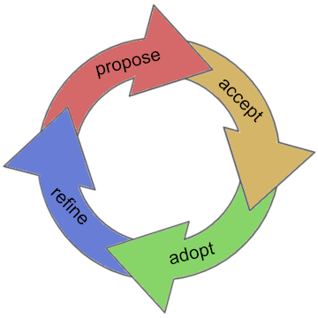

# 

This repo holds RFCs for the Aries project. They describe important
topics ([not minor details](contributing.md#do-you-need-an-RFC)) that we want to
standardize across the Aries ecosystem.

See [the RFC Index](index.md) for a current listing of all RFCs and their statuses.

There are 2 types of RFCs:

* RFCs that describe individual features (the [features](./features) folder)
* RFCs that explain concepts underpinning many features (the [concepts](./concepts) folder)

RFCs are for developers *building on* Aries. They don't provide guidance on how Aries
implements features internally; individual Aries repos have design docs for that.

## RFC Lifecycle

RFCs go through a standard lifecycle:

#### Status == PROPOSED
To __propose__ an RFC, [use these instructions to raise a PR](
contributing.md#how-to-propose-an-RFC) against the repo. Proposed
RFCs are considered a "work in progress", even after they are merged. In other words, they
haven't been endorsed by the community yet, but they seem like reasonable ideas worth
exploring.

#### Status == ACCEPTED
To get an RFC __accepted__, [build consensus](contributing.md#how-to-get-an-RFC-accepted)
for your RFC on [chat](https://chat.hyperledger.org/channel/aries) and in community
meetings. An accepted RFC is incubating on a standards track; the community has decided
to polish it and is exploring or pursuing implementation.

#### Status == ADOPTED
To get an RFC __adopted__, [socialize and implement](contributing.md#how-to-get-an-rfc-adopted).
An RFC gets this status once it has significant momentum--when implementations accumulate,
or when the mental model it advocates has begun to permeate our discourse. In other words,
adoption is acknowledgment of a _de facto_ standard.

To __refine__ an RFC, propose changes to it through additional PRs. Typically
these changes are driven by experience that accumulates during or after adoption.
Minor refinements that just improve clarity can happen inline with lightweight
review. Status is still ADOPTED.

#### Status == SUPERSEDED
Significant refinements require a superseding document; the original RFC is
__superseded__ with a forwarding hyperlink, not replaced.

## About

#### License

This repository is licensed under an [Apache 2 License](LICENSE). It is protected
by a [Developer Certificate of Origin](https://developercertificate.org/) on every commit.
This means that any contributions you make must be licensed in an Apache-2-compatible
way, and must be free from patent encumbrances or additional terms and conditions. By
raising a PR, you certify that this is the case for your contribution.

For more instructions about contributing, see [Contributing](contributing.md).

#### Acknowledgement

The structure and a lot of the initial language of this repository was borrowed from [Indy HIPEs](
https://github.com/hyperledger/indy-hipe), which borrowed it from [Rust RFC](https://github.com/rust-lang/rfcs).
Their good work has made the setup of this repository much quicker and better than it otherwise would have been.
If you are not familiar with the Rust community, you should check them out.
