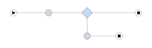
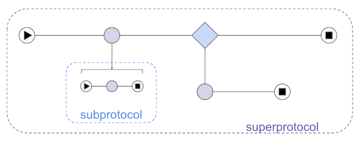
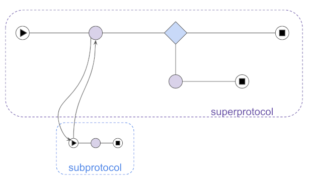
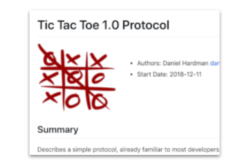

# 0003: Protocols
- Author: Daniel Hardman <daniel.hardman@gmail.com>
- Start Date: 2018-12-28

## Summary
- Status: [ACCEPTED](/README.md#rfc-lifecycle)
- Status Date: 2019-04-01
- Status Note: standards track and beginning to influence many mental models, but not yet
  [ADOPTED](/README.md#rfc-lifecycle). This supersedes [Indy PR #69](
  https://github.com/hyperledger/indy-hipe/pull/69).

Defines protocols (and the closely related concept of message families)
in the context of agent-to-agent interactions,
and shows how they should be designed and documented.

## Motivation

When we began exploring agent-to-agent interactions, we imagined that
interoperability would be achieved by formally defining message families.
We have since learned that message family definitions must define more 
than simply the attributes that are a part of each message. We also need 
to formally define the roles in an interaction, the possible states those roles 
can have, the way state changes in response to messages, and the errors 
that may arise.

In addition, we realized that we need clear examples of how to define all
these things, so designs are consistent and robust.

## Tutorial

#### What is a protocol?

A __protocol__ is a recipe for a stateful interaction. Protocols are all
around us, and are so ordinary that we take them for granted. Each of the
following interactions is stateful, and has conventions that constitute
a sort of "recipe":

* Ordering food at a restaurant
* Buying a house
* Playing a game of chess, checkers, tic-tac-toe, etc.
* Bidding on an item in an online auction.
* Going through security at the airport when we fly
* Applying for a loan

Protocols are a major concern for SSI agents. Agents need a recipe for
stateful interactions like:

* Connecting with one another
* Requesting and issuing credentials
* Proving things using credentials
* Putting things in escrow (and taking them out again)
* Paying
* Reporting errors
* Negotiating
* Cooperative debugging

#### Decentralized

As used in the agent/DIDComm world, protocols are _decentralized_. This means
there is not an overseer for the protocol, guaranteeing information flow,
enforcing behaviors, and ensuring a coherent view. It is a subtle but
important divergence from API-centric approaches, where a server holds
state against which all other parties (clients) operate. Instead, all
parties are peers, and they interact by mutual consent and with a (hopefully)
shared understanding of the rules and goals. Protocols are like a dance--not one
that's choreographed or directed, but one where the parties make dynamic
decisions and and react to them.

#### Types of Protocols

The most common protocol style in DID Communication is __request-response__.
This style involve two *parties*, with the `requester` making the first move,
and the `responder` completing the interaction. The [Discover Features Protocol](
../../features/0031-discover-features/README.md) uses this style.

A second common pattern that's also important is __notification__. This style also
involves two parties, but it is one-way: the `notifier` emits a message,
and the protocol ends when the `notified` receives it. The [ACK Protocol](
../../features/0015-acks/README.md) and the [Report Problem
Protocol](../../features/0035-report-problem/README.md) use this style.

However, more complex protocols exist. The [Introduce Protocol](
../../features/0028-introduce/README.md) involves three parties,
not two. When the [DID Exchange Protocol](
../../features/0023-did-exchange/README.md) includes organizations, it
may involve dozens of *participants*, and it has cycles and other complex
state evolution.

>See [this note](roles-participants-etc.md) for definitions of the terms
"role", "participant", and "party".

#### Agent Design

Protocols are *the* key unit of interoperable extensibility in agents. To add a
new interoperable feature to an agent, give it the ability to handle a
new protocol.

When agents receive messages, they map the messages to a __protocol handler__
and possibly to an __interaction state__ that was previous persisted. The
protocol handler is code that knows the rules of a particular protocol; the
interaction state tracks progress through an interaction. For more information,
see the [agents explainer -- RFC 0004](../0004-agents/README.md#general-patterns)
and the [DIDComm explainer -- RFC 0005](
../0005-didcomm/README.md).

#### Composable

Protocols are *composable*--meaning that you can nest one inside another.
The protocol for asking someone to repeat their last sentence can occur
inside the protocol for ordering food at a restaurant. The protocols for
reporting an error or arranging payment can occur inside a protocol for
issuing credentials.

When we invoke one protocol inside another, we call the inner protocol a
__subprotocol__, and the outer protocol a __superprotocol__. A given protocol
may be a subprotocol in some contexts, and a standalone protocol in others.
In some contexts, a protocol may be a subprotocol from one perspective, and
a superprotocol from another (as when protocols are nested at least 3 deep).

Commonly, protocols wait for subprotocols to complete, and then they continue.
A good example of this is [ACKs](../../features/0015-acks/README.md),
which are often used as a discrete step in a larger flow.

In other cases, a subprotocol is not "contained" inside its superprotocol.
Rather, the superprotocol triggers the subprotocol, then continues in parallel,
without waiting for the subprotocol to complete. In the [Introduce Protocol](
../../features/0028-introduce/README.md),
the final step is to begin a connection protocol between the two introducees--
but [the introduction superprotocol completes when the connect subprotocol
*starts*, not when it *completes*](
../../features/0028-introduce/README.md#goal).

#### Message Families

A message family is a collection of messages that share a common theme, goal, or
usage pattern. The messages used by a protocol may be a subset of a particular
message family; for example, the [DID Exchange Protocol](
../../features/0023-did-exchange/README.md)
uses one subset of the messages in the
`connections` message family, and the [sync connection protocol](
../../features/0030-sync-connection/README.md)
uses a different subset.

Collectively, the message types of a protocol serve as its _interface_. Each protocol
has a primary message family, and the name of the protocol is often the name of the
primary message family. 

#### Ingredients

A protocol has the following ingredients:

* [_Name_](template.md#name-and-version-under-tutorial) and [semver-compatible
  version](semver.md)
* [_URI_ that uniquely identifies it](uris.md)
* [_Messages (primary message family)_](template.md#messages-under-tutorial)
* [_Adopted messages_](template.md#adopted-messages)
* [_Roles_](template.md#roles-under-tutorial)
* [_State_ and _sequencing rules_](template.md#states-under-tutorial)
* _Events that can change state_ -- notably, _messages_, but also _errors_,
_timeouts_, and other things
* _Constraints that provide trust and incentives_

#### How to define a protocol or message family

To define a protocol, write an RFC. Specific instructions for
protocol RFCs, and a discussion about the theory behind detailed
protocol concepts, are given in the [Template for Protocol RFCs](
template.md). The [tictactoe protocol](tictactoe/README.md) is
also attached to this RFC as an example.

## Reference

* [Message Type and Protocol Identifier URIs](uris.md)
* [Semver Rules for Protocols](semver.md)
* [State Details and State Machines](state-details.md)
* [Roles, Participants, Parties, and Controllers](roles-participants-etc.md)

## Drawbacks

This RFC creates some formalism around defining protocols. It doesn't go
nearly as far as SOAP or CORBA/COM did, but it is slightly more demanding
of a protocol author than the familiar world of RESTful [Swagger/OpenAPI](
https://swagger.io/docs/specification/about/).

The extra complexity is justified by the greater demands that agent-to-agent
communications place on the protocol definition. (See notes in [Prior Art](#prior-art)
section for details.)

## Rationale and alternatives

Some of the simplest DIDComm protocols could be specified in a Swagger/OpenAPI
style. This would give some nice tooling. However, not all fit into that
mold. It may be desirable to create conversion tools that allow Swagger
interop.   

## Prior art

#### BPMN

[BPMN](https://en.wikipedia.org/wiki/Business_Process_Model_and_Notation) is a
graphical language for modeling flows of all types (plus things less like
our protocols as well). BPMN is a mature standard sponsored by [OMG](
https://en.wikipedia.org/wiki/Object_Management_Group). It has a nice
[tool ecosystem](https://camunda.com/bpmn/tool/). It also has an XML file
format, so the visual diagrams have a two-way transformation to and from
formal written language. And it has a code generation mode, where BPMN
can be used to drive executable behavior if diagrams are sufficiently
detailed and sufficiently standard. (Since BPMN supports various extensions
and is often used at various levels of formality, execution is not its most
common application.)

BPMN began with a focus on centralized processes
(those driven by a business entity), with diagrams organized around the goal
of the point-of-view entity and what they experience in the interaction. This
is somewhat different from a DIDComm protocol where any given entity may experience
the goal and the scope of interaction differently; the state machine for a
home inspector in the "buy a home" protocol is _quite_ different, and somewhat
separable, from the state machine of the buyer, and that of the title insurance
company.

BPMN 2.0 introduced the notion of a [choreography](
https://www.visual-paradigm.com/guide/bpmn/bpmn-orchestration-vs-choreography-vs-collaboration/#bpmn-choreography),
which is much closer to the concept of an A2A protocol, and which has quite
an elegent and intuitive visual representation. However, even a BPMN
choreography doesn't have a way to discuss interactions with decorators,
adoption of generic messages, and other A2A-specific concerns. Thus, we may
lean on BPMN for some diagramming tasks, but it is not a substitute for the
RFC definition procedure described here.

#### WSDL

[WSDL](https://www.w3.org/TR/2001/NOTE-wsdl-20010315) is a web-centric
evolution of earlier, RPC-style interface definition languages like
[IDL in all its varieties](https://en.wikipedia.org/wiki/Interface_description_language)
and [CORBA](https://en.wikipedia.org/wiki/Common_Object_Request_Broker_Architecture).
These technologies describe a *called* interface, but they don't describe
the caller, and they lack a formalism for capturing state changes, especiall
by the caller. They are also out of favor in the programmer community at
present, as being too heavy, [too fragile](
https://codecraft.co/2008/07/29/decoupling-interfaces-as-versions-evolve-part-1/),
or poorly supported by current tools.
 
#### Swagger / OpenAPI

[Swagger / OpenAPI](https://swagger.io/docs/specification/about/) overlaps
 about 60% with the concerns of protocol definition in agent-to-agent
 interactions. We like the tools and the convenience of the paradigm
 offered by OpenAPI, but where these two do not overlap, we have impedance.
 
 Agent-to-agent protocols must support more than 2 roles, or
 two roles that are peers, whereas RESTful web services assume just client
 and server--and only the server has a documented API.
 
 Agent-to-agent protocols are fundamentally asynchronous,
 whereas RESTful web services mostly assume synchronous request~response.
 
 Agent-to-agent protocols have complex considerations for diffuse trust, 
 whereas RESTful web services centralize trust in the web server.
 
 Agent-to-agent protocols need to support transports beyond HTTP, whereas
 RESTful web services do not.
 
 Agent-to-agent protocols are nestable, while
 RESTful web services don't provide any special support for that construct.
 
#### Other

* [Pdef (Protocol Definition Language)](https://github.com/pdef/pdef): An alternative to Swagger.
* [JSON RPC](https://www.jsonrpc.org/specification): Defines how invocation of
 remote methods can be accomplished by passing JSON messages. However, the
 RPC paradigm assumes request/response pairs, and does not provide a way
 to describe state and roles carefully.
* [IPC Protocol Definition Language (IPDL)](https://developer.mozilla.org/en-US/docs/Mozilla/IPDL):
 This is much closer to agent protocols in terms of its scope of concerns
 than OpenAPI. However, it is C++ only, and intended for use within browser
 plugins. 

# Unresolved questions

- Should we write a Swagger translator?
- If not swagger, what formal definition format should we use in the future?

