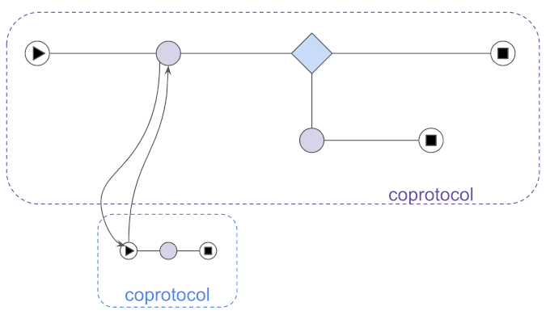

# Aries RFC 0003: Protocols

- Authors: [Daniel Hardman](daniel.hardman@gmail.com)
- Status: [ACCEPTED](/README.md#accepted)
- Since: 2019-04-01
- Status Note: standards track and beginning to influence many mental models, but not yet [ADOPTED](/README.md#rfc-lifecycle).
- Supersedes: [Indy PR #69]( https://github.com/hyperledger/indy-hipe/pull/69)
- Start Date: 2018-12-28
- Tags: [concept](/tags.md#concept)

## Summary

Defines peer-to-peer application-level protocols
in the context of interactions among [agent-like](../0004-agents/README.md) things,
and shows how they should be designed and documented.

[](https://docs.google.com/presentation/d/15UAkh_2WfDk7wlto7pSL7YU9NJr_XVMgGAOeNIRbzK8/edit#slide=id.p)

## Table of Contents<!-- omit in toc -->

- [Aries RFC 0003: Protocols](#aries-rfc-0003-protocols)
  - [Summary](#summary)
  - [Motivation](#motivation)
  - [Tutorial](#tutorial)
    - [What is a Protocol?](#what-is-a-protocol)
    - [Relationship to APIs](#relationship-to-apis)
    - [Decentralized](#decentralized)
    - [Types of Protocols](#types-of-protocols)
    - [Agent Design](#agent-design)
    - [Composable](#composable)
    - [Message Types](#message-types)
      - [Handling Unrecognized Items in Messages](#handling-unrecognized-items-in-messages)
    - [Ingredients](#ingredients)
    - [How to Define a Protocol](#how-to-define-a-protocol)
    - [Security Considerations](#security-considerations)
      - [Replay Attacks](#replay-attacks)
  - [Reference](#reference)
    - [Message Type and Protocol Identifier URIs](#message-type-and-protocol-identifier-uris)
      - [MTURI](#mturi)
      - [PIURI](#piuri)
    - [Semver Rules for Protocols](#semver-rules-for-protocols)
      - [Semver Examples](#semver-examples)
        - [Initiator](#initiator)
        - [Recipient Rules](#recipient-rules)
    - [State Details and State Machines](#state-details-and-state-machines)
      - [State Machines](#state-machines)
      - [Processing Points](#processing-points)
    - [Roles, Participants, Parties, and Controllers](#roles-participants-parties-and-controllers)
      - [Roles](#roles)
      - [Participants](#participants)
      - [Parties](#parties)
      - [Controllers](#controllers)
    - [Instructions for Protocol RFCs](#instructions-for-protocol-rfcs)
  - [Drawbacks](#drawbacks)
  - [Rationale and alternatives](#rationale-and-alternatives)
  - [Prior art](#prior-art)
    - [BPMN](#bpmn)
    - [WSDL](#wsdl)
    - [Swagger / OpenAPI](#swagger--openapi)
    - [Other](#other)
  - [Unresolved questions](#unresolved-questions)
  - [Implementations](#implementations)

## Motivation

APIs in the style of Swagger are familiar to nearly all developers, and it's a common assumption that we should use them to solve the problems at hand in the decentralized identity space. However, to truly decentralize, we must think about interactions at a higher level of generalization. Protocols can model all APIs, but not the other way around. This matters. We need to explain why.

We also need to show how a protocol is defined, so the analog to defining a Swagger API is demystified.

## Tutorial

### What is a Protocol?

A __protocol__ is a recipe for a stateful interaction. Protocols are all
around us, and are so ordinary that we take them for granted. Each of the
following interactions is stateful, and has conventions that constitute
a sort of "recipe":

* Ordering food at a restaurant
* Buying a house
* Playing a game of chess, checkers, tic-tac-toe, etc.
* Bidding on an item in an online auction.
* Going through security at the airport when we fly
* Applying for a loan

In the context of decentralized identity, protocols manifest at many different levels of the stack: at the lowest levels of networking, in cryptographic algorithms like Diffie Hellman, in the management of DIDs, in the conventions of [DIDComm](../0005-didcomm/README.md), and in higher-level interactions that solve problems for people with only minimal interest in the technology they're using. However, this RFC focuses on the last of these layers, where use cases and personas are transformed into features with obvious social value like:

* [Connecting with one another](../../features/0023-did-exchange/README.md)
* [Requesting and issuing credentials](../../features/0036-issue-credential/README.md)
* [Proving things using credentials](../../features/0037-present-proof/README.md)
* [Discovering things](../../features/0031-discover-features/README.md)
* Delegating
* Buying and Selling
* Negotiating
* Enacting and enforcing contracts
* Putting things in escrow (and taking them out again)
* Scheduling
* Auditing
* Reporting errors
* Cooperative debugging

When "protocol" is used in an Aries context without any qualifying adjective, it is referencing a recipe for a high-level interaction like these. Lower-level protocols are usually described more specifically and possibly with other verbiage: "cryptographic algorithms", "DID management procedures", "DIDComm conventions", "transports", and so forth. This helps us focus "protocol" on the place where application developers that consume Aries do most of the work that creates value.

### Relationship to APIs

The familiar world of web APIs is a world of protocols, but it comes with constraints antithetical to decentralized identity:

* It assumes all interactions are between a client and a server--either two parties, or N parties mediated by a central server. Thus, the server is a natural locus for surveillance and hacking.
* It assumes security is asymmetric--not using DIDs, but driven by certs on a server and by a session for the client.
* It assumes the transport is HTTP. This is problematic for pure mobile-to-mobile, or for use cases where the transport is complex or asymmetric.
* Because the server can never initiate an interaction, it requires at least one party to be continuously online.

Protocols impose none of these constraints. Web APIs can easily be modeled as protocols where the transport is HTTP and the payload is a message, and the Aries community actively does this. We are not opposed to APIs. We just want to describe and standardize the higher level abstraction so we don't have a web solution and a BlueTooth solution that are diverged for no good reason.

### Decentralized

As used in the agent/DIDComm world, protocols are _decentralized_. This means
there is not an overseer for the protocol, guaranteeing information flow,
enforcing behaviors, and ensuring a coherent view. It is a [subtle but
important divergence from API-centric approaches](https://www.reactivemanifesto.org/glossary#Protocol), where a server holds
state against which all other parties (clients) operate. Instead, all
parties are peers, and they interact by mutual consent and with a (hopefully)
shared understanding of the rules and goals. Protocols are like a dance&mdash;not one
that's choreographed or directed, but one where the parties make dynamic
decisions and react to them.


### Types of Protocols

The simplest protocol style is __notification__. This style
involves two parties, but it is one-way: the `notifier` emits a message,
and the protocol ends when the `notified` receives it. The [basic message protocol](../../features/0095-basic-message/README.md) uses this style.


Slightly more complex is the __request-response__ protocol style.
This style involve two parties, with the `requester` making the first move,
and the `responder` completing the interaction. The [Discover Features Protocol](
../../features/0031-discover-features/README.md) uses this style. Note that
with protocols as Aries models them (and unlike an HTTP request), the request-response messages are
asynchronous.


However, more complex protocols exist. The [Introduce Protocol](
../../features/0028-introduce/README.md) involves three parties,
not two. The [issue credential protocol](../../feature/../features/0036-issue-credential/README.md)
includes up to six message types (including `ack` and `problem_report`), two of which (`proposal` and `offer`)
can be used to interactively negotiate details of the elements of the subsequent messages in the protocol.

>See [this subsection](#roles-participants-parties-and-controllers) for definitions of the terms
"role", "participant", and "party".

### Agent Design

Protocols are *the* key unit of interoperable extensibility in agents and agent-like things. To add a
new interoperable feature to an agent, give it the ability to handle a
new protocol.

When agents receive messages, they map the messages to a __protocol handler__
and possibly to an __interaction state__ that was previously persisted. This is the analog to routes, route handlers, and sessions in web APIs, and could actually be implemented as such if the transport for the protocol is HTTP. The
protocol handler is code that knows the rules of a particular protocol; the
interaction state tracks progress through an interaction. For more information,
see the [agents explainer&mdash;RFC 0004](../0004-agents/README.md#general-patterns)
and the [DIDComm explainer&mdash;RFC 0005](../0005-didcomm/README.md).

### Composable

Protocols are *composable*--meaning that you can build complex ones from simple ones.
The protocol for asking someone to repeat their last sentence can be part of
the protocol for ordering food at a restaurant. It's common to ask a potential
driver's license holder to prove their street address before issuing the license.
In protocol terms, this is nicely modeled as the [present proof](../../features/0037-present-proof/README.md)
being invoked in the middle of an [issue credential](../../features/0036-issue-credential/README.md) protocol.

When we run one protocol _inside_ another, we call the inner protocol a
__subprotocol__, and the outer protocol a __superprotocol__. A given protocol
may be a subprotocol in some contexts, and a standalone protocol in others.
In some contexts, a protocol may be a subprotocol from one perspective, and
a superprotocol from another (as when protocols are nested at least 3 deep).


Commonly, protocols wait for subprotocols to complete, and then they continue.
A good example of this is mentioned above&mdash;starting an issue credential flow,
but requiring the potential issuer and/or the potential holder to prove something
to one another before completing the process.

In other cases, a protocol B is not "contained" inside protocol A.
Rather, A triggers B, then continues in parallel,
without waiting for B to complete. This __coprotocol__ relationship is analogous to
relationship between [coroutines in computer science](https://en.wikipedia.org/wiki/Coroutine).
In the [Introduce Protocol](../../features/0028-introduce/README.md),
the final step is to begin a connection protocol between the two introducees--
but [the introduction coprotocol completes when the connect coprotocol
*starts*, not when it *completes*](
../../features/0028-introduce/README.md#goal).



### Message Types

A protocol includes a number of message types that enable the execution of an instance of a protocol.
Collectively, the message types of a protocol become the skeleton of its _interface_. Most of the message
types are defined with the protocol, but several key message types, notably [acks](../../features/0015-acks/README.md)
and [problem reports](../../features/0035-report-problem/README.md) are defined in separate RFCs and `adopted` into
a protocol. This ensures that the structure of such messages is standardized, but used in the context of the
protocol adopting the message types.

#### Handling Unrecognized Items in Messages

In the [semver](#semver-rules-for-protocols) section of this document there is discussion of the handling of mismatches in minor versions
supported and received. Notably, a recipient that supports a given minor version of a protocol less than that of a
received protocol message should ignore any unrecognized fields in the message. Such handling of unrecognized data items applies more generally than
just minor version mismatches. A recipient of a message from a supported major version of a protocol should ignore **any** unrecognized items
in a received message, even if the supported and minor versions are the same. When items from the message are ignored, the recipient may want
to send a warning `problem-report` message with code `fields-ignored`.

### Ingredients

A protocol has the following ingredients:

* [_Name_](../../0000-template-protocol.md#name-and-version) and [semver-compatible
  version](#semver-rules-for-protocols)
* [_URI_ that uniquely identifies it](#message-type-and-protocol-identifier-uris)
* [_Messages (primary message family)_](../../0000-template-protocol.md#messages)
* [_Adopted messages_](../../0000-template-protocol.md#adopted-messages)
* [_Roles_](../../0000-template-protocol.md#roles)
* [_State_ and _sequencing rules_](../../0000-template-protocol.md#states)
* _Events that can change state_ -- notably, _messages_, but also _errors_,
_timeouts_, and other things
* _Constraints that provide trust and incentives_

### How to Define a Protocol

To define a protocol, write an RFC. Specific instructions for
protocol RFCs, and a discussion about the theory behind detailed
protocol concepts, are given in the [instructions for protocol RFCs](#instructions-for-protocol-rfcs)
and in the [protocol RFC template](../../0000-template-protocol.md).

The [tictactoe protocol](tictactoe/README.md) is attached to this RFC as an example.

[](tictactoe/README.md)

### Security Considerations

#### Replay Attacks

It should be noted that when defining a protocol that has domain specific requirements around preventing replay attacks, an `@id` property SHOULD be required. Given an `@id` field is most commonly set to be a UUID, it should provide randomness comparable to that of a nonce in preventing replay attacks. However, this means that care will be needed in processing of the `@id` field to make sure its value has not been used before. In some cases, nonces require being unpredictable as well. In this case, greater review should be taken as to how the `@id` field should be used in the domain specific protocol. In the event where the `@id` field is not adequate for preventing replay attacks, it's recommended that an additional `nonce` field be required by the domain specific protocol specification.

## Reference

### Message Type and Protocol Identifier URIs

Message types and protocols are identified with URIs that match certain
conventions.

#### MTURI

A __message type URI__ (MTURI) identifies message types unambiguously.
Standardizing its format is important because it is parsed by agents that
will map messages to handlers--basically, code will look at this string and
say, "Do I have something that can handle this message type inside protocol
*X* version *Y*?"

When this analysis happens, strings should be compared for byte-wise equality
in all segments except version. This means that case, unicode normalization,
and punctuation differences all matter. It is thus best practice to avoid
protocol and message names that differ only in subtle, easy-to-mistake ways.

Comparison of the version segment of an MTURI or PIURI should follow semver
rules and is discussed in the [semver section](#semver-rules-for-protocols) of this document.

The URI MUST be composed as follows:


```ABNF
message-type-uri  = doc-uri delim protocol-name
    "/" protocol-version "/" message-type-name
delim             = "?" / "/" / "&" / ":" / ";" / "="
protocol-name     = identifier
protocol-version  = semver
message-type-name = identifier
identifier        = alpha *(*(alphanum / "_" / "-" / ".") alphanum)
```

It can be loosely matched and parsed with the following regex:

```regex
    (.*?)([a-z0-9._-]+)/(\d[^/]*)/([a-z0-9._-]+)$
```

A match will have captures groups of (1) = `doc-uri`, (2) = `protocol-name`,
(3) = `protocol-version`, and (4) = `message-type-name`.

The goals of this URI are, in descending priority:

* Code can use the URI to route messages to protocol
handlers using [semver rules](#semver-rules-for-protocols).

* The definition of a protocol should be tied to the URI such
that it is semantically stable. This means that once version 1.0
of a protocol is defined, its definition [should not change in ways that would break implementations](#semver-rules-for-protocols).

* Developers can discover information about novel protocols, using
the URI to browse or search the web.

The `doc-uri` portion is any URI that exposes documentation about
protocols. A developer should be able to browse to that URI and use human intelligence
to look up the named and versioned protocol. Optionally and preferably, the
full URI may produce a page of documentation about the specific message type,
with no human mediation involved.

#### PIURI

A shorter URI that follows the same conventions but lacks the
`message-type-name` portion is called a __protocol identifier URI__
(PIURI).


```ABNF
protocol-identifier-uri  = doc-uri delim protocol-name
    "/" semver
```

Its loose matcher regex is:

```regex
    (.*?)([a-z0-9._-]+)/(\d[^/]*)/?$
```

The following are examples of valid MTURIs and PIURIs:

* `http://example.com/protocols?which=lets_do_lunch/1.0/` (PIURI with fully automated lookup of protocol docs)
* `http://example.com/message_types?which=lets_do_lunch/1.0/proposal` (MTURI)
* `https://github.com/hyperledger/aries-rfcs/tree/18c4f82:trust_ping/1.0/ping`
   (MTURI). Note that this URI returns a 404 error if followed directly--but
   per rules described above, the developer should browse to the doc root
   ([https://github.com/hyperledger/aries-rfcs/tree/18c4f82](
   https://github.com/hyperledger/aries-rfcs/tree/18c4f82
   )) and look for documentation on the `trust_ping/1.0` protocol.
* `https://didcomm.org/trust_ping/1.0/ping` (MTURI) This
   uses an https reference that could serve
   information about protocols.

### Semver Rules for Protocols

[Semver](https://semver.org) rules apply to protocols, with the version of a protocol is expressed
in the `semver` portion of its [identifying URI](#message-type-and-protocol-identifier-uris).
The ["ingredients"](#ingredients) of a protocol combine to form a
[public API in the semver sense](https://semver.org/#spec-item-1). Core Aries protocols
specify only major and minor elements in a version; the patch component is not used. Non-core
protocols may choose to use the patch element.

The major and minor versions of protocols match semver semantics:

- Clarification updates that do not change the "public API" of the protocol can be made
with community support _without_ changing the minor version of the protocol.
- An individual message type can add new optional fields, or deprecate
existing fields, [with only a change to its protocol's minor
version](https://semver.org/#spec-item-7). Similarly, a protocol can
add new or deprecate message types with only a change to the minor version.
- Changes that remove fields or message types, that make formerly optional
things required, or that alter the state machine in incompatible
ways, must result in an [increase of the major version of the protocol/primary
message family](https://semver.org/#spec-item-8).

Within a given major version of a protocol, an agent should:

- respond to a minimum supported minor version, defaulting to "0"
- respond with or initiate a protocol instance the current fully supported minor version

This leads to the following received message handling rules:

- Message types received with minor versions below the minimum MAY be ignored, or preferably, MAY be answered only with a `problem-report` message with code `version-not-supported`
- Message types received with a minor version **at or higher than** the minimum supported **and less than** the current minor version are processed as follows:
  - The processing MAY be with the same minor version of the received message.
    - To support this, an implementation must implement each minor version from minimum to current within the major version.
  - The processing MAY be with the current minor version.
    - This approach should be used if maintaining each minor version from minimum to current within the major version is impractical.
  - In addition to responding with the protocol message (if necessary), the agent MAY also want to send a warning `problem-report` message with code `version-with-degraded-features`
- Message types received with a minor version higher than the current minor version MUST processed with any unrecognized fields ignored
  - The response MUST be with the current minor version.
  - In addition to responding with the protocol message, an agent may want to send a warning `problem-report` message with code `fields-ignored-due-to-version-mismatch`

As documented in the semver documentation, these requirements are not applied when
major version 0 is used. In that case, minor version increments are considered breaking.

Agents may support multiple major versions and select which major version to
use when initiating an instance of the protocol.

An agent should reject messages from protocols or unsupported protocol major versions with
a `problem-report` message with code `version-not-supported`. Agents that receive such a
`problem-report` message may use the [discover features protocol](../../features/0031-discover-features/README.md)
to resolve the mismatch.

#### Semver Examples

##### Initiator

Unless Alice's agent (the initiator of a protocol) knows from prior history
that it should do something different, it should begin a protocol using the
highest version number that it supports. For example, if A.1
supports versions 2.0 through 2.2 of protocol X, it should use 2.2 as the
version in the message type of its first message.

##### Recipient Rules

Agents for Bob (the recipient) should reject messages from protocols with major
versions different from those they support. For major version 0, they should also
reject protocols with minor versions they don't support, since semver stipulates
that [features are not stable before 1.0](https://semver.org/#spec-item-4). For
example, if B.1 supports only versions 2.0 and 2.1 of protocol X, it should reject
any messages from version 3 or version 1 or 0. In most cases, rejecting a message
means sending a `problem-report` that the message is unsupported. The `code` field
in such messages should be `version-not-supported`. Agents that receive such a
`problem-report` can then use the [Discover Features Protocol](
../../features/0031-discover-features/README.md) to resolve version problems.

Recipient agents should accept messages that differ from their own supported version
of a protocol only in the patch, prerelease, and/or build fields, whether these
differences make the message earlier or later than the version the recipient prefers.
These messages will be robustly compatible.

For major version >= 1, recipients should also accept messages that differ only in that
the message's minor version is earlier than their own preference. In such a case, the
recipient should degrade gracefully to use the earlier version of the protocol. If the
earlier version lacks important features, the recipient may optionally choose to send,
in addition to a response, a `problem-report` with code `version-with-degraded-features`.

If a recipient supports protocol X version 1.0, it should tentatively
accept messages with later minor versions (e.g., 1.2). Message types that
differ in only in minor version are guaranteed to be compatible *for the
feature set of the earlier version*. That is, a 1.0-capable agent can support
1.0 features using a 1.2 message, though of course it will lose any features
that 1.2 added. Thus, accepting such a message could have two possible outcomes:

1. The message at version 1.2 might look and behave exactly like it did at version
1.0, in which case the message will process without any trouble.

2. The message might contain some fields that are unrecognized and need to be ignored.

In case 2, it is best practice for the recipient to send a `problem-report` that
is a *warning*, not an *error*, announcing that some fields could not be processed
(code = `fields-ignored-due-to-version-mismatch`). Such a message is *in addition
to* any response that the protocol demands of the recipient.

If the recipient of a protocol's initial message generates a response, the response
should use the latest major.minor protocol version that both parties support and
know about. Generally, all messages after the first use only major.minor

[](
https://docs.google.com/spreadsheets/d/1W5KYOqCCqmTeU4Z7XZQH9_6_0TeP5Vf5TtsOZmioyB0/edit#gid=0)

### State Details and State Machines

While some protocols have only one sequence of states to manage, in most
different roles perceive the interaction differently. The sequence of states
for each role needs to be described with care in the RFC.

#### State Machines

By convention, protocol state and sequence rules are described using the
concept of state machines, and we encourage developers who implement
protocols to build them that way.

Among other benefits, this helps with error handling: when one agent
sends a [`problem-report` message](../../features/0035-report-problem/README.md)
to another, the message can make it crystal clear which state it
has fallen back to as a result of the error.

Many developers will have encountered a formal of definition of state machines as
they wrote parsers or worked on other highly demanding tasks, and may worry
that state machines are heavy and intimidating. But as they are used in
Aries protocols, state machines are straightforward and elegant. They
cleanly encapsulate logic that would otherwise be a bunch of conditionals
scattered throughout agent code. The [tictactoe example protocol](tictactoe/README.md)
example includes a complete state machine in less than 50
lines of [python code](tictactoe/state_machine.py), with [tests](tictactoe/test_state_machine.py).

For an extended discussion of how state machines can be used, including in nested
protocols, and with hooks that let custom processing happen at each point in
a flow, see [https://github.com/dhh1128/distributed-state-machine](
https://github.com/dhh1128/distributed-state-machine/blob/master/README.md).

#### Processing Points

A protocol definition describes key points in the flow where business logic
can attach. Some of these __processing points__ are obvious, because the
protocol makes calls for decisions to be made. Others are implicit. Some examples
include:

* The _beginning_ and _end_.
* The _launch of a subprotocol_.
* The _completion of a subprotocol_, or the _subprotocol changing state_.
* _Sending a message_. (For each send, the sender could choose to go silent
and abandon the interaction instead, though many
protocols would ask for notification to be emitted as best practice.)
* (Receiving a message_. (Requires validation, then integration
with policy and processes internal to the agent and its sovereign domain,
to move the interaction forward.)

### Roles, Participants, Parties, and Controllers

#### Roles

The __roles__ in a protocol are the perspectives (responsibilities, privileges) that parties take in an
interaction.

This perspective is manifested in three general ways:

* by the expectations that a party takes on in a protocol (ex. a role may be expected to do something to start a protocol).
* by the messages that a party can and does use in the course of the protocol (some messages may be reserved for a single role, while other may used by some if not all roles).
* by the state and the transition rules

Like parties, roles are normally known at the start of the protocol but this is not a requirement.

In an auction protocol, there are only two roles&mdash;_auctioneer_ and _bidder_&mdash;even though there may be many parties involved.

#### Participants

The __participants__ in a protocol are the agents that send and/or receive
[plaintext application-level messages](../../concepts/../features/0044-didcomm-file-and-mime-types/README.md)
that embody the protocol's interaction. Alice, Bob, and
Carol may each have a cloud agent, a laptop, and a phone; if they engage in an
introduction protocol using phones, then the agents on their phones are the participants.
If the phones talk directly over Bluetooth, this is particularly clear--but even if the
phones leverage push notifications and HTTP such that cloud agents help with routing,
only the phone agents are participants, because only they maintain state for the
interaction underway. (The cloud agents would be __facilitators__, and the laptops would
be __bystanders__). When a protocol is complete, the participant agents know about the
outcome; they may need to synchronize or replicate their state before other agents of the
parties are aware.

#### Parties

The __parties__ to a protocol are the entities directly responsible for achieving the protocol's goals.
When a protocol is high-level, parties are typically people or organizations; as protocols become lower-level,
parties may be specific agents tasked with detail work through delegation.

Imagine a situation where Alice wants a vacation. She engages with a travel agent named Bob. Together, they
begin an "arrange a vacation" protocol. Alice is responsible for expressing her parameters and proving her willingness to
pay; Bob is responsible for running a bunch of subprotocols to work out the details. Alice and Bob--not software
agents they use--are parties to this high-level protocol, since they share responsibility for its goals.

As soon as Alice has provided enough direction and hangs up the phone, Bob begins a sub-protocol with a hotel to book
a room for Alice. This sub-protocol has related but different goals--it is about booking a particular hotel room, not
about the vacation as a whole. We can see the difference when we consider that Bob could abandon the booking and choose
a different hotel entirely, without affecting the overarching "arrange a vacation" protocol.

With the change in goal, the parties have now changed, too. Bob and a hotel concierge are the ones responsible
for making the "book a hotel room" protocol progress. Alice is an approver and indirect stakeholder, but she is
not doing the work. (In [RACI terms](https://en.wikipedia.org/wiki/Responsibility_assignment_matrix),
Alice is an "accountable" or "approving" entity, but only Bob and the concierge are "responsible" parties.)

Now, as part of the hotel reservation, Bob tells the concierge that the guest would like access to a waverunner
to play in the ocean on day 2. The concierge engages in a sub-sub-protocol to reserve the waverunner. The
goal of this sub-sub-protocol is to reserve the equipment, not to book a hotel or arrange a vacation. The parties to this
sub-sub-protocol are the concierge and the person or automated system that manages waverunners.

Often, parties are known at the start of a protocol; however, that is not a requirement. Some protocols might commence
with some parties not yet known or assigned.

For many protocols, there are only two parties, and they are in a pairwise relationship. Other protocols
are more complex. Introductions involves three; an auction may involve many.

Normally, the parties that are involved in a protocol also participate in the interaction but this is not always the
case. Consider a gossip protocol, two parties may be talking about a third party. In this case, the third party would
not even know that the protocol was happening and would definitely not participate.

#### Controllers

The __controllers__ in a protocol are entities that make decisions. They may or may not be direct parties.

Imagine a remote chess game between Bob and Carol, conducted with software agents. The chess protocol isn't
technically about _how to select a wise chess move_; it's about _communicating the moves_ so parties achieve
the shared goal of running a game to completion. Yet choices about moves are clearly made as the protocol
unfolds. These choices are made by controllers--Bob and Carol--while the agents responsible for the work of
moving the game forward wait with the protocol suspended.

In this case, Bob and Carol could be analyzed as parties to the protocol, as well as controllers. But in other
cases, the concepts are distinct. For example, in a protocol to issue credentials, the issuing institution
might use an AI and/or business automation as a controller.

### Instructions for Protocol RFCs

A protocol RFC conforms to general RFC patterns, but includes some specific substructure.

[](
https://docs.google.com/presentation/d/15UAkh_2WfDk7wlto7pSL7YU9NJr_XVMgGAOeNIRbzK8/edit#slide=id.g5609c67f13_0_113)

Please see the [special protocol RFC template](../../0000-template-protocol.md) for details.

## Drawbacks

This RFC creates some formalism around defining protocols. It doesn't go
nearly as far as SOAP or CORBA/COM did, but it is slightly more demanding
of a protocol author than the familiar world of RESTful [Swagger/OpenAPI](
https://swagger.io/docs/specification/about/).

The extra complexity is justified by the greater demands that agent-to-agent
communications place on the protocol definition. See notes in [Prior Art](#swagger--openapi)
section for details.

## Rationale and alternatives

Some of the simplest DIDComm protocols could be specified in a Swagger/OpenAPI
style. This would give some nice tooling. However, not all fit into that
mold. It may be desirable to create conversion tools that allow Swagger
interop.

## Prior art

### BPMN

[BPMN](https://en.wikipedia.org/wiki/Business_Process_Model_and_Notation) (Business Process Model and Notation) is a
graphical language for modeling flows of all types (plus things less like
our protocols as well). BPMN is a mature standard sponsored by [OMG](
https://en.wikipedia.org/wiki/Object_Management_Group)(Object Management Group). It has a nice
tool ecosystem (such as [this](https://camunda.com/bpmn/tool/)). It also has an XML file
format, so the visual diagrams have a two-way transformation to and from
formal written language. And it has a code generation mode, where BPMN
can be used to drive executable behavior if diagrams are sufficiently
detailed and sufficiently standard. (Since BPMN supports various extensions
and is often used at various levels of formality, execution is not its most
common application.)

BPMN began with a focus on centralized processes
(those driven by a business entity), with diagrams organized around the goal
of the point-of-view entity and what they experience in the interaction. This
is somewhat different from a DIDComm protocol where any given entity may experience
the goal and the scope of interaction differently; the state machine for a
home inspector in the "buy a home" protocol is _quite_ different, and somewhat
separable, from the state machine of the buyer, and that of the title insurance
company.

BPMN 2.0 introduced the notion of a [choreography](
https://www.visual-paradigm.com/guide/bpmn/bpmn-orchestration-vs-choreography-vs-collaboration/#bpmn-choreography),
which is much closer to the concept of an A2A protocol, and which has quite
an elegant and intuitive visual representation. However, even a BPMN
choreography doesn't have a way to discuss interactions with decorators,
adoption of generic messages, and other A2A-specific concerns. Thus, we may
lean on BPMN for some diagramming tasks, but it is not a substitute for the
RFC definition procedure described here.

### WSDL

[WSDL](https://www.w3.org/TR/2001/NOTE-wsdl-20010315) (Web Services Description Language) is a web-centric
evolution of earlier, RPC-style interface definition languages like
[IDL in all its varieties](https://en.wikipedia.org/wiki/Interface_description_language)
and [CORBA](https://en.wikipedia.org/wiki/Common_Object_Request_Broker_Architecture).
These technologies describe a *called* interface, but they don't describe
the caller, and they lack a formalism for capturing state changes, especiall
by the caller. They are also out of favor in the programmer community at
present, as being too heavy, [too fragile](
https://codecraft.co/2008/07/29/decoupling-interfaces-as-versions-evolve-part-1/),
or poorly supported by current tools.

### Swagger / OpenAPI

[Swagger / OpenAPI](https://swagger.io/docs/specification/about/) overlaps
with some of the concerns of protocol definition in agent-to-agent
 interactions. We like the tools and the convenience of the paradigm
 offered by OpenAPI, but where these two do not overlap, we have impedance.

 Agent-to-agent protocols must support more than 2 roles, or
 two roles that are peers, whereas RESTful web services assume just client
 and server--and only the server has a documented API.

 Agent-to-agent protocols are fundamentally asynchronous,
 whereas RESTful web services mostly assume synchronous request~response.

 Agent-to-agent protocols have complex considerations for diffuse trust,
 whereas RESTful web services centralize trust in the web server.

 Agent-to-agent protocols need to support transports beyond HTTP, whereas
 RESTful web services do not.

 Agent-to-agent protocols are nestable, while
 RESTful web services don't provide any special support for that construct.

### Other

* [Pdef (Protocol Definition Language)](https://github.com/pdef/pdef): An alternative to Swagger.
* [JSON RPC](https://www.jsonrpc.org/specification): Defines how invocation of
 remote methods can be accomplished by passing JSON messages. However, the
 RPC paradigm assumes request/response pairs, and does not provide a way
 to describe state and roles carefully.
* [IPC Protocol Definition Language (IPDL)](https://developer.mozilla.org/en-US/docs/Mozilla/IPDL):
 This is much closer to agent protocols in terms of its scope of concerns
 than OpenAPI. However, it is C++ only, and intended for use within browser
 plugins.

## Unresolved questions

- Should we write a Swagger translator?
- If not swagger, what formal definition format should we use in the future?

## Implementations

The following lists the implementations (if any) of this RFC. Please do a pull request to add your implementation. If the implementation is open source, include a link to the repo or to the implementation within the repo. Please be consistent in the "Name" field so that a mechanical processing of the RFCs can generate a list of all RFCs supported by an Aries implementation.

Name / Link | Implementation Notes
--- | ---
[Indy Cloud Agent - Python](https://github.com/hyperledger/indy-agent/python) | several protocols, circa Feb 2019
[Aries Framework - .NET](https://github.com/hyperledger/aries-framework-dotnet) | several protocols, circa Feb 2019
[Streetcred.id](https://streetcred.id/) | several protocols, circa Feb 2019
[Aries Cloud Agent - Python](https://github.com/hyperledger/aries-cloudagent-python) | numerous protocols plus extension mechanism for pluggable protocols
[Aries Static Agent - Python](https://github.com/hyperledger/aries-staticagent-python) | 2 or 3 protocols
[Aries Framework - Go](https://github.com/hyperledger/aries-framework-go) | DID Exchange
[Connect.Me](https://www.evernym.com/blog/connect-me-sovrin-digital-wallet/) | mature but proprietary protocols; community protocols in process
[Verity](https://www.evernym.com/products/) | mature but proprietary protocols; community protocols in process
[Aries Protocol Test Suite](https://github.com/hyperledger/aries-protocol-test-suite) | 2 or 3 core protocols; active work to implement all that are ACCEPTED, since this tests conformance of other agents
[Pico Labs](http://picolabs.io/) | [implemented](https://github.com/Picolab/G2S) protocols: connections, trust_ping, basicmessage, routing
