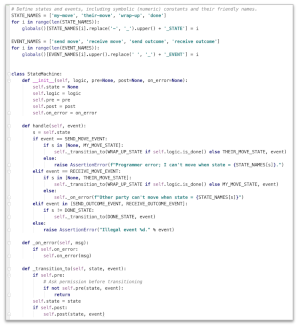

# State Details and State Machines

Some protocols have only one sequence of states to manage. But in many
protocols, different roles perceive the interaction differently. Each
perspective needs to be described with care. This rigor has been neglected
in many early efforts at protocol definition, and its omission is a big
miss. Analyzing all possible states and events for all roles leads to
robustness; skipping the analysis leads to fragility.

### State machines

By convention, our community describes state and sequence rules using the
concept of state machines, and we encourage developers who implement
protocols to build them that way.

Among other benefits, this helps with error handling: when one agent
sends a [`problem-report`](../../features/0035-report-problem/README.md)
message to another, the message can make it crystal clear which state it
has fallen back to as a result of the error.

Many developers will have encountered a formal definition of this concept as
they wrote parsers or worked on other highly demanding tasks, and may worry
that state machines are heavy and intimidating. But as they are used in
DIDComm protocols, state machines are straightforward and elegant. They
cleanly encapsulate logic that would otherwise be a bunch of conditionals
scattered throughout agent code. Without a state machine:

```python
if received_message.type == X and state == Y:
    do_something()
...
if received_message.type == X and state in [Y, Z]:
    do_something_else()
    state = V
...
if event == A and state in [V, W, Z]:
    state = Y
    do_yet_another_thing()
``` 

With a state machine:

```python
state_machine.handle(message) # hooks do_something()
...
state_machine.handle(message) # hooks do_something_else()
...
state_machine.handle(message) # hooks do_yet_another_thing()
```

Under maintenance, the robustness of the state machine approach is compelling.
Compare the approaches for how many places you might have to change if you had
a bug in how state Y is handled... The state machine approach also provides a
convenient way to load persisted state later, when a message arrives for an
interaction that is only partly complete. And it makes formal
testing for completeness and security much easier.

The tictactoe example includes a complete state machine in less than 50
lines of code. See [state-machine.py](tictactoe/state_machine.py). The
unit tests prove once and for all that the rules of the tictactoe protocol
(not the rules of the game, but the rules of how moves are communicated
and reacted to) are perfectly followed, in a [similarly brief chunk of code](
tictactoe/test_state_machine.py).

[](
tictactoe/state_machine.py)

For an extended discussion of how state machines can be used, including in nested
protocols, and with hooks that let custom processing happen at each point in
a flow, see [https://github.com/dhh1128/distributed-state-machine](
https://github.com/dhh1128/distributed-state-machine/blob/master/README.md).

### Processing Points

A protocol definition describes key points in the flow where business logic
can attach. Some of these __processing points__ are obvious, because the
protocol calls for a decision to be made. Others are implicit. Some examples
include:

* The _beginning_ and _end_.
* The _launch of a subprotocol_.
* The _completion of a subprotocol_, or the _subprotocol changing state_.
* _Sending a message_. (For each send, the sender could choose to go silent
and abandon the interaction instead, though many
protocols would ask for notification to be emitted as best practice.)
* (Receiving a message_. (Requires validation, then integration
with policy and processes internal to the agent and its sovereign domain,
to move the interaction forward.)

When a protocol is modeled with a state machine, each of these processing
points can be hooked without cluttering the state machine itself. This is
a nice encapsulation pattern.

### State Machine Scope

If you study the state machine example in the tictactoe protocol, you will
see that the state machine only concerns itself with *interacting* correctly;
it doesn't deal with implementing game logic such as deciding what a valid move
is. This is the job of an entirely different object, [game.py](tictactoe/game.py).

Agents building protocol support are going to see a similar pattern. The state
machine guarantees that rules about interacting with other parties are followed
correctly; other logic is needed to implement business rules, make decisions,
and so forth. Notice how the tictactoe state machine includes hooks (its `pre`
and `post` and `on_error` members) that allow it to be connected to other
code at processing points.

