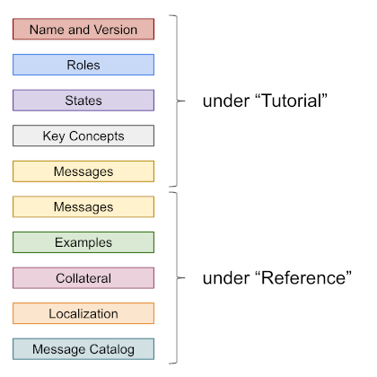
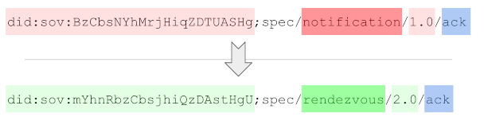

# Template for Protocol RFCs

A protocol RFC conforms to general RFC patterns, but includes some
specific substructure.

### "Name and Version" under "Tutorial"

The first section of a protocol RFC, under "Tutorial", should be called
"Name and Version". It should specify the official name of the protocol
and its version.

Protocol names are conventionally lower_snake_case (especially in URIs),
but are compared case-insensitively and ignoring punctuation. This means
that all of the following protocol names are considered identical in
comparison, and can be used interchangeably, depending on what's appropriate
for a given context (a user-friendly doc vs. CSS vs. python class vs. java class):

* `Let's Do Lunch!`
* `lets-do-lunch`
* `lets_do_lunch`
* `LetsDoLunch`

##### URI representation

Message types and protocols are identified with special URIs that match
certain conventions. See [Message Type and Protocol Identifier URIs](
uris.md) for more details.

##### Semver

The version of a protocol is declared carefully. See [Semver Rules for
Protocols](semver.md) for details.

### "Key Concepts" under "Tutorial"

This is the first subsection under "Tutorial". It is short--a paragraph or
two. It defines terms and describes the flow of the interaction at a very
high level. Key preconditions should be noted (e.g., "You can't issue a
credential until you have completed the _connection_ protocol first"), as
well as ways the protocol can start and end, and what can go wrong. The
section might also talk about timing constraints and other assumptions.
After reading this section, a developer should know what problem your
protocol solves, and should have a rough idea of how the protocol works in
its simpler variants.

### "Roles" under "Tutorial"

>See [this note](roles-participants-etc.md) for definitions of the terms
"role", "participant", and "party".

The "Roles" subsection comes next in a protocol RFC. It gives a formal name
to each role in the protocol, says who and how many can play each role, and
describes constraints associated with those roles (e.g., "You can only issue
a credential if you have a DID on the public ledger"). The issue of qualification
for roles can also be explored (e.g., "The holder of the credential must be known
to the issuer").

The formal names for each role are important because they are used when
[agents discover one another's capabilities](
https://github.com/hyperledger/indy-hipe/pull/73); an agent doesn't
just claim that it supports a protocol; it makes a claim about which
*roles* in the protocol it supports. An agent that supports credential
issuance and an agent that supports credential holding may have very
different features, but they both use the _credential-issuance_ protocol.
By convention, role names use lower-kebab-case but are compared
case-insensitively and ignoring punctuation.

### "States" under "Tutorial"

This section lists the possible states that exist for each role. It also
enumerates the events (often but not always messages) that can occur,
including errors, and what should happen to state as a result. A formal
representation of this information is provided in a _state machine matrix_.
It lists events as columns, and states as rows; a cell answers the
question, "If I am in state X (=row), and event Y (=column) occurs,
what happens to my state?" The [Tic Tac Toe example](tictactoe/README.md#states)
is typical.

[Choreography Diagrams](
https://www.visual-paradigm.com/guide/bpmn/bpmn-orchestration-vs-choreography-vs-collaboration/#bpmn-choreography)
from [BPMN](README.md#bpmn) are good artifacts here, as are [PUML sequence diagrams](
http://plantuml.com/sequence-diagram) and [UML-style state machine diagrams](http://agilemodeling.com/artifacts/stateMachineDiagram.htm).
The matrix form is nice because it forces an exhaustive analysis of every
possible event. The diagram styles are often simpler to create and consume,
and the PUML and BPMN forms have the virtue that they can support line-by-line
diffs when checked in with source code. However, they don't offer an
easy way to see if all possible flows have been considered; what they may
NOT describe isn't obvious. This--and the freedom from fancy tools--is why
the matrix form is used in many early RFCs. We leave it up to
the community to settle on whether it wants to strongly recommend specific
diagram types.

The formal names for each state are important, as they are used in [`ack`s]( https://github.com/hyperledger/indy-hipe/pull/77)
and [`problem-report`s](https://github.com/hyperledger/indy-hipe/pull/65)).
For example, a `problem-report` message declares which state the sender
arrived at because of the problem. This helps other participants
to react to errors with confidence. Formal state names are also used in the
agent test suite, in log messages, and so forth.

By convention, state names use lower-kebab-case but are compared
case-insensitively and ignoring punctuation.

State management in protocols is a deep topic. For more information, please
see [State Details and State Machines](state-details.md).

### "Messages" under "Tutorial"

If there is a message family associated with this protocol, this
section describes each member of it. It should also note the names and
versions of messages from other message families that are used by the
protocol (e.g., an [`ack`]( https://github.com/hyperledger/indy-hipe/pull/77)
or a [`problem-report`](https://github.com/hyperledger/indy-hipe/pull/65)).
Typically this section is written as a narrative, showing each message
type in the context of an end-to-end sample interaction. All possible
fields may not appear; an exhaustive catalog is saved for the "Reference"
section.

Sample messages that are presented in the narrative should also be checked
in next to the markdown of the RFC, in [DIDComm Plaintext format](
https://github.com/hyperledger/indy-hipe/blob/master/text/0026-agent-file-format/README.md#agent-plaintext-messages-ap).

##### Adopted Messages

Many protocols should use general-purpose messages such as [`ack`](
https://github.com/hyperledger/indy-hipe/pull/77) and [`problem-report`](
https://github.com/hyperledger/indy-hipe/pull/65)) at certain points in
an interaction. This reuse is strongly encouraged because it helps us avoid
defining redundant message types--and the code to handle them--over and
over again (see [DRY principle](https://en.wikipedia.org/wiki/Don't_repeat_yourself)).

However, using messages with generic values of `@type` (e.g., `"@type":
"did:sov:BzCbsNYhMrjHiqZDTUASHg;spec/notification/1.0/ack"`)
introduces a challenge for agents as they route messages to their internal
routines for handling. We expect internal handlers to be organized around
protocols, since a protocol is a discrete unit of business value as well
as a unit of testing in our agent test suite. Early work on agents has
gravitated towards pluggable, routable protocols as a unit of code
encapsulation and dependency as well. Thus the natural routing question
inside an agent, when it sees a message, is "Which protocol handler should
I route this message to, based on its @type?" A generic `ack` can't be
routed this way.

Therefore, we allow a protocol to __adopt__ messages into its namespace.
This works very much like python's `from module import symbol` syntax.
It changes the `@type` attribute of the adopted message. Suppose a `rendezvous`
protocol is identified by the URI `did:sov:mYhnRbzCbsjhiQzDAstHgU;spec/rendezvous/2.0`,
and its definition announces that it has adopted generic 1.x `ack`
messages. When such `ack` messages are sent, the `@type` should now use
the alias defined inside the namespace of the `rendezvous` protocol:

Adoption should be declared in an "Adopted" subsection of "Messages" in
a protocol RFC. When adoption is specified, it should include a __minimum
adopted version__ of the adopted message type: "This protocol adopts
`ack` with version >= 1.4". All versions of the adopted message that share
the same major number should be compatible, given the [semver rules](semver.md)
that apply to protocols.

### "Constraints" under "Tutorial"

Many protocols have constraints that help parties build trust.
For example, in buying a house, the protocol includes such things as
commission paid to realtors to guarantee their incentives, title insurance,
earnest money, and a phase of the process where a home inspection takes
place. If you are documenting a protocol that has attributes like
these, explain them here. If not, the section can be omitted.

### "Messages" under "Reference"

Unless the "Messages" section under "Tutorial" covered everything that
needs to be known about all message fields, this is where the data type,
validation rules, and semantics of each field in each message type are
details. Enumerating possible values, or providing ABNF or regexes is
encouraged. Following conventions such as [those for date-
and time-related fields](https://github.com/hyperledger/indy-hipe/pull/76)
can save a lot of time here.

Each message type should be associated with one or more roles in the 
protocol. That is, it should be clear which roles can send and receive
which message types.

### "Examples" under "Reference"

This section is optional. It can be used to show alternate flows through
the protocol.

### "Collateral" under "Reference"

This section is optional. It could be used to reference files, code,
relevant standards, oracles, test suites, or other artifacts that would
be useful to an implementer. In general, collateral should be checked in
with the RFC.

### "Localization" under "Reference"

If communication in the protocol involves humans, then localization of
message content may be relevant. Default settings for localization of
all messages in the protocol can be specified in an `l10n.json` file
described here and checked in with the RFC. See ["Decorators at Message
Type Scope"](https://github.com/hyperledger/indy-hipe/blob/318f265d508a3ddf1da7d91c79ae4ae27ab9142b/text/localized-messages/README.md#decorator-at-message-type-scope)
in the [Localization RFC](https://github.com/hyperledger/indy-hipe/pull/64).

### "Message Catalog" under "Reference"

If the protocol has a formally defined catalog of codes (e.g., for errors
or for statuses), define them in this section. See ["Message Codes and
Catalogs"](https://github.com/hyperledger/indy-hipe/blob/318f265d508a3ddf1da7d91c79ae4ae27ab9142b/text/localized-messages/README.md#message-codes-and-catalogs)
in the [Localization HIPE](https://github.com/hyperledger/indy-hipe/pull/64).
