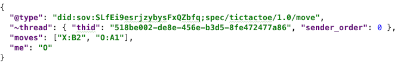
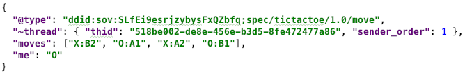
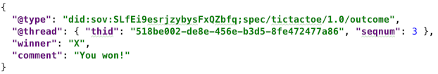

# Tic Tac Toe Protocol 1.0

## Summary

Describes a simple protocol, already familiar to most
developers, as a way to demonstrate how all protocols should
be documented.

## Motivation

Playing tic-tac-toe is a good way to test whether agents are
working properly, since it requires two parties to take turns
and to communicate reliably about state. However, it is also
pretty simple, and it has a low bar for trust (it's not dangerous
to play tic-tac-toe with a malicious stranger). Thus, we expect
agent tic-tac-toe to be a good way to test basic plumbing and to
identify functional gaps. The game also provides a way of testing
interactions with the human owners of agents, or of hooking up
an agent AI.

## Tutorial

[Tic-tac-toe is a simple game](https://en.wikipedia.org/wiki/Tic-tac-toe)
where players take turns placing Xs and Os in a 3x3 grid, attempting to
capture 3 cells of the grid in a straight line.

### Name and Version

This defines the `tictactoe` protocol, version 1.x, as identified by the
following [PIURI](https://github.com/hyperledger/aries-rfcs/blob/master/concepts/0003-protocols/uris.md#piuri):

    did:sov:SLfEi9esrjzybysFxQZbfq;spec/tictactoe/1.0

### Key Concepts

A tic-tac-toe game is an interaction where 2 parties take turns to
make up to 9 moves. It starts when either party proposes the game, and
ends when one of the parties wins, or when all all cells in the grid
are occupied but nobody has won (a draw).

Illegal moves and moving out of turn are errors that trigger a complaint
from the other player. However, they do not scuttle the interaction.
A game can also be abandoned in an unfinished state by either player,
for any reason. Games can last any amount of time.

    About the Key Concepts section: Here we describe the flow at a very
    high level. We identify preconditions, ways the protocol can start
    and end, and what can go wrong. We also talk about timing
    constraints and other assumptions.

### Roles

There are two parties in a tic-tac-toe game, but only one role, `player`.
One player places 'X' for the duration of a game; the other places 'O'.
There are no special requirements about who can be a player. The parties do
not need to be trusted or even known to one another, either at the outset or
as the game proceeds. No prior setup is required, other than an ability to
communicate.

    About the Roles section: Here we name the roles in the protocol,
    say who and how many can play each role, and describe constraints.
    We also explore qualifications for roles.

### States

The states of each `player` in the protocol evolve according to the
following state machine:

When a player is in the `my-move` state, possible valid events include
`send move` (the normal case), `send outcome` (if the player decides
to abandon the game), and `receive outcome` (if the other player
decides to abandon). A `receive move` event could conceivably occur, too--
but it would be an error on the part of the other player, and would
trigger a `problem-report` message as described above, leaving the
state unchanged.

In the `receive-move` state, `send move` is an impossible event for a
properly behaving player. All 3 of the other events could occur, causing
a state transition.

In the `wrap-up` state, the game is over, but communication with the
outcome message has not yet occurred. The logical flow is `send outcome`,
whereupon the player transitions to the `done` state.

    About the States section: Here we explain which states exist for each
    role. We also enumerate the events that can occur, including messages,
    errors, or events triggered by surrounding context, and what should
    happen to state as a result. In this protocol, we only have one role,
    and thus only one state machine matrix. But in many protocols, each
    role may have a different state machine.

### Messages

All messages in this protocol are part of the "tictactoe 1.0" message
family uniquely identified by this DID reference: `did:sov:SLfEi9esrjzybysFxQZbfq;spec/tictactoe/1.0`

<blockquote>
<em>NOTE 1</em>: All the messages defined in a protocol should follow
<a target="_blank" href="../../0074-didcomm-best-practices/README.md">
DIDComm best practices</a> as far as how they name fields and define their data types and
semantics.
</blockquote>

<blockquote>
<em>NOTE 2</em> about the "DID Reference" URI that appears here: DIDs can be resolved
    to a DID doc that contains an endpoint, to which everything after a
    semicolon can be appended. Thus, if this DID is publicly registered
    and its DID doc gives an endpoint of http://example.com, this URI
    would mean that anyone can find a formal definition of the protocol at
    http://example.com/spec/tictactoe/1.0. It is also possible to use a
    traditional URI here, such as http://example.com/spec/tictactoe/1.0.
    If that sort of URI is used, it is best practice for it to reference
    immutable content, as with a link to specific commit on github:
      https://github.com/hyperledger/indy-hipe/blob/4a17a845/text/protocols/tictactoe-1.0/README.md#messages
</blockquote>
    
##### `move` message

The protocol begins when one party sends a `move` message
to the other. It looks like this:

`@id` is required here, as it establishes a [message thread](https://github.com/hyperledger/indy-hipe/pull/30)
that will govern the rest of the game.

`me` tells which mark (X or O) the sender is placing.
It is required.

`moves` is optional in the first message of the interaction. If missing
or empty, the sender of the first message is inviting the recipient to
make the first move. If it contains a move, the sender is moving first.

Moves are strings like "X:B2" that match the regular expression `(?i)[XO]:[A-C][1-3]`.
They identify a mark to be placed ("X" or "O") and a position in the 3x3
grid. The grid's columns and rows are numbered like familiar spreadsheets,
with columns A, B, and C, and rows 1, 2, and 3.

`comment` is optional and probably not used much, but could be a way
for players to razz one another or chat as they play. It follows the
conventions of [localized messages](
https://github.com/hyperledger/indy-hipe/pull/64).

Other decorators could be placed on tic-tac-toe messages, such as those
to enable [message timing](../../../features/0032-message-timing/README.md)
to force players to make a move within a certain period of time.

##### Subsequent Moves
Once the initial `move` message has been sent, game play continues
by each player taking turns sending responses, which are also `move`
messages. With each new message the `move` array inside the message
grows by one, ensuring that the players agree on the current accumulated
state of the game. The `me` field is still required and must
accurately reflect the role of the message sender; it thus alternates
values between `X` and `O`.

Subsequent messages in the game use the [message threading](
https://github.com/hyperledger/indy-hipe/pull/30) mechanism where the
`@id` of the first `move` becomes the `~thread.thid` for the duration
of the game.

An evolving sequence of `move` messages might thus look like this,
suppressing all fields except what's required:

##### Message/Move 2

This is the first message in the thread that's sent by the `player` placing
"O"; hence it has `myindex` = 0.

##### Message/Move 3

This is the second message in the thread by the player placing "X"; hence
it has `myindex` = 1.

##### Message/Move 4

...and so forth.

Note that the order of the items in the `moves` array is NOT significant.
The state of the game at any given point of time is fully captured by
the moves, regardless of the order in which they were made.

If a player makes an illegal move or another error occurs, the other
player can complain using a [problem-report](
https://github.com/hyperledger/indy-hipe/blob/6a5e4fe2d7e14953cd8e3aed07d886176332e696/text/error-handling/README.md#the-problem-report-message-type)
message, with `explain.@l10n.code` set to one of the values defined
in the Message Catalog section (see below).

##### `outcome` message
Game play ends when one player sends a `move` message that manages to
mark 3 cells in a row. Thereupon, it is best practice, but not strictly
required, for the other player to send an acknowledgement in the form
of an `outcome` message.

The `moves` and `me` fields from a `move` message can also, optionally,
be included to further document state. The `winner` field is required.
Its value may be "X", "O", or--in the case of a draw--"none".

This `outcome` message can also be used to document an abandoned game,
in which case `winner` is `null`, and `comment` can be used to
explain why (e.g., timeout, loss of interest).

    About the Messages section: Here we explain the message types, but
    also which roles send which messages, what sequencing rules apply,
    and how errors may occur during the flow. The message begins with
    an announcement of the identifier and version of the message
    family, and also enumerates error codes to be used with problem
    reports. This protocol is simple enough that we document the
    datatypes and validation rules for fields inline in the narrative;
    in more complex protocols, we'd move that text into the Reference
    > Messages section instead.

### Constraints

Players do not have to trust one another. Messages do not have to be
authcrypted, although anoncrypted messages still have to have a
path back to the sender to be useful.

    About the Constraints section: Many protocols have rules
    or mechanisms that help parties build trust. For example, in buying
    a house, the protocol includes such things as commission paid to
    realtors to guarantee their incentives, title insurance, earnest
    money, and a phase of the process where a home inspection takes
    place. If you are documenting a protocol that has attributes like
    these, explain them here.

## Reference

    About the Reference section: If the Tutorial > Messages section
    suppresses details, we would add a Messages section here to
    exhaustively describe each field. We could also include an
    Examples section to show variations on the main flow.
    
### Collateral

A reference implementation of the logic of a game is provided with this
RFC as python 3.x code. See [game.py](game.py). There is also a simple
hand-coded AI that can play the game when plugged into an agent (see
[ai.py](ai.py)), and a set of unit tests that prove correctness (see
[test_tictactoe.py](test_tictactoe.py)).

A full implementation of the state machine is provided as well; see
[state_machine.py](state_machine.py) and [test_state_machine.py](
test_state_machine.py).

The game can be played interactively by running `python game.py`.

### Localization

The only localizable field in this message family is `comment` on both `move`
and `outcome` messages. It contains ad hoc text supplied by the sender,
instead of a value selected from an enumeration and identified by `code` for
use with message catalogs. This means the only approach to localize `move` or
`outcome` messages is to submit `comment` fields to an automated translation
service. Because the locale of `tictactoe` messages is not predefined, each
message must be decorated with `~l10n.locale` to make automated translation
possible.

There is one other way that localization is relevant to this protocol: in error
messages. Errors are communicated through the general [problem-report](
https://github.com/hyperledger/indy-hipe/blob/6a5e4fe2d7e14953cd8e3aed07d886176332e696/text/error-handling/README.md#the-problem-report-message-type)
message type rather than through a special message type that's part of the
`tictactoe` family. However, we define a catalog of tictactoe-specific error codes
below to make this protocol's specific error strings localizable. 

Thus, all instances of this message family carry localization metadata
in the form of an implicit `~l10n` decorator that looks like this:

This JSON fragment is checked in next to the narrative content of this
RFC as [~l10n.json](~l10n.json), for easy machine parsing.

Individual messages can use the `~l10n` decorator to supplement or override
these settings.

For more information about localization concepts, see the [HIPE about localized
messages](https://github.com/hyperledger/indy-hipe/blob/569357c6/text/localized-messages/README.md#message-codes-and-catalogs).

### Message Catalog

To facilitate localization of error messages, all instances of this message
family assume the following catalog in their `~l10n` data:

When referencing this catalog, please be sure you have the correct version. The
official, immutable URL to this version of the catalog file is:

    https://github.com/hyperledger/indy-hipe/blob/fc7a6028/text/tictactoe-protocol/catalog.json

This JSON fragment is checked in next to the narrative content of this RFC
as [catalog.json](catalog.json), for easy machine parsing. The catalog
currently contains localized alternatives only for English. Other language
contributions would be welcome.

For more information, see the [Message Catalog section of the localization HIPE](
https://github.com/hyperledger/indy-hipe/blob/569357c6/text/localized-messages/README.md#message-codes-and-catalogs
).

