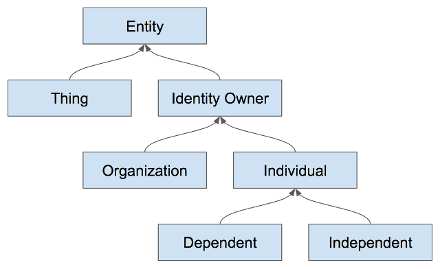
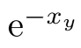

# 0006: SSI Notation
- Author: Daniel Hardman
- Start Date: 2018-05-03

## Status
- Status: [ACCEPTED](/README.md#rfc-lifecycle)
- Status Date: 2018-09-01
- Status Note: broadly accepted but not heavily used; may need
  greater usage before it's ready for [ADOPTED](/README.md#rfc-lifecycle) status.

## Summary
[summary]: #summary

This RFC describes a simple, standard notation for various concepts related
to independent identity (II) and self-sovereign identity (SSI). (II and SSI
are related but not synonymous, in that IoT things are independent but not
sovereign owners; the RFC covers both but uses SSI in its name as the more
recognized term.)

The notation could be used in design docs, other RFCs, source code comments,
chat channels, scripts, debug logs, and miscellaneous technical
materials throughout the Aries ecosystem. We hope it is also used in the larger
SSI community.

This RFC is complementary to the [Sovrin Glossary](
https://sovrin.org/library/glossary/), which carefully curates terms and their
meanings. We start from the concepts and verbiage defined there. Another
complementary effort is the work to standardize ZKLang (a symbolic
language for representing zero knowledge proof.)

## Motivation
[motivation]: #motivation

All technical materials in our ecosystem hinge on fundamental concepts of
self-sovereign identity such as owners, keys, DIDs, and agents. We need a
standard, documented notation to refer to such things, so we can
use it consistently, and so we can link to the notation's spec for
definitive usage.

## Tutorial
[tutorial]: #tutorial

The following explanation is meant to be read sequentially and should provide a
friendly overview for most who encounter the RFC. See the
[Reference section](#reference)
for quick lookup.

## Requirements
This notation aims to be:

* Precise
* Consistent
* Terse
* Easy to learn, understand, guess, and remember
* Representable in 7-bit ASCII plain text

The final requirement deserves special comment. Cryptologists are
a major stakeholder in SSI theory. They already have many
notational conventions, some more standardized than others.
Generally, their notation derives from advanced math and uses
specialized symbols and fonts. These experts also tend
to intersect strongly with academic circles, where LaTeX and similar
rendering technologies are common.

Despite the intersection between SSI, cryptology, and academia, SSI
has to serve a broader audience. Its practicioners are not just
mathematicians; they may include support and IT staff, lawyers
specializing in intellectual property, business people, auditors,
regulators, or even so-called "end users." In particular, SSI
ecosystems are built and maintained by coders.
Coders regularly write docs in markdown and html. They interact with
one another on chat. They write emails and source code where comments
might need to be embedded. They create UML diagrams. They type in shells.
They paste code into slide decks and word processors. All of these
behaviors militate against a notation that requires complex markup.
Instead, we want something simple, clean, and universally supported.
Hence the 7-bit ASCII requirement. A future version of this RFC,
or an addendum to it, might explain how to map this 7-bit
ASCII notation to various schemes that use mathematical symbols
and are familiar to experts from other fields.

### Solution

#### Entities
Entities are the primary actors in the SSI ecosystem. They, at minimum 
control but often own their self-sovereign domain. They are not, conceptually 
at least, a digital actor. This notation separates the need for an Identity
from the software/hardware that implement the functionality that might
be described by this notation that provides digital identity. Entities
could be a thing that would seem to be a digital actor (ex. self-driving
car), but the notation will still specify both the Entity and other
elements of their domain the provide digital functionality.

Two types of entities are being defined. Things and Identity Owners. 
Each have their own sections below and define their own syntax.



### Identity Owners

In a self-sovereign worldview, the conceptual center of gravity is
__identity owners__. These are people and institutions--the type of
entity that can (at least theoretically) be held legally accountable
for its actions. Identity owners control a __sovereign domain__ that
encompasses all their agents, data, and devices. The notation's first
goal is therefore an efficient and unambiguous way to anchor
derivative concepts to owners and their domains. 

Identity owners are denoted with a single
capital ASCII alpha, often corresponding to their first initial. For
example, Alice might be represented as `A`. By preference, the first
half of the alphabet is used (because "x", "y", and "z" tend to have
other ad-hoc meanings). When reading aloud, the spoken form of
a symbol like this is the name of the letter. The relevant [ABNF](
https://tools.ietf.org/html/rfc5234) fragment is:

 ```ABNF
  ucase-alpha    = %x41-5A            ; A-Z
  lcase-alpha    = %x61-7A            ; a-z
  digit          = %x30-39            ; 0-9
  
  identity-owner = ucase-alpha
  ```
Because the domain of an identity owner is like their private
universe, the name or symbol of an identity owner is often used
to denote a domain as well; context eliminates ambiguity. You
will see examples of this below.
   
#### Things

Identity owners are not the only participants in an SSI ecosystem.
Other participants include Things that control their own domain.
These __entities__ may have a high degree of autonomy (e.g., an AI in 
a self-driving car), but they are owned, operated, or controlled in at
least some sense by another party.

Note that non-identity-owner entities also control a __domain__,
but it is not _self-sovereign_. Anywhere that the notation allows domains,
any type of domain is possible.

Things are denoted with a single lower case ASCII alpha. Can correspond to
the first letter of a larger name for the thing. For example, Car AI could be
`c`. For clarity, it would be best practice to choose letter that don't match
other Identity Owners used in the same description. Identity Owners and Things
differ in character case but using the same letter would often be confusing.

```ABNF
  thing = lcase-alpha
  
  entity = identity-owner / thing
```

#### Association
Since Entities don't directly act in the SSI Ecosystem; people, 
organizations and even things can't of themselves do digital operations 
(ex. compute digital signatures). They require software and/or hardware 
to do the digital work of their digital Identity. These software/hardware 
elements are part of the Entity's domain and serve the master of the domain. 
Elements associated with a domain must be named in a way that
makes their association clear, using a `name@context` pattern familiar
from email addresses: `1@A` (“one at A”) is agent 1 in A’s sovereign domain.
(Note how we use an erstwhile identity owner symbol, `A`, to reference a
domain here, but there is no ambiguity.) This fully qualified form of an
entity reference is useful for clarification but is often not necessary.

In addition to domains, this same associating notation may be used where
a _relationship_ is the context, because sometimes the association is
to the relationship rather than to a participant. See the DID
example in the next section.

#### Agents
Agents are not Entities. They neither control or own a domain. They
live and act with in a domain. They are always owned and controlled by
Entity and live within the their domain. Agents are the first example 
of elements associated with an Entity. Despite this, agents are the
primary source of action with SSI ecosystem. 

Additionally, agents are distinct from devices, even though
we often (and inaccurately) used them interchangeably. We may
say things like "Alice's iPhone sends a message" when we more
precisely mean "the agent on Alice's iPhone sends a message."
In reality, there may be zero, one, or more than one agents
running on a particular device.

Agents are numbered and are represented by up to three digits and
then with an association. In most discussions, one digit is 
plenty, but three digits are allowed so agents can be 
conveniently grouped by prefix (e.g., all edge agents in Alice's
domain might begin with `1`, and all cloud might begin with `2`). 
   
  ```ABNF
  agent = 1*3digit "@" entity
  ```

#### Devices
Devices are another example of an element that are part of an Entity's
domain. Devices are digital hardware that are part of an Entity's domain.  

Devices are both represented with two or more
lower-case ASCII alphanumerics or underscore characters, where the
first char cannot be a digit and ended with an association:
 `bobs_car@B`, `drone4@F`, `alices_iphone9@A`.

  ```ABNF
  name-start-char = lcase-alpha / "_"            ; a-z or underscore
  name-other-char = digit / lcase-alpha / "_"    ; 0-9 or a-z or underscore
  device = name-start-char 1*name-other-char "@" entity
  ```

Agents are distinct from devices, even though
we often (and inaccurately) used them interchangeably. We may
say things like "Alice's iPhone sends a message" when we more
precisely mean "the agent on Alice's iPhone sends a message."
In reality, there may be zero, one, or more than one agents
running on a particular device.

Agents are numbered and are represented by up to three digits.
In most discussions, one digit is plenty, but three digits are
allowed so agents can be conveniently grouped by prefix (e.g.,
all agents in Alice's domain might begin with `1`, and all Bob's
agents might begin with `2`). 
   
  ```ABNF
  agent = 1*3digit
  ```
Note that non-identity-owner entities also control a __domain__,
but it is not _self-sovereign_. Anywhere that the notation allows domains,
any type of domain is possible.

### Cross-Domain Relationships

#### Short Form (more common)

Alice’s pairwise relationship with Bob is represented with colon
notation: `A:B`. This is read aloud as “A to B” (preferred because
it’s short; alternatives such as “the A B relationship” or “A colon B”
or “A with respect to B” are also valid). When written in the other order,
it represents the same relationship as seen from Bob’s point of view.
Note that IoT things may also participate in relationships: `A:bobs_car`.
(Contrast [Intra-Domain Relationships](#intra-domain-relationships) below.)

N-way relationships (e.g., doctor, hospital, patient) are written with
the perspective-governing entity's identifier, a single colon, then by all other
identifiers for members of the relationship, in alphabetical order,
separated by `+`: `A:B+C`, `B:A+C`. This is read aloud as in "A to B
plus C."
   
  ```ABNF
  next-entity = "+" entity
  short-relationship = entity ":" entity *next-entity
  ```

#### Long Form

Short form is convenient and brief, but it is inconsistent because each
party to the relationship describes it differently. Sometimes this may
be undesirable, so a long and consistent form is also supported. The long
form of both pairwise and N-way relationships lists all participants to
the right of the colon, in alphabetical order. Thus the long forms of the
Alice to Bob relationship might be `A:A+B` (for Alice's view of this
relationship) and `B:A+B` (for Bob's view). For a doctor, hospital,
patient relationship, we might have `D:D+H+P`, `H:D+H+P`, and `P:D+H+P`.
Note how the enumeration of parties to the right of the colon is consistent.

Long form and short form are allowed to vary freely; any tools that parses
this notation should treat them as synonyms and stylistic choices only.

The ABNF for long form is identical to short form, except that we are
guaranteed that after the colon, we will see at least two parties and
one `+` character:

  ```ABNF
  long-relationship = entity ":" entity 1*next-entity
  ```
  
#### Generalized Relationships

Some models for SSI emphasize the concept of __personas__. These are
essentially "masks" that an identity owner assumes, exposing a limited
subset of self to a generalized audience. For example, Alice might assume
one persona in her employment relationships, another for government
interactions, another for friends, and another when she's a customer.
(The wisdom of personas versus pairwise relationships is a matter of
some debate.)

Personas can be modeled as a relationship with a generalized audience:
`A:Work`, `A:Friends`.

  ```ABNF
  general-audience = ucase-alpha 1*name-other-char
  general-relationship = entity ":" general-audience
  relationship = short-relationship / long-relationship / general-relationship
  ```

The concept of public DIDs suggests that someone may think about a
relationship as unbounded, or as not varying no matter who the other
entity is. For example, a company may create a public DID and advertise
it to the world, intending for this connection point to begin relationships
with customers, partners, and vendors alike. While best practice suggests
that such relationships be used with care, and that they primarily serve to
bootstrap pairwise relationships, the notation still needs to represent the
possibility.

The [token `Any` is reserved](#reserved-tokens) for these semantics. If Acme Corp
is represented as `A`, then Acme's public persona could be denoted with
`A:Any`. When `Any` is used, it is never the entity whose perspective is
captured; it is always a faceless "other". This means that `Any` appears
only on the right side of a colon in a relationship, and it probably doesn't
make sense to combine it with other participants since it would subsume them
all.

### Intra-Domain Relationships

Within a domain, relationships among agents or devices may be interesting. Such
relationships use the `~` (tilde) character. Thus, the intra-domain relationship
between Alice's agent 1 and agent 2 could be written `1~2` and read as "one tilde two".


### Association

Entities associated with a domain may be named in a way that
makes that association clear, using a `name@context` pattern familiar
from email addresses: `1@A` (“one at A”) is agent 1 in A’s sovereign domain.
(Note how we use an erstwhile identity owner symbol, `A`, to reference a
domain here, but there is no ambiguity.) This fully qualified form of an
entity reference is useful for clarification but is often not necessary.

In addition to domains, this same associating notation may be used where
a _relationship_ is the context, because sometimes the association is
to the relationship rather than to a participant. See the DID
example in the next section.

### Inert Items

In contrast to entities that may be capable of independent action
and that may have identities in an II or SSI sense, inert or passive
constituents of a sovereign domain (for example, data, money, keys)
use dot notation for ownership: `A.ls`, (A’s link secret), `A.policy`,
etc.

Names for inert things use the same rules as names for agents and devices.

Alice’s DID for her relationship with Bob is inert and therefore owned, but
it is properly associated with the relationship rather than just Alice. It is
thus represented with `A.did@A:B`. (The [token `did` is reserved](#reserved-tokens)
for DIDs). This is read as “A’s DID at A to B”. Bob’s complementary DID would
be `B.did@B:A`.

  ```ABNF
  inert = name-start-char 1*name-other-char
  nested = "." inert
  owned-inert = entity 1*nested
  
  associated-to = identity-owner / relationship
  associated = entity 0*nested "@" associated-to
  ```
   
If `A` has a cloud agent `2`, then the public key (verification key or verkey)
and private, secret key (signing key or sigkey) used by
`2` in `A:B` would be: `2.pk@A:B` and `2.sk@A:B`. This is read as “2
dot P K at A to B” and “2 dot S K at A to B”. Here, `2` is known to
belong to `A` because it takes `A`’s perspective on `A:B`--it would
be equivalent but unnecessary to write `A.2.pk@A:B`.

### DID Docs and DID References

The mention of keys belonging to agents naturally raises the question of DID
Docs and the things they contain. How do they relate to our notaiton? 
[DIDs are designed to be URIs](
https://w3c-ccg.github.io/did-spec/#generic-did-syntax), and items that carry
an `id` property within a DID Doc [can be referenced with standard URI fragment
notation]( https://w3c-ccg.github.io/did-spec/#fragments). This allows someone, for example,
to refer to the first public key used by one of the agents owned by Alice with
a notation like: `did:sov:VUrvFeWW2cPv9hkNZ2ms2a;#key1`.

This notation is important and useful, but it is somewhat orthogonal to the concerns
of this RFC. In the context of SSI notation, we are not DID-centric; we are
owner centric, and owners are identified by a single capital alpha instead of
by their DID. This helps with brevity. It lets us ignore the specific DID value
and instead focus on the higher level semantics; compare:

<blockquote><code>{A.did@A:B}/B --> B</code></blockquote>

...to:

<blockquote><code>did:sov:PXqKt8sVsDu9T7BpeNqBfe</code> sends its DID for
<code>did:sov:6tb15mkMRagD7YA3SBZg3p</code> to 
<code>did:sov:6tb15mkMRagD7YA3SBZg3p</code>,
using the agent possessing <code>did:sov:PXqKt8sVsDu9T7BpeNqBfe;#key1</code>
to encrypt with the corresponding signing key.</blockquote>

We expect DID reference notation (the verbose text above) to be relevant for
concrete communication between computers, and SSI notation (the terse equivalent
shown first) to be more convenient for symbolic, higher
level discussions between human beings. Occasionally, we may get very specific
and map SSI notation into DID notation (e.g., `A.1.vk = did:sov:PXqKt8sVsDu9T7BpeNqBfe;#key1`).

### Counting and Iteration

Sometimes, a concept or value evolves over time. For example, a given discussion
might need to describe a DID Doc or an endpoint or a key across multiple
state changes. In mathematical notation, this would typically be modeled with
subscripts. In our notation, we use square brackets, and we number beginning
from zero. `A.pk[0]@A:B` would be the first pubkey used by A in the `A:B`
relationship; `A.pk[1]@A:B` would be the second pubkey, and so on. Likewise, a
sequence of messages could be represented with `msg[0]`, `msg[1]`, and `msg[2]`.

### Messages

Messages are represented as quoted string literals, or with the [reserved token](#reserved-tokens)
`msg`, or with kebab-case names that explain their semantics, as in `cred-offer`:

```ABNF
string-literal = %x22 c-literal %x22
kebab-char = lcase-alpha / digit
kebab-suffix = "-" 1*hint-char
kebab-msg = 1*kebab-char *kebab-suffix
message = "msg" / string-literal / kebab-msg
```

### Negotiation Patterns

A common interaction pattern in SSI ecosystems is negotiation. It involves
sequences like this:


Credential issuance follows this pattern: credential offer (step 1a) is either
followed by an incompatible credential request (1b)--and this pair of messages
repeats as needed--or by a compatible credential request (2). A credential is
then issued (3). Possibly the holder of the credential acknowledges receipt (4).

Proving follows this pattern (though it nearly always begins with a request).
Connections follow this pattern. Price negotiations follow this pattern.

The notation [reserves standard kebab suffixes](#reserved-tokens) on messages to
make this pattern obvious and consistent: `-offer` (step 1a), `-req` (step 1b
or 2), and `-receipt` (step 4). Step 3 is typically named without a suffix.
Thus: `proof-offer`, `proof-request`, `proof` (no suffix), `proof-receipt`.
  
### Payments

Economic activity is part of rich SSI ecosystems, and requires notation. A
__payment address__ is denoted with the [`pay` reserved token](#reserved-tokens);
`A.pay[4]` would be A's fifth payment address.
The public key and secret key for a payment address use the
[`ppk` and `psk` reserved token](#reserved-tokens), respectively. Thus, one way to reference
the payment keys for that payment address would be `A.pay[4].ppk` and
`A.pay[4].psk`. (Keys are normally held by agents, not by people--and every
agent has its own keys. Thus, another notation for the public key
pertaining to this address might be `A.1.pay[4].ppk`. This is an area of
clumsiness that needs further study.)

### Encryption

Encryption deserves special consideration in the SSI world. It often figures
prominently in discussions about security and privacy, and our notation needs
to be able to represent it carefully.

The following crypto operations are recognized by the notation, without
making a strong claim about how the operations are implemented. (For
example, inline Diffie Helman and an ephemeral symmetric key might be
used for the *_crypt algorithms. What is interesting to the notation
isn't the low-level details, but the general semantics achieved.)

* `anon_crypt(msg, recipient_pubkey)` -- Encrypt
only for recipient, achieving confidentiality. Sender is anonymous.
Parties may have had no prior contact, though sender must discover
recipient's pubkey. The message is tamper evident.
* `auth_crypt(msg, recipient_pubkey, sender_privkey)` -- Encrypt
only for recipient, achieving confidentiality. Recipient
learns sender’s pubkey but can’t prove to anybody else who the sender
is (making the message repudiable). Parties may have had no prior contact,
though sender must discover recipient's pubkey.
The message is tamper evident.
* `sign(msg, signer_privkeys)` -- Associate a signature with a
message, making the message [non-repudiable](
https://github.com/sovrin-foundation/protocol/blob/master/janus/repudiation.md).
This also makes the message tamper-evident. A signature does not
automatically encrypt and therefore is not a way to achieve
confidentiality. Note that complex signature schemes (multisig, M of N, ring)
use this operation as well.
* `verify(msg, signature, signer_pubkeys)` -- Verify a signature over a
message with select keys. Note that complex verification schemes
(multiverify, M of N, ring) use this operation as well.
* `sym_crypt(msg, sym_key)` -- Symmetrically encrypt for anyone
who has the symmetric key, achieving a limited form of confidentiality.
Key must be shared in advance with both parties. Likely tamper
evident. If multiple parties know the symmetric key, the sender is
not knowable to the recipient.

The notation for these crypto primitives uses curly braces around the
message, with suffixes to clarify semantics. Generally,
it identifies a recipient as an identity owner or thing, without clarifying
the key that's used--the pairwise key for their DID is assumed.

```ABNF
asymmetric   = "/"                                   ; suffix
symmetric    = "*"                                   ; suffix
sign         = "#"                                   ; suffix
multiplex    = "%"                                   ; suffix
verify       = "?"                                   ; suffix

anon-crypt   = "{" message "}" asymmetric entity          ; e.g., {"hi"}/B

                ; sender is first entity in relationship, receiver is second
auth-crypt   = "{" message "}" asymmetric short-relationship ; e.g., {"hi"}/A:B 
             
sym-crypt    = "{" message "}" symmetric entity           ; e.g., {"hi"}*B

verify       = "{" message "}" verify entity              ; e.g., {"hi"}?B
``` 

The relative order of suffixes reflects whether encryption or
signing takes place first: `{"hello"}*B#` says that symmetric
encryption happens first, and then a signature is computed over
the cypertext; `{"hello"#}*B` says that plaintext is signed, and
then both the plaintext and the signature are encrypted. (The
`{"hello"}#*B` variant is nonsensical because it splits the
encryption notation in half).
 
All suffixes can be further decorated with a parenthesized algorithm
name, if precision is required: `{"hello"}*(aes256)B` or
`{"hello"}/(rsa1024)A:B` or `{"hello"#(ecdsa)}/B`.

With signing, usually the signer and sender are assumed to be identical,
and the notation omits any clarification about the signer. However,
this can be added after `#` to be explicit. Thus, `{msg#B}~C` would be
a message with plaintext signed by B, anon-encrypted for C. Similarly,
`{msg#(ring-rabin)BGJM}~A:C` would be a message with plaintext signed
according to a Rabin ring signature algorithm, by B, G, J, and M, and
then auth-encrypted by A for C.

Signing verification would be over the corresponding message and which
entities perform the action. `{msg#A}?B` would be a message with plaintext
signed by A verified by B. `{msg#(threshold-sig)ABC}?DE` would be a plaintext
message signed according to a threshold signature algorithm by A, B, C
and then verified by D and E.

Multiplexed asymmetric encryption is noted above, but has not yet been
described. This is a technique whereby a message body is encrypted with
an ephemeral symmetric key, and then the ephemeral key is encrypted
asymmetrically for multiple potential recipients (each of which has a unique
but tiny payload [the key] to decrypt, which in turn unlocks the main payload). The
notation for this looks like `{msg}%BCDE` for multiplexed anon\_crypt (sender
is anonymous), and like `{msg}%A:BCDE` for multiplexed auth\_crypt (sender
is authenticated by their private key).

### Other punctuation

Message sending is represented with arrows: `->` is most common, though `<-`
is also reasonable in some cases. Message content and notes about sending
can be embedded in the hyphens of sending arrow, as in this example, where
the notation says an unknown party uses http to transmit "hello", anon-enrcypted
for Alice:

  ```<unknown> -- http: {"hello"}/A --> 1```

Parentheses have traditional meaning (casual usage in written language, plus
grouping and precedence).

Angle braces `<` and `>` are for placeholders; any
reasonable explanatory text may appear inside the angle braces, so to
represent Alice's relationship with a not-yet-known entity, the notation
might show something like `A:<TBD>`.

## Reference

### Examples
* `A`: an identity owner like Alice or Acme Corp.
* `alices_pixel@A` or `bobs_alexa@B`: a device or IoT thing
* `7@A`: an agent, arbitrarily assigned number 7
* `A:B` or `A:A+B`: The Alice to Bob relationship, as seen from Alice's perspective (short form, then long form).
  Bob's view of this relationship would be `B:A` or `B:A+B`.
* `B:ACD` or `B:A+B+C+D`: The 4-way relationship between A, B, C, and D, as seen from B's perspective (short form, then long form)
* `A:Dating`: Alice's dating persona
* `A.pay[3].ppk`: The public payment key for the fourth payment address belonging to A.
* `F.did@F:Any`: Faber's public DID.
* `C.ls`: Carol's link secret.
* `D.padr`: Doug's policy address.
* `F.micro@F:A`: F's microledger for the F:A relationship.
* `A.uri@A:B`: Alice's URI (endpoint of DID doc) in the Alice to Bob relationship.
* `F.uri@F:Any`: The endpoint where the DID doc for Faber's public DID is hosted.
* `escrow-offer`: A message that represents step 1a in a standard negotiation about escrow.
  (The escrow concept is unknown to the notation, and we don't know the format of
  its messages, but we know they are used in a standard way because of the `-offer`
  kebab suffix).
* `{msg}/A`: A message anon-encrypted for A.
* `{"hello"}/A:B`: A message auth-encrypted for B by A.
* `{bail-req#(p2sh)DF}/(rsa)B`: A message that represents step 1b or step 2 in a standard negotiaion
  about bail. This message was signed as plaintext using the p2sh multisig algorithm
  by D and F, and was then anon-encrypted for B using an RSA algorithm.
* `{advice-receipt}*A`: A message that that represents step 4 in a
  standard negotiaion about advice. The message was symmetrically encrypted
  and sent to A.
* `{msg[4]}%C:1+2`: A message (5th in sequence) that was multiplex-encrypted by
  C for agents 1 and 2.

### Reserved Tokens
* `Any`: The name for the public side of a relationship between a
  specific entity and the public.
* `did`: The DID belonging to an entity in a given relationship, as in `A.did@A:B`
* `ipk` and `isk`: Issuer public (verification) key and issuer secret key.
* `key`: A symmetric key. 
* `ls`: The link secret belonging to an entity, as in `A.ls`.
* `micro`: The microledger belonging to an entity in a given relationship, as in `A.micro@A:B`
* `msg`: A generic message.
* `-offer`: kebab suffix for messages that express willingness to give
   something. Step 1a in a [negotiation pattern](#negotiation-patterns).
* `padr`: a policy address, as in `F.padr`.
* `pay`: A payment address belonging to an identity owner, as in `C.pay`.
* `ppk` and `psk`: Payment address public (verification) and secret key (control
   cryptocurrency).
* `pk`: The public verification key (verkey) portion of an asymmetric
  keypair. The more specific form, `vk`, is only recommended if elliptic
  curve crypto is specifically intended.
* `-receipt`: kebab suffix for messages that formally acknowledge receipt after
  receiving a delivered item. Step 4 in a [negotiation pattern](#negotiation-patterns).
* `-req`: kebab suffix for messages that formally request something. Step 1b or
  step 2 in a [negotiation pattern](#negotiation-patterns).
* `rpk` and `rsk`: Revocation public (verification) and secret key.
* `sk`: The private key (privkey, sigkey) portion of an asymmetric
  keypair.
* `uri`: An endpoint for a relationship, as in `B.uri@A:B`
* `vk`: The public verification key (verkey) portion of an asymmetric
  keypair. The more generic form, `pk`, is recommended instead, unless elliptic
  curve crypto is specifically intended.
* `wallet`: An identity wallet belonging to an entity.

### ABNF

```ABNF
ucase-alpha    = %x41-5A                        ; A-Z
lcase-alpha    = %x61-7A                        ; a-z
digit          = %x30-39                        ; 0-9
name-start-char = lcase-alpha / "_"             ; a-z or underscore
name-other-char = digit / lcase-alpha / "_"     ; 0-9 or a-z or underscore

identity-owner = ucase-alpha
thing = lcase-alpha
entity = identity-owner / thing

agent = 1*3digit "@" entity
device = name-start-char 1*name-other-char "@" entity

next-entity = "+" entity
short-relationship = entity ":" entity *next-entity
long-relationship = entity ":" entity 1*next-entity
general-audience = ucase-alpha 1*name-other-char
general-relationship = entity ":" general-audience
relationship = short-relationship / long-relationship / general-relationship

inert = name-start-char 1*name-other-char
nested = "." inert
owned-inert = entity 1*nested

associated-to = identity-owner / relationship
associated = entity 0*nested "@" associated-to

string-literal = %x22 c-literal %x22
kebab-char = lcase-alpha / digit
kebab-suffix = "-" 1*hint-char
kebab-msg = 1*kebab-char *kebab-suffix
message = "msg" / string-literal / kebab-msg

asymmetric   = "/"                                   ; suffix
symmetric    = "*"                                   ; suffix
sign         = "#"                                   ; suffix
multiplex    = "%"                                   ; suffix

anon-crypt   = "{" message "}" asymmetric entity          ; e.g., {"hi"}/B

                ; sender is first entity in relationship, receiver is second
auth-crypt   = "{" message asymmetric short-relationship ; e.g., {"hi"}/A:B 
             
sym-crypt    = "{" message "}" symmetric entity           ; e.g., {"hi"}*B
```

## Drawbacks
[drawbacks]: #drawbacks

* Creates one more formalism to learn. SSI is already a dense topic with a steep
  learning curve.
* Creates something that needs to be version-controlled.

## Rationale and alternatives
[alternatives]: #alternatives

- Why is this design the best in the space of possible designs?
- What other designs have been considered and what is the rationale for not choosing them?
- What is the impact of not doing this?

## Prior art
[prior-art]: #prior-art

* [LaTeX](https://en.wikibooks.org/wiki/LaTeX/Mathematics) provides powerful
and beautiful rendering of complex formal concepts, and uses escape sequences that are
pure ASCII. There is a [JVM-based parser/renderer for Latex](
https://sourceforge.net/projects/jlatex/); perhaps similar things exist for other
programming languages as well.

    However, LaTeX has drawbacks. It focuses on rendering,
    not on the semantics behind what's rendered. In
    this respect, it is a bit like HTML 1.0 before CSS--you can bold or underline,
    but you're usually encoding what something looks like, not what it means. (LaTeX
    does support logical styles and sections, but this introduces far more complexity
    than we need.)
    
    The LaTeX snippet ```e^{-x_y}``` should render like this:
     
    
     
    This is great--but it doesn't say anything about what `e`, `x`, and `y` _mean_. Thus a LaTeX
    solution would still have to define conventions for meaning in a separate spec.
    These conventions would have to find representations that are not obvious
    (LaTeX recommends no particular rendering for encryption functions, keys,
    ownership, association). And such a spec would have to be careful not to
    ascribe meaning to a rendering that conflicts with assumptions of
    knowledgeable LaTeX users (e.g., using `\sqrt` for something other than
    its mathematical square root function in the vocabulary would raise eyebrows). 
    
    Highly formatted LaTeX is also quite verbose.
    
    A very simple form of LaTeX could be used (e.g., just superscripts and subscripts)--
    but this would have to solve some of the problems [mentioned below](#superscripts), in the 
    DKMS section.
    
* [ASCIIMath](http://asciimath.org/) has many of the same benefits and drawbacks as
LaTeX. It is less ubiquitous.

* The key management notation introduced in "[DKMS (Decentralized Key Management
System) V3](http://bit.ly/dkmsv3)" overlaps significantly with the concerns of this notation (render [this
diagram](
https://github.com/hyperledger/indy-sdk/blob/677a0439487a1b7ce64c2e62671ed3e0079cc11f/doc/design/005-dkms/08-add-connection-private-did-provisioned.puml
) for an example). However, it does not encompass all the concerns
explored here, so it would have to be expanded before it could be complete.

  [superscripts]: #superscripts

  Also, experiments with superscripts and subscripts in this format led to semantic
  dead ends or undesirable nesting when patterns were applied consistently. For
  example, one thought had us representing Alice's verkey, signing key, and DID for her
  Bob relationship with A<sub>B</sub><sup>VK</sup>, A<sub>B</sub><sup>SK</sup>.
  and A<sub>B</sub><sup>DID</sup>. This was fine until we asked how to represent
  the verkey for Alice's agent in the Alice to Bob relationship; is that
  A<sub>B</sub><sup>DID<sup>VK</sup></sup>? And what about Alice's link secret, that
  isn't relationship-specific? And how would we handle N-way relationships?

## Unresolved questions
[unresolved]: #unresolved-questions

* Do we need to support non-ASCII characters in the notation? (I suggest no--for coders
  wishing to share simple algebra-like notes in comments or on chat, ASCII is a reasonable
  least-common denominator usable with any keyboard or natural language. Adding more complicates
  too many things.)
* Do we need special notation for credentials, proofs, and the like? If so, how does
  this relate to ZKLang?
* Do we need notation for security contexts of messages?
