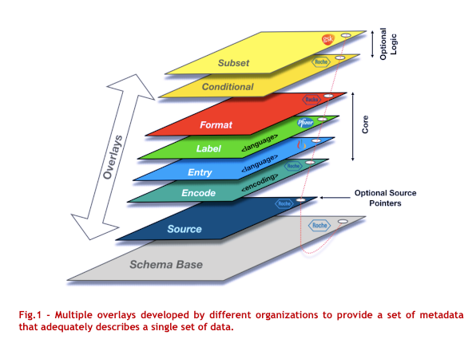
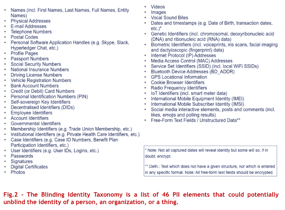
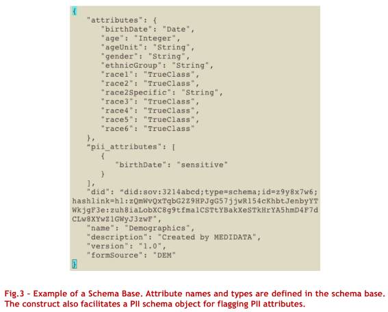
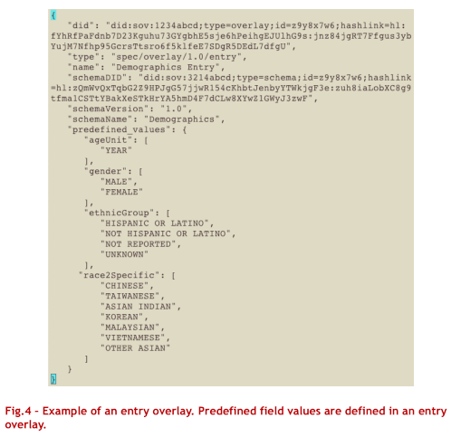
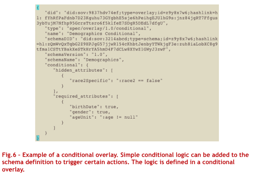
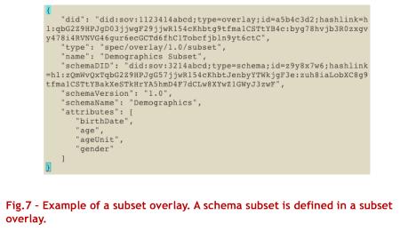

# 0013: Overlays
- Author: Paul Knowles, Dativa
- Start Date: 2018-10-01

## Status
- Status: [PROPOSED](/README.md#rfc-lifecycle)
- Status Date: 2019-05-20
- Status Note: socialized for many months; no implementations yet

## Summary

Describes a standard approach to data capture that separates raw schema
building blocks from additional semantic layers such as data entry business
logic and constraints, knowledge about data sensitivity, and so forth.

## Motivation

The post millennial generation has witnessed an explosion of captured data points which has sparked profound possibilities in both Artificial Intelligence (AI) and Internet of Things (IoT) solutions. This has spawned the collective realization that society’s current technological infrastructure is simply not equipped to fully protect personally identifiable information (PII) or to entice corporations to break down internal data silos, streamline data harmonization processes and ultimately resolve worldwide data duplication and storage resource issues.

The FAIR Data Principles are a set of guiding principles in order to make data findable, accessible, interoperable and reusable (Wilkinson et al., 2016). These principles provide guidance for scientific data management and stewardship and are relevant to all stakeholders in the current digital ecosystem.

In line with the FAIR principles, data harmonization and interoperability processes between internal departments and functions is a high priority for companies but the current cognitive framework available for global data capture is hampered by limitations to the foundational data object architecture.

## Tutorial

In terms of creating a fully-fledged decentralized data economy, we are still in the early turbulent stages of business, legal and technological innovation with gaps, grey areas and required revision aplenty but, one thing is for certain, we are heading into an era where siloed data ownership will be superseded by consented access to subsets of decentralized data.

Data-centric innovation points to a future society where new values and services will be created continuously, making people’s lives more conformable and sustainable. Developing and deploying the right data capture architecture will improve the quality of externally pooled data for future AI and IoT solutions. The Overlays Data Capture Architecture (ODCA) was conceived for this purpose.

### Overlays Data Capture Architecture (ODCA)
ODCA is a standardized global solution for data capture and exchange which protects PII data and provides a positive alternative to current architectures.

A schema, a machine-readable definition of the semantics of a data structure, is typically created as a single data object. However, ODCA represents a schema as a multi-dimensional object consisting of a stable schema base and linked overlays, data objects that provide additional extensions, coloration, and functionality to the base object. Any sponsor can use a pre-existing schema base and build their own suite of linked overlays to add extra context to transform how information is displayed to a viewer or to guide an agent in how to apply a custom process to schema data.

ODCA was primarily devised for data object interoperability and privacy compliant data sharing. The architecture promises to significantly enhance the ability to pool data more effectively in terms of simplicity, accuracy, and allocation of resources. The degree of separation between schema bases and overlays allows multiple parties to use the same base objects for similar data capture requirements thus providing a standard base from which to decentralize data.

ODCA offers many advantages, including:

1. Data pooling. Decoupling can occur at any time as overlays are linked objects. With all coloration stored in the overlays, combining data from related sources becomes much easier. Overlays can be removed from the base objects before the data merging process begins and reapplied to ensure consistent coloration post data pooling.
2. Stable schema bases. Most schema updates tend to be done at the application layer. In the case of ODCA, all extension, coloration, and functionality definitions are applied in the overlays. This enables issuers to edit one or more of the linked objects to create simple updates rather than having to reissue schema bases on an ongoing basis.
3. PII encryption. Using the Blinding Identity Taxonomy (BIT) as a reference [see section below], issuers can flag PII attributes in the schema base. With PII attributes flagged at the base object layer, all corresponding data can be treated as sensitive throughout the data lifecycle and encrypted or removed at any stage. This ensures that data protection of personal data is guaranteed as entity identification is impossible.
4. Data decentralization. ODCA enables schema base definitions to remain in their purest form thus providing a standard base from which to decentralize data. Organizations wishing to contribute data to a decentralized data lake for consented third-party usage can capture data using generic open source schema bases. This ensures that data standardization is done prior to any data lake migration.

#### BLINDING IDENTITY TAXONOMY (BIT)
Internet-related services and social media companies founded in the late ‘90s and early ‘00s triggered a digital hoarding revolution with large amounts of personal data captured and stored in corporate data silos under centralized control. Silicon Valley’s largest technology companies have subsequently seen revenue figures soar through deployed marketing tools built to enable third party vendors to target subsets of individuals according to dynamic criteria searches. Revenue models have tended to rely heavily on these targeted advertising mechanisms which has encouraged an unparalleled corporate drive for data ownership.

Corporate responsibility regarding data privacy should have escalated in parallel with the relentless drive for data ownership but, until the General Data Protection Regulation (GDPR) came into force in May 2018, strong legislation was not in place to prevent the unethical distribution of personal data.

GDPR is a set of laws that provide a legal framework for the data protection and privacy of all individuals within the European Union (EU) and the European Economic Area (EEA) whilst also addressing the export of personal data outside the EU and EEA areas. It aims to empower individuals by improving their right to self-determination regarding their personal data. However well intentioned, GDPR does not sufficiently define a concrete list of PII elements which is problematic when it comes to tech implementation and personal data processing.

The Blinding Identity Taxonomy (BIT) was created to define a list of elements that could potentially unblind the identity of a person, an organization, or a thing.

The BIT is one of those critical pieces of behind-the-scenes plumbing that is expected to fundamentally improve data protection of personal data as deployment rates in both traditional and distributed ledger technology (DLT) domains rise.

In terms of ODCA implementation, issuers can reference the BIT and flag PII attributes in the schema bases. With PII attributes flagged at the base object layer, all corresponding data can be treated as sensitive throughout the data lifecycle and encrypted or removed at any stage, making identifying individuals impossible and thus guaranteeing their privacy.

The BIT resides with Kantara Initiative, a non-profit industry consortium and professional trade association dedicated to advancing technical and legal innovation and trust framework operations related to digital identity management and data privacy.

The latest version of the BIT is available at:

>https://kantarainitiative.org/confluence/display/infosharing/Blinding+Identity+Taxonomy

### Background
In conjunction with the exponential rise of data capture, Satoshi Nakamoto’s groundbreaking white paper “Bitcoin: A Peer-to-Peer Electronic Cash System” was published in November 2008 triggering a peer-to-peer (P2P) computing revolution where files and transaction proofs could be shared directly between network nodes without the need of a central server. In 2009, Bitcoin became the first cryptocurrency to utilize a decentralized ledger to keep a record of all transactions taking place across a P2P network. It was not until the launch of Ethereum in July 2015, that the foundational technology, “blockchain”, would feature smart contract functionality giving rise to a golden age of DLT solutions that continue to mould a decentralized data economy.

DLT solutions will continue to drive uniform data processing mechanisms, verifiable proof of consent, secure data portability and self-sovereign identity (SSI). With ODCA, a standardized global solution for data capture and exchange, community driven data standards, interoperable data capture objects and PII encryption capability can also be realized.

It is ultimately a combination of these ingredients that will enable an improved ontology-driven approach to data management allowing data to be decentralized and better AI and IoT solutions to be built for societal benefit.

### Methods
Rather than a schema being created as a single data object, ODCA represents a schema as a multi-dimensional object consisting of a schema base and linked overlays. Each of these data objects serve a specific function in the overall schema definition which, when amalgamated, provide a set of metadata that adequately describes a single set of data.

Each data object contains its own decentralized identifier (DID), a new type of identifier that is globally unique, resolvable with high availability, and cryptographically verifiable. In order for an overlay to be linked to a schema base, the DID of the base object must be referenced in the metadata block of the overlay. In other words, a linked overlay will contain both its own DID and, for coupling purposes, the DID of the schema base.

#### Schema Base
A schema base is a stable base object that defines a single set of data in its purest form thus providing a standard base from which to decentralize data.

Apart from any metadata relating to the object, attribute names and types are defined in the schema base. The construct also facilitates a PII schema object which allows the issuer to flag PII attributes. With PII attributes flagged at the base layer, all corresponding data can be treated as sensitive throughout the data lifecycle and encrypted or removed at any stage thus protecting the identity of captured data subjects.

The DID of the schema base is contained in the metadata and allows the object to remain immutable and interoperable in both traditional and DLT environments.

#### Source Overlay
A source overlay is an optional linked object that can be used to specify an endpoint path containing a dynamic variable whose address is determined when the program is run.

DIDs for both the overlay and associated schema base are referenced in the metadata block of the source overlay. The DID for the schema base can then be used as a coupling point to link the two data objects.

#### Encode Overlay
An encode overlay is a core linked object that can be used to specify a character encoding standard (e.g. UTF-8, ISO-8859-1, Windows-1251, Base58Check, etc.) or character set (e.g. English, Japanese, Arabic, etc.) for the schema.

DIDs for both the overlay and associated schema base are referenced in the metadata block of the encode overlay. The DID for the schema base can then be used as a coupling point to link the two data objects.

#### Entry Overlay
An entry overlay is a core linked object that can be used to add predefined field values in a specified language to schema attributes.

DIDs for both the overlay and associated schema base are referenced in the metadata block of the entry overlay. The DID for the schema base can then be used as a coupling point to link the two data objects.

#### Label Overlay
A label overlay is a core linked object that can be used to add labels in a specified language to schema attributes and categories.

DIDs for both the overlay and associated schema base are referenced in the metadata block of the label overlay. The DID for the schema base can then be used as a coupling point to link the two data objects.

#### Format Overlay
A format overlay is a core linked object that can be used to add formats and field lengths to schema attributes.

DIDs for both the overlay and associated schema base are referenced in the metadata block of the format overlay. The DID for the schema base can then be used as a coupling point to link the two data objects.

#### Conditional Overlay
A conditional overlay is an optional linked object that can be used to add simple conditional logic within the schema definition to trigger certain actions.

DIDs for both the overlay and associated schema base are referenced in the metadata block of the conditional overlay. The DID for the schema base can then be used as a coupling point to link the two data objects.

#### Subset Overlay
A subset overlay is an optional linked object that can be used to create a schema subset.

DIDs for both the overlay and associated schema base are referenced in the metadata block of the subset overlay. The DID for the schema base can then be used as a coupling point to link the two data objects.

#### Sensitive Overlay (Holder Only)
In contrast to other overlay types which are assigned by an issuer, a sensitive overlay is an optional object assigned by the data holder that can be used to flag user-defined sensitive attributes. For example, gender is not defined as a PII element in its most common presentation of male or female as, in isolation, it cannot identify an individual. However, Thailand has 18 different gender identities that are recognized in the local lexicon and, as such, may be deemed as sensitive to a Thai citizen. In this case, a sensitive overlay could be coupled to a data vault on a personal device or a data repository held by a trusted agent to flag the element.

### Conclusion
Primarily devised for data object interoperability and privacy compliant data sharing, ODCA significantly enhances the ability to pool data more effectively in terms of simplicity, accuracy, and allocation of resources. The degree of separation between schema bases and overlays allows multiple parties to use the same base objects for similar data capture requirements thus providing a standard base from which to decentralize data.

ODCA aims to provide a standardized global solution for data capture and exchange which can facilitate a global decentralized lake containing non-PII data to be used for societal benefit.

## Reference

Provide guidance for implementers, procedures to inform testing,
interface definitions, formal function prototypes, error codes,
diagrams, and other technical details that might be looked up.
Strive to guarantee that:

- Interactions with other features are clear.
- Implementation trajectory is well defined.
- Corner cases are dissected by example.

## Drawbacks

Why should we *not* do this?

## Rationale and alternatives

- Why is this design the best in the space of possible designs?
- What other designs have been considered and what is the rationale for not
choosing them?
- What is the impact of not doing this?

## Prior art

Discuss prior art, both the good and the bad, in relation to this proposal.
A few examples of what this can include are:

- Does this feature exist in other SSI ecosystems and what experience have
their community had?
- For other teams: What lessons can we learn from other attempts?
- Papers: Are there any published papers or great posts that discuss this?
If you have some relevant papers to refer to, this can serve as a more detailed
theoretical background.

This section is intended to encourage you as an author to think about the
lessons from other implementers, provide readers of your proposal with a
fuller picture. If there is no prior art, that is fine - your ideas are
interesting to us whether they are brand new or if they are an adaptation
from other communities.

Note that while precedent set by other communities is some motivation, it
does not on its own motivate an enhancement proposal here. Please also take
into consideration that Aries sometimes intentionally diverges from common
identity features.

## Unresolved questions

- What parts of the design do you expect to resolve through the
enhancement proposal process before this gets merged?
- What parts of the design do you expect to resolve through the
implementation of this feature before stabilization?
- What related issues do you consider out of scope for this 
proposal that could be addressed in the future independently of the
solution that comes out of this doc?
