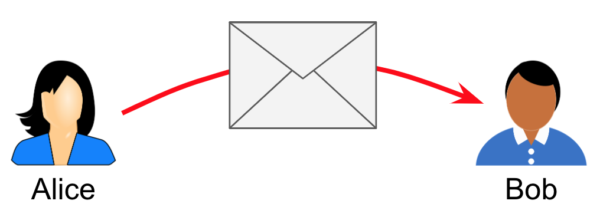
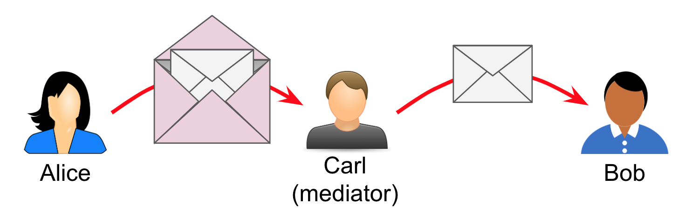
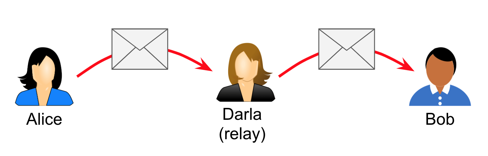
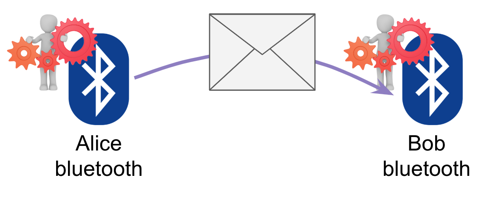
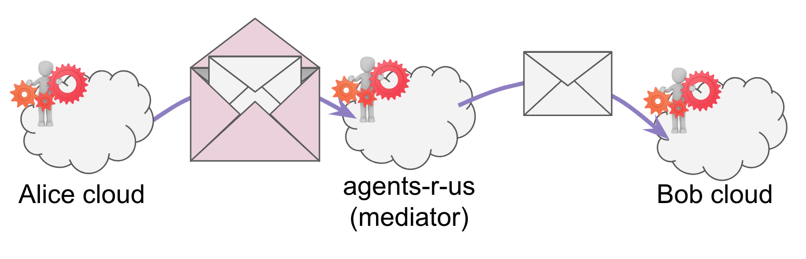
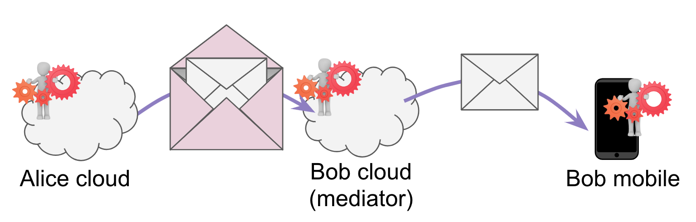
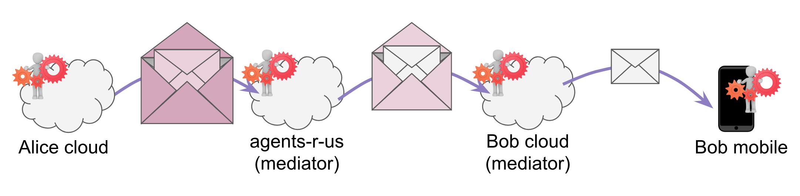

# 0046: Mediators and Relays
- Author: Daniel Hardman <daniel.hardman@gmail.com>
- Start Date: 2018-12-01

## Status
- Status: [ACCEPTED](/README.md#rfc-lifecycle)
- Status Date: 2019-02-01
- Status Note: Socialized and broadly understood in other conceptual
  RFCs about routing.

## Summary

The mental model for agent-to-agent messaging (A2A) messaging includes
two important communication primitives that have a meaning unique to our
ecosystem: _mediator_ and _relay_.

A __mediator__ is a participant in agent-to-agent message delivery that
must be modeled by the sender. It has its own keys and will
deliver messages only after decrypting an outer envelope to reveal
a `forward` request. Many types of mediators may exist, but two important
ones should be widely understood, as they commonly manifest in DID Docs:

1. A service that hosts many cloud agents a single endpoint to provide herd
privacy (an "agency") is a _mediator_.
2. A cloud-based agent that routes between/among the edges of a sovereign
domain is a _mediator_.

A __relay__ is an entity that passes along agent-to-agent messages, but
that can be ignored when the sender considers encryption choices. It does
not decrypt anything. Relays can be used to change the transport for a
message (e.g., accept an HTTP POST, then turn around and emit an email;
accept a Bluetooth transmission, then turn around and emit something
in a message queue). Mix networks like TOR are an important type of relay.

Read on to explore how agent-to-agent communication can model complex
topologies and flows using these two primitives.

## Motivation

When we describe agent-to-agent communication, it is convenient to think of an
interaction only in terms of Alice and Bob and their agents. We say things like:
"Alice's agent sends a message to Bob's agent" -- or perhaps "Alice's edge agent
sends a message to Bob's cloud agent, which forwards it to Bob's edge agent".

Such statements adopt a useful level of abstraction--one that's highly recommended 
for most discussions. However, they make a number of simplifications. By modeling
the roles of mediators and relays in routing, we can support routes that use
multiple transports, routes that are not fully known (or knowable) to the sender,
routes that pass through mix networks, and other advanced and powerful concepts. 

## Tutorial

### Key Concepts

Let's define mediators and relays by exploring how they manifest in a series of
communication scenarios between Alice and Bob.

#### Scenario 1 (base)

Alice and Bob are both employees of a large corporation. They work in the same office,
but have never met. The office has a rule that all messages between employees must be
encrypted. They use paper messages and physical delivery as the transport. Alice writes
a note, encrypts it so only Bob can read it, puts it in an envelope addressed to Bob,
and drops the envelope on a desk that she has been told belongs to Bob. This desk is
in fact Bob's, and he later picks up the message, decrypts it, and reads it.

In this scenario, there is no mediator, and no relay.

#### Scenario 2: a gatekeeper

Imagine that Bob hires an executive assistant, Carl, to filter his mail. Bob won't
open any mail unless Carl looks at it and decides that it's worthy of Bob's attention.

Alice has to change her behavior. She continues to package a message for Bob, but now
she must account for Carl as well. She take the envelope for Bob, and places it inside
a new envelope addressed to Carl. Inside the outer envelope, and next to the envelope
destined for Bob, Alice writes Carl an encrypted note: "This inner envelope is for
Bob. Please forward."

Here, Carl is acting as a __mediator__. He is mostly just passing messages along. But
because he is processing a message himself, and because Carl is interposed between
Alice and Bob, he affects the behavior of the sender. He is a known entity in the
route.

#### Scenario 3: transparent indirection

All is the same as the base scenario (Carl has been fired), except that Bob is working
from home when Alice's message lands on his desk. Bob has previously arranged with his
friend Darla, who lives near him, to pick up any mail that's on his desk and drop it off
at his house at the end of the work day. Darla sees Alice's note and takes it home to
Bob.

In this scenario, Darla is acting as a __relay__. Note that Bob arranges for Darla to
do this *without notifying Alice*, and that *Alice does not need to adjust her behavior
in any way for the relay to work*.

#### Scenario 4: more indirection

Like scenario 3, Darla brings Bob his mail at home. However, Bob isn't at home when his
mail arrives. He's had to rush out on an errand, but he's left instructions with his
son, Emil, to open any work mail, take a photo of the letter, and text him the photo.
Emil intends to do this, but the camera on his phone misfires, so he convinces his
sister, Francis, to take the picture on her phone and email it to him. Then he texts
the photo to Bob, as arranged.

Here, Emil and Francis are also acting as relays. Note that *nobody knows about the
full route*. Alice thinks she's delivering directly to Bob. So does Darla. Bob knows
about Darla and Emil, but not about Francis.

Note, too, how the transport is changing from physical mail to email to text.

To the party immediately upstream (closer to the sender), a relay is indistinguishable
from the next party downstream (closer to the recipient). A party anywhere in the chain
can insert one or more relays upstream from themselves, as long as those relays are
not upstream of another named party (sender or mediator).

##### More Scenarios

Mediators and relays can be combined in any order and any amount in variations on
our fictional scenario. Bob could employ Carl as a mediator, and Carl could work
from home and arrange delivery via George, then have his daughter Hannah run messages
back to Bob's desk at work. Carl could hire his own mediator. Darla could arrange 
or Ivan to substitute for her when she goes on vacation. And so forth.

### More Traditional Usage

The scenarios used above are somewhat artificial. Our most familiar agent-to-agent
scenarios involve edge agents running on mobile devices and accessible through
bluetooth or push notification, and cloud agents that use electronic protocols
as their transport. Let's see how relays and mediators apply there.

#### Scenario 5 (traditional base)

Alice's cloud agent wants to talk to Bob's cloud agent. Bob's cloud agent is
listening at http://bob.com/agent. Alice encrypts a message for Bob and posts it
to that URL.

In this scenario, we are using a direct transport with neither a mediator nor a relay.

If you are familiar with common routing patterns and you are steeped in HTTP, you
are likely objecting at this point, pointing out ways that this description diverges
from best practice, including what's prescribed in other RFC. You may be eager to
explain why this is a privacy problem, for example.

You are not wrong, exactly. But please suspend those concerns and hang with me. This
is about what's theoretically possible in the mental model. Besides, I would note
that virtually the same diagram could be used for a Bluetooth agent conversation:

#### Scenario 6: herd hosting

Let's tweak Scenario 5 slightly by saying that Bob's agent is one of thousands that
are hosted at the same URL. Maybe the URL is now http://agents-r-us.com/inbox. Now
if Alice wants to talk to Bob's cloud agent, she has to cope with a mediator. She
wraps the encrypted message for Bob's cloud agent inside a `forward` message that's
addressed to and encrypted for the agent of agents-r-us that functions as a gatekeeper.

This scenario is one that highlights an __external mediator__--so-called because the
mediator lives outside the sovereign domain of the final recipient.

#### Scenario 7: intra-domain dispatch

Now let's subtract agents-r-us. We're back to Bob's cloud agent listening directly at
http://bob.com/agent. However, let's say that Alice has a different goal--now she wants
to talk to the edge agent running on Bob's mobile device. This agent doesn't have a
permanent IP address, so Bob uses his own cloud agent as a mediator. He tells Alice
that his mobile device agent can only be reached via his cloud agent.

Once again, this causes Alice to modify her behavior. Again, she wraps her encrypted
message. The inner message is enclosed in an outer envelope, and the outer envelope
is passed to the mediator.

This scenario highlights an __internal mediator__. Internal and external mediators
introduce similar features and similar constraints; the relevant difference is that
internal mediators live within the sovereign domain of the recipient, and may thus
be worthy of greater trust.

#### Scenario 8: double mediation

Now let's combine. Bob's cloud agent is hosted at agents-r-us, AND Alice wants to
reach Bob's mobile:

This is a common pattern with HTTP-based cloud agents plus mobile edge agents,
which is the most common deployment pattern we expect for many users of self-sovereign
identity. Note that the properties of the agency and the routing agent are not
particularly special--they are just an external and an internal mediator, respectively.

### Related Concepts

#### Routes are One-Way (not duplex)

In all of this discussion, note that we are analyzing *only* a flow from Alice to
Bob. How Bob gets a message back to Alice is a completely separate question. Just
because Carl, Darla, Emil, Francis, and Agents-R-Us may be involved in how messages
flow from Alice to Bob, does not mean they are involved in flow the opposite
direction.

Note how this breaks the simple assumptions of pure request-response technologies
like HTTP, that assume the channel in (request) is also the channel out (response).
[Duplex](https://en.wikipedia.org/wiki/Duplex_%28telecommunications%29) request-response
can be modeled with A2A, but doing so requires support that may not always be
available, plus cooperative behavior governed by the [`~thread`](
../0008-message-id-and-threading/README.md) decorator.

#### Conventions on Direction

For any given one-way route, the direction of flow is always from sender to
receiver. We could use many different metaphors to talk about the "closer to sender"
and "closer to receiver" directions -- upstream and downstream, left and right,
before and after, in and out. We've chosen to standardize on two:

* The [SSI Notation uses directional arrows](../0006-ssi-notation/README.md#other-punctuation).
A message from Alice to Bob is notated as either `A --> B` or `B <-- A` -- whether
the arrow faces left or right, it always points to Bob. 

[ward]: #ward
* In text, we use the words __source-ward__ and __dest-ward__ to clarify whether we
are moving toward the sender, or toward the receiver, respectively. "Dest-ward"
always corresponds to where the arrow is pointing and to later points in time;
"source-ward" is the opposite direction. All messages, whether requests,
responses, or otherwise, always flow dest-ward.
