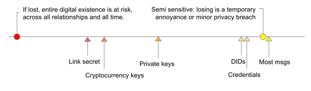
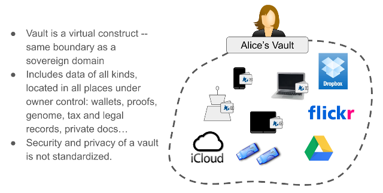
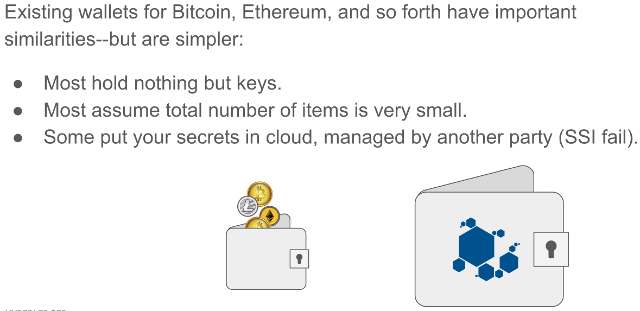
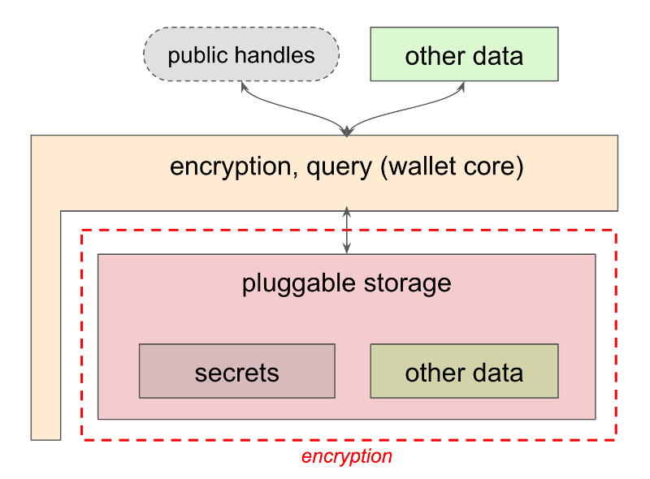

# 0050: Wallets
- Author: Daniel Hardman, Darko Kulic, Vyacheslav Gudkov, Mike Lodder
- Start Date: 2018-05-22

## Status
- Status: [ACCEPTED](/README.md#rfc-lifecycle)
- Status Date: 2018-07-01
- Status Note: Fully implemented in Indy SDK, but not yet
  socialized well in the broader Aries community. Needs some
  updates to promote better key management; see related RFC
  about [lox](../../features/0042-lox/README.md). This
  supersedes [Indy HIPE 0013](
  https://github.com/hyperledger/indy-hipe/tree/master/text/0013-wallets).

## Summary
[summary]: #summary

Specify the external interfaces of identity wallets in the Indy ecosystem, as well
as some background concepts, theory, tradeoffs, and internal implementation guidelines.


## Motivation
[motivation]: #motivation

Wallets are a familiar component metaphor that SSI has adopted from the world of
cryptocurrencies. The translation isn't perfect, though; crypto wallets have only a
subset of the features that an identity wallet needs. This causes problems, as
coders may approach wallets in Indy with assumptions that are more narrow than
our actual design target.

Since wallets are a major vector for hacking and cybersecurity issues, casual or
fuzzy wallet requirements are a recipe for frustration or disaster. Divergent
and substandard implementations could undermine security more broadly. This
argues for as much design guidance and implementation help as possible. 

Wallets are also a unit of identity portability--if an identity owner doesn't
like how her software is working, she should be able to exercise her self-
sovereignty by taking the contents of her wallet to a new service. This implies
that wallets need certain types of interoperability in the ecosystem, if they
are to avoid vendor lock-in.

All of these reasons--to clarify design scope, to provide uniform high security, and
to guarantee interop--suggest that we need a formal RFC to document wallet
architecture. 

## Tutorial
[tutorial]: #tutorial

(For a slide deck that gives a simplified overview of all the content in this
RFC, please see [http://bit.ly/2JUcIiT](https://docs.google.com/presentation/d/1d35TtEAP-f1tTh88XSZ2uQ2qnuPh6JIPluIWno_P3b0/edit). The deck also
includes a link to a recorded presentation, if you prefer something verbal
and interactive.)

### What Is an Identity Wallet?

Informally, an __identity wallet__ (preferably not just "wallet") is a digital
container for data that's needed _to control a self-sovereign identity_. We
borrow this metaphor from physical wallets:


Notice that we do not carry around in a physical wallet every document, key, card,
photo, piece of currency, or credential that we possess. A wallet is a mechanism
of _convenient control_, not an exhaustive repository. A wallet is _portable_.
A wallet is _worth safeguarding_. Good wallets are _organized so we can find
things easily_. A wallet has a _physical location_.

What does suggest about _identity wallets_?

### Types of Sovereign Data

Before we give a definitive answer to that question, let's take a detour for a
moment to consider digital data. Actors in a self-sovereign identity ecosystem
may own or control many different types of data:

* encryption and signing keys
* payment keys
* link secrets
* PII about themselves or others
* credentials
* personal documents (e.g., last year's tax filing, journal, love letters)
* digital breadcrumbs (e.g., purchase history)
* photos and videos
* receipts
* health records

...and much more. Different subsets of data may be worthy of different
protection efforts:

 

The data can also show huge variety in its size and in its richness:


Because of the sensitivity difference, the size and richness difference, joint
ownership, and different needs for access in different circumstances, we may
store digital data in many different locations, with different backup regimes,
different levels of security, and different cost profiles.

### What's Out of Scope

#### Not a Vault
This variety suggests that an identity wallet as a loose grab-bag of all our
digital "stuff" will give us a poor design. We won't be able to make good
tradeoffs that satisfy everybody; some will want rigorous, optimized search;
others will want to minimize storage footprint; others will be concerned about
maximizing security.

We reserve the term __vault__ to refer to the complex collection of all an
identity owner's data:



Note that a vault can _contain_ an identity wallet. A vault is an important
construct, and we may want to formalize its interface. But that is not the
subject of this spec.

#### Not A Cryptocurrency Wallet

The cryptocurrency community has popularized the term "wallet"--and because
identity wallets share with crypto wallets both high-tech crypto and a need
to store secrets, it is tempting to equate these two concepts. However, an
identity wallet can hold more than just cryptocurrency keys, just as a physical
wallet can hold more than paper currency. Also, identity wallets may need to
manage hundreds of millions of relationships (in the case of large organizations),
whereas most crypto wallets manage a small number of keys:



#### Not a GUI

As used in this spec, an identity wallet is not a visible application, but
rather a data store. Although user interfaces (superb ones!) can and should
be layered on top of wallets, from indy's perspective the wallet itself
consists of a container and its data; its friendly face is a separate
construct. We may casually refer to an application as a "wallet", but what
we really mean is that the application provides an interface to the
underlying wallet.

This is important because if a user changes which app manages his identity,
he should be able to retain the wallet data itself. We are aiming for a
better portability story than browsers offer (where if you change browsers,
you may be able to export+import your bookmarks, but you have to rebuild
all sessions and logins from scratch).

### Personas

Wallets have many stakeholders. However, three categories of wallet users are
especially impactful on design decisions, so we define a persona for each.

#### Alice (individual identity owner)


Alice owns several devices, and she has an agent in the cloud. She has a
thousand relationships--some with institutions, some with other people. She
has a couple hundred credentials. She owns three different types of
cryptocurrency. She doesn’t issue or revoke credentials--she just uses them.
She receives proofs from other entities (people and orgs). Her main tool for
exercising a self-sovereign identity is an app on a mobile device. 

#### Faber (intitutional identity owner)


Faber College has an on-prem data center as well as many resources and
processes in public and private clouds. It has relationships with a million
students, alumni, staff, former staff, applicants, business partners,
suppliers, and so forth. Faber issues credentials and must manage their
revocation. Faber may use crypto tokens to sell and buy credentials and
proofs.

#### The Org Book (trust hub)


The Org Book holds credentials (business licenses, articles of incorporation,
health permits, etc) issued by various government agencies, about millions
of other business entities. It needs to index and search credentials quickly.
Its data is public. It serves as a reference for many relying parties--thus its
trust hub role.

### Use Cases

The specific uses cases for an identity wallet are too numerous to fully
list, but we can summarize them as follows:

_As an identity owner (any of the [personas](#personas) above), I want to
manage identity and its relationships in a way that guarantees security and
privacy:_

* Create an identity
* Setup protective policies
* Govern agents
* Connect and interact with others
* Recover and revoke
* Take an identity somewhere else


### Managing Secrets

Certain sensitive things require special handling. We would never expect to casually
lay an _ebola zaire_ sample on the counter in our bio lab; rather, it must never
leave a special controlled isolation chamber.


Cybersecurity in wallets can be greatly enhanced if we take a similar tack with
high-value secrets. We prefer to generate such secrets in their final resting place,
possibly using a seed if we need determinism. We only use such secrets in their safe
place, instead of passing them out to untrusted parties.

TPMs, HSMs, and so forth follow these rules. Indy’s current wallet interface does,
too. You can’t get private keys out.

### Composition

The foregoing discussions about cybersecurity, the desirability of design guidance
and careful implementation, and wallet data that includes but is not limited to
secrets motivates the following logical organization of identity wallets in Indy:



The world outside a wallet interfaces with the wallet through a public interface
provided by indy-sdk, and implemented only once. This is the block labeled
`encryption, query (wallet core)` in the diagram. The implementation in this layer
guarantees proper encryption and secret-handling. It also provides some [query
features](#tags-and-queries).
Records (items) to be stored in a wallet are referenced by a public handle if they are secrets.
This public handle might be a public key in a key pair, for example. Records that are
not secrets can be returned directly across the API boundary.

Underneath, this common wallet code in libindy is supplemented with pluggable storage--
a technology that provides persistence and query features. This pluggable storage could
be a file system, an object store, an RDBMS, a NoSQL DB, a Graph DB, a key~value store,
or almost anything similar. The pluggable storage is registered with the wallet layer
by providing a series of C-callable functions (callbacks). The
storage layer doesn't have to worry about encryption at all; by the time data reaches
it, it is encrypted robustly, and the layer above the storage takes care of translating
queries to and from encrypted form for external consumers of the wallet.

### Tags and Queries

Searchability in wallets is facilitated with a tagging mechanism. Each item in a wallet
can be associated with zero or more tags, where a tag is a `key=value` pair. Items
can be searched based on the tags associated with them, and tag values can be strings
or numbers. With a good inventory of tags in a wallet, searching can be robust and
efficient--but there is no support for joins, subqueries, and other RDBMS-like
constructs, as this would constrain the type of storage plugin that could be written.

An example of the tags on a wallet item that is a credential might be:

```
  item-name = "My Driver's License"
  date-issued = "2018-05-23"
  issuer-did = "ABC"
  schema = "DEF"
```

Tag names and tag values are both case-sensitive.

Because tag values are normally [encrypted](#encryption), most tag values can only be tested
using the `$eq`, `$neq` or `$in` operators (see [Wallet Query Language](#wallet-query-language),
next). However, it is possible to force a tag to be stored in the wallet as plain text
by naming it with a special prefix, `~` (tilde). This enables operators like `$gt`, `$lt`, and `$like`.
Such tags lose their security guarantees but provide for richer queries; it is up to
applications and their users to decide whether the tradeoff is appropriate.

### Wallet Query Language

Wallets can be searched and filtered using a simple, JSON-based query language. We call
this Wallet Query Language (WQL). WQL is designed to require no fancy parsing by
storage plugins, and to be easy enough for developers to learn in just a few minutes.
It is inspired by MongoDB's query syntax, and can be mapped to SQL, GraphQL, and other
query languages supported by storage backends, with minimal effort.

Formal definition of WQL language is the following:

```Rust
query = {subquery}
subquery = {subquery, ..., subquery} // means subquery AND ... AND subquery
subquery = $or: [{subquery},..., {subquery}] // means subquery OR ... OR subquery
subquery = $not: {subquery} // means NOT (subquery)
subquery = "tagName": tagValue // means tagName == tagValue
subquery = "tagName": {$neq: tagValue} // means tagName != tagValue
subquery = "tagName": {$gt: tagValue} // means tagName > tagValue
subquery = "tagName": {$gte: tagValue} // means tagName >= tagValue
subquery = "tagName": {$lt: tagValue} // means tagName < tagValue
subquery = "tagName": {$lte: tagValue} // means tagName <= tagValue
subquery = "tagName": {$like: tagValue} // means tagName LIKE tagValue
subquery = "tagName": {$in: [tagValue, ..., tagValue]} // means tagName IN (tagValue, ..., tagValue)
```

#### Sample WQL Query 1

Get all credentials where subject like ‘Acme%’ and issue_date > last week. (Note here
that the name of the issue date tag begins with a tilde, telling the wallet to store its
value unencrypted, which makes the `$gt` operator possible.)

```JSON
{
  "subject": {"$like": "Acme%"},
  "~issue_date": {"$gt": 2018-06-01}
}
```

#### Sample WQL Query 2

Get all credentials about me where schema in (a, b, c) and issuer in (d, e, f).

```JSON
{
  "schema_id": {"$in": ["a", "b", "c"]},
  "issuer_id": {"$in": ["d", "e", "f"]},
  "holder_role": "self"
}
```

### Encryption

Wallets need very robust encryption. However, they must also be searchable, and
the encryption must be equally strong regardless of which storage technology is used.
We want to be able to hide data patterns in the encrypted data, such that an attacker
cannot see common prefixes on keys, or common fragments of data in encrypted values.
And we want to rotate the key that protects a wallet without having to
re-encrypt all its content. This suggests that a trivial encryption scheme,
where we pick a symmetric key and encrypt everything with it, is not adequate.

Instead, wallet encryption takes the following approach:

* For attributes of items that are searchable  (`type`, `id`, `tag_name`,
  `tag_value`):
  * The same input produces the same output.
  * Every attribute "column" has its own key. That is, there's an encryption key for
    all `type` attributes, a different encryption key for all `id` attributes,
    and so forth.
  * Initialization vector is HMAC-256 value of the field being encrypted.
  * Two more keys are needed for HMAC--one for `type` and `id` and one for
    `tag_name` and `tag_value`.
    
* For item values:
  * A new value key is generated for each item value.
  * Value key is encrypted using key for that field. (Value key also has a "column"
    key that contributes to its encryption.)
  * Initialization vector is generated every time for both encryptions.
  
* For wallet keys:
  * Encrypted with master key with random initialization vector.

The 7 "column" keys are concatenated and encrypted with a wallet __master key__,
 then saved into the metadata of the wallet. This allows the master key to be rotated
 without re-encrypting all the items in the wallet.

Today, all encryption is done using ChaCha20-Poly1305, with HMAC-SHA256. This is a solid,
secure encryption algorithm, well tested and widely supported. However, we anticipate the desire
to use different cipher suites, so in the future we will make the cipher suite pluggable.

The way the individual fields are encrypted is shown in the following diagram. Here,
data is shown as if stored in a relational database with tables. Wallet storage may
or may not use tables, but regardless of how the storage distributes and divides the
data, the logical relationships and the encryption shown in the diagram apply.


### Pluggable Storage

Although Indy infrastructure will provide only one wallet implementation it will allow
to plug different storages for covering of different use cases. Default storage shipped
with libindy will be sqlite based and well suited for agents running on edge devices.
The API endpoint ```register_wallet_storage``` will allow Indy Developers to register
a custom storage implementation as a set of handlers.

A storage implementation does not need any special security features. It stores data that
was already encrypted by libindy (or data that needs no encryption/protection, in the
case of unencrypted tag values). It searches data in whatever form it is persisted, without
any translation. It returns data as persisted, and lets the common wallet infrastructure
in libindy decrypt it before return it to the user.

### Secure Enclaves

Secure Enclaves are purposely designed to manage, generate, and securely store cryptographic
material. Enclaves can be either specially designed hardware (e.g. HSM, TPM) or trusted execution
environments (TEE) that isolate code and data from operating systems (e.g. Intel SGX, AMD SVE,
ARM Trustzone). Enclaves can replace common cryptographic operations that wallets perform (e.g.
encryption, signing). Some secrets cannot be stored in wallets like the key that encrypts the
wallet itself or keys that are backed up. These cannot be stored in enclaves as keys stored in
enclaves cannot be extracted. Enclaves can still protect these secrets via a mechanism called
__wrapping__.
 
#### Enclave Wrapping

Suppose I have a secret, X, that needs maximum protection. However, I can’t
store X in my secure enclave because I need to use it for operations that
the enclave can’t do for me; I need direct access. So how to I extend
enclave protections to encompass my secret?

I ask the secure enclave to generate a key, Y, that will be used to protect X.
Y is called a __wrapping key__. I give X to the secure enclave and ask that it be
encrypted with wrapping key Y. The enclave returns X’ (ciphertext of X, now
called a __wrapped secret__), which I can leave on disk with confidence; it
cannot be decrypted to X without involving the secure enclave. Later, when
I want to decrypt, I give wrapped secret X’ to the secure enclave and ask it
to give me back X by decrypting with wrapping key Y.


You could ask whether this really increases security. If you can get into the
enclave, you can wrap or unwrap at will.

The answer is that an unwrapped secret is protected by only one thing--whatever
ACLs exist on the filesystem or storage where it resides. A wrapped secret is
protected by two things--the ACLs and the enclave. OS access may breach either
one, but pulling a hard drive out of a device will not breach the enclave.

### Paper Wallets

It is possible to persist wallet data to physical paper (or, for that matter, to
etched metal or other physical media) instead of a digital container. Such
data has attractive storage properties (e.g., may survive natural disasters,
power outages, and other challenges that would destroy digital data). Of course,
by leaving the digital realm, the data loses its accessibility over standard APIs.

We anticipate that paper wallets will play a role in backup and recovery, and
possibly in enabling SSI usage by populations that lack easy access to smartphones
or the internet. Our wallet design should be friendly to such usage, but physical
persistence of data is beyond the scope of Indy's plugin storage model and thus
not explored further in this RFC.

### Backup and Recovery

Wallets need a backup and recovery feature, and also a way to export data and
import it. Indy's wallet API includes an export function and an import function
that may be helpful in such use cases. Today, the export is unfiltered--all data
is exported. The import is also all-or-nothing and must be to an empty wallet;
it is not possible to import selectively or to update existing records during
import.

A future version of import and export may add filtering, overwrite, and progress
callbacks. It may also allow supporting or auxiliary data (other than what the
wallet directly persists) to be associated with the export/import payload.

For technical details on how export and import work, please see the [internal
design docs](https://github.com/hyperledger/indy-sdk/tree/master/docs/design/009-wallet-export-import).

## Reference
[reference]: #reference

- [Wallet Design](https://github.com/hyperledger/indy-sdk/tree/master/docs/design/003-wallet-storage)

## Rationale and alternatives
[alternatives]: #alternatives

We could implement wallets purely as built already in the cryptocurrency world.
This would give us great security (except for crypto wallets that are cloud based),
and perhaps moderately good usability.

However, it would also mean we could not store credentials in wallets. Indy would
then need an alternate mechanism to scan some sort of container when trying to
satisfy a proof request. And it would mean that a person's identity would not be
portable via a single container; rather, if you wanted to take your identity to a
new place, you'd have to copy all crypto keys in your crypto wallet, plus copy all
your credentials using some other mechanism. It would also fragment the places where
you could maintain an audit trail of your SSI activities.

## Prior art
[prior-art]: #prior-art

See comment about crypto wallets, above.

## Unresolved questions
[unresolved]: #unresolved-questions

- What is the relationship between a threading model in pluggable storage and
  the threading model of wallets? Is it always legal to be reading and writing
  wallets from multiple threads at the same time?
