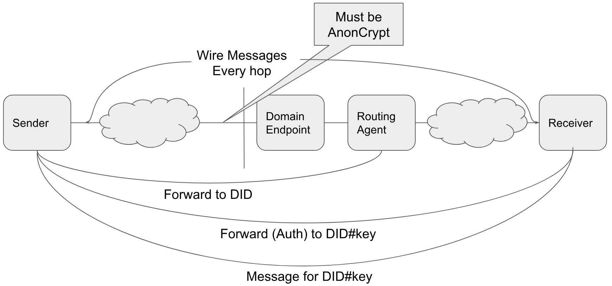

# 0094: Cross-Domain Messaging
- Author: Stephen Curran (swcurran@gmail.com)
- Start Date: 2018-08-13

## Status
- Status: [Accepted](/README.md#rfc-lifecycle)
- Status Date: 2018-10-29
- Status Note: Socialized and broadly understood in other conceptual
  RFCs about routing. Supersedes Indy RFC [0022-Cross-Domain-Messaging](https://github.com/hyperledger/indy-RFC/blob/master/text/0022-cross-domain-messaging/README.md)

## Summary

There are two layers of messages that combine to enable **interoperable** self-sovereign identity DIDcomm (formerly called Agent-to-Agent) communication. At the highest level are Agent Messages - messages sent between Identities to accomplish some shared goal. For example, establishing a connection between identities, issuing a Verifiable Credential from an Issuer to a Holder or even the simple delivery of a text Instant Message from one person to another. Agent Messages are delivered via the second, lower layer of messaging - encryption envelopes. An encryption envelope is a wrapper (envelope) around an Agent Message to enable the secure delivery of a message from one Agent directly to another Agent. An Agent Message going from its Sender to its Receiver may be passed through a number of Agents, and an encryption envelope is used for each hop of the journey.

This RFC addresses Cross Domain messaging to enable interoperability. This is one of a series of related RFCs that address interoperability, including [DIDDoc Conventions](../../features/0067-didcomm-diddoc-conventions/README.md), [Agent Messages](../0020-message-types/README.md) and [Encryption Envelope](../../features/0019-encryption-envelope/README.md). Those RFCs should be considered together in understanding [DIDcomm](../0005-didcomm/README.md) messaging.

In order to send a message from one Identity to another, the sending Identity must know something about the Receiver's domain - the Receiver's configuration of Agents. This RFC outlines how a domain MUST present itself to enable the Sender to know enough to be able to send a message to an Agent in the domain.  In support of that, a DIDcomm protocol (currently consisting of just one Message Type) is introduced to route messages through a network of Agents in both the Sender and Receiver's domain. This RFC provides the specification of the "Forward" Agent Message Type - an envelope that indicates the destination of a message without revealing anything about the message.

The goal of this RFC is to define the rules that domains MUST follow to enable the delivery of Agent messages from a Sending Agent to a Receiver Agent in a secure and privacy-preserving manner.

## Motivation

The purpose of this RFC and its related RFCs is to define a layered messaging protocol such that we can ignore the delivery of messages as we discuss the much richer Agent Messaging types and interactions. That is, we can assume that there is no need to include in an Agent message anything about how to route the message to the Receiver - it just magically happens. Alice (via her App Agent) sends a message to Bob, and (because of implementations based on this series of RFCs) we can ignore how the actual message got to Bob's App Agent.

Put another way - these RFCs are about envelopes. They define a way to put a message - any message - into an envelope, put it into an outbound mailbox and have it magically appear in the Receiver's inbound mailbox in a secure and privacy-preserving manner. Once we have that, we can focus on letters and not how letters are sent.

Most importantly for Agent to Agent interoperability, this RFC clearly defines the assumptions necessary to deliver a message from one domain to another - e.g. what exactly does Alice have to know about Bob's domain to send Bob a message?

## Tutorial
[tutorial]: #tutorial

### Core Messaging Goals

These are vital design goals for this RFC:

1. **Sender Encapsulation**: We SHOULD minimize what the Receiver has to know about the domain (routing tree or agent infrastructure) of the Sender in order for them to communicate.
2. **Receiver Encapsulation**: We SHOULD minimize what the Sender has to know about the domain (routing tree or agent infrastructure) of the Receiver in order for them to communicate.
3. **Independent Keys**: Private signing keys SHOULD NOT be shared between agents; each agent SHOULD be separately identifiable for accounting and authorization/revocation purposes.
4. ***Need To Know* Information Sharing**: Information made available to intermediary agents between the Sender and Receiver SHOULD be minimized to what is needed to perform the agent's role in the process.

### Assumptions

The following are assumptions upon which this RFC is predicated.

#### Terminology

The following terms are used in this RFC with the following meanings:

- Domain - a set of Agents collaborating on behalf of an Identity
  - It's assumed that the Agents of a Domain were developed by a single vendor and so MAY have implementation-specific mechanisms for tracking extra information about one another.
  - An example of two Domains is provided in the image below.
- Edge Agents - the Agents involved in sending (creating) and receiving (processing) an Agent Message
  - Sender - the Agent sending an original Agent Message
  - Receiver - the Agent intended to receive an Agent Message from the Sender
  - **Note**: A message MAY pass through many Agents between the Sender and Receiver
- Domain Endpoint - a physical endpoint for messages into domains that MUST be assumed to be shared across many Identities
  - Shared by many identities (e.g. https://endpoint.agentsRus.com)
  - Agency - the handler for messages sent to the Domain Endpoint.
- Mediators - agents explicitly known to the sender as part of routing messages to a Receiver.
- DID - reference to the literal Decentralized ID text
  - e.g. did:sov:1234abcd
- DID#keyname - reference to the DID appended with "#" and a specific key from the DIDDoc
  - e.g. did:sov:1234abcd#1 references key "1" of the "did:sov:1234abcd" DIDDoc.
  - **Note**: The #keyname is NOT the actual Public Key - it's a reference to an entry in the DIDDoc that contains the Public Key.

#### DIDDoc

The term "DIDDoc" is used in this RFC as it is defined in the [DID Specification](https://w3c-ccg.github.io/did-spec/):

- a collection of public keys and endpoints,
- controlled by an identity,
- associated with a DID, and
- used for a relationship.

A DID can be resolved to get its corresponding DIDDoc by any Agent that needs access to the DIDDoc. This is true whether talking about a DID on a Public Ledger, or a pairwise DID (using the [did:peer method](https://dhh1128.github.io/peer-did-method-spec/index.html)) persisted only to the parties of the relationship. In the case of pairwise DIDs, it's the (implementation specific) domain's responsibility to ensure such resolution is available to all Agents requiring it within the domain.

#### Messages are Private

Agent Messages sent from a Sender to a Receiver SHOULD be private. That is, the Sender SHOULD encrypt the message with a public key for the Receiver. Any agent in between the Sender and Receiver will know only to whom the message is intended (by DID and possibly keyname within the DID), not anything about the message.

#### The Sender Knows The Receiver

This RFC assumes that the Sender knows the Receiver's DID and, within the DIDDoc for that DID, the keyname to use for the Receiver's Agent. How the Sender knows the DID and keyname to send the message is not defined within this RFC - that is a higher level concern.

The Receiver's DID MAY be a public or pairwise DID, and MAY be on a Public Ledger or only shared between the parties of the relationship.

### Example: Domain and DIDDoc

The following is an example of an arbitrary pair of domains that will be helpful in defining the requirements in this RFC.


In the diagram above:

- Alice has
  - 1 Edge Agent - "1"
  - 1 Routing Agent - "2"
  - 1 Domain Endpoint - "8"
- Bob has
  - 3 Edge Agents - "4", "5" and "6"
    - "6" is an Edge Agent in the cloud, "4" and "5" are physical devices.
  - 1 Routing Agent - "3"
  - 1 Domain Endpoint - "9"

#### Bob's DID for his Relationship with Alice

Bob’s domain has 3 devices he uses for processing messages - two phones (4 and 5) and a cloud-based agent (6). However, in Bob's relationship with Alice, he ONLY uses one phone (4) and the cloud-based agent (6). Thus the key for device 5 is left out of the DIDDoc (see below).

Note that the keyname for the Routing Agent (3) is called "routing". This is an example of the kind of convention needed to allow the Sender's agents to know the keys for Agents with a designated role in the receiving domain - as defined in the `DIDDoc Conventions` RFC.

```json
{
  "@context": "https://w3id.org/did/v1",
  "id": "did:sov:1234abcd",
  "publicKey": [
    {"id": "routing", "type": "RsaVerificationKey2018",  "owner": "did:sov:1234abcd","publicKeyPem": "-----BEGIN PUBLIC X…"},
    {"id": "4", "type": "RsaVerificationKey2018",  "owner": "did:sov:1234abcd","publicKeyPem": "-----BEGIN PUBLIC 9…"},
    {"id": "6", "type": "RsaVerificationKey2018",  "owner": "did:sov:1234abcd","publicKeyPem": "-----BEGIN PUBLIC A…"}
  ],
  "authentication": [
    {"type": "RsaSignatureAuthentication2018", "publicKey": "did:sov:1234abcd#4"}
  ],
  "service": [
    {
      "id": "did:example:123456789abcdefghi;did-communication",
      "type": "did-communication",
      "priority" : 0,
      "recipientKeys" : [ "did:example:1234abcd#4" ],
      "routingKeys" : [ "did:example:1234abcd#3" ],
      "serviceEndpoint" : "did:example:xd45fr567794lrzti67;did-communication"
    }
  ]
}
```

For the purposes of this discussion we are defining the message flow to be:

> 1 --> 2 --> 8 --> 9 --> 3 --> 4

However, that flow is arbitrary and only one hop is actually required:

- 1 is the Sender in this case and so must send the first message.
- 4 is the Receiver in this case and so must receive the message.

### Encryption Envelopes

An encryption envelope is used to transport any Agent Message from one Agent directly to another. In our example message flow above, there are five encryption envelopes sent, one for each hop in the flow. The separate [Encryption Envelope](../../features/0019-encryption-envelope/README.md) RFC covers those details.

### Agent Message Format

An Agent Message defines the format of messages processed by Agents. Details about the general form of Agent Messages can be found in the [Agent Messages](../0020-message-types/README.md) RFC.

This RFC specifies (below) the "Forward" message type, a part of the "Routing" family of Agent Messages.

### DID, DIDDoc and Routing

A DID owned by the Receiver is resolvable by the Sender as a DIDDoc using either a Public Ledger or using pairwise DIDs based on the `did:peer` method. The related [DIDcomm DIDDoc Conventions](../../features/0067-didcomm-diddoc-conventions/README.md) RFC defines the required contents of a DIDDoc created by the receiving entity. Notably, the DIDDoc given to the Sender by the Receiver specifies the required routing of the message through an optional set of [mediators](../0046-mediators-and-relays/README.md).

### Cross Domain Interoperability

A key goal for interoperability is that we want other domains to know just enough about the configuration of a domain to which they are delivering a message, but no more. The following walks through those minimum requirements.

#### Required: The DID and DIDDoc

As noted above, the Sender of an Agent to Agent Message has the DID of the Receiver, and knows the key(s) from the DIDDoc to use for the Receiver's Agent(s).

> Example: Alice wants to send a message from her phone (1) to Bob's phone (4). She has Bob's B:did@A:B, the DID/DIDDoc Bob created and gave to Alice to use for their relationship. Alice created A:did@A:B and gave that to Bob, but we don't need to use that in this example. The content of the DIDDoc for B:did@A:B is presented above.

#### Required: End-to-End encryption of the Agent Message

The Agent Message from the Sender SHOULD be hidden from all Agents other than the Receiver. Thus, it SHOULD be encrypted with the public key of the Receiver. Based on our assumptions, the Sender can get the public key of the Receiver agent because they know the DID#keyname string, can resolve the DID to the DIDDoc and find the public key associated with DID#keyname in the DIDDoc. In our example above, that is the key associated with "did:sov:1234abcd#4".

Most Sender-to-Receiver messages will be sent between parties that have shared pairwise DIDs (using the `did:peer` method). When that is true, the Sender will (usually) AuthCrypt the message. If that is not the case, or for some other reason the Sender does not want to AuthCrypt the message, AnonCrypt will be used. In either case, the Indy-SDK `pack()` function handles the encryption.

If there are mediators specified in the DID service endpoint for the Receiver agent, the Sender must wrap the message for the Receiver in a 'Forward' message for each mediator. It is assumed that the Receiver can determine the from `did` based on the `to` DID (or the sender's verkey) using their pairwise relationship.

```json
{
  "@type" : "did:sov:BzCbsNYhMrjHiqZDTUASHg;spec/routing/1.0/forward",
  "to"   : "did:sov:1234abcd#4",
  "msg"  : { json object from <pack(AgentMessage,valueOf(did:sov:1234abcd#4), privKey(A.did@A:B#1))> }
}
```

**Notes**

- the `@type` value is in the precise URI format for the "forward" message type
- Indy-SDK's "pack" function is used to AuthCrypt the message using the Receiver's public key and the Sender's private key.
  - If the Sender wishes to remain anonymous or knows the Receiver does not know the Sender's public key, AnonCrypt is used.
  - More details about the Indy-SDK `pack()` function can be found in the [Encryption Envelope](../../features/0019-encryption-envelope/README.md) RFC.
- The Indy-SDK's "unpack()" function MUST return the public key of the private key used to sign the message. See the note below for the background on this.
- Additional `forward` messages are created to wrap each forward for each mediator.

> The bullet above about the unpack() function returning the signer's public key deserves some additional attention. The Receiver of the message knows from the "to" field the DID to which the message was sent. From that, the Receiver is expected to be able to determine the DID of the Sender, and from that, access the Sender's DIDDoc. However, knowing the DIDDoc is not enough to know from whom the message was sent - which key was used to send the message, and hence, which Agent controls the Sending private key. This information MUST be made known to the Receiver (from unpack()) when AuthCrypt is used so that the Receiver knows which key was used to the send the message and can, for example, use that key in responding to the arriving Message.


The Sender can now send the Forward Agent Message on its way via the first of the encryption envelope. In our example, the Sender sends the Agent Message to 2 (in the Sender's domain), who in turn sends it to 8. That of course, is arbitrary - the Sender's Domain could have any configuration of Agents for outbound messages. The Agent Message above is passed unchanged, with each Agent able to see the `@type`, `to` and `msg` fields as described above. This continues until the outer `forward` message gets to the Receiver's first mediator or the Receiver's agent (if there are no mediators). Each agent decrypts the received encrypted envelope and either forwards it (if a mediator) or processes it (if the Receiver Agent). Per the [Encryption Envelope](../../features/0019-encryption-envelope/README.md) RFC, between Agents the Agent Message is pack()'d and unpack()'d as appropriate or required.

The diagram below shows an example use of the `forward` messages to encrypt the message all the way to the Receiver with two mediators in between - a shared domain endpoint (aka https://agents-r-us.com) and a routing agent owned by the receiving entity.



#### Required: Cross Domain Encryption

While within a domain the Agents MAY choose to use encryption or not when sending messages from Agent to Agent, encryption MUST be used when sending a message into the Receiver's domain. The endpoint agent unpack()'s the encryption envelope and processes the message - usually a `forward`. Note that within a domain, the agents may use arbitrary [relays](../0046-mediators-and-relays/README.md) for messages, unknown to the sender. How the agents within the domain knows where to send the message is implementation specific - likely some sort of dynamic DID-to-Agent routing table. If the path to the receiving agent includes mediators, the message must go through those mediators in order (for example, through 3 in our example) as the message being forwarded has been encrypted for the mediators.

#### Required: Mediators Process Forward Messages

When a mediator (eventually) receives the message, it determines it is the target of the (current) outer forward Agent Message and so decrypts the message's `msg` value to reveal the inner "Forward" message.  Mediators use their (implementation specific) knowledge to map from the `to` field to deliver the message to the physical endpoint of the next agent to process the message on it's way to the Receiver.

#### Required: The Receiver App Agent Decrypts/Processes the Agent Message

When the Receiver Agent receives the message, it determines it is the target of the forward message, decrypts the payload and processes the message.

#### Exposed Data

The following summarizes the information needed by the Sender's agents:

- The DID to use for the relationship, and its related DIDDoc
- A public key entry for the Receiver agent
- From the DIDDoc, a service entry for each Receiver agent that includes:
  - a public DID or physical endpoint and public key for the endpoint agent.
  - An optional order list of public keys (`RoutingKeys`) of mediators used by the Receiver in delivering the message.

The DIDDoc will have a public key entry for each additional Agent message Receiver and each mediator.

In many cases, the entry for the endpoint agent should be a public DID, as it will likely be operated by an agency (for example, https://agents-r-us.com) rather than by the Receiver entity (for example, a person). By making that a public DID in that case, the agency can rotate its public key(s) for receiving messages in a single operation, rather than having to notify each identity owner and in turn having them update the public key in every pairwise DID that uses that endpoint.

#### Data Not Exposed

Given the sequence specified above, the following data is **NOT** exposed to the Sender's agents:

- The relays within the Receiver's domain
- Receiver agents the identity chooses not to include in a given DIDDoc
- The physical endpoints of agents within the Receiver's domain (other than the Domain Endpoint)
  - The physical endpoints and, as required, associated public keys, are shared as needed by the agents within the Receiver's domain.

## Message Types

The following Message Types are defined in this RFC.

### Core:Routing:1.0:Forward

The core message type "forward", version 1.0 of the "routing" family is defined in this RFC. An example of the message is the following:

```json
{
  "@type" : "did:sov:BzCbsNYhMrjHiqZDTUASHg;spec/routing/1.0/forward",
  "to"   : "did:sov:1234abcd#4",
  "msg"  : { json object from <pack(AgentMessage,valueOf(did:sov:1234abcd#4), privKey(A.did@A:B#1))> }
}
```

The `to` field is required and takes one of two forms:

- A DID without a key reference (e.g. `did:sov:1234abcd`)
- A DID with a key reference (e.g. `did:sov:1234abcd#4`)

The first form is used when sending forward messages across one or more agents that do not need to know the details of a domain. The Receiver of the message is the designated `Routing Agent` in the Receiver Domain, as it controls the key used to decrypt messages sent to the domain, but not to a specific Agent.

The second form is used when the precise key (and hence, the Agent controlling that key) is used to encrypt the Agent Message placed in the `msg` field.

The `msg` field calls the Indy-SDK `pack()` function to encrypt the Agent Message to be forwarded. The Sender calls the `pack()` with the suitable arguments to AnonCrypt or AuthCrypt the message. The `pack()` and `unpack()` functions are described in more detail in the [Encryption Envelope](../../features/0019-encryption-envelope/README.md) RFC.

## Reference
[reference]: #reference

See the other RFCs referenced in this document:

- [DIDcomm](../0005-didcomm/README.md)
- [Encryption Envelope](../../features/0019-encryption-envelope/README.md)
- [Agent Messages](../0020-message-types/README.md)
- [DIDDoc Conventions](../../features/0067-didcomm-diddoc-conventions/README.md)

## Drawbacks
[drawbacks]: #drawbacks

N/A

## Rationale and alternatives
[alternatives]: #alternatives

A number of discussions were held about this RFC. In those discussions, the rationale for the RFC evolved into the text, and the alternatives were eliminated. See prior versions of the superseded HIPE (in status section, above) for details.

A suggestion was made that the following optional parameters could be defined in the "routing/1.0/forward" message type:

- **forward-after**: specify that the message should not be forwarded until the system clock shows a particular time, or until a particular interval has elapsed. This could be useful to defeat timing correlations. Particular agents might not support it.
- **mix-config**: artificially introduce extra hops to obscure path (use a mix network like TOR)

The optional parameters have been left off for now, but could be added in this RFC or to a later version of the message type.

## Prior art
[prior-art]: #prior-art

N/A

## Unresolved questions
[unresolved]: #unresolved-questions

N/A
