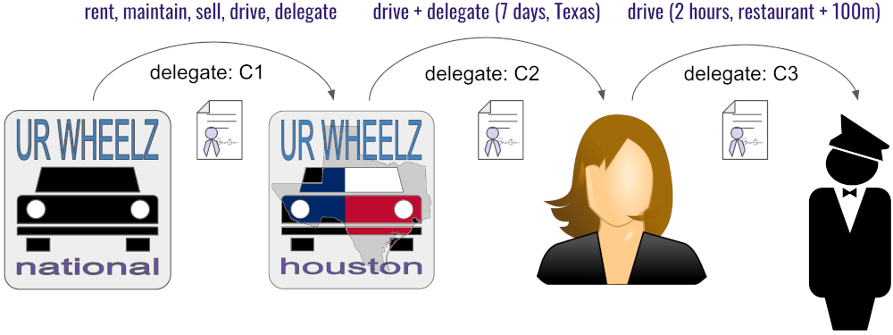

# Aries RFC 0104: Delegatable Credentials

- Authors: Daniel Hardman
- Status: [PROPOSED](/README.md#proposed)
- Since: 2019-09-09
- Status Note: Various aspects of this are implemented, or in the process of being implemented, in Hyperledger Ursa and Hyperledger Indy. This doc will be updated based on learnings.
- Start Date: 2019-08-01
- Tags: concept, credentials

## Summary

Describes a [object capabilities (OCAP)](https://en.wikipedia.org/wiki/Capability-based_security) mechanism that allows verifiable credentials to be delegated and attenuated while preserving privacy and operating robustly in offline mode. This mechanism works for any W3C-conformant verifiable credential type. It is similar to [ZCAP-LD](https://w3c-ccg.github.io/zcap-ld/) in scope, features, and intent, but it accomplishes its goals a bit differently. See [here](contrast-zcap-ld.md) for an explanation of the divergence and redundancy.

This RFC is a sister to [Aries RFC 0103: Indirect Identity Control](../0103-indirect-identity-control/README.md). That doc describes how delegation (and related control mechanisms like delegation and controllership) can be modeled; this one describes an underlying infrastructure to enable such a model.

## Motivation

Verifiable credentials have many delegation use cases. We need to support them robustly before the VC ecosystem can fully mature.

## Tutorial

### Sample use case

Many use cases could be described. However, we chose the following one as being a good test of all the characteristics we want.

>Note: see [here](https://docs.google.com/presentation/d/1lMHHvsHDrP8j3_WUf5bFK1eFYCILue1l9jhnfR_mLVY/edit) for original images.

The national headquarters of Ur Wheelz (a car rental company) issues a verifiable credential, C1, to its regional office in Houston, authorizing Ur Wheelz Houston to rent, maintain, sell, drive, and delegate driving privileges to customers, for certain cars owned by the parent company. 

Alice rents a car from Ur Wheelz Houston. Ur Wheelz Houston issues a driving privileges credential, C2, to Alice. C2 gives Alice the privilege to drive the car on a particular week, within the state of Texas, and to further delegate that privilege. Alice uses her C2 credential to prove to the car (which is a fancy future car with SSI capabilities that acts as verifier) that she is an authorized driver; this is what unlocks the door.

Alice gets pulled over for speeding on Wednesday and uses C2 to prove to the police that she is the authorized driver of the car.

On Thursday night Alice goes to a fancy restaurant. She uses valet parking. She issues credential C3 to the valet, allowing him to drive the car within 100 meters of the restaurant, for the next 2 hours while she is at the restaurant. Alice chooses to constrain C3 so the valet cannot further delegate. The valet uses C3 to unlock and drive the car to the parking garage.

While Alice eats, law enforcement officers go to Ur Wheelz Houston with a search warrant for the car. They have discovered that the previous driver of the car was a criminal. They ask Ur Wheelz to revoke C2, because they don’t want the car to be driven any more, in case evidence is accidentally destroyed.

At the end of dinner, Alice goes to the valet and asks for her car to be returned. The valet goes to the car and attempts to open the door using C3. The car tests the validity of the delegation chain of C3, and discovers that C2 has been revoked, making C3 invalid. The car refuses to open the door. Alice has to take Uber to get home. Law enforcement takes possession of the car.

### How delegatable credentials address this use case

A delegatable credential is a verifiable credential that functions like a capability token. Typically it cannot be directly transferred, since it is bound to a particular holder; however, if it includes the `delegate` privilege, a derivative delegatable credential can be created from it, extending a subset of its privileges to a new holder. The delegation chain can be as long as required.

The first entity in the delegation chain (Ur Wheels National, in our use case) is called the **root delegator**, and is probably an institution configured for traditional credential issuance (e.g., with a public DID to which reputation attaches; in Indy, this entity also publishes a credential definition). All other entities in the chain can participate with no special setup. They need not have public DIDs or credential definitions.
 
 Unlike an ACL, where an identity is mapped to a list of permissions it should have, the valid possession of a delegated credential entitles its holder to whatever permissions the credential directly embodies. (Here, "valid possession" means that the credential wasn't transferred by theft or fraud, if the credential is designed to be bound to a specific holder. If the credential isn't bound to a holder, then it's a bearer token and is an even more canonical OCAP.) 

#### Special Sauce

A delegatable credential delivers these features by obeying some special conventions over and above the core requirements of an ordinary VC:

1. It contains a special field called `schema` that is a base64-encoded representation of *its own schema*. This makes the credential self-contained in the sense that it doesn't depend on a schema or credential definition defined by an external authority (though it could optionally embody one). This field is always disclosed in presentations.

2. It meets all the requirements to be a __proxy credential__ as described in [Aries RFC 0103: Indirect Identity Control](https://github.com/hyperledger/aries-rfcs/blob/master/concepts/0103-indirect-identity-control/README.md#proxy-credential). Specifically:

    * It uses `credentialSubject.holder.*` fields to bind it to a particular holder, if applicable.
    
    * It uses `credentialSubject.proxied.*` fields to describe the upstream delegator to whatever extent is required.
    
    * It uses `credentialSubject.holder.role` and `credentialSubject.proxied.permissions` to grant permissions that the holder has.

3. It is associated (through a name in its `type` field array and through a URI in its `trustFrameworkURI` field) with a [delegation trust framework](https://github.com/hyperledger/aries-rfcs/blob/master/concepts/0103-indirect-identity-control/README.md#proxy-trust-framework). This may partially describe the semantics of some schema variants for a family of delegatable credentials, as well as the sets of permissions that these credentials can delegate. For example, a trust framework jointly published by Ur Wheelz and other car rental companies might describe delegatable credential schemas for car owners, car rental offices, drivers, insurers, maintenance staff, and guest users of cars. It might specify that the permissions delegatable in these credentials include `drive`, `maintain`, `rent`, `sell`, `retire`, `delegate-further`, and so forth. The trust framework would do more than enumerate these values; it would define exactly what they mean, how they interact with one another, and what permissions are expected to be in force in various circumstances.

4. Each credential in a delegation chain contains information describing the delegated permissions. See [Aries RFC 0103: Indirect Identity Control](https://github.com/hyperledger/aries-rfcs/blob/master/concepts/0103-indirect-identity-control/README.md) for more info.

4. Each credential in a delegation chain is associated with a delgation proof, lets call it `delegationProof`. Depending on the type of delegatable credential (more on that later), actual data in the delgation proof will be different. It can simply be a list of credentials from all upstream issuers or a list of special kinds of malleable signatures, or something else. This proof proves the authority of the upstream delegator to create and issue the current delegated credential to the current holder. For non-ZKP proofs, the `delegationProof` can simply be a presentation from the upstream issuer's credential.

    Using credentials C3, C2, and C1 from our example use case, the `delegationProof` of C1 proves that Ur Wheelz had the authority (as car owner) to delegate a certain set of privileges X to Ur Wheelz. The `delegationProof` of C2 proves that Ur Wheelz had authority to delegate Y (a subset of the authority in X) to Alice, and also that Ur Wheelz derived its authority from Ur Wheelz, who had the authority to delegate X to Ur Wheelz. Similarly C3's `delegationProof` is an extension of C2's `delegationProof` –now proving that Alice had the authority to delegate Z to the valet, plus all the other delegations in the upstream credentials.

    
    
    JWT-based credentials and presentations are also supportable in the same model.
    
5. When a presentation is created from a delegatable credential, `delegationProof` is either disclosed (for non-ZKP proofs), or is used to generate a new presentation that proves the same thing.

6. Proof of non-revocation uses the same mechanism as the underlying credentialing system. For ZKPs, this means that merkle tree or accumulator state is checked against the ledger or against any other source of truth that the root issuer in the chain specifies; no conferring with upstream issuers is required.

7. The reputation of non-root holders in a delegation chain become irrelevant as far as credential trust is concerned--trust is based on an unbroken chain back to a root public issuer, not on published, permanent characteristics of secondary issuers. Only the root issuer needs to have a public DID. Unlike normal credentials, there is no credential definition required. Schemas are defined in the associated trust framework, and issuer keys and DIDs for all but the root issuer can be private and pairwise.

8. Offline mode works exactly the same way as it works for ordinary credentials, and with exactly the same latency and caching properties.

9. Delegatable credentials may contain ordinary credential attributes that describe the holder or other subjects, including ZKP-style blinded link secrets. This allows delegatable credentials to be combined with other VCs in composite presentations.

We clarify that there are two kinds of delegatable anonymous credentials with different tradeoffs. The more efficient ones provides no privacy among the issuers but only verifiers so if the holder, say Alice, requests a delegatable credential from the root issuer, say Acme Corp., which it further delegates to a downstream issuer Bob which further delegates to another downstream issuer Carol. Here Carol knows the identity (a public key) of Bob and both Carol and Bob know the identity of Alice but when Carol or Bob uses its credential to create a proof and send it to the verifier, the verifier only learns about the identity of the root issuer. To get privacy between delegators as well, less efficient schemes exist. The choice of the scheme should depend on the situation whether privacy between delegators is required or not. The first reference is a scheme which does not allow for privacy between delegators while the second and third do.

### Schema

In current implementation of anonymous credentials, the schema is decided (or created) by the issuer. But depending on the use case for private individual, the schema might be decided by the delegator or the delegatee since the delegatee might want to delegate it further. But for unambiguity, the schema should be made an attribute of each credential (in the form of a hash) and should always be revealed (unhashed) to the verifier. It should be the responsibility of each issuer to ensure that the first attribute of the credential is the schema.

### Revocation

The abstract idea is that when a credential is being issued, a unique credential id is assigned to it by its issuer and then the revocation registry is updated to track which credential id was issued by which issuer. During proof presentation, the prover proves in zero knowledge that its credential is not revoked. When a credential is to be revoked, the issuer of the credential sends a signed message to the revocation registry asking it to mark the credential id as revoked. Note that this allows only the issuer of the credential to revoke the credential and does not allow, for example, the delegator to revoke any credential that was issued by its delegatee. However, this can be achieved by the verifier mandating that each credential in the chain of credentials is non-revoked. When a PCF decides to revoke the PTR credential, every subsequent credential should be considered revoked.
In practice, there are more attributes associated with the credential id in the revocation registry than just the public key. The registry also tracks the timestamps of issuance and revocation of the credential id and the prover is able to prove in zero knowledge about those data points as well. The way we imagine revocation being implemented is having a merkle tree with each leaf corresponding to a credential id, so for a binary tree of height 8, there are 2^8 = 256 leaves and leaf number 1 will correspond to credential id 1, leaf number 2 will correspond to credential id 2, and so on. The data at the leaf consists of the public key of the issuer, the issuance timestamp and the revocation timestamp. We imagine the use of Bulletproofs merkle tree gadget to do such proofs like we plan to do for the upcoming version of anonymous credentials.

## Reference

In the first scheme, each issuer passes on the its received credentials to the issuer it is delegating to. In the above Acme Corp., Alice, Bob and Carol example, if when Alice delegates to Bob, it gives Bob a new credential but also a copy of the credential it received from Acme Corp. And when Bob delegates to Carol, he gives a new credential to Carol but also the copies of credential it got from Alice and the one Alice had got from Acme Corp. The verifier while getting a proof from, say Carol, does not learn the about the Alice, Bob or Carol but learns that there were 2 issuers between Acme Corp and the proof presenter. It also learns the number of attributes in each credential in the chain of credentials.
In the second and third scheme, during delegation, the delegator gives only one credential to the delegatee derived from its credential but the delegatee randomizes its identity each time. The second scheme's efficiency is comparable to the first scheme's but it has a trusted authority which can deanonymize any issuer given a proof created from that issuer's credential. This might be fine in cases where the PCF can be safely made the trusted authority and is not assumed to colluding with the verifiers to deanonymize the users.
In the third scheme, another limitation exists that non-root issuers cannot add any more attributes to the credential than the root issuer did.

1. [Practical UC-Secure Delegatable Credentials with Attributes and Their Application to Blockchain](https://acmccs.github.io/papers/p683-camenischA.pdf).
2. [Delegatable Attribute-based Anonymous Credentials from Dynamically Malleable Signatures](https://eprint.iacr.org/2018/340)
3. [Delegatable Anonymous Credentials from Mercurial Signatures](https://eprint.iacr.org/2018/923)

## Drawbacks

If the trust framework is not properly defined, malicious parties might be able to get credentials from delegators leading to priviledge escalation. 

## Rationale and alternatives

An expensive alternative of delegatable credentials is the holder to get credential directly from the root issuer. The expensiveness of this is not just computational but operational too.

## Prior art

Delegatable anonymous credentials have been explored since the last decade and the first efficient (somewhat) came in 2009 by Belenkiy et al. in "Randomizable proofs and delegatable anonymous credentials". Although this was a significant efficiency improvement over previous works, it was still impractical. Chase et al. gave a conceptually novel construction of delegatable anonymous credentials in 2013 in "Complex unary transformations and delegatable anonymous credentials" but the resulting construction was essentially as inefficient as that of Belenkiy et al. 