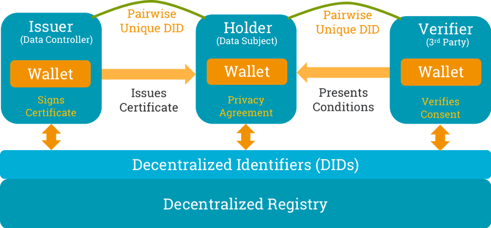
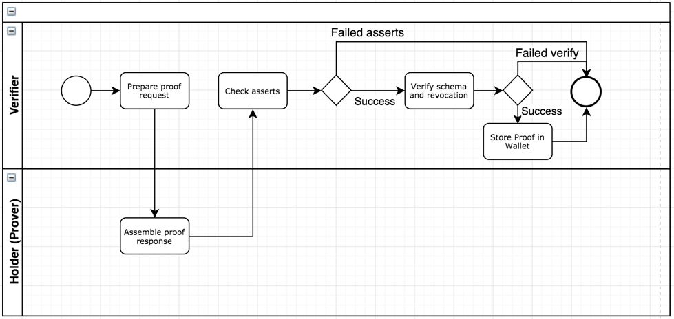

# Aries RFC 0167: Data Consent Lifecycle

- Authors: Jan Lindquist, Dativa; Paul Knowles, Dativa; Mark Lizar, OpenConsent; Harshvardhan J. Pandit, ADAPT Centre, Trinity College Dublin
- Status: [PROPOSED](/README.md#proposed)
- Since: 2019-08-07 (updated 2019-03-16)
- Status Note: This RFC is under development. The reference implementation was recently added.
- Supersedes: [Indy HIPE PR #55: Consent Receipt](https://github.com/hyperledger/indy-hipe/pull/55)
- Start Date: 2018-11-08
- Tags: [concept](/tags.md#concept)
    
    
## Table of Contents

* [Summary](#summary)
* [Motivation](#motivation)
* [Overview](#overview)
* [Concepts](#concepts)
* [Use Cases](#use-cases)
* [Implementation Guidelines](#implementation-guidelines)
    * [Collect Personal Data](#collect-personal-data)
    * [Personal Data Processing Schema](#personal-data-processing-schema)
    * [Example: schemas](#example-schemas)
    * [Blockchain Prerequisites](#blockchain-prerequisites)
    * [Data Consent Receipt Certificate](#data-consent-receipt-certificate)
    * [Initial agreement of privacy agreement](#initial-agreement-of-privacy-agreement)
    * [Proof Request](#proof-request)
    * [Performing Proof Request](#performing-proof-request)
    * [Certification Revocation](#certification-revocation)
* [Implementation Reference](#implementation-reference)
* [Reference](#reference)
* [Annex A: PDP Schema mapping to Kantara Consent Receipt](#annex-a-pdp-schema-mapping-to-kantara-consent-receipt)
* [Prior art](#prior-art)
    * [ETL process](#etl-process)
    * [Personal Data Terms and Conditions](#personal-data-terms-and-conditions)
* [Unresolved questions](#unresolved-questions)
* [Plan](#plan)
* [ToDo](#todo)
* [Comments](#comments)

## Summary

This  RFC illustrates a reference implementation for generating a consent proof for use with DLT (Distributed Ledger Technology).  Presenting a person controlled consent proof data control architecture and supply chain permissions, that is linked to the single consent proof.

The objective of this RFC is to move this  reference implementation, once comments are processed, to a working implementation RFC, demonstrating a proof of consent for DLT.

This RFC  breaks down key components to generate an explicit consent directive with the use of a personal data processing notice (PDP-N) specification which is provided with this RFC as a template for smart privacy.  Appendix - PDP - Notice Spec (DLC Extension for CR v2)

This reference RFC utilises a unified legal data control vocabulary for notification and consent records and receipts  (see Appendix A), maintained by the W3C Data Privacy Vocabulary Control Community Group (DPV), where the unified data control vocabulary is actively being maintained.

This RFC modularizes data capture to make the mappings interchangeable with overlays  (OCA -Ref), to facilitate scale of data control sets across contexts, domains and jurisdictions.

## Motivation

A key challenge with privacy and personal data sharing and self-initiated consent is to establish trust. There is no trust in the personal data based economy. [GDPR Article 25,
Data Protection by Design and by Default](https://ico.org.uk/for-organisations/guide-to-data-protection/guide-to-the-general-data-protection-regulation-gdpr/accountability-and-governance/data-protection-by-design-and-default/), lists recommendations on how
private data is processed. Here we list the technology changes
required to implement that GDPR article. Note the RFC focuses on formalizing the
processing agreement associated with the consent, rather than on informal consent
dialogue.

Hyperledger Aries provides the perfect framework for managing
personal data, especially personal identifiable information (PII), when
necessary data is restricted to protect the identity of the individual
or data subject. Currently, the privacy policy that is agreed to when
signing up for a new service dictates how personal data is processed and
for which purpose. There is no clear technology to hold a
company accountable for the privacy policy. By using blockchain and the
data consent receipt, accountability of a privacy policy can be reached. The
data consent is not limited to a single data controller (or institution) and
data subject (or individual), but to a series of institutions that
process the data from the original data subject. The beauty of the
proposal in this RFC is that accountability is extended to ALL
parties using the data subject's personal data. When the data subject
withdraws consent, the data consent receipt agreement is withdrawn, too.

GDPR lacks specifics regarding how technology should be or can be used
to enforce obligations. This RFC provides a viable alternative with the
mechanisms to bring accountability and at the same time protecting
personal data.

## Overview

Three key components need to be in place:

1.  Schema bases/overlays

2.  Consent Lifecycle

3.  Wallet

Schema bases/overlays describes a standard approach to data capture
that separates raw schema building blocks from additional semantic
layers such as data entry business logic and constraints, knowledge
about data sensitivity, and so forth (refer to [[RFC 0013: Overlays](../0013-overlays/README.md)
for details). The data consent lifecycle covers the data consent receipt
certificate, proof request and revocation. The wallet is where all data
is stored which requires a high level of security and control by
individual or institution. This RFC will cover the consent lifecycle.

The [Concepts section](#concepts) below explains the RFC in GDPR terms. There
is an attempt to align with the vocabulary in the
[W3C Data Privacy Vocabulary](https://www.w3.org/ns/dpv) specification.

The consent lifecycle will be based on self sovereign identity (SSI) to 
ensure that the individual (data subject) has full control of their personal
information. To help illustrate how SSI is applied several use cases along
a reference implementation will help show the relation between the data subject,
data controller and data processor.

## Concepts

These are some concepts that are important to understand when reviewing
this RFC.

**Secondary Data Controller**: The terms "data subject" and "data
controller" (see [GDPR Article 4](http://www.privacy-regulation.eu/en/article-4-definitions-GDPR.htm), items 1 and 7) should be well understood. The data controller is responsible for the data that
is shared beyond their control. A data controller which does not itself
collect data but receives it from another controller is termed a
'secondary' data controller. Even though the
secondary data controller is independent in its processing of personal
data, GDPR requires the primary or original data controller to be
responsible for sharing data under the given consent. The 3rd party
becomes a secondary controller under the responsibility of the original
data controller. Important to note that if a 3rd party does not share
the collected data back to the original data controller, then the 3rd
party is considered an independent data controller (add reference to
CIEU).

**Opt-in / Opt-out**: These terms describe a request
to use personal data beyond the limits of legitimate reasons for
conducting a service. If for example the data is shared with a 3rd party
a consent or **opt-in** is required. At any point the data subject may
withdraw the consent through an **opt-out**.

**Expiration**: The consent may have time limitations that may require
being renewed and does not automatically renew. The data subject may
have a yearly subscription or for purposes of a trial there needs to be
a mechanism to ensure the consent is limited to the duration of the
service.

**Storage limitation**: PII data should not be stored indefinitely and
need to have a clear storage limitation. Storage limitation as defined
by GDPR is limiting how long PII data is kept to fulfill the legitimate
reasons of a service.

**Processing TTL**: Indy currently supports proof only limited to a
specific point in time. For companies that collect data over time to
check for proof every minute is not a viable solution. The **processing
TTL** gives allowances for data ingestion to be done for an extended
period without requiring performing new proof request. Examples will be
given that explain the usage of the term.

## Use Cases

These are the use cases to help understand the implementation guide. A
reference implementation will help in the development.

1.  Alice (data subject) gives data consent by accepting a privacy agreement.

2.  Acme (3rd party data controller) requests proof that data consent
    was given

3.  Alice terminates privacy agreement, thus withdrawing her data consent.

Note: additional use cases may be developed based on contributions to
this RFC.

## Implementation Guidelines

### Collect Personal Data 

These are the steps covered with collect personal data:

-   list personal Identifiable data points
-   list quasi-identifiable data points

The [[Blinding Identity
Taxonomy]](https://kantarainitiative.org/confluence/display/infosharing/Blinding+Identity+Taxonomy)
provides a compressive list of data points that are considered sensitive
and shall be handled with higher level of security.

*Section will expand terms of the explanation of personal identifiable
and quasi-identifiable terms.*

### Personal Data Processing Schema

The personal data processing (PDP) schema captures attributes used to
defines the conditions of collecting data and conditions how data may be
shared or used.

These are the PDP schema attributes:

| Category | Attribute | Brief description | Comment |
| --- | --- | --- | --- |
| Data subset | DID of associated schema or overlay | Data object identifier | _All data objects_ |
|   | Industry Scope [[1](#1)] | A predefined description of the industry scope of the issuer. | _All data objects_ |
| Storage (raw) | Expiration Date | The definitive date on which data revocation throughout the chain of engaged private data lockers of all Data Controllers and sub-Data Controllers will automatically occur. In other words when the PDP expires. | Access-Window |
|   | Limitation (Restricted-Time) | How long data is kept in the system before being removed. Different from _expiration date_ attribute _limitation_ indicates how long personal data may be used beyond the PDP expires. Request to be forgotten supersedes the limitation. | Access-Window |
|   | PII pseudonymization | Data stored with pseudonymization. Conditions of access to are given under _purpose_ attribute of &quot;Access&quot; category. | Encryption |
|   | Method of psuedonymization | Specify algorithm used for performing anonymisation that is acceptable. | Encryption |
|   | Geographic restriction | The data storage has geo location restrictions (country). | Demarcation |
|   | No share | The data shall not be shared outside of the Data Controller responsibility. When set no 3rd party or Secondary Data Controller are allowed. | Demarcation |
| Access (1-n) | Purpose  | The purpose for processing data shall be specified (refer to GDPR Article 4, clause 2, for details on processing details). Applies to both a Data Controller and Secondary Data Controller. | Access-Window |
|   | policyUrl | Reference to privacy policy URL that describes policy in human readable form. | Access-Window |
|   | Requires 3PP PDP [[2](#2)] | A PDP is required between Data Controller and Secondary Data Controller in the form of code of conduct agreement. | Access-Window |
|   | Single Use | The data is shared only for the purpose of completing the interaction at hand. &quot;Expiration-Date&quot; is set to the date of interaction completion. | Access-Window |
|   | PII anonymisation | Data stored with no PII association. | Encryption [[3](#3)] |
|   | Method of anonymisation | Specify algorithm used for performing anonymisation that is acceptable. | Encryption |
|   | Multi-attribute anonymisation | Quasi-identifiable data may be combined create a finger print of the data subject. When set a method of multi-attribute anonymisation is applied on the data | Encryption |
|   | Method of multi-attribute anonymisation | Specifify algorithm used for performing anonymisation that is acceptable (K-anonymity). | Encryption |
|   | Ongoing Use | The data is shared for repeated use by the recipient, with no end date or end conditions. However, the data subject may alter the terms of use in the future, and if the alteration in terms is unacceptable to the data controller, the data controller acknowledges that it will thereby incur a duty to delete. In other words, the controller uses the data at the ongoing sufferance of its owner. | Access-Window |
|   | Collection Frequency (Refresh) | How frequently the data can be accessed. The collection may be limited to once a day or 1 hour. Purpose of attribute is protect data subject to create a profile of behavior. | Access-Window |
|   | Validity TTL | If collection is continuous the validity TTL specifies when to perform new verification. Verification is to check customer withdrew consent. Note this is method for revocation. | Access-Window |
|   | No correlation | No correlation is allowed for subset. This means no external data shall be combined for example public data record of the data subject. | Correlation |
|   | Inform correlation | Correlation is shared with data subject and what data was combined related to them. | Correlation |
|   | Open correlation | Correlation is open and does not need to be informed to data subject. | Correlation |

#### Notes

##### 1
As the PDP schema may be the only compulsory linked schema
specified in every schema metadata block, we have an opportunity to
store the "Framework Description" - a description of the business
framework of the issuer.

Predefined values could be imported from the GICS "Description" entries,
or, where missing, NECS "Description" entries, courtesy of filtration
through the Global Industry Classification Standard (GICS) or New
Economy Classification Standard (NECS) ontologies.

The predefined values could be determined by the next highest level code
to the stored GICS "Sub-industry" code (or NECS "SubSector" code) held
in the associated metadata attribute of the primary schema base to add
flexibility of choice for the Issuer.

##### 2
If a PDP is required between the Data Controller (Issuer) and
sub-Data Controller, we should have a field(s) to store the Public DID
(or Private Data Locker ID) of the sub-Data Controller(s). This will be
vital to ensure auto-revocation from all associated private data lockers
on the date of expiry.

##### 3
As the "PII Attribute" schema object is already in place for
Issuer's to flag sensitive data according to the Blinding Identity
Taxonomy (BIT), we already have a mechanism in place for PII. Once
flagged, we can obviously encrypt sensitive data. Some considerations
post PII flagging: (i.) In the Issuer's **Private Data Locker** : The
default position should be to encrypt all sensitive elements. However,
the issuer should be able to specify if any of the flagged sensitive
elements should remain unencrypted in their private locker. (ii.) In a
**Public** **Data Store** : all sensitive elements should always be
encrypted

### Example: Schemas

When defining a schema there will be a consent schema associated with
it.

    SCHEMA = {
          did: "did:sov:3214abcd",
        name: 'Demographics',
        description: "Created by Faber",
        version: '1.0',
        # MANDATORY KEYS
        attr_names: {
          brthd: Date,
          ageic: Integer
        },
        consent: did:schema:27312381238123  # reference to consent schema
        # Attributes flagged according to the Blinding Identity Taxonomy
        # by the issuer of the schema
        # OPTIONAL KEYS
        frmsrc: "DEM"
    }

The original schema will have a consent schema reference.

    CONSENT_SCHEMA = {
        did: "did:schema:27312381238123",
        name: 'Consent schema for consumer behaviour data',
        description: "Created by Faber",
        version: '1.0',
        # MANDATORY KEYS
        attr_names: {
          expiration: Date,
          limitation: Date,
          dictatedBy: String,
          validityTTL: Integer
        }
    }

The consent schema will have specific attributes for managing data.

  Attribute|Purpose|Type
  --------|-------|------
  expiration|How long consent valid for|Date
  limitation|How long is data kept|Date
  dictatedBy|Who sets expiration and limitation|String
  validityTTL|Duration proof is valid for purposes of data processing|Integer

The issuer may optionally define an overlay that sets the consent schema
values without input from the data subject.

    CONSENT_RECEIPT_OVERLAY = {
      did: "did:sov:5678abcd",
      type: "spec/overlay/1.0/consent_entry",
      name: "Consent receipt entry overlay for clinical trial",
      default_values: [
        :expiration => 3 years,
        :limitation => 2 years,
        :dictatedBy = <reference to issuer> # ??? Should the DID of the issuer's DID be used?
        :validityTTL => 1 month
        ]
    }

If some attributes are identified as sensitive based on the Blinding
Identity Taxonomy when a sensitivity overlay is created.

    SENSITIVE_OVERLAY = {
        did: "did:sov:12idksjabcd",
      type: "spec/overlay/1.0/bit",
      name: "Sensitive data for private entity",
      attributes: [
          :ageic
      ]
    }

To finalise a consent a proof schema has to be created which lists which
schemas and overlays applied and values. The proof is kept off ledger in
the wallet.

    PROOF_SCHEMA = {
        did: "did:schema:12341dasd",
        name: 'Credential Proof schema',
        description: "Created by Rosche",
        version: '1.0',
        # MANDATORY KEYS
        attr_names: {
          createdAt: DateTime,           # How long consent valid for.
          proof_key: "<crypto asset>",   # How long data is kept.
          # Include all the schema did that were agreed upon
          proof_of: [ "did:sov:3214abcd", "did:sov:1234abcd"]
        }
    }

### Blockchain Prerequisites

These are the considerations when setting up the ledger:

-   Ledger setup
-   Wallet setup
-   Types of entities
-   Agents (working on behalf of entity)
-   Communication between entities
-   Onboarding
-   Onboarding of data subject

### Data Consent Receipt Certificate

These are the steps covered with data consent receipt certificate:

-   initial agreement of privacy agreement
-   update agreement with changed terms of use
-   update agreement with new opt-in
-   terminate agreement
-   apply option to forget

### Initial agreement of privacy agreement

The following flow diagram for setting up privacy agreement.

### Proof Request

These are the steps covered with proof request:

-   performing proof request
-   performing proof request without personal data
-   auditing of proof request by Data Authority

The proof request serves multiple purposes. The main one being the
conditions of access are auditable. If a data controller encounters a
situation they need to show the consent and conditions of accessing data
are meet the proof request provides the evidence. The data subject also
has more control of the proof request and in situations the revocation
of certificate is not performed this becomes an extra safe guard. An
important aspect with proof request is that it can be done without
requiring to share any personal data.

### Performing Proof Request

The following flow diagram for setting up privacy agreement.

### Certification Revocation

These are the steps covered with certification revocation:

-   data subject initiated revocation

-   data controller initiated revocation

-   data authority initiated revocation (if owns schema base)

## Implementation Reference

A python jupyter notebook is available as reference implementation 
to help with implementation. The base for this example is 
getting-started jupyter notebook. In order to run the example take
the following steps.

1.   Clone indy-sdk \

         git clone https://github.com/hyperledger/indy-sdk.git
2.    Copy over following files to doc/getting-started \
      - [consent-flow.ipynb](./reference-implementation/consent-flow.ipynb)
      - [docker-compose.yml](./reference-implementation/docker-compose.yml) *

      Note * - Reason for changing the docker-compose.yml is to be able to 
      view consent-flow.ipynb.
    
3. Ready to start docker-compose \

       docker-compose up
4. Open html link and run consent-flow.ipynb

## Reference

*Provide guidance for implementers, procedures to inform testing,
interface definitions, formal function prototypes, error codes,
diagrams, and other technical details that might be looked up. Strive to
guarantee that:*

-   *Interactions with other features are clear.*

-   *Implementation trajectory is well defined.*

-   *Corner cases are dissected by example.*

1.  General Data Protection Regulation\
    REGULATION (EU) 2016/679 OF THE EUROPEAN PARLIAMENT AND OF THE
    COUNCIL of 27 April 2016

2.  Data Privacy Vocabulary v0.1\
    Draft Community Group Report 26 July 2019\
    [[https://www.w3.org/ns/dpv]](https://www.w3.org/ns/dpv)

3.  Hyperledger Aries is infrastructure for blockchain-rooted,
    peer-to-peer interactions\
    [[https://github.com/hyperledger/aries-rfcs]](https://github.com/hyperledger/aries-rfcs)

4.  Overlays\
    [[../0013-overlays/README.md]](../0013-overlays/README.md)

5.  Blinding Identity Taxonomy\
    Created by Andrew Hughes, last modified on Jun 19, 2019\
    [[https://kantarainitiative.org/confluence/display/infosharing/Blinding+Identity+Taxonomy]](https://kantarainitiative.org/confluence/display/infosharing/Blinding+Identity+Taxonomy)

6.  W3C Verifiable Credential
    https://www.w3.org/TR/vc-data-model/
    
## Annex A: PDP Schema mapping to Kantara Consent Receipt

Kantara has defined a Consent Receipt with a list of mandatory and
optional attributes. This annex maps the attributes to the PDP. Many of
the attributes are supported through the ledger and is not directly
included in the PDP.

*Note: The draft used for this annex was file "Consent receipt annex for
29184.docx".*

| **Kantara attribute** | **Hyperledger Indy mapping** |
| --- | --- |
| Version | Schema registration |
| Jurisdiction | Agent registration |
| Consent Timestamp | PDP signed certificate |
| Collection Method | - |
| Consent Receipt ID | PDP signed certificate |
| Public Key | Ledger |
| Language | Overlays |
| PII Principal ID | Schema/Agent registration |
| PII Controller | Agent registration |
| On Behalf | Agent registration (1) |
| PII Controller Contract | Agent registration (2) |
| PII Controller Address | Agent registration |
| PII Controller Email | Agent registration |
| PII Controller Phone | Agent registration |
| PII Controller URL [OPTIONAL] | - |
| Privacy Policy | PDP |
| services | PDP |
| purposes | PDP |
| Purpose Category | - |
| Consent Type | PDP |
| PII Categories | - |
| Primary Purpose | PDP |
| Termination | Ledger |
| Third Party Name | PDP |
| Sensitive PII | Schema base |

Notes

(1) Agent may be of type Cloud Agent which works on behalf of an Issuer
    (Data Controller). When the institution when they register in
    blockchain should make it clear who are they registering on behalf.

(2) Controller Contact may change over time and is not a good reference
    to be used when accepting a consent. If required suggest include as
    part of Agent registration (or requirement)

## Prior art

### ETL process

Current data processing of PII date is not based on blockchain. Data is
processed through ETL routines (ex. AWS API Gateway and Lambda) with a
data warehouse (ex. AWS Redshift). The enforcement of GDPR is based on
adding configuration routines to enforce storage limitations. Most data
warehouses do not implement pseudonymization and may instead opt to have
a very short storage limitation of a couple of months. The current
practice is to collect as much data as possible which goes against data
minimisation.

### Personal Data Terms and Conditions

The [Customer Commons iniative (customercommons.org)](https://customercommons.org) has developed a [[terms and
conditions]](https://docs.google.com/document/d/1Wf7kaXRn85pSEy8kKiX7GsVmZ295x_HbX5M0Ddu7D1s/edit)
for personal data usage. The implementation of these terms and
conditions will be tied to the schema and overlay definitions. The
overlay will specify the conditions of sharing. For more broader
conditions the schema will have new attributes for actual consent for
data sharing. The work by Hypeledger Aries and Customer Commons
complement each other.

## Unresolved questions

## Implementations

The following lists the implementations (if any) of this RFC. Please do a pull request to add your implementation. If the implementation is open source, include a link to the repo or to the implementation within the repo. Please be consistent in the "Name" field so that a mechanical processing of the RFCs can generate a list of all RFCs supported by an Aries implementation.

Name / Link | Implementation Notes
--- | ---
 |  | 

### Plan

-   Upload consent demo to Indy-sdk

### ToDo
-   Update schema examples

### Comments
| **Question** | **From** | **Date** | **Answer** |
| --- | --- | --- | --- |
| Where is consent recorded? | Harsh | 2019-07-31 | There are several types of consent listed below. Where the actual consent is recorded needs Specialised Consent (legal)Generic Consent (legal)General Data Processing Consent |
|   |   |   |   |

