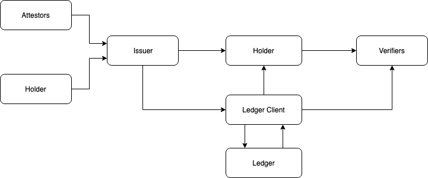
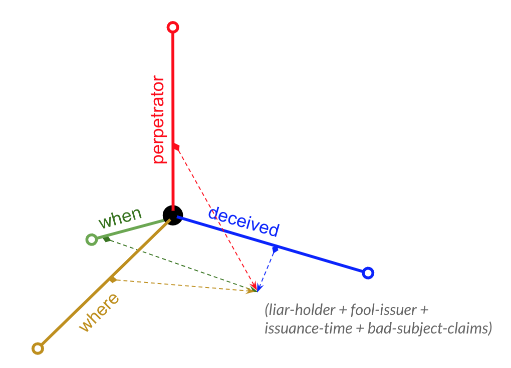

# 0207: Credential Fraud Threat Model
- Authors: [Daniel Hardman](daniel.hardman@gmail.com)
- Status: [STALLED](/README.md#stalled)
- Since: 2024-04-03
- Status Note: No implementations have been created. Socialized on an informal credential fraud study group (https://groups.google.com/d/forum/credential-fraud-study) circa 2019.  
- Start Date: 2019-05-23
- Tags: [concept](/tags.md#concept), [credentials](/tags.md#credentials)

## Summary

Provides a model for analyzing and preventing fraud with [verifiable credentials](https://w3c.github.io/vc-data-model/).

## Motivation

Cybersecurity experts often view technology through the lens of a [threat model](https://en.wikipedia.org/wiki/Threat_model) that helps implementers methodically discover and remediate vulnerabilities.
 
Verifiable credentials are a new technology that has enormous potential to shape the digital landscape. However, when used carelessly, they could bring to digital, remote interactions many of the same abuse possibilities that criminals have exploited for generations in face-to-face interactions.

We need a base threat model for the specific subdiscipline of verifiable credentials, so implementations and deployments have a clear view of how vulnerabilities might arise, and how they can be eliminated. More specific threat models can build atop this general foundation.
 
## Tutorial

### Scope

Verifiable credentials are a way to establish trust. They provide value for login, authorization, reputation, and data sharing, and they enable an entire ecosystem of loosely cooperating parties that use different software, follow different business processes, and require different levels of assurance.

This looseness and variety presents a challenge. Exhaustively detailing every conceivable abuse in such an ecosystem would be nearly as daunting as trying to model all risk on the internet.

This threat model therefore takes a narrower view. We assume the digital landscape (e.g., the internet) as context, with all its vulnerabilities and mitigating best practices. We focus on just the ways that the risks and mitigations for verifiable credential fraud are unique.

### Definition
__Fraud__: intentional deception to secure unfair or unlawful gain, or to hurt a victim. Contrast __hoax__, which is deception for annoyance or entertainment. (paraphrase from Wikipedia)

### Relation to familiar methods
There are many methods for constructing threat models, including [STRIDE](https://en.wikipedia.org/wiki/STRIDE_%28security%29), [PASTA](https://www.owasp.org/images/a/aa/AppSecEU2012_PASTA.pdf), [LINDDUN](https://linddun.org/), [CVSS](https://www.first.org/cvss/specification-document), and so forth. These are excellent tools. We use insights from them to construct what's offered here, and we borrow some terminology. We recommend them to any issuer, holder, or verifier that wants to deepen their expertise. They are an excellent complement to this RFC.

However, this RFC is an actual _model_, not a _method_. Also, early exploration of the threat space suggests that with verifiable credentials, patterns of remediation grow more obvious if we categorize vulnerabilities in a specialized way. Therefore, what follows is more than just the mechanical expansion of the STRIDE algorithm or the PASTA process.

### Data Flow Diagram

Data flows in a verifiable credential ecosystem in approximately the following way:

Some verifiable credential models include an additional flow (arrow) directly from issuers to verifiers, if they call for revocation to be tested by consulting a revocation list maintained by the issuer.

### Key Questions
 
Fraud could be categorized in many ways--for example, by how much damage it causes, how easy it is to detect, or how common it is. However, we get predictive power and true insight when we focus on characteristics that lead to different risk profiles and different remediations. For verifiable credentials, this suggests a focus on the following 4 questions:

1. Who is the __perpetrator__?
2. Who is __directly deceived__?
3. __When__ is the deception committed?
4. __Where__ (on which fact) is the deception focused? 

We can think of these questions as orthogonal dimensions, where each question is like an axis that has many possible positions or answers. We will enumerate as many answers to these questions as we can, and assign each answer a formal name. Then we can use a terse, almost mathematical notation in the form `(w + x + y + z)` (where `w` is an answer to question 1, `x` is an answer to question 2, and so forth) to identify a fraud potential in 4-dimensional space. For example, a fraud where the holder fools the issuer at time of issuance about subject data might be given by the locus: `(liar-holder + fool-issuer + issuance-time + bad-subject-claims)`.

 
What follows is an exploration of each question and a beginning set of associated answers. We provide at least one example of a situation that embodies each answer, notated with ⇨. Our catalog is unlikely to be exhaustive; criminal creativity  will find new expressions as we eliminate potential in the obvious places. However, these answers are complete enough to provide significant insight into the risks and remediations in the ecosystem.

#### 1. Who is the perpetrator?
* 1.1 __liar-issuer__ ⇨ Issuer lies about a fact (e.g., birthdate). ⇨ Issuer charges to issue a college diploma, but turns out not to be accredited. ⇨ Issuer signs credential with the wrong key, making it useless.
* 1.2 __liar-holder__ ⇨ Holder lets a friend use the credential. ⇨ Holder attests to something that’s not true, that gets incorporated into cred (e.g., claims they haven’t had any seizures lately, as driver’s license is issued--but has actually had them).
* 1.3 __liar-subject__ ⇨ A subject that is not the holder convinces Issuer of attributes that weren’t actually true.
liar-verifier ⇨ Verifier replays a presentation to impersonate holder.
##### third parties
* 1.4 __fake-issuer__ ⇨ charges £50 for a diploma from Oxford, but isn’t actually Oxford.
* 1.5 __fake-holder__ ⇨ Mallory pretends to be Alice and gets Alice's driver’s license issued to Mallory instead.
* 1.6 __fake-verifier__ ⇨ Gets holder to prove something to the wrong person.
* 1.7 __hacker__ ⇨ Hacker alters issuer’s internal DB upon which creds are based. ⇨ Hacker checks revocation lists on Alice’s credentials to create a fake trail of her proving activities.
* 1.8 __malicious-node__ ⇨ Malicious node of blockchain reports invalid state of blockchain or revocation upon which validation depends.
* 1.9 __malicious-resolver__ ⇨ Ledger client or similar claims DID state that is wrong.
* 1.10 __malicious-server__ ⇨ Serves incorrect revocation list or similar data.
##### combinations
* 1.11 __colluding-issuer-holder__ ⇨ Deceive verifier by holder presenting and issuer claiming non-revoked cred--but really cred was revoked and the rest of the world knows it.
* 1.12 __colluding-issuer-verifier__ ⇨ Coordinate to correlate holder without holder knowing. ⇨ Embed info in the credential that the holder doesn’t realize.
* 1.13 __colluding-holder-verifier__ ⇨ Deceive issuer about a proving interaction that didn’t actually happen.

#### 2. Who is directly deceived?
* 2.1 __fool-verifier__ ⇨ Present data that doesn’t satisfy a presentation request but convince verifier to accept anyway. ⇨ Convince verifier to leak data that was proved to them, contrary to terms of use that applied when holder gave data to them.
* 2.2 __fool-issuer__ ⇨ Convince issuer to reissue without revoking old credential, allowing double spend. ⇨ Get issuer to issue with faulty data.
* 2.3 __fool-holder__ ⇨ Verifier gets holder to reveal attributes that are more correlating than they realize, or to reveal without consent. ⇨ Anonymous person extorts holder claiming to have proof that holder did something embarrassing.
* 2.4 __fool-subject__ ⇨ Put subject attributes in a credential they didn’t consent to.
* 2.5 __fool-auditor__ ⇨ Build fake evidence that something was proved when it wasn’t. ⇨ Remove evidence that something was proved. ⇨ Build fake evidence that something was NOT proved, when it was. ⇨ Fake evidence (or evidence that’s circumstantial and true, but irrelevant) presented to law enforcement to harass a holder.
* 2.6 __fool-twin__ ⇨ A person named “John Smith” is extorted with a true credential about “John Smith” (a different one) doing something nefarious -- threat to reveal.

Combinations of the above?

#### 3. When is the deception committed?
* 3.1 __connection-time__ ⇨ insert MITM when two identities first connect--but possibly don’t take advantage of the redirection until a strategic time in the future.
* 3.2 __proving-time__ ⇨ Get verifier to believe the wrong thing from the presentation.
* 3.3 __post-proving-time__ ⇨ Lull verifier into continuing to believe something that’s no longer true, but that was true when it was proved long ago.
* 3.4 __revocation-time__ ⇨ MITM pretends to record revocation but doesn’t actually do so.
* 3.5 __revocation-check-time__ ⇨ MITM serves up bogus revocation data.
* 3.6 __cache-refresh-time__ ⇨ Malware on Verifier system changes local record of how long it’s been since testing credential, delaying a needed check.
* 3.7 __cache-check-time__
* 3.8 __before-issuance-time__ ⇨ Convince the issuer of something untrue that will alter what they attest about the subject.
* 3.9 __issuance-time__ ⇨ Issue to the wrong person. ⇨ Issue twice when intention was one cred per person.
* 3.10 __post-issuance-time__ ⇨ Convince issuer to revoke for no good reason.
* 3.11 __multi-time__ ⇨ Fraud must happen at two or more different times to accomplish its objective.

#### 4. Where (on which fact) is the deception focused?
##### identity
* 4.1 __bad-holder-identity__ ⇨ Impersonate holder by proving with a device that the holder doesn’t control.
* 4.2 __bad-subject-identity__ ⇨ Put the wrong father in a birth certificate.
* 4.3 __bad-issuer-identity__ ⇨ Sign credential with a key belonging to the IRS’s HR department instead of the IRS’s main government agency key.
* 4.4 __bad-verifier-identity__ ⇨ Get prover to prove something to a MITM pretending to be the legitimate verifier.

##### claims
* 4.5 __bad-subject-claims__
* 4.6 __inadequate-claims__ ⇨ Get verifier to assume something beyond what the evidence actually supports.

##### context
* 4.7 __bad-timestamp__ ⇨ Fraud hinges on claiming a different time for an event than the time it actually occurred.
* 4.8 __bad-ledger-read__ ⇨ Malicious ledger client returns incorrect data from a query of the ledger. 
* 4.9 __bad-ledger-write__ ⇨ Malicious ledger client alters data before writing it to the ledger.
* 4.10 __bad-revoc-read__ ⇨ False revocation status is reported when a revocation list or revocation registry is read.
* 4.11 __bad-revoc-write__ ⇨ Revocation status is not updated when a request to update is submitted.
* 4.12 __bad-payment__ ⇨ A payment amount, timestamp, or responsibile party is falsified.
* 4.13 __bad-did-resolve__ ⇨ Invalid or stale results are returned when a DID is resolved.
* 4.14 __bad-tamper-check__ ⇨ Data is tampered with, but the tampering is not detected.
* 4.15 __missing-evidence__ ⇨ Issuer subverts audit by removing evidence that they discriminated when a loan was issued.
* 4.16 __bad-evidence__ ⇨ Issuer subverts audit by creating falsified evidence that they behaved properly when a loan was issued.
* 4.17 __bad-compliance__ ⇨ Verifier asserts to government or to holder that they’ve complied with GDPR, but this is not actually true.

## Reference

Provide guidance for implementers, procedures to inform testing,
interface definitions, formal function prototypes, error codes,
diagrams, and other technical details that might be looked up.
Strive to guarantee that:

- Interactions with other features are clear.
- Implementation trajectory is well defined.
- Corner cases are dissected by example.

## Drawbacks

Why should we *not* do this?

## Rationale and alternatives

- Why is this design the best in the space of possible designs?
- What other designs have been considered and what is the rationale for not
choosing them?
- What is the impact of not doing this?

## Prior art

Discuss prior art, both the good and the bad, in relation to this proposal.
A few examples of what this can include are:

- Does this feature exist in other SSI ecosystems and what experience have
their community had?
- For other teams: What lessons can we learn from other attempts?
- Papers: Are there any published papers or great posts that discuss this?
If you have some relevant papers to refer to, this can serve as a more detailed
theoretical background.

This section is intended to encourage you as an author to think about the
lessons from other implementers, provide readers of your proposal with a
fuller picture. If there is no prior art, that is fine - your ideas are
interesting to us whether they are brand new or if they are an adaptation
from other communities.

Note that while precedent set by other communities is some motivation, it
does not on its own motivate an enhancement proposal here. Please also take
into consideration that Aries sometimes intentionally diverges from common
identity features.

## Unresolved questions

- What parts of the design do you expect to resolve through the
enhancement proposal process before this gets merged?
- What parts of the design do you expect to resolve through the
implementation of this feature before stabilization?
- What related issues do you consider out of scope for this 
proposal that could be addressed in the future independently of the
solution that comes out of this doc?
   
## Implementations

The following lists the implementations (if any) of this RFC. Please do a pull request to add your implementation. If the implementation is open source, include a link to the repo or to the implementation within the repo. Please be consistent in the "Name" field so that a mechanical processing of the RFCs can generate a list of all RFCs supported by an Aries implementation.

Name / Link | Implementation Notes
--- | ---
 |  | 

