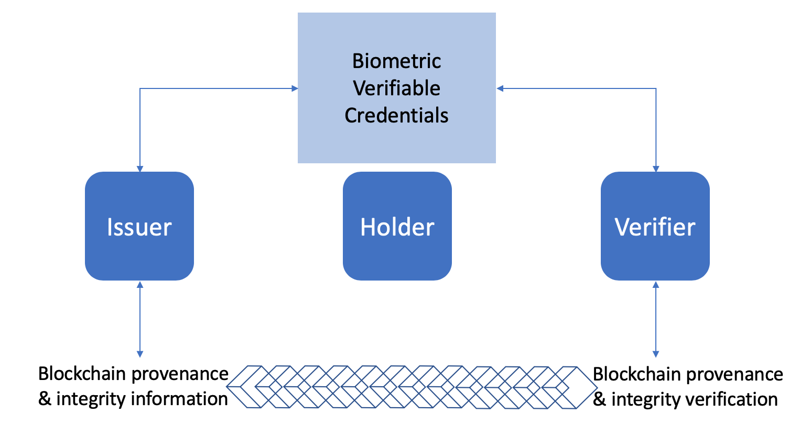
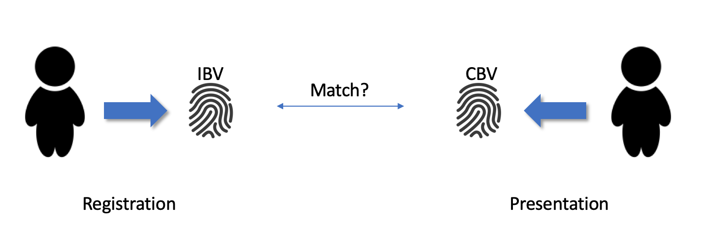
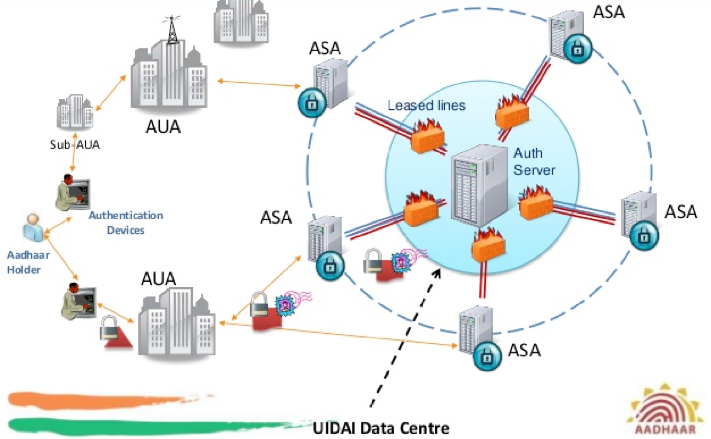
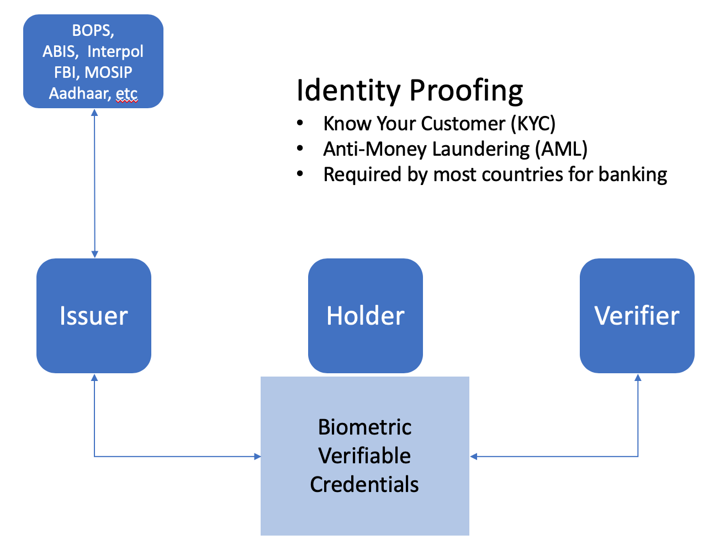
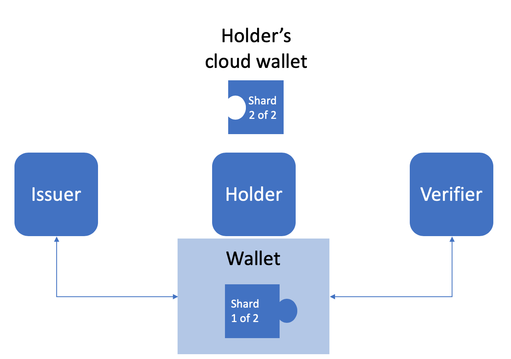

# Aries RFC 0231: Biometric Service Provider

- Authors: [John Callahan](jcallahan@acm.org), [Daniel Hardman](daniel.hardman@gmail.com), [Asem Othman](aothman@veridiumid.com)
- Status: [PROPOSED](/README.md#proposed)
- Since: 2019-09-24
- Status Note: Proposed for now based on authors joint work
- Start Date: 2019-06-01
- Tags: concept

## Summary

Biometric services for Identity Verification, Authentication, Recovery
and other use cases referred to in Aries RFCs including DKMS.

## Motivation

Biometrics play a special role in many identity use cases because of
their ability to intrinsically identify a unique individual, but their
use depends on a variety of factors including liveness, matching
accuracy, ease of acquisition, security and privacy. Use of biometrics
is already well established in most countries for domestic and
international travel, banking and law enforcement.  In banking,
know-your-customer (KYC) and anti-money laundering (AML) laws require
some form of biometric(s) when establishing accounts.

In this specification, we characterize the functions and schema that
biometric service providers (BSPs) must implement to ensure a uniform
interface to clients: wallets and agents.  For example, current
Automated Biometric Information Systems (ABIS) and other standards
(IEEE 2410, FIDO) provide a subset of services but often require
proprietary adaptors due to the fragmented history of the biometric
market: different modalities (face, fingerprint, iris, etc.) require
different functions, schema, and registration information.  More
recently, standards have begun to specify functions and schema across
biometric modalities.  This specification will adopt these approaches
and treat biometric data within an encrypted envelope across
modalities.

## Tutorial

One goal of the Biometric Service Provider (BSP) specification is to
allow for self-sovereign biometric credentials in a holder's wallet or
cloud agent trusted by issuers and verifiers:

An issuer may collect biometric information from a holder in order to
issue credentials (biometric or not). Likewise, a verifier may require
biometric matching against the holder's credentials for
authentication.  In either case, issuers, holders and verifiers may
need to rely on 3rd party services to perform biometric matching
functions for comparison to authoritative databases.

### Basics

In general, biometrics are collected during registration from a person
and stored for later comparisons.  The registration data is called the
Initial Biometric Vector (IBV).  During subsequent sessions, a
biometric reading is taken called the Candidate Biometric Vector (CBV)
and "matched" to the IBV:

Both the IBV and CBV must be securely stored on a mobile device or
server often with the help of hardware-based encryption mechanisms
such as a Trusted Execution Environment (TEE) or Hardware Security
Module (HSM).  The CBV is typically ephemeral and discarded (using
secure erasure) following the match operation.

If the IBV and/or CBV are used on a server, any exchange must use
strong encryption between client and server if transmitted over public
or private networks in case of interception.  Failure to properly
protect the collection, transmission, storage and processing of
biometric data is a serious offense in most countries and violations
are subject to severe fines and/or imprisonment.

### Example: Aadhaar

The Aadhaar system is an operational biometric that provides identity
proofing and identity verification services for over 1 billion people
in India.  Aadhaar is comprised of many elements with authentication
as the most common use case:

Authentication Service Agents (ASAs) are licensed by the Government of
India to pass the verification request via secure channels to the Unique
Identification Authority of India (UIDAI) data centre where IBVs are retireved and matched
to incoming CBVs from Authentication User Agencies (AUA) that broker
user authentication sessions from point-of-sale (PoS) terminals:

### Use Cases

A Biometric Service Provider (BSP) supports the following use cases.
In each case, we distinguish whether the use case requires one-to-one
(1:1) matching or one-to-many (1:N) matching:

1. Device Unlocking - primarily introduced to solve the inconvenience
of typing a password into a small mobile device, face and single-digit
fingerprint was introduced to mobile devices to protect access to the
device resources.  This is a 1:1 match operation.

2. Authentication - the dominant use case for biometrics.  Users must
prove they *sufficiently* match the IBV created during registration in
order to access local *and* remote resources including doors, cars,
servers, etc. This is a 1:1 match operation.

3. Identification - an unknown person presents for purposes of
determining their identity against a database of registered persons.
This is a 1:N match operation because the database(s) must be searched
for all IBVs of matching identities.

5. Identity Verification - a person claims a specific identity with
associated metadata (e.g., name, address, etc.) and provides a CBV for
match against that person's registered biometric data to confirm the
claim.  This is a 1:1 match operation.

4. Identity Proofing - a person claims a specific identity with
associated metadata (e.g., name, address, etc.) and provides a CBV for
match against *all* persons in database(s) in order to determine the
efficacy of their claims and any counter-claims.  This is a 1:N match
operation because the database(s) must be searched for all IBVs of
matching identities.

6. Deduplication - given a CBV, match against IBVs of all registered
identities to determine if already present or not in the database(s).
This is a 1:N matching operation.

7. Fraud prevention - A match operation could return confidence
score(s) (0..1) rather than a simply boolean.  Confidence score(s)
express the probability that the candidate is not an imposter and
could be used in risk analysis engines.  *This may be a use case for
BSP clients*.

8. Recovery - Using biometric shards, a process using one's biometrics
to recover lost private keys associated with a credential is possible
using secret sharing.  *This may be a use case for BSP clients*.

The previous diagram describing the IBV and CBV collection and
matching during registration and presentation did not specify *where*
the IBV is persisted nor *where* the match operation is performed.  In
general, we can divide the use cases into 4 categories depending on
where the IBV is persisted and where the match must occur:

**Mobile-Mobile**: If the IBV is stored on the mobile device and the
match with the CBV occurs on the mobile device, then

**Mobile-Server**: If the IBV is stored on the mobile device, but the
match occurs on a server,

**Server-Mobile**: If the IBV is stored on a server, but the match
occurs on a mobile device,

**Server-Server**: Finally, if the IBV is stored on a server and the
match occurs on a server, then

### Use case 1: Identity Proofing

### Use case 2: Recovery

## Reference

The NIST 800-63-3 publications are *guidelines* that establish levels
of assurance (LOA) for identity proofing (Volume A), authentication
(Volume B), and federation (Volume C).  The Biometric Service Provider
(BSP) specification deals primarily with ientity proofing and
authentication.

A common misconception is that a biometric is like a password, but
cannot be replaced upon loss or compromise.  A biometric is *private
but not secret*, whereas a password is *secret and private*.  Used
correctly, biomtrics require *presentation attack detection* (PAD), also
called *liveness*, to ensure that the sensor is presented with a live
face, fingerprints, etc. of a subject rather than a spoof, i.e., a
photo, fake fingertips, etc.  Indeed, NIST 800-63-3B requires presence
of a person in front of a witness for Identity Assurance Level 3
(IAL3) in identity proofing use cases.NIST
characterizes the identity proofing process as follows:

Remote use of biometrics is increasing as well to streamline
on-boarding and recovery processes without having to present to an
official.  NIST 800-63-3A introduced remote identity proofing for IAL2
in 2017 with some form of PAD strongly recommended (by reference to
NIST 800-63-3B).  Typically, additional measures are combined with
biometrics including knowledge-based authentication (KBA), risk
scoring and document-based verification to reduce fraud.  

### Protection

Biometric data is highly sensitive and must be protected wherever and
whenever it is collected, transmitted, stored and processed.  In
general, some simple rules of thumb include:

* Protect biometric data at collection (sensor safeguards)
* Protect biometric data at rest (special hardware, TPM/TEE, database encryption)
* Protect biometric data in transit (encrypted communications)
* Protect biometric data during match (volatile memory protections)
* Never log biometric data!
* The Candidate Biometric Vector (CBV) is ephemeral

### Issues

* Should define biometric verifiable credential schema(s)
* Biometric modality agnostic
 * Accommodate Biometric shards
 * Integrate with Ursa crypto
 * Integrate with service endpoint model
* Allows Issuers, Verifiers, and Holder wallets & agents to invoke services like:
 * Registration 
 * Matching
 * Deduplication
 * Verification
* Provides new services
 * Fuzzy matching
 * Shard management (for DKMS) including Horcrux-based storage options
 * Holder-specific biometric matching “machine” (using ZK-STARKs)
* Compatible with trust relationships
 * Supports DID connections/Trust relationships (Holder ⟷ BSP ⟷ Verifier)

## Drawbacks

Biometrics are explicity required in many global regulations including
NIST (USA), Aadhaar (India), INE (Mexico), and RENIEC (Peru) but also
standardized by international organizations for travel (IATA) and
finance (FATF).

## Rationale and alternatives

By addressing biometrics, we seek to provide explicit guidance to
developers who will undoubtedly encounter them in many identity
credentialing and authentication processes.

## Prior art

Several biometric standards exist that provide frameworks for
biometric services including the FIDO family of stanfards and IEEE
2410.  Within each biometric modality, standards exist to encode
representations of biometric information.  For example, fingerprints
can be captured as raw images in JPEG or PNG format but also
represented as vectors of minutae encoded in the WSQ format.

## Unresolved questions

* What is the threat model?
* Alignment with other RFCs
 * Distributed Key Management RFC (Open Issues and Future Work section)
 * Credential Fraud RFC (Threat model, Patterns & Anti-Patterns)
* Relation to
 * IEEE 2410 (BOPS)
 * FIDO and new FIDO IDWG (Identity Verification)

## Implementations

The following lists the implementations (if any) of this RFC. Please
do a pull request to add your implementation. If the implementation is
open source, include a link to the repo or to the implementation
within the repo. Please be consistent in the "Name" field so that a
mechanical processing of the RFCs can generate a list of all RFCs
supported by an Aries implementation.

Name / Link | Implementation Notes
--- | ---
 |  | 

