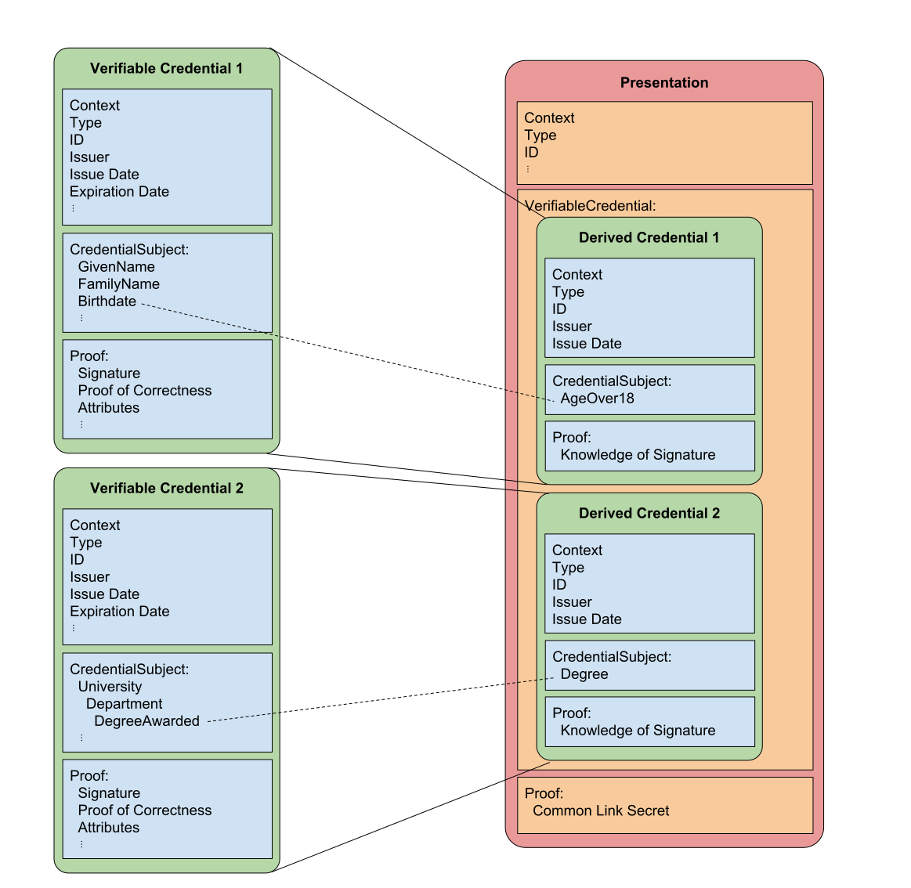

# RFC 0250: Rich Schema Objects
- Author: [Ken Ebert](ken@sovrin.org), [Brent Zundel](brent.zundel@evernym.com)
- Status: [ACCEPTED](/README.md#accepted)
- Since: 2019-10-08
- Status Note: Port of [this HIPE](https://github.com/hyperledger/indy-hipe/tree/master/text/0119-rich-schemas/README.md)
- Supersedes: [this HIPE](https://github.com/hyperledger/indy-hipe/tree/master/text/0119-rich-schemas/README.md)
- Start Date: 2019-03-19
- Tags: concept, rich-schemas

## Summary

A high-level description of the components of an anonymous credential
ecosystem that supports rich schemas, W3C Verifiable Credentials and
Presentations, and correspondingly rich presentation requests. Rich
schemas are hierarchically composable graph-based representations of
complex data. For these rich schemas to be incorporated into the aries
anonymous credential ecosystem, we also introduce such objects as
mappings, encodings, presentation definitions and their associated
contexts.

This RFC provides a brief description of each rich schema object.
Future RFCs will provide greater detail for each individual object and
will be linked to from this document. The further RFCs will contain
examples for each object.

## Motivation

### Standards Compliance
The W3C Verifiable Claims Working Group (VCWG) will soon be releasing a
verifiable credential data model. This proposal introduces aries anonymous
credentials and presentations which are in compliance with that standard.

## Interoperability
Compliance with the VCWG data model introduces the possibility of
interoperability with other credentials that also comply with the
standard. The verifiable credential data model specification is limited to
defining the data structure of verifiable credentials and presentations.
This includes defining extension points, such as "proof" or
"credentialStatus."

The extensions themselves are outside the scope of the current
specification, so interoperability beyond the data model layer will require
shared understanding of the extensions used. Work on interoperability of
the extensions will be an important aspect of maturing the data model
specification and associated protocols.

Additionally, the new rich schemas are compatible with or the same as
existing schemas defined by industry standards bodies and communities of
interest. This means that the rich schemas should be interoperable with
those found on schema.org, for example. Schemas can also be readily
defined for those organizations that have standards for data
representation, but who do not have an existing formal schema
representation.

## Shared Semantic Meaning

The rich schemas and associated constructs are linked data objects that
have an explicitly shared context. This allows for all entities in the
ecosystem to operate with a shared vocabulary.

Because rich schemas are composable, the potential data types that may
be used for field values are themselves specified in schemas that are
linked to in the property definitions. The shared semantic meaning gives
greater assurance that the meaning of the claims in a presentation is in
harmony with the semantics the issuer intended to attest when they signed
the credential.

## Improved Predicate Proofs
Introducing standard encoding methods for most data types will enable
predicate proof support for floating point numbers, dates and times, and
other assorted measurements. We also introduce a mapping object that ties
intended encoding methods to each schema property that may be signed so
that an issuer will have the ability to canonically specify how the data
they wish to sign maps to the signature they provide.

## Use of JSON-LD
Rich schema objects primarily wish to benefit from the accessibility of
ordinary JSON, but require more sophisticated JSON-LD-driven patterns when
the need arises.

Each rich schema object will specify the extent to which it supports
JSON-LD functionality, and the extent to which JSON-LD processing may be
required.

### What the Casual Developer Needs to Know

* __The `@` character in rich schema objects is reserved for JSON-LD-isms__.
Any usage of JSON keys that begin with this character is required to be
JSON-LD-compatible, and any time you see it, you are seeing JSON-LD at
work.

* __`@context` and `@type` are required at the root of every object__. The
meaning of these fields in rich schema objects matches JSON-LD's
expectations, but you don't need to learn JSON-LD to use them.

* __JSON-LD's more advanced mechanisms are an option__--not invoked ad hoc
for every type of rich schema object, but specified in the formal
description of each rich schema object. Most rich schema objects use no
more JSON-LD than `@context`, `@type`, and `@id`.

### Details

Compatibility with JSON-LD was evaluated against version 1.1 of the
JSON-LD spec, current in early 2019. If material changes in the spec
are forthcoming, a new analysis may be worthwhile. Our current
understanding follows.

#### `@type`

The type of an rich schema object, or of an embedded object within a rich
schema object, is given by the JSON-LD `@type` property.
[JSON-LD requires this value to be an IRI](https://w3c.github.io/json-ld-syntax/#typed-values).

#### `@id`

The identifier for a rich schema object is given by the JSON-LD `@id`
property.
[JSON-LD requires this value to be an IRI](https://w3c.github.io/json-ld-syntax/#node-identifiers).

#### `@context`

This is JSON-LD’s namespacing mechanism. It is active in rich schema
objects, but can usually be ignored for simple processing, in the same way
namespaces in XML are often ignored for simple tasks.

Every rich schema object has an associated `@context`, but for many of them
we have chosen to follow the procedure described in [section
6 of the JSON-LD spec](https://w3c.github.io/json-ld-syntax/#interpreting-json-as-json-ld),
which focuses on how ordinary JSON can be interpreted as JSON-LD.

Contexts are JSON objects. They are the standard mechanism for defining
shared semantic meaning among rich schema objects. Contexts allow schemas,
mappings, presentations, etc. to use a common vocabulary when referring to
common attributes, i.e. they provide an explicit shared semantic meaning.

#### Ordering

[JSON-LD specifies](https://w3c.github.io/json-ld-syntax/#sets-and-lists)
that the order of items in arrays is NOT significant, and notes that this
is the opposite of the standard assumption for plain JSON. This makes sense
when viewed through the lens of JSON-LD’s role as a transformation of RDF,
and is a concept supported by rich schema objects.

## Tutorial
[tutorial]: #tutorial
The object ecosystem for anonymous credentials that make use of rich
schemas has a lot of familiar items: credentials, credential definitions,
schemas, and presentations. Each of these objects has been changed, some
slightly, some more significantly, in order to take advantage of the
benefits of contextually rich linked schemas and W3C verifiable
credentials. More information on each of these objects can be found
below.

In addition to the familiar objects, we introduce some new objects:
contexts, mappings, encodings, and presentation definitions. These serve
to bridge between our current powerful signatures and the rich schemas,
as well as to take advantage of some of the new capabilities that are
introduced.

    
    <b>Relationship graph of rich schema objects</b>

### Verifiable Credentials
The Verifiable Claims Working Group of the W3C is working to publish a
Verifiable Credentials data model specification. Put simply, the goal
of the new data format for anonymous credentials is to comply with the W3C
specification.

The data model introduces some standard properties and a shared
vocabulary so that different producers of credentials can better
inter-operate.

### Rich Schemas
The proposed rich schemas are [JSON-LD objects](https://json-ld.org/). This
allows credentials issued according to them to have a clear semantic
meaning, so that the verifier can know what the issuer intended. They also
support explicitly typed properties and semantic inheritance. A schema may
include other schemas as property types, or extend another schema with
additional properties. For example a schema for "employee" may inherit from
the schema for "person."

### Mappings
Rich schemas are complex, hierarchical, and possibly nested objects. The
[Camenisch-Lysyanskaya signature][CL-signatures] scheme used in anonymous
credentials requires the attributes to be represented by an array of
256-bit integers. Converting data specified by a rich schema into a flat
array of integers requires a mapping object.

Mappings serve as a bridge between rich schemas and the flat array of
signed integers. A mapping specifies the order in which attributes are
transformed and signed. It consists of a set of graph paths and the
encoding used for the attribute values specified by those graph paths. Each
claim in a mapping has a reference to an encoding, and those encodings are
defined in encoding objects.

Mappings are written to a data registry so they can be shared by multiple
credential definitions. They need to be discoverable. When a mapping has
been created or selected by an issuer, it is made part of the credential
definition.

The mappings serve as a vital part of the verification process. The
verifier, upon receipt of a presentation must not only check that the array
of integers signed by the issuer is valid, but that the attribute values
were transformed and ordered according to the mapping referenced in the
credential definition.

Note: The anonymous credential signature scheme introduced here is
[Camenisch-Lysyanskaya signatures][CL-signatures]. It is the use of this
signature scheme in combination with rich schema objects that necessitates
a mapping object. If another signature scheme is used which does not have
the same requirements, a mapping object may not be necessary or a different
mapping object may need to be defined.

### Encodings
All attribute values to be signed in an anonymous credential must be
transformed into 256-bit integers in order to support the current
[Camenisch-Lysyanskaya signature][CL-signatures] scheme.

The introduction of rich schemas and their associated range of possible
attribute value data types require correspondingly rich encoding
algorithms. The purpose of the encoding object is to specify the
algorithm used to perform transformations for each attribute value data
type. The encoding algorithms will also allow for extending the
cryptographic schemes and various sizes of encodings (256-bit, 384-bit,
etc.). The encoding algorithms will allow for broad use of predicate
proofs, and avoid hashed values where they are not needed, as they do not
support predicate proofs.

Encoding objects are written to a data registry. Encoding
objects also allow for a means of extending the standard set of encodings.
All encoding methods result in an integer representation of an attribute
value according to the encoding algorithm selected by the issuer.

### Credential Definitions
Credential definitions provide a method for issuers to specify a schema and
mapping object, and provide public key data for credentials they issue.
This ties the schema and public key data values to the issuer. The verifier
uses the credential definition to check the validity of each signed
credential attribute presented to the verifier.

### Presentation Definitions
A presentation definition is the means whereby a verifier asks for data
from a holder. It contains a set of named desired proof attributes with
corresponding restrictions that limit the potential sources for the
attribute data according to the desired source schema, issuer DID,
credential definition, etc. A presentation definition also contains a
similar set of requested predicate proofs, with named attributes and
restrictions.

It may be helpful to think of a presentation definition as the
mirror image of a mapping object. Where a mapping object specifies the
graph paths of the attributes to be signed, a presentation definition
specifies the graph query that may be fulfilled by such graph paths. The
presentation definition does not need to concern itself with specifying a
particular mapping that contains the desired graph paths, any mapping that
contains those graph paths may be acceptable. The fact that multiple graph
paths might satisfy the query adds some complexity to the presentation
definition. The query may also restrict the acceptable set of issuers and
credential definitions and specify the desired predicates.

A presentation definition is expressed using JSON-LD and may be stored in a
data registry. This supports re-use, interoperability, and a much
richer set of communication options. Multiple verifiers can use the same
presentation definitions. A community may specify acceptable presentation
definitions for its verifiers, and this acceptable set may be adopted by
other communities. Credential offers may include the presentation
definition the issuer would like fulfilled by the holder before issuing
them a credential. Presentation requests may also be more simply negotiated
by pointing to alternative acceptable presentation definitions. Writing a
presentation definition to a data ragistry also allows it to be publicly
reviewed for privacy and security considerations and gain or lose
reputation.

### Presentations
The presentation object that makes use of rich schemas is defined by the
W3C Verifiable Credentials Data Model, and is known in the specification as
a verifiable presentation. The verifiable presentation is defined as a way
to present multiple credentials to a verifier in a single package.

The claims that make up a presentation are specified by the presentation
definition. The credentials from which these claims originate are used to
create new derived credentials that only contain the specified claims and
the cryptographic material necessary for proofs. The type of claims in
derived credentials is also specified by the presentation definition. These
types include revealed and predicate proof claims. The presentation also
contains the cryptographic material which supports a proof that source
credentials are held by the same entity. This is accomplished by proving
knowledge of a link secret.

A presentation refers to the credential definitions on the data registry
associated with the source credentials. It also refers to the presentation
definition. A presentation is not stored on the ledger.

The following image illustrates the relationship between credentials and
presentations:

### Presentation Description
There may be a number of ways a presentation definition can be used by a
holder to produce a presentation, based on the graph queries and other
restrictions in the presentation definition. A presentation description
describes the source credentials and the process that was used to derive
a presentation from them.

## Reference
This document draws on a number of other documents, most notably the
[W3C verifiable credentials and presentation data model.](https://w3c.github.io/vc-data-model/)

The signature types used here are the same as those currently used.
Here is the paper that defines
[Camenisch-Lysyanskaya signatures.][CL-signatures] They are the source for
[Indy's AnonCreds protocol](https://github.com/hyperledger/indy-hipe/pull/109).

[CL-signatures]: (https://groups.csail.mit.edu/cis/pubs/lysyanskaya/cl02b.pdf)

## Drawbacks

- Rich schemas are complex.

- The formats rely largely on JSON-LD serialization and may be dependent on
full or limited JSON-LD processing.

## Rationale and alternatives
This design has the following benefits:
  - It complies with the upcoming Verifiable Credentials standard.
  - It allows for interoperability with existing schemas, such as those
  found on [schema.org](https://www.schema.org).
  - It adds security guarantees by providing means for validation of
  attribute encodings.
  - It allows for a broad range of value types to be used in predicate
  proofs.
  - It introduces presentation definitions that allow for proof
  negotiation, rich presentation specification, and an assurance
  that the presentation requested complies with security and privacy
  concerns.
  - It supports discoverability of schemas, mappings, encodings,
  presentation definitions, etc.

## Unresolved questions

This technology is intended for implementation at the SDK API level. It
does not address UI tools for the creation or editing of these objects.

Variable length attribute lists are only partially addressed using
mappings. Variable lists of attributes may be specified by a rich schema,
but the maximum number of attributes that may be signed as part of the list
must be determined at the time of mapping creation.

## Implementations

The following lists the implementations (if any) of this RFC. Please do a pull request to add your implementation. If the implementation is open source, include a link to the repo or to the implementation within the repo. Please be consistent in the "Name" field so that a mechanical processing of the RFCs can generate a list of all RFCs supported by an Aries implementation.

Name / Link | Implementation Notes
--- | ---
 |  | 

