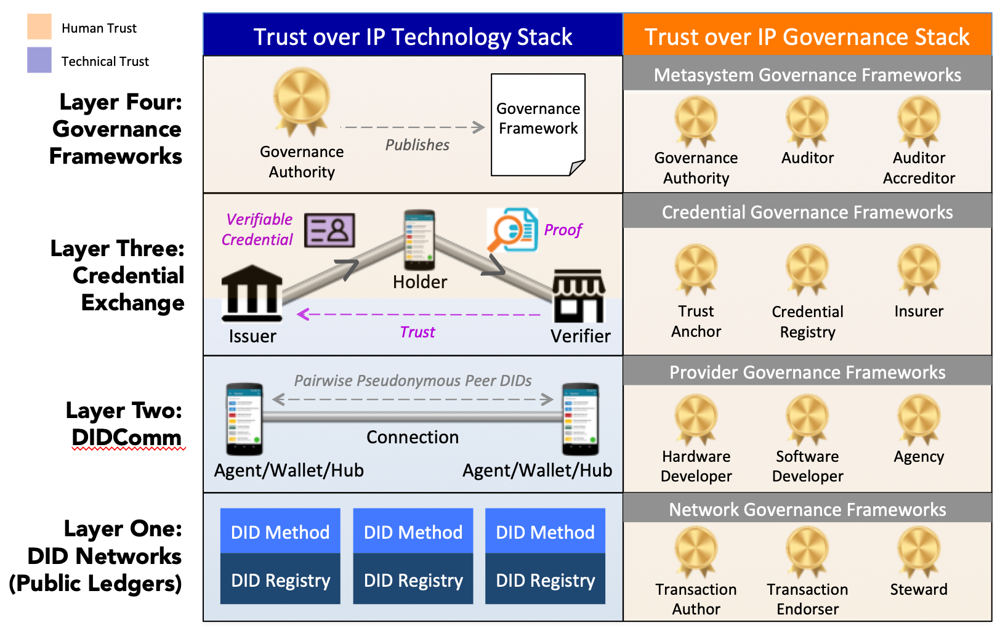
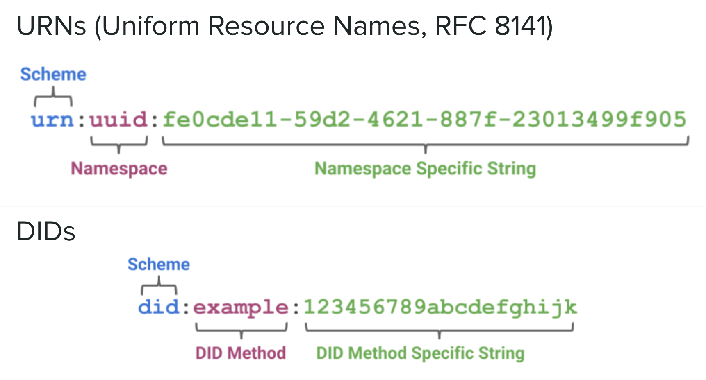
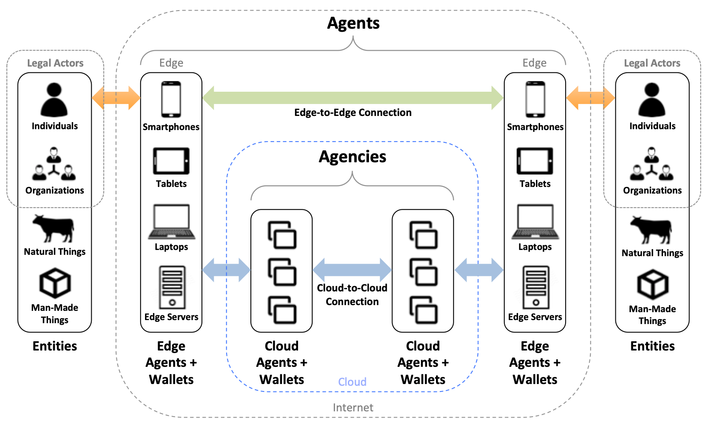
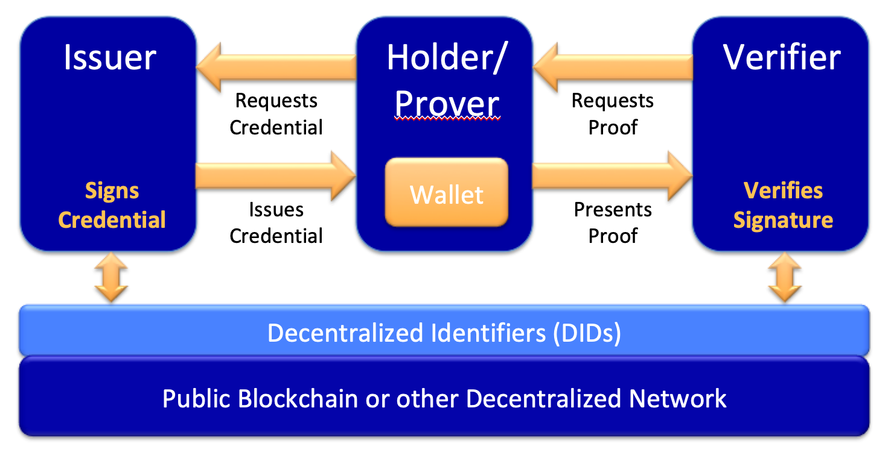
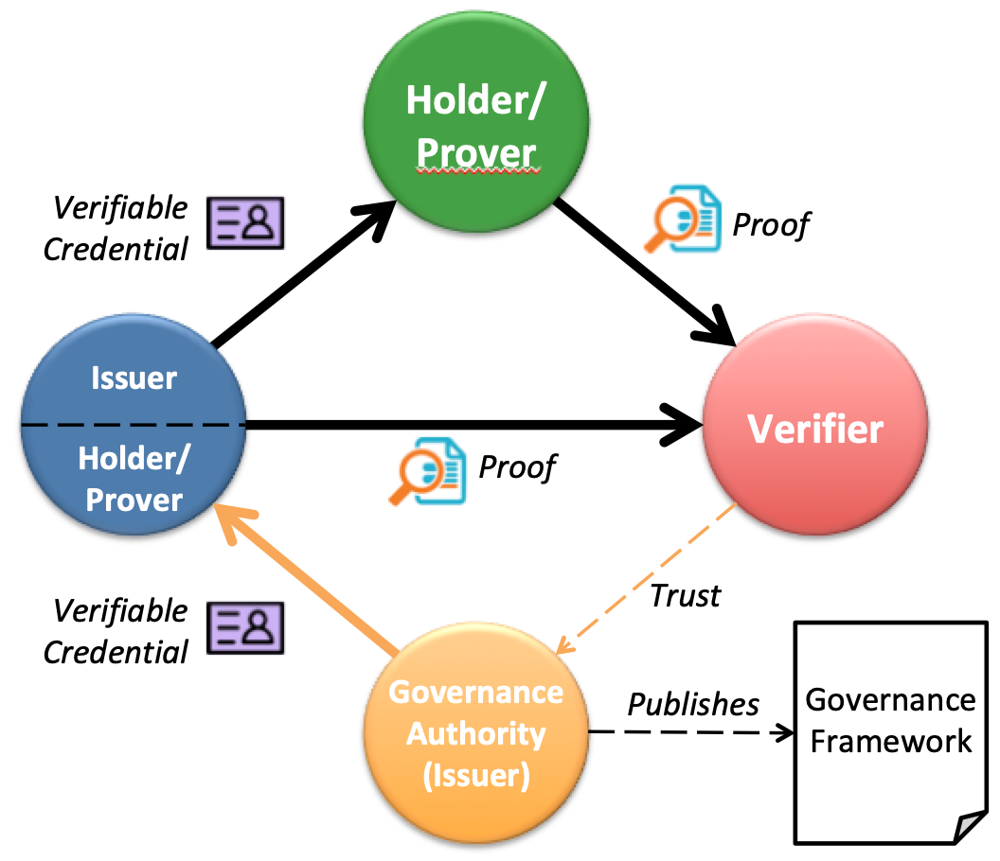

# 0289: The Trust Over IP Stack
- Authors: Matthew Davie, [Dan Gisolfi](dan.gisolfi@gmail.com), [Daniel Hardman](daniel.hardman@evernym.com), [John Jordan](john.jordan@gov.bc.ca), Darrell O'Donnell, [Drummond Reed](drummond.reed@evernym.com)
- Status: [PROPOSED](/README.md#proposed)
- Since: 2019-11-04
- Status Note: Initial Proposal
- Start Date: 2019-01-01
- Tags: concept, stack, trust layer

## Summary

This Aries concept RFC introduces a complete architecture for Internet-scale digital trust that integrates cryptographic trust at the machine layer with human trust at the business, social, and legal layers.

## Motivation

The importance of interoperability for the widespread adoption of an information network architecture has been proven by the dramatic rise to dominance of the Internet [1]. A key driver of the Internet's rise to dominance was the open source implementation of the TCP/IP stack in Version 4.2 of Berkeley Software Distrbution (BSD) of UNIX [2].

This widely-adopted open source implementation of the TCP/IP stack offered the capability for any two peer devices to form a connection and exchange data packets regardless of their local network. Without a doubt, the BSD stack (and other TCP/IP implementations) have driven a tremendous amount of innovation over the last 30 years. However, there remains a significant and widely-recognized gap in Internet architecture: a means for peers to establish trust over these digital connections. This gap has often been referred to as "the Internet's missing identity layer" [3].

The purpose of this Aries Concept RFC is to fill this gap by defining a standard information network architecture that developers can implement to establish trusted relationships over digital communicatons networks.

## Architectural Layering of the Trust over IP Stack

Since the ultimate purpose of an "identity layer" is not actually to identify entities, but to facilitate the trust they need to interact, co-author John Jordan coined the term *Trust over IP* (ToIP) for this stack. Figure 1 is a diagram of its four layers:

Note that it is actually a "dual stack": two parallel stacks encompassing both technology and governance. This reflects the fact that digital trust cannot be achieved by technology alone, but only by humans and technology working together. The unique role of governance in the ToIP stack is explored in detail in the section on Layer Four.

## Layer One: Decentralized Identifier (DID) Networks

The ToIP stack is fundamentally made possible by new advancements in cryptography and distributed systems, including blockchains and distributed ledgers. Their high availability and cryptographic verifiability enable strong roots of trust that are decentralized so they will not be single points of failure.

### DIDs

Adapting these decentralized systems to be the base layer of the ToIP stack required a new type of globally unique identifier called a Decentralized Identifier (DID). Starting with a research grant from the U.S. Department of Homeland Security Science & Technology division, the DID specification [4] and the DID Primer [5] were contributed to the W3C Credentials Community Group in June 2017. In September 2019 the W3C launched the DID Working Group to complete the job of turning DIDs into a full W3C standard [6].

DIDs are defined by an [RFC 3986](https://www.ietf.org/rfc/rfc3986.txt)-compliant URI scheme designed to provide four core properties:

1. **Permanence**. A DID effectively functions as a Uniform Resource Name (URN) [7], i.e., once assigned to an entity (called the DID subject), a DID is a persistent identifier for that entity that should never be reassigned to another entity.
2. **Resolvability**. A DID resolves to a *DID document*—a JSON data structure describing the public key(s) and service endpoint(s) necessary to engage in trusted interactions with the DID subject.
3. **Cryptographic verifiability**. The cryptographic material in a DID document enables a DID subject to prove cryptographic control of a DID.
4. **Decentralization**. Because they are cryptograpically generated and verified, DIDs do not require centralized registration authorities like those needed for phone numbers, IP addresses, or domain names today.

Figure 2 shows the resemblance between DID syntax and URN syntax (RFC 8141).

### DID Methods

Like the URN specification, the DID specification also defines a generic URI scheme which is in turn used for defining other specific URI schemes. With DIDs, these are called *DID methods*. Each DID method is defined by its own DID method specification that must include:

1. The target system (called a *DID registry*) on which the DID method operates. Note that this is not limited to blockchains or distributed ledgers. DID methods can be designed for distributed databases, file systems, or other system that can serve as a cryptographic root of trust.
2. The DID method name.
3. The syntax of the DID method-specific string.
4. The CRUD (Create, Read, Update, Delete) operations for DIDs and DID documents that conform to the specification.

DIDs have already proved to be a popular solution to decentralized PKI (public key infrastructure). Over 33 DID methods have already been registered in the informal DID Method Registry [8] hosted by the W3C Credentials Community Group. They include methods for:

* Permissionless blockchains such as Bitcoin (three methods), Ethereum (six methods), Veres One, IOTA, RChain, Ontology, etc.
* Permissioned ledgers such as the [Sovrin ledger](https://sovrin.org/).
* Distributed file systems such as IPFS.
* Ledgerless P2P networks such as git, JLINC, and peer DIDs.

### Layer One Support for Higher Layers

DIDs and DID documents are not the only cryptographic data structures that Layer One provides to support the higher layers. The others include:

* **Schemas** define the claims (attributes) that can be included in verifiable credentials (Layer Three).
* **Credential definitions** specify the claims and related metadata needed by an issuer of verifiable credentials (Layer Three).
* **Revocation Registries** are [cryptographic accumulators](https://en.wikipedia.org/wiki/Accumulator_(cryptography)) that enable credential issuers to revoke credentials while still protecting the privacy of the credential holder (Layer Three).
* **Agent Authorization Policies** are also cryptographic accumulators that enable credential holders to activate and deactivate agents operating on their behalf at Layer Two.

In summary, the interoperability of Layer One is defined by the W3C DID specification and Aries RFCs for the other cryptographic data structures listed above. Any DID network that supports all of these data structures can work with any agent, wallet, and hub that operates at Layer Two.

## Layer Two: DIDComm

The second layer of the Trust over IP stack is defined by the DIDComm secure messaging standards [9]. This family of Aries specifications establish a cryptographic means by which any two software agents (peers) can securely communicate either directly edge-to-edge or via intermediate cloud agents (Figure 3).

### Peer DIDs and DID-to-DID Connections

A fundamental feature of DIDComm is that by default all DID-to-DID connections are established and secured using pairwise pseudonymous *peer DIDs* as defined in the Peer DID Method Specification [10]. These DIDs are based on key pairs generated and stored by the local cryptographic key management system (KMS, aka "wallet") maintained by each agent. Agents then use the DID Exchange protocol to exchange peer DIDs and DID documents in order to establish and maintain secure private *connections* between each other—including key rotation or revocation as needed during the lifetime of a trusted relationship.

Because all of the components of peer DIDs and DID-to-DID connections are created, stored, and managed at Layer Two, there is no need for them to be registered in a Layer One public DID network. In fact there are good privacy and security reasons not to—these components can stay entirely private to the peers. As a general rule, the only ToIP actors who should need public DIDs at Layer One are credential issuers as explained below.

This also means that, once formed, DID-to-DID connections can be used for any type of secure communications between the peers. Furthermore, these connections are capable of lasting literally *forever*. There are no intermediary service providers of any kind involved. The only reason a DID-to-DID connection needs to end is that one or both of the peers no longer wants it.

### Agents and Wallets

At Layer Two, every agent is paired with a digital wallet—or more accurately a KMS (key management system). This KMS can be anything from a very simple static file on an embedded device to a highly sophisticated enterprise-grade key server. Regardless of the complexity, the job of the KMS is to safeguards sensitive data: key pairs, zero-knowledge proof blinded secrets, verifiable credentials, and the other cryptographic material needed to establish and maintain technical trust.

This job includes the difficult challenge of recovery after a device is lost or stolen or a KMS is hacked or corrupted. This is the province of decentralized key management. For more details, see the Decentralized Key Management System (DKMS) Design and Architecture document [11].

### Hubs

Agents may also be paired with a digital *hub*—a data store with three special properties:

1. It is controlled exclusively by the DID subject (person, organization, or thing) and not by any intermediary or third party.
2. All the data is encrypted with private keys in the subject’s KMS.
3. If a DID subject has moe than one hub, they can be automatically synchronized according to the owner’s preferences.

Work on standardizing digital hubs is proceeding in different projects besides Aries, including at the Decentralized Identity Foundation, the Ethereum Foundation, and the W3C Credentials Community Group.

### Layer Two Support for Higher Layers

The purpose of Layer Two is to enable peers to form secure DID-to-DID connections so they can:

1. Issue, exchange, and verify credentials over these connections (Layer Three).
2. Access the Layer One cryptographic data structures needed to issue and verify these credentials regardless of the DID network used by an issuer.
3. Migrate and port ToIP data between agents, wallets, and hubs without restriction. This data portability is critical to the broad adoption and interoperability of ToIP.

## Layer Three: Verifiable Credential Exchange

Layer One and Layer Two together enable the establishment of *cryptographic trust* (also called *technical trust*) between peers. By contrast, the purpose of Layers Three and Four is to establish *human trust* between peers—trust between real-world individuals and organizations and the things with which they interact (devices, sensors, appliances, vehicles, buildings, cities, etc.).

### The Verifiable Credentials Data Model

Layer Three is currently the most advanced in terms of open standards. After several years of incubation led by Manu Sporny, David Longley, and other members of the W3C Credentials Community Group, the W3C Verifiable Claims Working Group (VCWG) was formed in 2017 and produced the Verifiable Credentials Data Model 1.0 which is currently a W3C Proposed Recommendation [12].

Figure 4 is a diagram of the three core roles in verifiable credential exchange—often called the "trust triangle". For more information see the Verifiable Credentials Primer [13].

### Credential Proof Types

The Verifiable Credentials Data Model 1.0 supports several different cryptographic proof types:

1. [JSON Web Tokens](https://tools.ietf.org/html/rfc7519) secured using [JSON Web Signatures](https://tools.ietf.org/html/rfc7515).
2. [Linked Data Signatures](https://w3c-dvcg.github.io/ld-signatures/) using JSON-LD.
3. [Camenisch-Lysyanskaya Zero Knowledge Proofs](http://groups.csail.mit.edu/cis/pubs/lysyanskaya/cl02b.pdf).

ZKP-based credentials are particularly important to the ToIP stack because they enable credential holders to selectively disclose claims to verifiers without correlation—a major advancement in Privacy by Design architecture as recommended by the EU General Data Protection Regulation (GDPR), the California Consumer Privacy Act (CCPA), and similar data protection regulations.

The ToIP stack is designed to support all three of these credential proof types, which means:

* Layer One must support the data structures necessary to issue and verify each proof type.
* Layer Two agents, wallets, and hubs must support storage and export of the cryptographic materials needed for each proof type.
* Layer Three must support credential exchange protocols for each proof type.

### Credential Exchange Protocols

In Layer Three, the exchange of verifiable credentials is performed by agents using extensions of the DIDComm protocol. Extension protocol specifications are being published as part of the DIDComm suite [9]. Extension protocols are unique to each credential proof type because the request and response formats are different. The goal of the ToIP stack is to standardize all supported credential exchange protocols so that any ToIP-compatible agent, wallet, and hub can work with any other agent, wallet, and hub.

With fully interoperable verifiable credentials, any issuer may issue any set of claims to any holder who can then prove them to any verifier. This is a fully decentralized system that uses the same trust triangle as the physical credentials we carry in our physical wallets today. This simple, universal trust model can be adapted to any set of requirements from any trust community. In most cases will not require new “trust infrastructure” at all, but will simply enable existing physical credentials to be transformed into a much more flexible and useful digital format.

### Layer Three Support for Higher Layers

What separates Layer Three and Layer Four is not additional technical capabilities, but the addition of governance for the lower layers. While the governance itself is not technical—it is based on human business, legal, and social processes and documents—it can still be supported by specific technical features of Layer Three:

* **Specific types of verifiable credentials** that are designed to implement the roles and responsibilities defined in governance framework.
* **Specific types of claims** in verifiable credentials that enable them to be linked to governance frameworks.

These will typically be defined by metasystem governance frameworks (see below).

## Layer Four: Governance Frameworks

The top half of Figure 5 below shows the basic trust triangle architecture used by verifiable credentials. The bottom half shows a second trust triangle—the *governance trust triangle*—that can solve a number of problems related to the real-world adoption and scalability of verifiable credentials.

### Goverance Authorities

What the governance trust triangle represents is the same governance model that exists for many of the most successful physical credentials we use every day: passports, driving licenses, credit cards, health insurance cards, etc.

These credentials are "backed" by rules and policies that in many cases have taken decades to evolve. They are developed, published, and enforced by many different types of governance authorities—private companies, industry consortia, financial networks, and of course governments.

The same model can be applied to verifiable credentials simply by having those same governance authorities—or new ones formed explicitly to govern verifiable credentials—publish *digital* governance frameworks.

### Scaling Digital Trust

Any group of issuers who want to standardize, strengthen, and scale the credentials they offer can join together under the auspices of a sponsoring authority to craft a governance framework. No matter the form of the organization—government, consortia, association, cooperative—the purpose is the same: define the business, legal, and technical rules by which the members agree to operate in order to achieve trust.

This of course is exactly how Visa and Mastercard—two of the world’s very largest trust networks—have scaled. Any bank or merchant can verify in seconds that another bank or merchant is a member of the network and thus bound by its rules.

With the ToIP stack, this governance architecture can be applied to any set of roles and/or credentials, for any trust community of any size.

### Layers in the Governance Stack

In ToIP architecture, the governance stack is parallel to the technology stack by design: *every layer needs governance*. At each layer it serves a specific purpose:

1. **Network Governance Frameworks** specify the rules for operation of a DID network—whether permissioned or permissionless (even permissionless networks still have rules, formal or informal, governing who can update the code).
2. **Provider Governance Frameworks** specify the rules for how providers of ToIP hardware, software, and agencies (hosting providers for cloud agents, wallets, and hubs) can be verified and certified.
3. **Credential Governance Frameworks** specify the trust anchors who verifiers can consider authoritative for issuing credentials as well as the policies those issuers must follow for issuing and revoking credentials. They can also specify business models, liability frameworks, and insurance models.
4. **Metasystem Governance Frameworks** specify the purpose, principles, and overall policies that other network, provider, and credential governance authorities agree to follow in order to interoperate within that metasystem.

### Roles in the Governance Stack

Table 1 summarizes the twelve roles being defined in the ToIP governance stack. These roles are associated with different responsibilities at each layer; entities may take on more than one role.

|    Layer Four Roles     |                        Description                        |
|:-----------------------:|:---------------------------------------------------------:|
|  Governance Authority   |   Publishes and administers a governance framework (GF)   |
|         Auditor         |       Audits participants for compliance with a GF        |
|   Auditor Accreditor    |                Accredits auditors for a GF                |
|  **Layer Three Roles**  |                                                           |
|      Trust Anchor       |      Authoritative issuer of a credential under a GF      |
|   Credential Registry   | Authoritative alternate holder (directory) of credentials |
|         Insurer         |     Insures issuers operating under the terms of a GF     |
|   **Layer Two Roles**   |                                                           |
|   Hardware Developer    |             Provides ToIP-compliant hardware              |
|   Software Developer    |       Provides ToIP-compliant agents, wallets, hubs       |
|         Agency          |             Hosts ToIP-compliant cloud agents             |
|   **Layer One Roles**   |                                                           |
| Transaction Author (TA) |         Initiates a transaction on a DID network          |
|  Transaction Endorser   | Facilitates TA transactions on a permissioned DID network |
|         Steward         |       Operates a node of a permissioned DID network       |

**Table 1: Standard roles in the ToIP governance stack**

The governance half of the ToIP stack has evolved from the Sovrin Governance Framework (SGF) [14] developed over the past three years by the [Sovrin Foundation](https://www.sovrin.org), the governance authority for the Sovrin public ledger for self-sovereign identity (SSI). The current second-generation SGF provides a combination of:

1. A Layer One network governance framework for Transaction Authors, Transaction Endorsers, and Stewards of the Sovrin ledger, and
1. The foundation for a Layer Four metasystem governance framework.

The Sovrin Governance Framework Working Group [15] is currently developing a third generation of the SGF to fully adapt it to the ToIP stack.

### Trust Anchor Discovery and Verification

Verifiers often need to verify that a credential was issued by an authoritative issuer, i.e, trust anchor. The ToIP stack gives governance authorities several mechanisms for designating trust anchors:

1. **DID Documents.** For a relatively small set of trust anchors, the governance authority can publish the list of trust anchor DIDs in a DID document on one or more DID networks of its choice.
2. **Verifiable credentials.** As shown in Figure 5, the governance authority (or its designated auditors) can issue verifiable credentials to the issuers which they in turn can provide directly to verifiers or indirectly via credential holders.
3. **Credential registries.** For search and discovery, a governance authority can also publish verifiable credentials for each trust anchor to a credential registry.

### Interoperability with Other Governance Frameworks

The ToIP governance stack is also designed to be compatible with—and an implementation vehicle for—national governance frameworks such as the Pan-Canadian Trust Framework (PCTF) being developed through a public/private sector collaboration with the Digital Identity and Authentication Council of Canada (DIACC) [16]. It should also interoperate with regional and local governance frameworks of all kinds. For example, the Province of British Columbia (BC) has implemented a ToIP-compatible verifiable credential registry service called [OrgBook BC](https://orgbook.gov.bc.ca). OrgBook is a holder/prover service for legally registered entities in BC and is built using [Indy Catalyst](https://www.github.com/bcgov/indy-catalyst) and [Hyperledger Aries Cloud Agent - Python](https://github.com/hyperledger/aries-cloudagent-python). Other jursidctions such as Onterio, and Canada have begun to experiment with these service for business credentials which is giving rise to new kind of network where trust is at the edge. It is called VON (Verifiable Organization Network) [17].

## Conclusion: A Trust Layer for the Internet

The purpose of the ToIP stack is to define a solid, decentralized, privacy-respecting trust layer for the Internet. It leverages blockchain technology and other new developments in cryptography, decentralized systems, cloud computing, mobile computing, and digital governance to solve longstanding problems in establishing and maintaining digital trust.

This RFC will be updated to track the evolution of the ToIP stack as it is further developed through a series of Aries RFCs. We welcome comments and contributions.

## References

1. Petros Kavassalis, Richard Jay Solomon, Pierre-Jean Benghozi, [The Internet: a Paradigmatic Rupture in Cumulative Telecom Evolution, Industrial and Corporate Change](https://pdfs.semanticscholar.org/17ae/045d49211a765c782f7643ce58dcd43c835e.pdf), 1996; accessed September 5 2019.
2. FreeBSD, [What, a real UNIX®?](https://www.freebsd.org/doc/en_US.ISO8859-1/articles/explaining-bsd/what-a-real-unix.html), accessed September 5, 2019.
3. Kim Cameron, [The Laws of Identity](https://www.identityblog.com/?p=352), May 2005; accessed November 2, 2019.
4. Drummond Reed, Manu Sporny, David Longley, Christopher Allen, Ryan Grant, Markus Sabadello, [Decentralized Identifiers (DIDs) v0.13](https://w3c-ccg.github.io/did-spec/), June 2019; accessed July 6, 2019.
5. W3C Credentials Community Group, [DID Primer](https://w3c-ccg.github.io/did-primer/), January 2019; accessed July 6, 2019.
6. W3C DID Working Group, [Home Page](https://www.w3.org/2019/did-wg/), September 2019; accessed November 2, 2019.
7. Uniform Resource Names (URNs), [RFC 8141](https://tools.ietf.org/html/rfc8141), April 2017; accessed November 2, 2019.
8. W3C Credentials Community Group, [DID Method Registry](https://w3c-ccg.github.io/did-method-registry/), June 2019; accessed July 6, 2019.
9. Daniel Hardman, [DID Communication](https://github.com/hyperledger/aries-rfcs/blob/master/concepts/0005-didcomm/README.md), January 2019; accessed July 6, 2019.
10. Daniel Hardman et al, [Peer DID Method 1.0 Specification](https://openssi.github.io/peer-did-method-spec/), July 2019; accessed July 6, 2019.
11. Drummond Reed, Jason Law, Daniel Hardman, Mike Lodder, [DKMS Design and Architecture V4](http://bit.ly/dkms-v4), March 2019; accessed November 2, 2019.
12. Manu Sporny, Grant Noble, Dave Longley, Daniel C. Burnett, Brent Zundel, [Verifiable Credentials Data Model 1.0](https://www.w3.org/TR/vc-data-model/), September 2019; accessed November 2, 2019.
13. Manu Sporny, [Verifiable Credentials Primer](https://github.com/WebOfTrustInfo/rwot8-barcelona/blob/master/topics-and-advance-readings/verifiable-credentials-primer.md), February 2019; accessed July 6, 2019.
14. Sovrin Governance Framework Working Group, [Sovrin Governance Framework V2](https://sovrin.org/governance-framework/), March 2019; accessed July 6, 2019.
15. Sovrin Governance Framework Working Group, [Home Page](https://docs.google.com/document/d/1aJskOztz8NP8tI-9eaKaaOypF0Fm__SCLKR-U8ptSII/edit?usp=sharing), October 2017; accessed November 2, 2019.
16. DIACC, [Pan-Canadian Trust Framework](https://diacc.ca/pan-canadian-trust-framework/), May 2019; accessed July 6, 2019.
17. Governments of British Columbia, Ontario, and Canada, [Verifiable Organizations Network (VON)](https://vonx.io/),June 2019; accessed July 6, 2019.

## Implementations

The following lists the implementations (if any) of this RFC. Please do a pull request to add your implementation. If the implementation is open source, include a link to the repo or to the implementation within the repo. Please be consistent in the "Name" field so that a mechanical processing of the RFCs can generate a list of all RFCs supported by an Aries implementation.

*Implementation Notes* [may need to include a link to test results](/README.md#accepted).

Name / Link | Implementation Notes
--- | ---
 | 

