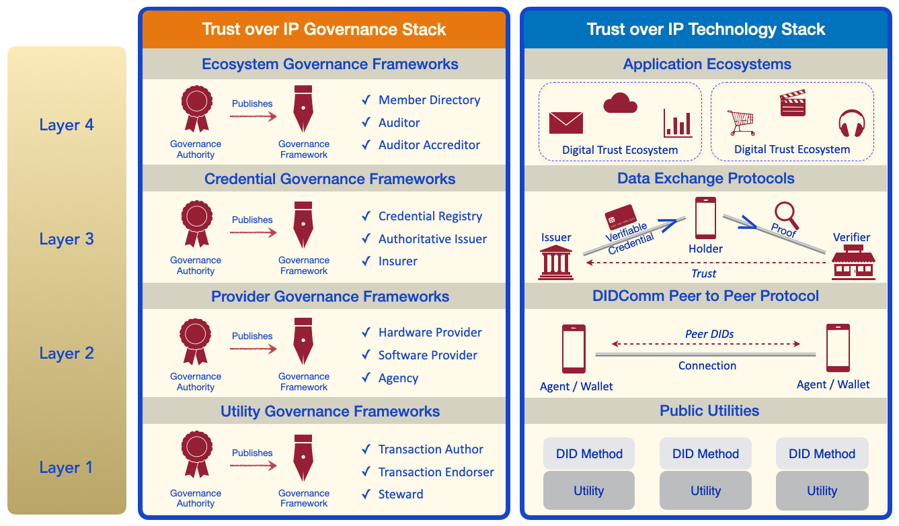
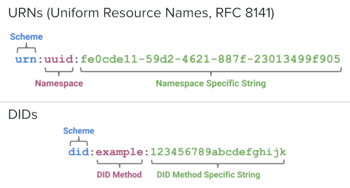
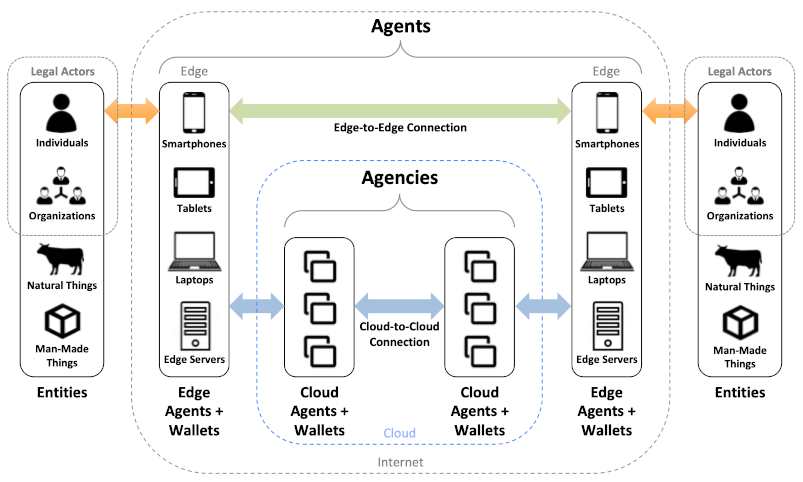
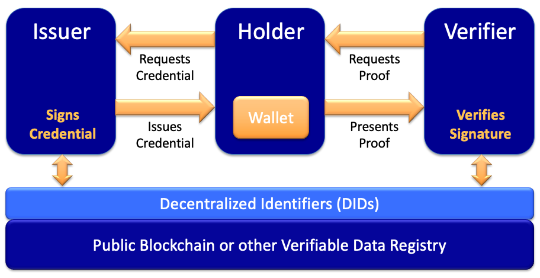
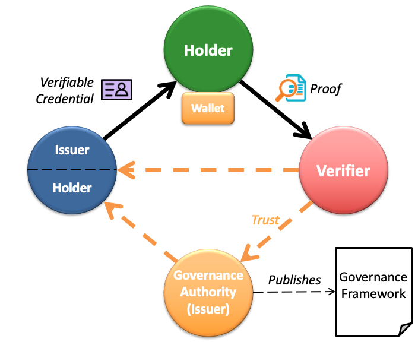

# 0289: The Trust Over IP Stack
- Authors: Matthew Davie, [Dan Gisolfi](dan.gisolfi@gmail.com), [Daniel Hardman](daniel.hardman@evernym.com), [John Jordan](john.jordan@gov.bc.ca), Darrell O'Donnell, [Drummond Reed](drummond.reed@evernym.com), [Oskar van Deventer](oskar.vandeventer@tno.nl)
- Status: [PROPOSED](/README.md#proposed)
- Since: 2019-11-04
- Status Note: Initial Proposal
- Start Date: 2019-01-01
- Tags: concept, stack, trust layer, governance framework

## Summary

This Aries concept RFC introduces a complete architecture for Internet-scale digital trust that integrates cryptographic trust at the machine layer with human trust at the business, legal, and social layers.

## Motivations

The importance of interoperability for the widespread adoption of an information network architecture has been proven by the dramatic rise to dominance of the Internet [1]. A key driver of the Internet's rise to dominance was the open source implementation of the TCP/IP stack in Version 4.2 of Berkeley Software Distrbution (BSD) of UNIX [2].
This widely-adopted open source implementation of the TCP/IP stack offered the capability for any two peer devices to form a connection and exchange data packets regardless of their local network.
In addition, secure protocol suites such as the Secure Sockets Layer (SSL), and its modern version, Transport Layer Security (TLS), have been protecting Internet transactions since 1995.

Without a doubt, implementations of the TCP/IP stack, followed by SSL/TLS, have driven a tremendous amount of innovation over the last 30 years.
However, although protocols such as TLS offer world-class security, the architecture over which they have been built leaves a significant and widely-recognized gap: **a means for any peer to establish trust over these digital connections**. For example, while TLS does allow a user to trust she is accessing the right website, it does not offer, at least in an usable way, a way for the user to _log in_, or prove her identity, to the website. This gap has often been referred to as "the Internet's missing identity layer" [3].

The purpose of this Aries Concept RFC is to fill this gap by defining a standard information network architecture that developers can implement to establish trusted relationships over digital communicatons networks.

## Architectural Layering of the Trust over IP Stack

Since the ultimate purpose of an "identity layer" is not actually to identify entities, but to facilitate the trust they need to interact, co-author John Jordan coined the term *Trust over IP* (ToIP) for this stack. Figure 1 is a diagram of its four layers:

**Figure 1: The ToIP stack**

Note that it is actually a "dual stack": two parallel stacks encompassing both technology and governance. This reflects the fact that digital trust cannot be achieved by technology alone, but only by humans and technology working together.

**Important: The ToIP stack does not define specific governance frameworks.** Rather it is a *metamodel* for how to design and implement digital governance frameworks that can be universally referenced, understood, and consumed in order to facilitate transitive trust online. This approach to defining governance makes it easier for  humans—and the software agents that represent us at Layer Two—to make trust decisions both within and across trust boundaries.

The ToIP Governance Stack plays a special role in ToIP architecture. See the descriptions of the specialized governance frameworks at each layer and also the special section on Scaling Digital Trust.

## Layer One: Public Utilities for Decentralized Identifiers (DIDs)

The ToIP stack is fundamentally made possible by new advancements in cryptography and distributed systems, including blockchains and distributed ledgers. Their high availability and cryptographic verifiability enable strong roots of trust that are decentralized so they will not serve as single points of failure.

### DIDs

Adapting these decentralized systems to be the base layer of the ToIP stack required a new type of globally unique identifier called a Decentralized Identifier (DID). Starting with a research grant from the U.S. Department of Homeland Security Science & Technology division, the DID specification [4] and the DID Primer [5] were contributed to the W3C Credentials Community Group in June 2017. In September 2019 the W3C launched the DID Working Group to complete the job of turning DIDs into a full W3C standard [6].

DIDs are defined by an [RFC 3986](https://www.ietf.org/rfc/rfc3986.txt)-compliant URI scheme designed to provide four core properties:

1. **Permanence**. A DID effectively functions as a Uniform Resource Name (URN) [7], i.e., once assigned to an entity (called the DID subject), a DID is a persistent identifier for that entity that should never be reassigned to another entity.
2. **Resolvability**. A DID resolves to a *DID document*—a data structure (encoded in JSON or other syntaxes) describing the public key(s) and service endpoint(s) necessary to engage in trusted interactions with the DID subject.
3. **Cryptographic verifiability**. The cryptographic material in a DID document that enables a DID subject to prove cryptographic control of a DID.
4. **Decentralization**. Because a DID is cryptographically generated and verified, it does not require a centralized registration authority such as those needed for phone numbers, IP addresses, or domain names today.

Figure 2 shows the resemblance between DID syntax and URN syntax (RFC 8141).

**Figure 2: How DID syntax resembles URN syntax**

### DID Methods

Like the URN specification, the DID specification also defines a generic URI scheme which is in turn used for defining other specific URI schemes. With DIDs, these are called *DID methods*. Each DID method is defined by its own DID method specification that must include:

1. The target system (technically called a *verifiable data registry*) against which the DID method operates. In the ToIP stack this is called a *utility*. Note that a utility is not required to be implemented as a blockchain or distributed ledger. DID methods can be designed to work with any type of distributed database, file system, or other system that can anchor a cryptographic root of trust.
2. The DID method name.
3. The syntax of the DID method-specific string.
4. The CRUD (Create, Read, Update, Delete) operations for DIDs and DID documents that conform to the specification.

DIDs have already proved to be a popular solution to decentralized PKI (public key infrastructure) [8]. Over 40 DID methods have already been registered in the informal DID Method Registry [9] hosted by the W3C Credentials Community Group (which the W3C DID Working Group is planning to incorporate into a formal registry as one of its deliverables). The CCG DID Method Registry currently include methods for:

* Permissionless blockchains such as Bitcoin (three methods), Ethereum (six methods), Veres One, IOTA, RChain, Ontology, etc.
* Permissioned ledgers such as the [Sovrin ledger](https://sovrin.org/).
* Distributed file systems such as IPFS.
* Ledgerless P2P networks such as git, JLINC, and peer DIDs.

### Utility Governance Frameworks

A Layer One public utility may choose any governance model suited to the the constraints of its business model, legal model, and technical architecture. This is true whether the public utility is operated as a blockchain, distributed ledger, or decentralized file store, or whether it is permissioned, permissionless, or any hybrid. (Note that even permissionless blockchain networks still have rules—formal or informal—governing who can update the code.)

All ToIP architecture requires is that the governance model conform to the requirements of the ToIP Governance Stack to support both interoperability and transitive trust. This includes transparent identification of the governance authority, the governance framework, and participant nodes or operators; transparent discovery of nodes and/or service endpoints; and transparent security, privacy, data protection, and other operational policies. See the Governance section below.

Utility governance frameworks that conform to the ToIP Governance Stack model will support standard roles for all types of utility governance authorities. For example, the role currently supported by public-permissioned utilities such as those based on Hyperledger Indy include:

* **Transaction Authors:** initiate transactions
* **Transaction Endorsers:** permission transactions for Transaction Authors
* **Stewards:** operate a node of the ledger

### Layer One Support for Higher Layers

DIDs and DID documents are not the only cryptographic data structures needed to support the higher layers. Others include:

* **Schemas** define the claims (attributes) that can be included in verifiable credentials (Layer Three).
* **Credential definitions** specify the claims and related metadata needed by an issuer of verifiable credentials (Layer Three).
* **Revocation Registries** are [cryptographic accumulators](https://en.wikipedia.org/wiki/Accumulator_(cryptography)) that enable credential issuers to revoke credentials while still protecting the privacy of the credential holder (Layer Three).
* **Agent Authorization Policies** are also cryptographic accumulators that enable credential holders to activate and deactivate agents operating on their behalf at Layer Two. (For more information, see section 5.1 of [DKMS Design and Architecture](http://bit.ly/dkms-v4).)

In summary, the interoperability of Layer One is currently defined by the W3C DID specification and by Aries RFCs for the other cryptographic data structures listed above. Any DID registry that supports all of these data structures can work with any agent, wallet, and secure data store that operates at Layer Two.

## Layer Two: The DIDComm Protocol

The second layer of the Trust over IP stack is defined by the DIDComm secure messaging standards [10]. This family of specifications, which are now being defined in the DIDComm Working Group at the [Decentralized Identity Foundation](https://identity.foundation/), establish a cryptographic means by which any two software agents (peers) can securely communicate either directly edge-to-edge or via intermediate cloud agents as shown in Figure 3).

**Figure 3: At Layer Two, agents communicate peer-to-peer using DIDComm standards**

### Peer DIDs and DID-to-DID Connections

A fundamental feature of DIDComm is that by default all DID-to-DID connections are established and secured using pairwise pseudonymous *peer DIDs* as defined in the [Peer DID Method Specification](https://openssi.github.io/peer-did-method-spec/) [11]. These DIDs are based on key pairs generated and stored by the local cryptographic key management system (KMS, aka "wallet") maintained by each agent. Agents then use the DID Exchange protocol to exchange peer DIDs and DID documents in order to establish and maintain secure private *connections* between each other—including key rotation or revocation as needed during the lifetime of a trusted relationship.

Because all of the components of peer DIDs and DID-to-DID connections are created, stored, and managed at Layer Two, there is no need for them to be registered in a Layer One public utility. In fact there are good privacy and security reasons not to—these components can stay entirely private to the peers. As a general rule, the only ToIP actors who should need public DIDs at Layer One are:

1. **Credential issuers** as explained in Layer Three below.
2. **Governance authorities** at any layer as explained in the section on Scaling Digital Trust.

This also means that, once formed, DID-to-DID connections can be used for any type of secure communications between the peers. Furthermore, these connections are capable of lasting literally *forever*. There are no intermediary service providers of any kind involved. The only reason a DID-to-DID connection needs to broken is if one or both of the peers no longer wants it.

### Agents and Wallets

At Layer Two, every agent is paired with a *digital wallet*—or more accurately a KMS (key management system). This KMS can be anything from a very simple static file on an embedded device to a highly sophisticated enterprise-grade key server. Regardless of the complexity, the job of the KMS is to safeguard sensitive data: key pairs, zero-knowledge proof blinded secrets, verifiable credentials, and any other cryptographic material needed to establish and maintain technical trust.

This job includes the difficult challenge of recovery after a device is lost or stolen or a KMS is hacked or corrupted. This is the province of *decentralized key management*. For more details, see the [Decentralized Key Management System (DKMS) Design and Architecture document](http://bit.ly/dkms-v4) [12], and Dr. Sam Smith's paper on [KERI (Key Event Receipt Infrastructure)](https://arxiv.org/abs/1907.02143) [13].

### Secure Data Stores

Agents may also be paired with a *secure data store*—a database with three special properties:

1. It is controlled exclusively by the DID controller (person, organization, or thing) and not by any intermediary or third party.
2. All the data is encrypted with private keys in the subject’s KMS.
3. If a DID controller has more than one secure data store, the set of stores can be automatically synchronized according to the owner’s preferences.

Work on standardizing secure data stores has been proceeding in several projects in addition to Hyperledger Aries—primarily at the [Decentralized Identity Foundation](http://identity.foundation/) (DIF) and the [W3C Credentials Community Group](https://www.w3.org/community/credentials/). This has culminated in the formation of the [Secure Data Store (SDS) Working Group](https://identity.foundation/working-groups/secure-data-storage.html) at DIF.

### Guardianship and Guardian Agents/Wallets

The ToIP stack cannot become a universal layer for digital trust if it ignores the one-third of the world's population that do not have smartphones or Internet access—or the physical, mental, or economic capacity to use ToIP-enabled infrastructure. This underscores the need for the ToIP layer to robustly support the concept of *digital guardianship*—the combination of a hosted cloud agent/wallet service and an individual or organization willing to take legal responsibility for managing that cloud agent/wallet on behalf of the person under guardianship, called the *dependent*.

For more about all aspects of digital guardianship, see the Sovrin Foundation white paper [On Guardianship in Self-Sovereign Identity](https://sovrin.org/guardianship/) [14].

### Provider Governance Frameworks

At Layer Two, governance is needed primarily to establish  interoperability testing and certification requirements, including security, privacy, data protection, for the following roles:

* **Hardware Developers** who provider ToIP-compliant hardware, e.g., secure enclaves, trusted execution environments, HSMs.
* **Software Developers** who provider ToIP-compliant agents, wallets, secure data stores, etc.
* **Agencies** who host ToIP-compliant cloud agents for individuals, organizations, and guardians.

### Layer Two Support for Higher Layers

The purpose of Layer Two is to enable peers to form secure DID-to-DID connections so they can:

1. Issue, exchange, and verify credentials over these connections using the data exchange protocols at Layer Three.
2. Access the Layer One cryptographic data structures needed to issue and verify Layer Three credentials regardless of the public utility used by the issuer.
3. Migrate and port ToIP data between agents, wallets, and  secure data stores without restriction. This data portability is critical to the broad adoption and interoperability of ToIP.

## Layer Three: Data Exchange Protocols

Layer One and Layer Two together enable the establishment of *cryptographic trust* (also called *technical trust*) between peers. By contrast, the purpose of Layers Three and Four is to establish *human trust* between peers—trust between real-world individuals and organizations and the things with which they interact (devices, sensors, appliances, vehicles, buildings, etc.)

Part of the power of the DIDComm protocol at Layer Two is that it lays the foundation for secure, private agent-to-agent connections that can now "speak" any number of data exchange protocols. From the standpoint of the ToIP stack, the most important of these are protocols that support the exchange of *verifiable credentials*.

### The Verifiable Credentials Data Model

After several years of incubation led by Manu Sporny, David Longley, and other members of the W3C Credentials Community Group, the W3C Verifiable Claims Working Group (VCWG) was formed in 2017 and produced the [Verifiable Credentials Data Model 1.0](https://www.w3.org/TR/vc-data-model/) which became a W3C Recommendation in September 2019 [15].

Figure 4 is a diagram of the three core roles in verifiable credential exchange—often called the "trust triangle". For more information see the [Verifiable Credentials Primer](https://github.com/WebOfTrustInfo/rwot8-barcelona/blob/master/topics-and-advance-readings/verifiable-credentials-primer.md) [16].

**Figure 4: The three primary roles in the W3C Verifiable Credentials Data Model**

The core goal of the Verifiable Credentials standard is to enable us to finally have the digital equivalent of the physical credentials we store in our physical wallets to provide proof of our identity and attributes every day. This is why the presentation of a verifiable credential to a verified is call a *proof*—it is both a cryptographic proof and a proof of some set of attributes or relationships a verifier needs to make a trust decision.

### Credential Proof Types

The Verifiable Credentials Data Model 1.0 supports several different cryptographic proof types:

1. [JSON Web Tokens](https://tools.ietf.org/html/rfc7519) (JWTs) secured using [JSON Web Signatures](https://tools.ietf.org/html/rfc7515).
2. [Linked Data Signatures](https://w3c-dvcg.github.io/ld-signatures/) using JSON-LD.
3. Zero Knowledge Proofs (ZKPs) using [Camenisch-Lysyanskaya Signatures](http://groups.csail.mit.edu/cis/pubs/lysyanskaya/cl02b.pdf).

All three proof types address specific needs in the market:

- JWTs are widely used in the JOSE stack and federated identity infrastructure.
- Linked Data Signatures are used in wide-area data integration and other Semantic Web applications.
- ZKP-based credentials enable credential holders to selectively disclose claims to verifiers without unintentional correlation—a significant advancement in Privacy by Design architecture that simplifies compliance with the EU General Data Protection Regulation (GDPR), the California Consumer Privacy Act (CCPA), and similar data protection regulations.

To support all three of these credential proof types in the ToIP stack means:

* Layer One must support the data structures necessary to issue and verify each proof type.
* Layer Two agents, wallets, and secure data stores must support storage and export of the cryptographic materials needed for each proof type.
* Layer Three must support credential exchange protocols for each proof type.

### Credential Exchange Protocols

At Layer Three, the exchange of verifiable credentials is performed by agents using data exchange protocols layered over the DIDComm protocol. These data exchange protocol specifications are being published as part of the DIDComm suite [10]. Credential exchange protocols are unique to each credential proof type because the request and response formats are different. The goal of the ToIP technology stack is to standardize all supported credential exchange protocols so that any ToIP-compatible agent, wallet, and secure data store can work with any other agent, wallet, and secure data store.

With fully interoperable verifiable credentials, any issuer may issue any set of claims to any holder who can then prove them to any verifier. Every verifier can decide which issuers and which claims it will trust. This is a fully decentralized system that uses the same trust triangle as the physical credentials we carry in our physical wallets today. This simple, universal trust model can be adapted to any set of requirements from any trust community. Even better, in most cases it does not require new  policies or business relationships. Instead the same policies that apply to existing physical credentials can just be applied to a new, more flexible and useful digital format.

### Credential Governance Frameworks

Since Layer Three is where the ToIP stack crosses over from technical trust to human trust, this is the layer where governance frameworks become a critical component for interoperability and scalability of digital trust ecosystems. Credential governance frameworks can be used to specify:

* Credential schema definitions.
* The rules governing who can serve as the authoritative issuers for those credentials.
* The policies those issuers must follow to issue and revoke those credentials.
* Applicable business models, liability frameworks, and insurance models.

Standard roles that credential governance frameworks can define under the ToIP Governance Stack model include:

* **Authoritative Issuers** are issuers authorized by the governance authority to issue specific types of credentials at specific levels of assurance
* **Credential Registries** are alternative holders of credentials to support other uses, such as public searchable directory services.
* **Insurers** provide insurance to issuers operating under the terms of the governance framework.

### Layer Three Support for Higher Layers

Layer Three enables human trust—in the form of verifiable assertions about entities, attributes and relationships—to be layered over the cryptographic trust provided by Layers One and Two. Layer Four is the application ecosystems that request and consume these verifiable credentials in order to support the specific trust models and policies of their own digital trust ecosystem.

## Layer Four: Application Ecosystems

Layer Four is the layer where humans interact with applications in order to engage in trusted interactions that serve a specific business, legal, or social purpose. Just as applications call the TCP/IP stack to communicate over the Internet, applications call the ToIP stack to register DIDs, form connections, obtain and exchange verifiable credentials, and engage in trusted data exchange using the protocols in Layers One, Two, and Three.

The ToIP stack no more  limits the applications that can be built on it than the TCP/IP stack  limits the applications that can be built on the Internet. The ToIP stack simply defines the "tools and rules"—technology and governance—for those applications to interoperate within digital trust ecosystems that provide the security, privacy, and data protection that their members expect. The ToIP stack also enables the consistent user experience of trust decisions across applications and ecosystems that is critical to achieving widespread trust online—just as a consistent user experience of the controls for driving a car (steering wheel, gas pedal, brakes, turn signals) are critical to the safety of drivers throughout the world.

### Ecosystem Governance Frameworks

Layer Four is where humans will directly experience the ToIP Governance Stack—specifically the trust marks and policy promises of ecosystem governance frameworks. These specify the purpose, principes, and policies that apply to all  governance authorities and governance frameworks operating within that ecosystem—at all four levels of the ToIP stack.

The ToIP Governance Stack will define standard roles that can be included in an ecosystem governance framework (EGF) including:

* **Member Directories** the provide both human- and machine-searchable listings of the public DIDs and other searchable attributes of participants in the EGF.
* **Auditors** who can audit participants in a EGF for compliance with the EGF policies.
* **Accreditors** who can accredit auditors when a EGF needs to scale nationally or globally.

To fully understand the scope and power of ecosystem governance frameworks, let us dive deeper into the special role of the ToIP Governance Stack.

## Scaling Digital Trust

The top half of Figure 5 below shows the basic trust triangle architecture used by verifiable credentials. The bottom half shows a second trust triangle—the *governance trust triangle*—that can solve a number of problems related to the real-world adoption and scalability of verifiable credentials and the ToIP stack.

**Figure 5: The special role of governance frameworks**

### Governance Authorities

The governance trust triangle in Figure 5 represents the same governance model that exists for many of the most successful physical credentials we use every day: passports, driving licenses, credit cards, health insurance cards, etc.

These credentials are "backed" by rules and policies that in many cases have taken decades to evolve. These rules and policies have been developed, published, and enforced by many different types of existing governance authorities—private companies, industry consortia, financial networks, and of course governments.

The same model can be applied to verifiable credentials simply by having these same governance authorities—or new ones formed explicitly for ToIP governance—publish *digital* governance frameworks. Any group of issuers who want to standardize, strengthen, and scale the credentials they offer can join together under the auspices of a sponsoring authority to craft a governance framework. No matter the form of the organization—government, consortia, association, cooperative—the purpose is the same: define the business, legal, and technical rules under which the members agree to operate in order to achieve trust.

This of course is exactly how Mastercard and Visa—two of the world’s largest trust networks—have scaled. Any bank or merchant can verify in seconds that another bank or merchant is a member of the network and thus bound by its rules.

With the ToIP stack, this governance architecture can be applied to any set of roles and/or credentials, for any trust community, of any size, in any jurisdiction.

As an historical note, some facets of the ToIP governance stack are inspired by the [Sovrin Governance Framework (SGF)](https://sovrin.org/governance-framework/) [17] developed starting in 2017 by the [Sovrin Foundation](https://www.sovrin.org), the governance authority for the Sovrin public ledger for self-sovereign identity (SSI).

### Defining a Governance Framework

In addition to the overall metamodel, the ToIP governance stack will provide an architectural model for individual governance frameworks at any level. This enables the components of the governance framework to be expressed in a standard, modular format so they can be easily indexed and referenced both internally and externally from other governance frameworks.

Figure 6 shows this basic architectural model:

**Figure 6: Anatomy of a governance framework**

### Discovery and Verification of Authoritative Issuers

Verifiers often need to verify that a credential was issued by an authoritative issuer. The ToIP stack will give governance authorities multiple mechanisms for designating their set of authoritative issuers (these options are non-exclusive—they can each be used independently or in any combination):

1. **DID Documents.** The governance authority can publish the list of their DIDs in a DID document on one or more public utilities of its choice.
2. **Member Directories.** A governance authority can publish a "whitelist" of DIDs via a whitelisting service available at a standard service endpoint published in the governance authority’s own DID document.
3. **Credential registries.** If search and discovery of authoritative issuers is desired, a governance authority can publish verifiable credentials containing both the DID and additional attributes for each authoritative issuer in a credential registry.  Note that in this case the credential registry serves as a *separate, cryptographically-verifiable holder of the credential*—a holder that is not the subject of the credential, but which can independently prove the validity of the credential.
4. **Verifiable credentials.** As shown in Figure 5, the governance authority (or its designated auditors) can issue verifiable credentials to the authoritative issuers, which they in turn can provide directly to verifiers or indirectly via credential holders.

### Discovery and Verification of Authoritative Verifiers

Holders often need to verify that a credential was requested by an authoritative verifier, e.g. as part of a ‘machine readable governance framework’. The ToIP stack will give governance authorities multiple mechanisms for designating their set of authoritative verifiers (these options are non-exclusive—they can be used independently or in any combination):

1. **DID Documents.** The governance authority can publish the list of their DIDs in a DID document on one or more verifiable data registries of its choice.
2. **Member Directories.** A governance authority can publish a "whitelist" of DIDs via a whitelisting service available at a standard service endpoint published in the governance authority’s own DID document.
3. **Credential registries.** If search and discovery of authoritative verifiers is desired, a governance authority can publish verifiable credentials containing both the DID and additional attributes for each authoritative verifiers in a credential registry.  Note that in this case the credential registry serves as a *separate, cryptographically-verifiable holder of the credential*—a holder that is not the subject of the credential, but which can independently prove the validity of the credential.
4. **Verifiable credentials.** Similar to Figure 5, the governance authority (or its designated auditors) can issue verifiable credentials to the authoritative issuers in the governance framework. Those issuers can in turn provide proofs directly to holders or verifiers.

### Countermeasures against coercion

The concept of "self-sovereign" identity presumes that parties are free to enter a transaction, to share personal and confidential information, and to walk away when requests by the other party are deemed unreasonable or even unlawful. In practice, this is often not the case: "What do you give an 800-pound gorilla?", answer: "Anything that it asks for". Examples of such 800-pound gorillas are some big-tech websites, immigration offices and uniformed individuals alleging to represent law-enforcement [20]. Also the typical client-server nature of web transactions reinforces this power imbalance, where the human party behind its client agent feels coerced in surrendering personal data as otherwise they are denied access to a product, service or location. Point in case are the infamous cookie walls, where a visitor of a website get the choice between "accept all cookies or go into the maze-without-exit".

Governance frameworks may be certified to implement one or more potential countermeasures against different types of coercion. In case of a machine readable governance framework, some of such countermeasures may be automatically enforced, safeguarding its user from being coerced into action against their own interest. Different governance frameworks may choose different balances between full self-sovereignty and tight control, depending of the interests that are at play as well as applicable legislation.

The following are examples of potential countermeasures against coercion. The governance framework can stimulate or enforce that some verifiable credentials are only presented when the holder agent determines that some requirements are satisfied. When a requirement is not fulfilled, the user is warned about the violation and the holder agent may refuse presentation of the requested verifiable credential.
1. **Require authoritative verifier.** Verifiers would need to be authorized within the applicable governance framework, see also section “Discovery and Verification of Authoritative Verifiers”.
2. **Require evidence collection.** Requests for presentation of verifiable credentials may hold up as evidence in court, if the electronic signature on the requests is linked to the verifier in a non-repudiable way.
3. **Require enabling anonymous complaints.** The above evidence collection may be compromised if the holder can be uniquely identified from the collected evidence. So a governance framework may require the blinding of holder information, as well as instance-identifiable information about the evidence itself.
4. **Require remote/proxy verification.** Verification has only value to a holder, if it results in a positive decision by the verifier. Hence a holder should preferably only surrender personal data if such warrants a positive decision. It would save travel, if the requested decision is access to a physical facility. It would in any case prevent unnecessary disclosure of personal data. Some verifiers may consider their decision criteria confidential. Hence, different governance frameworks may choose different balances between holder privacy and verifier confidentiality.
5. **Require complying holder agent.** Some rogue holder agents may surrender personal data against the policies of the governance framework associated with that data. Issuers of such data may require verification of compliance of the holder’s agent before issuing.
6. **Require what-you-know authentication.** Holders may be forced to surrender biometric authentication by rogue verifiers as well as some state jurisdictions. This is the reason that many bank apps require “what-you-know” authentication, next to biometric “what-you-are” or device-based “what-you-have” authentication. This may be needed even for when then the user views its own personal data in the app without electronic presentation, as some 800-pound gorillas require watching over the shoulder.

### Interoperability with Other Governance Frameworks

The ToIP governance stack is designed to be compatible with—and an implementation vehicle for—national governance frameworks such as the [Pan-Canadian Trust Framework (PCTF)](https://diacc.ca/pan-canadian-trust-framework/) [18] being developed through a public/private sector collaboration with the [Digital Identity and Authentication Council of Canada (DIACC)](https://diacc.ca/). It should also interoperate with regional and local governance frameworks of all kinds. For example, the Province of British Columbia (BC) has implemented a ToIP-compatible verifiable credential registry service called [OrgBook BC](https://orgbook.gov.bc.ca). OrgBook is a holder service for legally registered entities in BC that was built using [Indy Catalyst](https://www.github.com/bcgov/indy-catalyst) and [Hyperledger Aries Cloud Agent - Python](https://github.com/hyperledger/aries-cloudagent-python). Other provinces such as Ontario and Alberta as well as the Canadian federal government have begun to experiment with these services for business credentials, giving rise to new kind of network where trust is at the edge. For more information see the [VON (Verifiable Organization Network)](https://vonx.io/) [19].

## Building a World of Interoperable Digital Trust Ecosystems

The Internet is a network of networks, where the interconnections between each network are facilitated through the TCP/IP stack. The ToIP-enable Internet is a *digital trust ecosystem of digital trust ecosystems*, where the interconnections between each digital trust ecosystem are facilitated through the ToIP stack. The boundaries of each digital trust ecosystem are determined by the governance framework(s) under which its members are operating.

This allows the ToIP-enabled Internet to reflect the same diversity and richness the Internet has today, but with a new ability to form and maintain trust relationships of any kind—personal, business, social, academic, political—at any distance. These trust relationships can cross trust boundaries as easily as IP packets can cross network boundaries today.

## Conclusion: A Trust Layer for the Internet

The purpose of the ToIP stack is to define a strong, decentralized, privacy-respecting trust layer for the Internet. It leverages blockchain technology and other new developments in cryptography, decentralized systems, cloud computing, mobile computing, and digital governance to solve longstanding problems in establishing and maintaining digital trust.

This RFC will be updated to track the evolution of the ToIP stack as it is further developed, both through Hyperledger Aries and via other projects at the Linux Foundation. We welcome comments and contributions.

## References

1. Petros Kavassalis, Richard Jay Solomon, Pierre-Jean Benghozi, [The Internet: a Paradigmatic Rupture in Cumulative Telecom Evolution, Industrial and Corporate Change](https://pdfs.semanticscholar.org/17ae/045d49211a765c782f7643ce58dcd43c835e.pdf), 1996; accessed September 5 2019.
2. FreeBSD, [What, a real UNIX®?](https://www.freebsd.org/doc/en_US.ISO8859-1/articles/explaining-bsd/what-a-real-unix.html), accessed September 5, 2019.
3. Kim Cameron, [The Laws of Identity](https://www.identityblog.com/?p=352), May 2005; accessed November 2, 2019.
4. Drummond Reed, Manu Sporny, Markus Sabadello, David Longley, Christopher Allen, Ryan Grant, [Decentralized Identifiers (DIDs) v1.0](https://www.w3.org/TR/did-core/), December 2019; accessed January 24, 2020.
5. W3C Credentials Community Group, [DID Primer](https://w3c-ccg.github.io/did-primer/), January 2019; accessed July 6, 2019.
6. W3C DID Working Group, [Home Page](https://www.w3.org/2019/did-wg/), September 2019; accessed November 2, 2019.
7. Uniform Resource Names (URNs), [RFC 8141](https://tools.ietf.org/html/rfc8141), April 2017; accessed November 2, 2019.
8. Greg Slepak, Christopher Allen, et al, [Decentralized Public Key Infrastructure](https://github.com/WebOfTrustInfo/rwot1-sf/blob/master/draft-documents/Decentralized-Public-Key-Infrastructure-CURRENT.md), December 2015, accessed January 24, 2020.
9. W3C Credentials Community Group, [DID Method Registry](https://w3c-ccg.github.io/did-method-registry/), June 2019; accessed July 6, 2019.
10. Daniel Hardman, [DID Communication](https://github.com/hyperledger/aries-rfcs/blob/master/concepts/0005-didcomm/README.md), January 2019; accessed July 6, 2019.
11. Daniel Hardman et al, [Peer DID Method 1.0 Specification](https://openssi.github.io/peer-did-method-spec/), July 2019; accessed July 6, 2019.
12. Drummond Reed, Jason Law, Daniel Hardman, Mike Lodder, [DKMS Design and Architecture V4](http://bit.ly/dkms-v4), March 2019; accessed November 2, 2019.
13. Samuel M. Smith, [Key Event Receipt Infrastructure (KERI)](https://arxiv.org/abs/1907.02143) , July 2019, accessed February 4, 2020.
14. Sovrin Governance Framework Working Group, [On Guardianship in Self-Sovereign Identity](https://sovrin.org/guardianship/), December 2019, accessed April 10, 2020.
15. Manu Sporny, Grant Noble, Dave Longley, Daniel C. Burnett, Brent Zundel, [Verifiable Credentials Data Model 1.0](https://www.w3.org/TR/vc-data-model/), September 2019; accessed November 2, 2019.
16. Manu Sporny, [Verifiable Credentials Primer](https://github.com/WebOfTrustInfo/rwot8-barcelona/blob/master/topics-and-advance-readings/verifiable-credentials-primer.md), February 2019; accessed July 6, 2019.
17. Sovrin Foundation, [Sovrin Governance Framework V2](https://sovrin.org/governance-framework/), March 2019; accessed December 21, 2019.
18. DIACC, [Pan-Canadian Trust Framework](https://diacc.ca/pan-canadian-trust-framework/), May 2019; accessed July 6, 2019.
19. Governments of British Columbia, Ontario, and Canada, [Verifiable Organizations Network (VON)](https://vonx.io/),June 2019; accessed July 6, 2019.
20. Oskar van Deventer et al, TNO, Netherlands, [Self-Sovereign Identity - The Good, The Bad And The Ugly]( https://blockchain.tno.nl/blog/self-sovereign-identity-the-good-the-bad-and-the-ugly/),May 2019.

## Implementations

The following lists the implementations (if any) of this RFC. Please do a pull request to add your implementation. If the implementation is open source, include a link to the repo or to the implementation within the repo. Please be consistent in the "Name" field so that a mechanical processing of the RFCs can generate a list of all RFCs supported by an Aries implementation.

*Implementation Notes* [may need to include a link to test results](/README.md#accepted).

Name / Link | Implementation Notes
--- | ---
 |
