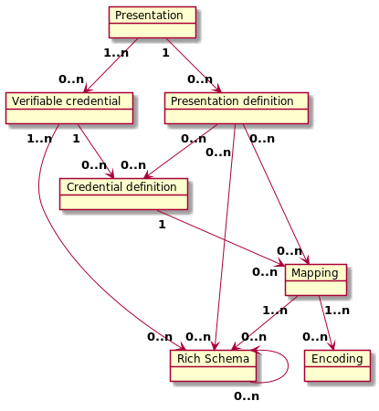

# 0420: Rich Schema Objects Common
- Author: [Alexander Shcherbakov](alexander.shcherbakov@evernym.com), [Brent Zundel](brent.zundel@evernym.com)
- Status: [PROPOSED](/README.md#proposed)
- Since: 2020-02-13
- Status Note: Part of proposed Rich Schema capabilities for credentials 
- Start Date: 2020-02-05
- Tags: [concept](/tags.md#concept), [rich-schemas](/tags.md#rich-schemas)


## Summary

A low-level description of the components of an anonymous credential ecosystem that supports rich schemas,
W3C Verifiable Credentials and Presentations, and correspondingly rich presentation requests. 

Please see [0250: Rich Schema Objects](https://github.com/hyperledger/aries-rfcs/tree/master/concepts/0250-rich-schemas) 
for high-level description.

This RFC provides more low-level description of Rich Schema objects defining how they are identified and referenced.
It also defines a general template and common part for all Rich Schema objects. 

## Motivation

Please see [0250: Rich Schema Objects](https://github.com/hyperledger/aries-rfcs/tree/master/concepts/0250-rich-schemas)
for use cases and high-level description of why Rich Schemas are needed.

This RFC serves as a low-level design of common parts between all Rich Schema objects, and can help developers to 
properly implement Rich Schema transactions on the Ledger and the corresponding client API. 

## Tutorial: General Principles

By Rich Schema objects we mean all objects related to Rich Schema concept
(Context, Rich Schema, Encoding, Mapping, Credential Definition, Presentation Definition)

Let's discuss a number of items common for all Rich Schema objects

### Immutability of Rich Schema Objects

The following Rich Schema objects are immutable:
- Context
- Rich Schema
- Encoding
- Mapping

The following Rich Schema objects can be mutable:
- Credential Definition
- Presentation Definition

Credential Definition is considered as a mutable object as the Issuer may rotate
keys present there.
However, rotation of Issuer's keys should be done carefully as it will invalidate all
credentials issued for this key.

Presentation Definition is considered as a mutable object since restrictions to Issuers, Schemas and 
Credential Definitions to be used in proof may evolve. 
For example, Issuer's key for a given Credential Definition may be compromised, so 
Presentation Definition can be updated to exclude this Credential Definition from the list
of recommended ones. 

Please note, that some ledgers (Indy Ledger for example) have configurable auth rules which allow to have restrictions on mutability of particular objects, so that
it can be up to applications and network administrators to decide if Credential Definition and Presentation Definition 
are mutable. 

### Identification of Rich Schema Objects

- Every Rich Schema object is identified by a unique ID
- DID can be used as the ID.
    - The id-string of the DID is the base58 representation of the SHA2-256 hash of the canonical form
 of the `content` field (see [How Rich Schema objects are stored in the Data Registry](#how-rich-schema-objects-are-stored-in-the-data-registry).
 The canonicalization scheme we recommend is the IETF draft 
 [JSON Canonicalization Scheme (JCS).](https://tools.ietf.org/id/draft-rundgren-json-canonicalization-scheme-16.html) 
- There is additional metadata (aliases) that can identify Rich Schema objects on the ledger 
in a more user-friendly way.
   - rs_name 
   - rs_version
   - rs_type 
- Issuer's or Endorser's DID is not part of metadata, which means that Rich Schema objects of a given type
must be unique among all Issuers and Endorsers.      

The suggested Identification scheme allows to have a unique Identifier for any Rich Schema object. 
DID's method name (for example `did:sov`) allows to identify Rich Schema objects with equal content within different 
data registries (ledgers).   

### Referencing Rich Schema Objects
- Any Rich Schema object is referenced by other Rich Schema objects by its ID (DID).
- A Rich Schema object may reference a Rich Schema object from another ledger (as defined by DID's method name).

### Relationship
- A credential definition refers to a single mapping object
- A mapping object refers to 1 or more schema objects.
Each attribute in a schema may be included in the mapping one or more times (it is possible to encode a single attribute 
in multiple ways). A mapping may map only a subset of the attributes of a schema.
- A presentation definition refers to 1 or more schema and credential definition objects. A presentation definition may use only a
subset of the attributes of a schema.  



### How Rich Schema objects are stored in the Data Registry

Any write request for Rich Schema object has the same fields:
```
'id': <Rich Schema object's ID>                # DID string 
'content': <Rich Schema object as JSON-LD>     # JSON-serialized string
'rs_name': <rich schema object name>           # string
'rs_version': <rich schema object version>     # string
'rs_type': <rich schema object type>           # integer
'ver': <format version>                        # integer                              
```
- `id` is a unique ID (for example a DID with a id-string being base58 representation of the SHA2-256 hash of the `content` field)
- The `content` field here contains a Rich Schema object in JSON-LD format (see [0250: Rich Schema Objects](https://github.com/hyperledger/aries-rfcs/tree/master/concepts/0250-rich-schemas)).
It's passed and stored as-is.
The `content` field must be serialized in the canonical form. The canonicalization scheme we recommend is the IETF draft 
 [JSON Canonicalization Scheme (JCS).](https://tools.ietf.org/id/draft-rundgren-json-canonicalization-scheme-16.html)
- `metadata` contains additional fields which can be used for human-readable identification    
- `ver` defines the version of the format. It defines what fields and metadata are there, how `id` is generated, what hash function is used there, etc. 
- Author's and Endorser's DIDs are also passed as a common metadata fields for any Request. 


### Querying Rich Schema objects from the Data Registry
- Any Rich Schema object can be get from a Data Registry (Ledger) by its ID (DID).
- It should be possible to get Rich Schema objects by metadata as well: `(rs_name, rs_version, rs_type)`.
- Currently it's supposed that every Rich Schema object is queried individually, so it's up to clients and applications
to get, query and cache all dependent Rich Schema objects.
- We may support resolving a Rich Schema object by a DID as a DID DOC object once
aries-vdr interface for DID resolving is defined and DID DOC specification is finalized.

The following information is returned from the Ledger in a reply for any get request of a Rich Schema object:
```
'id': <Rich Schema object's ID>              # DID string 
'content': <Rich Schema object as JSON-LD>   # JSON-serialized string
'rs_name': <rich schema object name>         # string
'rs_version': <rich schema object version>   # string
'rs_type': <rich schema object type>         # integer
'ver': <format version>                      # integer
'from': <author DID>,                        # DID string
'endorser': <endorser DID>,                  # DID string
```

Common fields specific to a Ledger are also returned. 


### Aries Data Registry Interface

We can have a unified API to write and read Rich Schema objects from a Data Registry.
Just two methods are sufficient to handle all Rich Schema types:
- `write_rich_schema_object`
- `read_rich_schema_object_request`


##### write_rich_schema_object
```
Writes a Rich Schema object to the ledger.

#Params
submitter: information about submitter
data: {
    id: Rich Schema object's ID (as a DID for example),
    content: Rich Schema object as JSON-LD string,
    rs_name: Rich Schema object name
    rs_version: Rich Schema object version
    rs_type: Rich schema object type
    ver: the version of the generic object template
},
registry: identifier for the registry

#Returns
registry_response: result as json,
error: {
    code: aries common error code,
    description:  aries common error description
}
```

##### read_rich_schema_object
```
Reads a Rich Schema object from the ledger.

#Params
submitter (optional): information about submitter
data: {
    id: Rich Schema object's ID (as a DID for example),
    ver: the version of the generic object template
},
registry: identifier for the registry

#Returns
registry_response: result as json,
error: {
    code: aries common error code,
    description:  aries common error description
}
```

## Reference
- [0250: Rich Schema Objects](https://github.com/hyperledger/aries-rfcs/tree/master/concepts/0250-rich-schemas)
- [0249: Aries Rich Schema Contexts](https://github.com/hyperledger/aries-rfcs/tree/master/features/0249-rich-schema-contexts) 
- [0281: Aries Rich Schemas](https://github.com/hyperledger/aries-rfcs/tree/master/features/0281-rich-schemas)

## Drawbacks

Rich schema objects introduce more complexity.

## Rationale and alternatives

#### Rich Schema object ID
The following options on how a Rich Schema object can be identified exist:
- DID unique for each Rich Schema
- DID URL with the origin (issuer's) DID as a base
- DID URL with a unique (not issuer-related) DID as a base
- UUID or other unique ID

UUID doesn't provide global resolvability. We can not say what ledger the Rich Schema object belongs to 
by looking at the UUID.

DID and DID URL give persistence, global resolvability and decentralization.
We can resolve the DID and understand what ledger the Rich Schema object belongs to.
Also we can see that the object with the same id-string on different ledger is the same object (if id-string is calculated
against a canonicalized hash of the content).  

However, Rich Schema's DIDs don't have cryptographic verifiability property of common DIDs,
so this is a DID not associated with keys in general case.
This DID belongs neither to person nor organization nor thing.

Using Issuer's DID (origin DID) as a base for DID URL may be too Indy-specific as other ledgers may not have
an Issuer DID. Also it links a Rich Schema object to the Issuer belonging to a particular ledger. 

So, we are proposing to use a unique DID for each Rich Schema object as it gives more natural way to identify 
an entity in the distributed ledger world.  


#### Rich Schema object as DID DOC
If Rich Schema objects are identified by a unique DID, then a natural question is whether each Rich Schema object 
needs to be presented as a DID DOC and resolved by a DID in a generic way.

We are not requiring to define Rich Schema objects as DID DOCs for now. We may re-consider this in future once DID DOC format
is finalized.

## Unresolved questions
- We are not defining Rich Schema objects as DID DOCs for now. We may re-consider this in future 
once aries-vdr interface for DID resolving is defined and DID DOC specification is finalized.
- Whether we should extend DID to be a standard for Rich Schema object IDs.
- Whether the proposed way to make a Canonicalization form of a content to be used for DID's id-string generation is good enough. 

## Implementations

The following lists the implementations (if any) of this RFC. Please do a
pull request to add your implementation. If the implementation is open
source, include a link to the repo or to the implementation within the
repo. Please be consistent in the "Name" field so that a mechanical
processing of the RFCs can generate a list of all RFCs supported by an
Aries implementation.

Name / Link | Implementation Notes
--- | ---
 |  | 