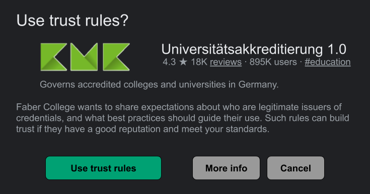
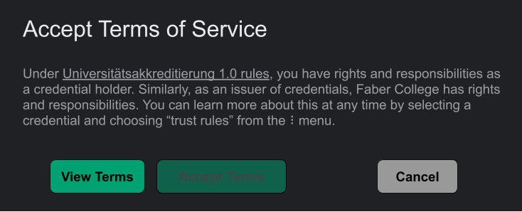
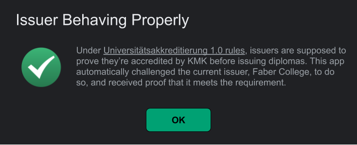
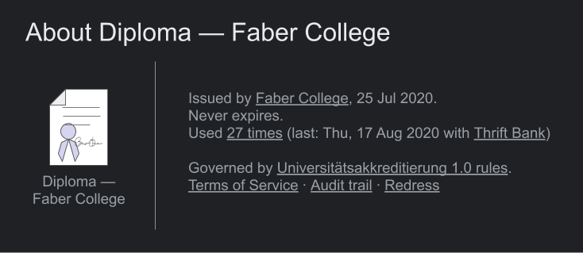
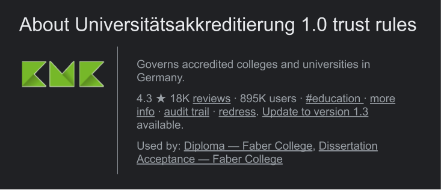
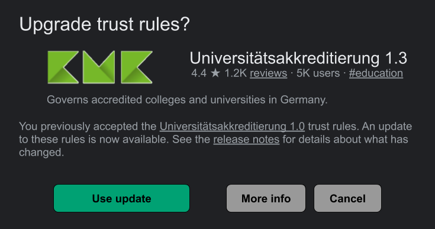

# Aries RFC 0430: Machine-Readable Governance Frameworks
- Authors: [Daniel Hardman](daniel.hardman@gmail.com)
- Status: [PROPOSED](/README.md#proposed)
- Since: 2020-02-24
- Status Note: early proposal only  
- Start Date: 2020-02-24
- Tags: [concept](/tags.md#concept)

## Summary

Explains how governance frameworks are embodied in formal data structures, so it's possible to react to them with software, not just with human intelligence.

## Motivation

We need to be able to write software that reacts to arbitrary governance frameworks in standard ways. This will allow [various desirable features](#desirable-features).


## Tutorial

A __governance framework__ (also called a __trust framework__ in some contexts) is a set of rules that establish trust about process (and indirectly, about outcomes) in a given context. For example, the rules that bind buyers, merchants, vendors, and a global credit card company like Mastercard or Visa constitute a governance framework in a financial services context &mdash; and they have a corresponding trust mark to make the governance framework's relevance explicit. The rules by which certificate authorities are vetted and accepted by browser manufacturers, and by which CAs issue derivative certificates, constitute a governance framework in a web context. Trust frameworks are like guy wires: they balance opposing forces to produce careful alignment and optimal behavior.

[](https://www.flickr.com/photos/popcorncx/31899289874/)

Decentralized identity doesn't eliminate all forms of centralized authority, but its opt-in collaboration, openness, and peer orientation makes the need for trust rules particularly compelling. Somehow, a community needs to agree on answers to questions like these:

#### Sample Questions Answered in a Trust Framework

* Which institutions should be trusted to attest key facts such as an individual's citizenship, graduation from college, HIV status, membership in an ethnic group, credit worthiness, etc?
* How do rules about consent, privacy, and repudiation influence the flow of data?
* Who can hold which parties accountable, and how, and when?
* What levels of assurance are required for certain privileges?
* How auditable must various activities be?
* How do incentives and reputation work?
* What terms of service are standard, odd-but-reasonable, or prohibited?

Many industry groups are exploring these questions, and are building careful documentation of the answers they produce. It is not the purpose of this RFC to duplicate or guide such work. Rather, it's our goal to answer a secondary question:

#### The Question Tackled By This RFC

>How can answers to these questions be represented so they are consumable as artifacts of software policy? 

When we have good answers to this question, we can address feature requests like the following:

#### Desirable Features

* All the software used at a refugee camp &mdash; whether built by the United Nations, by an NGO like Doctors Without Borders, by startups providing identity wallets to individuals, or by military personnel &mdash; has a shared understanding about standards of proof, consent, enforcement, appeal, and privacy.
* Rules in an ecosystem can be versioned and updated formally, and parties who interact can know unambiguously whether their expectations align. If there is a misalignment, it is easy to identify the particulars.
* A user of an SSI-centric mobile app can be prompted about whether they'd like to accept as proof credentials issued under the rules of governance framework X (e.g., the governance framework for accredited institutions of higher education in Germany) &mdash; allowing them to accept or reject entire categories of proof without having to track the DIDs and business practices of every individual issuer they might encounter.

#### Sample Data Structure

Trust frameworks generally begin as human-friendly content. They have to be created, reviewed, and agreed upon by experts from various disciplines: legal, business, humanitarian, government, trade groups, advocacy groups, etc. Developers can help by surfacing how rules are (or are not) susceptible to modeling in formal data structures. This can lead to an iterative process, where data structures and human conversations create refinement pressure on each other until the framework is ready for release.

Each problem domain will probably have unique requirements. Therefore, we start with a general governance framework recipe, but plan for extension. We use JSON-LD for this purpose. Here we present a simple example for the problem domain of university credentials in Germany. It manifests just the components of a governance framework that are common across all contexts; additional JSON-LD `@context` values can be added to introduce more structure as needed. (See [Field Details](#field-details) for explanatory comments.)

```jsonc
{
    "@context": [
        // The first context must be this RFC's context. It defines core properties.
        "https://github.com/hyperledger/aries-rfcs/blob/master/0430-machine-readable-governance-frameworks/context.jsonld", 
        // Additional contexts can be added to extend.
        "https://kmk.org/uni-accred-trust-fw"
    ],
    "name": "Universitätsakkreditierung"
    "version": "1.0",
    "logo": "http://kmk.org/uni-accred-trust-fw/logo.png",
    "description": "Governs accredited colleges and universities in Germany.",
    "docs_uri": "http://https://kmk.org/uni-accred-trust-fw/v1",
    "data_uri": "http://https://kmk.org/uni-accred-trust-fw/v1/tf.json",
    // In which problem domains is this governance framework relevant?
    // Think of these like hash tags; they constitute a loose,
    // overlapping topic cloud rather than a normative taxonomy;
    // the purpose is to facilitate search.
    "topics": ["education"],
    // In which legal jurisdictions is this governance framework relevant?
    // Values here should use ISO 639-2 or 3 language code, possibly
    // narrowed to a standard province and even county/city using > as
    // the narrowing character, plus standard abbreviations where
    // useful: us>tx>houston for "Houston, Texas, USA" or ca>qc for
    // the province of Quebec in Canada.
    "jurisdictions": ["de", "eu"],
    // In which geographies is this governance framework relevant? May be
    // redundant with jurisdictions in many cases.
    "geos": ["Deutschland"],
    // Name all the roles that are significant to understanding
    // interactions in this governance framework. These map to X in rules
    // like "X can do Y if Z."
    "roles": ["accreditor", "school", "graduate", "anyone"],
    // Name all the privileges that are significant to understanding
    // interactions in this governance framework. These map to Y in rules
    // like "X can do Y if Z." Each privilege is defined for humans
    // at the specified URI, so a person can understand what it
    // entails.
    "privileges": [
        {"name": "accredit", "uri": "http://kmk.org/tf/accredit"},
        {"name": "issue-edu", "uri": "http://kmk.org/tf/issue-edu"},
        {"name": "hold-edu", "uri": "http://kmk.org/tf/hold-edu"},
        {"name": "request-proof", "uri", "http://kmk.org/tf/request-proof"
    ],
    // Name all the duties that are significant to understanding
    // interactions in this governance framework. Each duty is defined for humans
    // at the specified URI, so a person can understand what it
    // entails.
    "duties": [
        {"name": "safe-accredit", "uri": "http://kmk.org/tf/responsible-accredit"},
        {"name": "GDPR-dat-control", "uri": "http://europa.eu/gdpr/trust-fw/gdpr-data-controller"}
        {"name": "GDPR-edu-verif", "uri": "http://kmk.org/tf/gdpr-verif"}
        {"name": "accept-kmk-tos", "uri": "http://kmk.org/tf/tos"}
    ],
    // Use DIDs to define key participants in the ecosystem. KMK is
    // the accreditation authority for higher education in Germany.
    // Here we show it using two different DIDs.
    "define": [
        {"name": "KMK": "id": "did:example:abc123"},
        {"name": "KMK": "id": "did:anotherexample:def456"},
    ], 
    // Describe role-based rules of behavior like "X can do Y if Z,"
    // where Z is a criterion following "when".
    "rules": [
        {"grant": ["accredit"], "when": {"name": "KMK"},
            "duties": ["safe-accredit"]},
        {"grant": ["issue-edu"], "when": {
                // Proof request (see RFC 0037) specifying that
                // institution is accredited by KMK.
            },
            // Any party who fulfills these criteria is considered
            // to have the "school" role.
            "thus": ["school"],
            // And is considered to have the "GDPR-dat-control" duty.
            "duties": ["GDPR-dat-control", "accept-kmk-tos"]
        },
        {"grant": "hold-edu", "when": {
                // Proof request specifying that holder is a human.
                // The presence of this item in the TF means that
                // conforming issuers are supposed to verify
                // humanness before issuing. Issuers can impose
                // additional criteria; this is just the base
                // requirement.
            },
            // Any party who fulfills these criteria is considered
            // to qualify for the "graduate" role.
            "thus": "graduate",
            "duties": ["accept-kmk-tos"]
        },
        // In this governance framework, anyone can request proof based
        // on credentials. No criteria are tested to map an entity
        // to the "anyone" role.
        {
            "grant": "request-proof", "thus": "anyone",
            "duties": ["GDPR-edu-verif", "accept-kmk-tos"]
        },
        // Is there an authority that audits interactions?
        "audit": {
            // Where should reports be submitted via http POST?
            "uri": "http://kmk.org/audit",
            // How likely is it that a given interaction needs to
            // be audited? Each party in the interaction picks a
            // random number between 0 and 1, inclusive; if the number
            // is <= this number, then that party submits a report about it.
            "probability": "0.01"
        },
        // Is there an authority to whom requests for redress can
        // be made, if one party feels like another violates
        // the governance framework? 
        "redress": {
            "uri": "http://kmk.org/redress"
        }
    }    
}
```

#### Using the Sample

Let's look at how the above structure can be used to influence behavior of verifiable credential management software, and the parties that use it.

We begin by noticing that KMK (KultusMinisterKonferenz), the accrediting body for universities in Germany, has a privileged role in this governance framework. It is given the right to operate as "KMK" as long as it proves control of one of the two DIDs named in the `define` array. 

We posit an issuer, Faber College, that wants to issue credentials compliant with this governance framework. This means that Faber College wants the `issue-edu` privilege defined at http://kmk.org/tf/issue-edu (see the second item in the `privileges` array). It wants to create credentials that contain the following field: `"trust_framework": "http://https://kmk.org/uni-accred-trust-fw/v1/tf.json"` (see the `data_uri` field). It wants to have a credential from KMK proving its accreditation (see second item in the `rules` array).

Faber is required by this governance framework to accept the terms of service published at http://kmk.org/tf/tos, because it can't get the `issue-edu` privilege without incurring that duty (see the `accept-kmk-tos` duty in the second item in the `rules` array). KMK by implication incurs the obligation to enforce these terms of service when it issues a credential attesting Faber's accreditation and compliance with the governance framework.

Assuming that Faber proceeds and satisfies KMK, Faber is now considered a `school` as far as this governance framework is concerned.

Now, let us suppose that Alice, a student at Faber, wants to get a diploma as a verifiable credential. In addition to whatever else Faber does before it gives Alice a diploma, Faber is obligated by the governance framework to challenge Alice to prove she's a human being (see `when` in the third item of the `rules` array). Hopefully this is easy, and was done long before graduation. :-) It is also obligated to introduce Alice to the terms of service for KMK, since Alice will be acquiring the `graduate` role and this rule has the `accept-kmk-tos` duty. How Faber does this is something that might be clarified in the terms of service that Faber already accepted; we'll narrate one possible approach.

Alice is holding a mobile app that manages credentials for her. She clicks an invitation to receive a credential in some way. What she sees next on her screen might look something like this:



Her app knew to display this message because the issuer, Faber College, communicated its reliance on this governance framework (by referencing its `data_uri`) as part of an early step in the issuance process (e.g., in the invitation or in the [`offer-credential` message](../../features/0036-issue-credential/README.md#propose-credential)). Notice how metadata from the governance framework &mdash; its title, version, topics, and descriptions &mdash; show up in the prompt. Notice as well that governance frameworks have reputations. This helps users determine whether the rules are legitimate and worth using. The "More Info" tab would link to the governance framework's `docs_uri` page.

Alice doesn't have to re-accept the governance framework if she's already using it (e.g., if she already activated it in her mobile app because she's it's relevant to other credentials she holds). As a person works regularly within a particular credential domain, decisions like these will become cached and seamless. However, we're showing the step here, for completeness.

Suppose that Alice accepts the proposed rules. The governance framework requires that she also accept the KMK terms of service. These might require her to report any errors in her credential promptly, and clarify that she has the right to appeal under certain conditions (see the `redress` section of the governance framework data structure). They might also discuss the KMK governance framework's requirement for random auditing (see the `audit` section).

A natural way to introduce Alice to these topics might be to combine them with a normal "Accept terms of service" screen for Faber itself. Many issuers are likely to ask holders to agree to how they want to manage revocation, privacy, and GDPR compliance; including information about terms that Faber inherited from the governance framework would be an easy addition.

Suppose, therefore, that Alice is next shown a "Terms of Service" screen like the following.



Note the hyperlink back to the governance framework; if Alice already accepted the governance framework in another context, this helps her know what governance framework is in effect for a given credential.

After Alice accepts the terms, she now proceeds with the issuance workflow. For the most part, she can forget about the governance framework attached to her credential &mdash; but the software doesn't. Some of the screens it might show her, because of information that it reads in the governance framework, include things like:



Or, alternatively:
 


In either case, proof of the issuer's qualifications was requested automatically, using canned criteria (see the second item in the governance framework's `rules` array).

Trust framework knowledge can also be woven into other parts of a UI, as for example:



And:



And:



The point here is not the specifics in the UI we're positing. Different UX designers may may different choices. Rather, it's that by publishing a carefully versioned, machine-readable governance framework, such UIs become possible. The user's experience becomes less about individual circumstances, and more about general patterns that have known reputations, dependable safeguards, and so forth.

#### Versioning

Trust framework data structures follow [semver rules](https://semver.org):

* A major change is one that breaks the trust status of another party as a result of the change. Examples include:

    * Altering the internal structure of the JSON in a breaking way, such that software can no longer process the structure. (Software is required to ignore fields in this structure that it doesn't understand, so simply adding things won't do this.)
    * Disallowing a formerly defined field.
    * Making a field required that used to be optional.
    * Removing a defined role or privilege, such that relationships built under an old version of the framework are no longer explainable in an updated version.
    * Changing how privileges are granted, in such a way that a party who had privileges before would lose them across the update.
    * Substantive changes to terms of service.

* A minor change adds precision or options to an existing governance framework, without invalidating trust built with proximate, preceding versions. For example:

    * Adding new roles or privileges.
    * Changing URIs or minor details of auditing, redress, or terms of service.
    * Changing privilege grants such that existing parties with existing privileges get new privileges as well.
    
* Patch versions of governance frameworks are supported but generally not displayed. They should be safe to accept automatically. They include things like:

    * Adding new topics (hash tags).
    * Tweaking descriptions.
    
#### Localization

Trust frameworks can offer localized alternatives of text using the same mechanism described in [RFC 0043: l10n](../../features/0043-l10n/README.md); treat the governance framework JSON as a DIDComm message and use decorators as it describes.
 
## Reference

We've tried to make the sample JSON above self-describing. All fields are optional except the governance framework's `name`, `version`, `data_uri`, and at least one `define` or `rules` item to confer some trust.

### Field Details 

#### `name`
A short descriptive string that explains the governance framework's purpose and focus. Extends http://schema.org/name.

#### `version`
A semver-formatted value. Typically only major and minor segments are used, but patch should also be supported if present. Extends http://schema.org/version with the major/minor semantics discussed under [Versioning](#versioning) above.

#### `logo`
A URI that references something visually identifying for this framework, suitable for display to a user. Extends http://schema.org/logo.

#### `description`
Longer explanatory comment about the purpose and scope of the framework. Extends http://schema.org/description.

#### `docs_uri`
Where is this governance framework officially published in human-readable form? A human should be able to browse here to learn more. Extends http://schema.org/url.

#### `data_uri`
Where is this governance framework officially published as a machine-readable data structure? A computer should be able to GET this JSON (MIME type = application/json) at the specified URI.

#### `topics`
In which problem domains is this governance framework relevant? Think of these like hash tags; they constitute a loose, overlapping topic cloud rather than a normative taxonomy; the purpose is to facilitate search.

#### `geos`
In which geographies is this governance framework relevant? May be redundant with jurisdictions in many cases.
    
#### `jurisdictions`
In which legal jurisdictions is this governance framework relevant?
Values here should use ISO 639-2 or 3 language code, possibly
narrowed to a standard province and even county/city using `>` as
the narrowing character, plus standard abbreviations where
useful: `us>tx>houston` for "Houston, Texas, USA" or `ca>qc` for
the province of Quebec in Canada.

#### `roles`
Names all the roles that are significant to understanding interactions in this governance framework. These map to X in rules like "X can do Y if Z."

#### `privileges`
Names all the privileges that are significant to understanding
interactions in this governance framework. These map to Y in rules
like "X can do Y if Z." Each privilege is defined for humans
at the specified URI, so a person can understand what it
entails.

#### `duties`
Name all the duties that are significant to understanding interactions in this governance framework. Each duty is defined for humans at the specified URI, so a person can understand what it entails.

#### `define`
Uses an array of `{"name":x, "id": did value}` objects to define key participants in the ecosystem.

#### `rules`
Uses [SGL](https://pypi.org/project/sgl/) syntax to describe role-based rules of behavior like "X can do Y if Z," where Z is a criterion following "when". 


[Another sample governance framework](../0103-indirect-identity-control/guardianship-sample/trust-framework.md) (including the human documentation that would accompany the data structure) is [presented as part of the discussion of guardianship in RFC 0103](../0103-indirect-identity-control/README.md).

## Drawbacks

#### Timing?
It may be early in the evolution of the ecosystem to attempt to standardize governance framework structure. (On the other hand, if we don't standardize now, we may be running the risk of unwise divergence.)

#### Overkill?
Joe Andrieu has pointed out on W3C CCG mailing list discussions that some important use cases for delegation involve returning to the issuer of a directed capability to receive the intended privilege. This contrasts with the way verifiable credentials are commonly used (across trust domain boundaries).

Joe notes that governance frameworks are unnecessary (and perhaps counterproductive) for the simpler, within-boundary case; if the issuer of a directed capability is also the arbiter of trust in the end, credentials may be overkill. To the extent that Joe's insight applies, it may suggest that formalizing governance framework data structures is also overkill in some use cases.

## Rationale and alternatives

- We could leave governance frameworks as entirely human-consumable artifacts. This would cause developers to interpret each set of such artifacts into code in a unique way. Bespoke adaptation might result in more polished UX and impose less learning curve on users, but it would also create larger integration burdens and greater difficulty in assessing trust.

## Prior art

Some of the work on consent receipts, both in the Kantara Initiative and here in [RFC 0167](../0167-data-consent-lifecycle/README.md), overlaps to a small degree. However, this effort and that one are mainly complementary rather than conflicting.

## Unresolved questions

* How do we enumerate canonical proof requests, and map them to circumstances appropriately?
* How do we test whether those circumstances apply? 
   
## Implementations

The following lists the implementations (if any) of this RFC. Please do a pull request to add your implementation. If the implementation is open source, include a link to the repo or to the implementation within the repo. Please be consistent in the "Name" field so that a mechanical processing of the RFCs can generate a list of all RFCs supported by an Aries implementation.

*Implementation Notes* [may need to include a link to test results](../../README.md#accepted).

Name / Link | Implementation Notes
--- | ---
 | 

