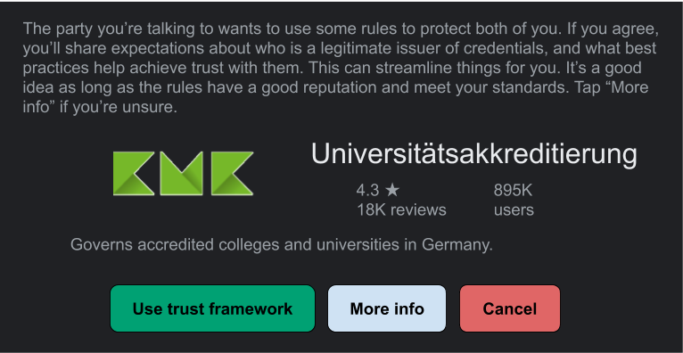

# Aries RFC 0430: Machine-Readable Trust Frameworks
- Authors: [Daniel Hardman](daniel.hardman@gmail.com)
- Status: [PROPOSED](/README.md#proposed)
- Since: 2020-02-24
- Status Note: early proposal only  
- Start Date: 2020-02-24
- Tags: [feature](/tags.md#feature)

## Summary

Explains how trust frameworks are embodied in formal data structures, so it's possible to react to them with software as opposed to human intelligence.

## Motivation

We need to be able to write software that reacts to arbitrary trust frameworks in standard ways. This will allow [various desirable features](#desirable-features).


## Tutorial

A __trust framework__ is a set of rules that establish trust about process (and indirectly, about outcomes) in a given context. For example, the rules that bind buyers, merchants, vendors, and a global credit card company like Mastercard or Visa constitute a trust framework in a financial services context &mdash; and they have a corresponding trust mark to make the trust framework's relevance explicit. The rules by which certificate authorities are vetted and approved by browser manufacturers, and by which CAs issue derivative certificates, constitute a trust framework in a web context. Trust frameworks are like guy wires: they balance opposing forces to produce careful alignment and optimal behavior.

[](https://www.flickr.com/photos/popcorncx/31899289874/)

Decentralized identity doesn't eliminate all forms of centralized authority, but its opt-in collaboration, openness, and peer orientation makes the need for trust rules particularly compelling. Somehow, a community needs to agree on answers to questions like these:

#### Sample Questions Answered in a Trust Framework

* Which institutions should be trusted to attest key facts such as an individual's citizenship, graduation from college, HIV status, membership in an ethnic group, credit worthiness, etc?
* How do rules about consent, privacy, and repudiation influence the flow of data?
* Who can hold which parties accountable, and how, and when?
* What levels of assurance are required for certain privileges?
* How auditable must various activities be?
* How do incentives and reputation work?
* What terms of service are standard, odd-but-reasonable, or prohibited?

Many industry groups are exploring these questions, and are building careful documentation of the answers they produce. It is not the purpose of this RFC to duplicate or guide such work. Rather, it's our goal to answer a secondary question:

#### The Question Tackled By This RFC

>How can answers to these questions be represented so they are consumable as artifacts of software policy? 

When we have good answers to this question, we can address feature requests like the following:

#### Desirable Features

* All the software used at a refugee camp &mdash; whether built by the United Nations, by an NGO like Doctors Without Borders, by startups providing identity wallets to individuals, or by military personnel &mdash; has a shared understanding about standards of proof, consent, enforcement, appeal, and privacy.
* Rules in an ecosystem can be versioned and updated formally, and parties who interact can know unambiguously whether their expectations align. If there is a misalignment, it is easy to identify the particulars.
* A user of an SSI-centric mobile app can be prompted about whether they'd like to accept as proof credentials issued under the rules of trust framework X (e.g., the trust framework for accredited institutions of higher education in Germany) &mdash; allowing them to accept or reject entire categories of proof without having to track the DIDs and business practices of every individual issuer they might encounter.

#### Sample Data Structure

Trust Frameworks generally begin as human-friendly content. They have to be created, reviewed, and agreed upon by experts from various disciplines: legal, business, humanitarian, government, trade groups, advocacy groups, etc. Developers can facilitate by surfacing how rules are (or are not) susceptible to formal modeling.

Each problem domain will probably have unique requirements. Therefore, a general trust framework recipe needs to be extensible. We use JSON-LD for this purpose. Here we present a simple example for the problem domain of university credentials in Germany. It manifests just the components of a trust framework that are common across all contexts; additional JSON-LD `@context` values can be added to introduce more structure as needed. 

```jsonc
{
    "@context": [
        // The first context must be this RFC. It defines core properties.
        "https://github.com/hyperledger/aries-rfcs/concepts/0430-machine-readable-trust-frameworks", 
        // Additional contexts can be added to extend.
        "https://kmk.org/uni-accred-trust-fw"
    ],
    // name
    "name": "Universitätsakkreditierung"
    // version (semver rules apply)
    "1.0",
    // Something that can be displayed to a user.
    "http://kmk.org/uni-accred-trust-fw/logo.png",
    // Something that can be displayed to a user.
    "description": "Governs accredited colleges and universities in Germany.",
    // Where is this trust framework officially published, in human-
    // readable form? A human can browse here to learn more.
    "docs_uri": "http://https://kmk.org/uni-accred-trust-fw/v1",
    // Where is this trust framework officially published, as a
    // machine-readable data structure? A computer should be able to
    // GET this JSON (MIME type = application/json) at the specified
    // URI.
    "data_uri": "http://https://kmk.org/uni-accred-trust-fw/v1/tf.json",
    // In which problem domains is this trust framework relevant?
    // Think of these like hash tags; they constitute a loose,
    // overlapping topic cloud rather than a normative taxonomy;
    // the purpose is to facilitate search.
    "topics": ["education"],
    // In which legal jurisdictions is this trust framework relevant?
    // Values here should use ISO 639-2 or 3 language code, possibly
    // narrowed to a standard province and even county/city using > as
    // the narrowing character, plus standard abbreviations where
    // useful: us>tx>houston for "Houston, Texas, USA" or ca>qc for
    // the province of Quebec in Canada.
    "jurisdictions": ["de", "eu"],
    // In which geographies is this trust framework relevant? May be
    // redundant with jurisdictions in many cases.
    "geos": ["Deutschland"],
    // Name all the roles that are significant to understanding
    // interactions in this trust framework. These map to X in rules
    // like "X can do Y if Z."
    "roles": ["accreditor", "school", "graduate", "anyone"],
    // Name all the privileges that are significant to understanding
    // interactions in this trust framework. These map to Y in rules
    // like "X can do Y if Z." Each privilege is defined for humans
    // at the specified URI, so a person can understand what it
    // entails.
    "privileges": [
        {"name": "accredit", "uri": "http://kmk.org/tf/accredit"},
        {"name": "issue-edu", "uri": "http://kmk.org/tf/issue-edu"},
        {"name": "hold-edu", "uri": "http://kmk.org/tf/hold-edu"},
        {"name": "request-proof", "uri", "http://kmk.org/tf/request-proof"
    ],
    // Name all the duties that are significant to understanding
    // interactions in this trust framework. Each duty is defined for humans
    // at the specified URI, so a person can understand what it
    // entails.
    "duties": [
        {"name": "safe-accredit", "uri": "http://kmk.org/tf/responsible-accredit"},
        {"name": "GDPR-dat-control", "uri": "http://europa.eu/gdpr/trust-fw/gdpr-data-controller"}
        {"name": "GDPR-edu-verif", "uri": "http://kmk.org/tf/gdpr-verif"}
        {"name": "accept-kmk-tos", "uri": "http://kmk.org/tf/tos"}
    ],
    // Use DIDs to define key participants in the ecosystem. KMK is
    // the accreditation authority for higher education in Germany.
    // Here we show it using two different DIDs.
    "define": [
        {"name": "KMK": "id": "did:example:abc123"},
        {"name": "KMK": "id": "did:anotherexample:def456"},
    ], 
    // Describe role-based rules of behavior like "X can do Y if Z,"
    // where Z is a criterion following "when".
    "rules": [
        {"grant": ["accredit"], "when": {"name": "KMK"},
            "duties": ["safe-accredit"]},
        {"grant": ["issue-edu"], "when": {
                // Proof request (see RFC 0037) specifying that
                // institution is accredited by KMK.
            },
            // Any party who fulfills these criteria is considered
            // to have the "school" role.
            "thus": ["school"],
            // And is considered to have the "GDPR-dat-control" duty.
            "duties": ["GDPR-dat-control", "accept-kmk-tos"]
        },
        {"grant": "hold-edu", "when": {
                // Proof request specifying that holder is a human.
                // The presence of this item in the TF means that
                // conforming issuers are supposed to verify
                // humanness before issuing. Issuers can impose
                // additional criteria; this is just the base
                // requirement.
            },
            // Any party who fulfills these criteria is considered
            // to qualify for the "graduate" role.
            "thus": "graduate",
            "duties": ["accept-kmk-tos"]
        },
        // In this trust framework, anyone can request proof based
        // on credentials. No criteria are tested to map an entity
        // to the "anyone" role.
        {
            "grant": "request-proof", "thus": "anyone",
            "duties": ["GDPR-edu-verif", "accept-kmk-tos"]
        },
        // Is there an authority that audits interactions?
        "audit": {
            // Where should reports be submitted via http POST?
            "uri": "http://kmk.org/audit",
            // How likely is it that a given interaction needs to
            // be audited? Each party in the interaction picks a
            // random number between 0 and 1, inclusive; if the number
            // is <= this number, then that party submits a report about it.
            "probability": "0.01"
        },
        // Is there an authority to whom requests for redress can
        // be made, if another party feels like another violates
        // the trust framework? 
        "redress": {
            "uri": "http://kmk.org/redress"
        }
    }    
}
```

#### Using the Sample

Let's look at how the above structure can be used to influence behavior of verifiable credential management software.

We begin by noticing that KMK (KultusMinisterKonferenz), the accrediting body for universities in Germany, has a privileged role in this trust framework. It is given the right to operate as "KMK" as long as it proves control of one of the two DIDs named in the `define` array. 

We next posit an issuer, Faber College, that wants to issue credentials compliant with this trust framework. This means that Faber College wants the `issue-edu` privilege defined at http://kmk.org/tf/issue-edu (see the second item in the `privileges` array). It wants to create credentials that contain the following field: `"trust_framework": "http://https://kmk.org/uni-accred-trust-fw/v1/tf.json"` (see the `data_uri` field). It wants to have a credential from KMK proving its accreditation (see second item in the `rules` array).

Faber is required by this trust framework to accept the terms of service published at http://kmk.org/tf/tos, because it can't get the `issue-edu` privilege without incurring that duty (see the `accept-kmk-tos` duty in the second item in the `rules` array). KMK by implication incurs the obligation to enforce these terms of service when it issues a credential to Faber.

Assuming that Faber proceeds and satisfies KMK, Faber is now considered a `school` as far as this trust framework is concerned.

Now, let us suppose that Alice, a student at Faber, wants to get a diploma as a verifiable credential. In addition to whatever else Faber does before it gives Alice a diploma, Faber is obligated by the trust framework to challenge Alice to prove she's a human being (see `when` in the third item of the `rules` array). Hopefully this is easy, and was done long before graduation. :-) It is also obligated to introduce Alice to the terms of service for KMK, since Alice will be acquiring the `graduate` role and this rule has the `accept-kmk-tos` duty.

Alice is holding a mobile app that manages credentials for her. She clicked an invitation to receive a credential in some way. What she sees on her screen might look something like this:


 
## Reference

Provide guidance for implementers, procedures to inform testing,
interface definitions, formal function prototypes, error codes,
diagrams, and other technical details that might be looked up.
Strive to guarantee that:

- Interactions with other features are clear.
- Implementation trajectory is well defined.
- Corner cases are dissected by example.

## Drawbacks

Why should we *not* do this?

## Rationale and alternatives

- Why is this design the best in the space of possible designs?
- What other designs have been considered and what is the rationale for not
choosing them?
- What is the impact of not doing this?

## Prior art

Discuss prior art, both the good and the bad, in relation to this proposal.
A few examples of what this can include are:

- Does this feature exist in other SSI ecosystems and what experience have
their community had?
- For other teams: What lessons can we learn from other attempts?
- Papers: Are there any published papers or great posts that discuss this?
If you have some relevant papers to refer to, this can serve as a more detailed
theoretical background.

This section is intended to encourage you as an author to think about the
lessons from other implementers, provide readers of your proposal with a
fuller picture. If there is no prior art, that is fine - your ideas are
interesting to us whether they are brand new or if they are an adaptation
from other communities.

Note that while precedent set by other communities is some motivation, it
does not on its own motivate an enhancement proposal here. Please also take
into consideration that Aries sometimes intentionally diverges from common
identity features.

## Unresolved questions

- What parts of the design do you expect to resolve through the
enhancement proposal process before this gets merged?
- What parts of the design do you expect to resolve through the
implementation of this feature before stabilization?
- What related issues do you consider out of scope for this 
proposal that could be addressed in the future independently of the
solution that comes out of this doc?
   
## Implementations

The following lists the implementations (if any) of this RFC. Please do a pull request to add your implementation. If the implementation is open source, include a link to the repo or to the implementation within the repo. Please be consistent in the "Name" field so that a mechanical processing of the RFCs can generate a list of all RFCs supported by an Aries implementation.

*Implementation Notes* [may need to include a link to test results](README.md#accepted).

Name / Link | Implementation Notes
--- | ---
 | 

