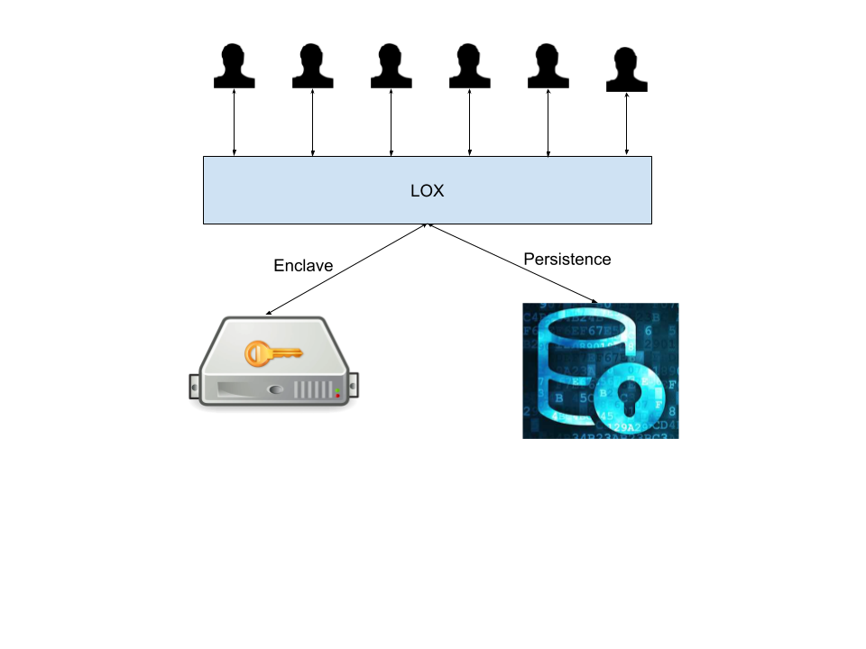
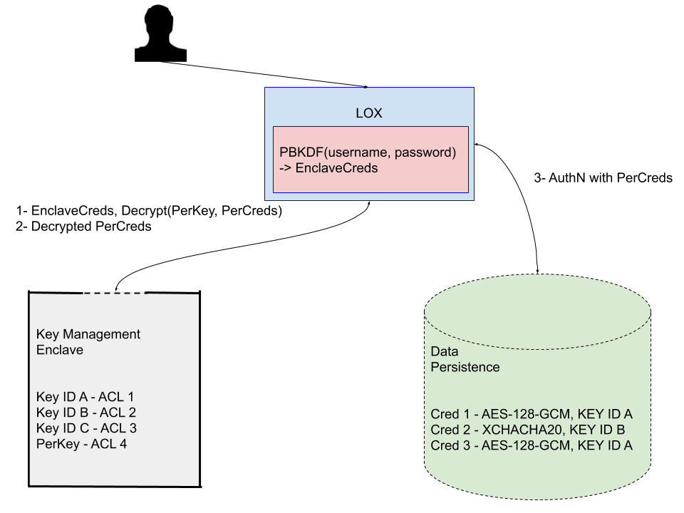
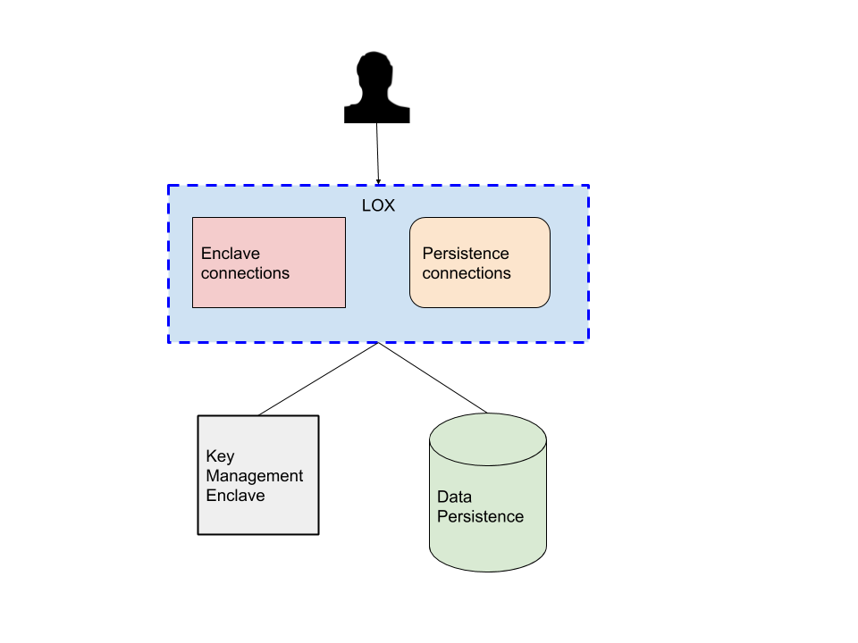

# 0440: KMS Architectures 
- Authors: [Michael Lodder](mike@sovrin.org)
- Status: [PROPOSED](/README.md#proposed)
- Since: 2020-03-06
- Status Note: Proposed
- Supersedes: [Wallets](https://github.com/hyperledger/aries-rfcs/blob/main/concepts/0050-wallets/README.md), uses concepts from [LOX](https://github.com/hyperledger/aries-rfcs/blob/main/features/0042-lox/README.md)
- Start Date: 2019-12-02
- Tags: [concept](/tags.md#concept)

## Summary

A Key Management Service (KMS) is designed to handle protecting sensitive agent information
like keys, credentials, protocol state, and other data. 
User authentication, access control policies, and cryptography are used in various combinations
to mitigate various threat models and minimize risk. However, how to do this in practice is not intuitive and done incorrectly results in flawed or weak designs. 
This RFC proposes best practices for designing a KMS that offers reasonable tradeoffs
in flexibility for implementers with strong data security and privacy guarantees.

## Motivation

A KMS needs to be flexible to support various needs that arise when implementing agents.
Mobile device needs are very different from an enterprise server environment, but ultimately the secrets still need to be protected in all environments.
Some KMSs have already been implemented but fail to consider all the various threat models that exist within their designs.
Some overlook good authentication schemes.
Some misuse cryptography making the implementation insecure.
A good KMS should provide the ability to configure alternative algorithms that are validated against specific standards like the Federal Information Processing Standards (FIPS).
This RFC is meant to reduce the chances that an insecure implementation could be deployed while raising awareness of principles used in more secure designs.

## Tutorial

A KMS can be broken into three main components with each component having potential subcategories.
These components are designed to handle specific use cases and should be plug-and-play.
The components are listed below and described in detail in the following sections:

1. Enclave - 
    * Safeguards cryptographic keys
    * Key Generation
        * Encryption
        * Digital Signatures
        * Key exchange
        * Proof generation and verification 
1. Persistence - 
    * Stores non-key data
        * Verifiable credentials
        * Protocol states
        * DID documents
        * Other metadata
1. LOX - 
    * Handle user authentication
    * Access control enforcement
    * Session/context establishment and management to the previous layers as described [here](https://github.com/hyperledger/aries-rfcs/blob/main/features/0042-lox/README.md).

## Architecture

LOX sits between clients and the other subsystems.
LOX asks the Enclave to do specific cryptographic operations and may pass the results to clients or Persistence or LOX may consume the results itself.
The persistence layer does not directly interact with the enclave layer nor does the enclave layer interact directly with the persistence layer.

## LOX 
LOX is the first layer KMS consumers will encounter and where the bulk of KMS work for implementers happens. LOX is divided
into the following subcomponents that are not mutually exclusive:

1. Authentication - Credentials for accessing the KMS and how to communicate with the KMS. Username/Passwords, PINS, Cryptographic keys, Verifiable credentials, Key fobs, key cards, and OpenID Connect are common methods for this layer. Any sensitive data handled by in this layer should be cleared from memory and minimize its footprint. 
1. Access control - Policies that indicate who can access the data and how data are handled. 
1. Audit - Logging about who does what and when and how verbose are the details 

Connecting to a KMS is usually done using functional system or library API calls, physical means like USB, or networks like Bluetooth, SSH, or HTTPS.
These connections should be secured using encryption techniques like TLS or SSH or Signal other methods to prevent eavesdropping on 
authentication credentials from end users. This is often the most vulnerable part of the system because its easy to 
design something with weak security like passwords with only 6 characters and sent in plaintext.  It is preferred to use keys and multi-factor authentication techniques for connecting to LOX.
Since password based sign ins are the most common, the following is a list of good methods for handling password based sign ins.

### Use hashing specially designed for passwords 
Password based hashes are designed to be slow so the outputs are not so easily subjected to a brute-force dictionary attack.
Simply hashing the password with cryptographic algorithms like Sha2/Sha3/Blake2 is not good enough. Below is a list of approved
algorithms

1. PBKDF2
1. Bcrypt
1. Scrypt
1. Argon2

The settings for using each of these should be enough to make even the strongest hardware take about 1-2 seconds to complete.
The recommended settings in each section, also apply to mobile devices.

**PBKDF2**

Many applications use PBKDF2 which is NIST approved. However, PBKDF2 can use any SHA-family hash algorithm. Thus,
it can be made weak if paired with SHA1 for example. When using PBKDF2, choose SHA2-512, which is significantly slower
in current GPUs. The PBKDF2 parameters are

* `N` - iterations count (the number of hashes to perform, ≥100K recommended)
* `password` - the input password
* `salt` - securely-generated random bytes (128 bits recommended)
* `hash` - The hash algorithm to use (SHA2-512 recommended)

**Bcrypt**

Bcrypt is a functional variant of the Blowfish cipher designed specially for password hashing. Unfortunately,
the password sizes are limited to the first 72 bytes, any extra bytes are ignored. The recommended number of rounds 
to use is ≥14. Bcrypt can support up to 31 rounds. Bcrypt is less resistant to ASIC and GPU attacks because it uses
constant memory making it easier to build hardware-accelerated password crackers. When properly configured, Bcrypt is
considered secure and is widely used in practice.

* `N` - number of rounds (≥14 recommended)
* `password` - the input password
* `salt` - securely-generated random bytes (128 bits recommended)

**Scrypt**

[Scrypt](https://tools.ietf.org/html/rfc7914.html) is designed to make it costly to perform large-scale custom hardware attacks by requiring large amounts of memory.
It is memory-intensive on purpose to prevent GPU, ASIC and FPGA attacks. 
Scrypt offers multiple parameters:

* `N` - iterations count (affects memory and CPU usage), e.g. 16384 or 2048
* `r` - block size (affects memory and CPU usage), e.g. 8
* `p` - parallelism factor (threads to run in parallel - affects the memory, CPU usage), usually 1
* `password` - the input password
* `salt` - securely-generated random bytes (128 bits recommended)
* `derived-key-length` - how many bytes to generate as output, e.g. 32 bytes (256 bits)

The memory in Scrypt is accessed in strongly dependent order at each step, so the memory access speed is the algorithm's
bottleneck. The memory required is calculated as `128 * N * r * p` bytes. Example: 128*16384*8*1 = 16MB

Choosing parameters depends on how much waiting is desired and what level of security (cracking resistance) should be achieved.

MyEtherWallet uses N=8192, r=8, p=1. This is not considered strong enough for crypto wallets. Parameters of N=16384,r=8,p=1 (RAM = 2MB)
typically take around 0.5 seconds, used for interactive sign ins. This doesn't hammer server side performance too much where
many users can login at the same time. N=1048576,r=8,p=1 (RAM = 1GB) takes around 2-3 seconds. Scrypt is considered
highly secure when properly configured.

**Argon2**

Argon2 is optimized for the x86 architecture and exploits the cache and memory layouts of modern Intel and AMD processors.
It was the password hash competition winner and is recommended over PBKDF2, Bcrypt and Scrypt.
Not recommended for ARM ABI's as performance tends to be much slower. This performance hit seem be desirable but what tends to
happen is the parameters are configured lower for ARM environments to be reasonable but then can be cracked at 2-3 times
faster when the hash is brute-forced on x86. Argon2 comes in three flavors: Argon2d, Argon2i and Argon2id and uses the 
following parameters

* Argon2d - provides strong GPU resistance, but has potential side-channel attacks. Best if used on end-user machines where side channel attacks are less likely to happen.
* Argon2i - provides less GPU resistance, but has no side-channel attacks. Best if used for server-side sign ins.
* Argon2id - combines both. Runs Argon2i first then Argon2d second, thus providing both side-channel attack protection and brute-force cost savings.

* `password` - the input password
* `salt` - securely-generated random bytes (128 bits recommended)
* `N` - number of iterations to perform
* `m` - amount of memory to use in kilobytes
* `p` - degree of parallelism (number of threads)
* `derived-key-length` - how many bytes to generate as output, e.g. 32 bytes (256 bits)

Parameters p=2,m=65536,n=128 typically take around 0.5 seconds, used for interactive sign ins. Moderate parameters are
p=3,m=262144,n=192 typically take around 2-3 seconds, and sensitive parameters are p=4,m=1048576,n=256. Always time it
in your environments.

## Session establishment

Upon authentication to LOX, LOX should establish connections to the enclave component and persistence component
which should appear opaque to the client. LOX may need to authenticate to the enclave component or persistence component
depending on where client access credentials are stored by implementors. Its preferable to store these in keychains
or keystores if possible where the access is determined by the operating system and can include stronger mechanisms like
TouchID or FaceID and hardware tokens in addition to passwords or pins. As described in [LOX](https://github.com/hyperledger/aries-rfcs/blob/main/features/0042-lox/README.md),
the credentials for accessing the enclave and persistence layer can then be retrieved or generated if the client is new
and stored in a secure manner. 

### Using OS Keychain

### Using Password based key derivation

### Session management
Active connections to these other layers may possibly be pooled for efficiency reasons
but care must be taken to avoid accidental permission grants. For example, Alice must not be able to use Bob's connection
and Bob for Alice. However, the same database connection credentials might be used transparently for Alice and Bob, in which 
case the database connection can be reused. This should be an exception as credential sharing is strongly discouraged.
Auditing in the database might not be able to determine whether Alice or Bob performed a specific query. 
Connections to enclaves and persistence usually requires session or context objects to be handled. 
These must not be returned to clients, but rather maintained by LOX. When a client connection is closed, these must be
securely deleted and/or closed.

## Enclave

The enclave handles as many operations related to cryptography and key management as possible to ensure keys are adequately protected.
Keys can potentially be stolen by means of side channel attacks from memory, disk, operational timing, voltage, heat, extraction, and others.
Each enclave has been designed to consider certain threat models and mitigate these risks.
For example, a Thales HSM is very different than a Yubico HSM or an Intel SGX Enclave.
The correct mental model is to think about the formal guarantees that are needed and pick and choose/design the enclave layer to suite those needs.
Build the system that meets the definition(s) of security then prove it meets the requirements.
An enclave functions as a specialized cryptography component.
The enclave provides APIs for passing in data to be operated on and executes its various cryptographic operations internally and only returns results to callers.
The following is a list of operations that enclaves can support.
The list will vary depending on the vendor.

1. Generate asymmetric key
1. Generate symmetric key
1. Generate random
1. Put key
1. Delete key
1. Wrap key
1. Unwrap key
1. Export wrapped key
1. Import wrapped key
1. List keys
1. Update key metadata/capability
1. Get key info/metadata
1. Derive key agreement
1. Sign
1. Verify
1. Encrypt
1. Decrypt
1. Get enclave info - metadata about the enclave like device info, version, manufacturer
1. Query enclave capability
1. Audit - e.g. enable/disable auditing
1. Log - e.g. read audit logs
1. Attestation - e.g. generate proofs about the enclave

Most hardware implementations do not allow key material to be passed through the API,
even in encrypted form,
so a system of external references is required that allows keys to be referenced in a way that supports:

1. Consistency - The same ID refers to the same key every time.
1. Naming schemes - such as RSA_PSS_2048_8192_SHA256

Some enclaves do support key material to be passed through the API.
If allowed, these are called Key blocks.
Key blocks are how a key is formatted when passed into or out of the enclave. See [here](https://www.geobridge.net/wp-content/uploads/2018/03/GEOBRIDGE-Guide-Key-Block-Implementation.pdf).

In keeping with the drive for enclaves to be simple and hard to mess up, the proposal is to make key IDs in the enclave storage be simple UTF-8 string names, and leave the underlying provider implementation to deal with the complexities of translation, key rollover, duplication and so on.
Each of these operations uses different parameters and the enclave should specify what it allows and what it does not.
If code needs to discover the capabilities on the fly, it is much more efficient to query the enclave if it supports it rather than return a list of capabilities that are search externally.

Enclaves also store metadata with each key. This metadata consists of

1. Attributes - e.g. key id, label, tag
1. Access Constraints - e.g. require passcode or biometric auth to use
1. Access Controls - e.g. can decrypt, can verify, can sign, exportable when wrapped

### Attributes

Attributes describe a key and do not enforce any particular permission about it.
Such attributes typically include

1. Identifier - e.g. f12f149d-e8d9-427c-85c7-f116f87f2e70 or 5a71028a74f1ad9f3f39 or 9s5m7EEJq1zZyc or 158
1. Alias - e.g. fcb9ec81-d613-4c0f-a023-470155f38f92 or 1BC6HUi1soNML. Useful to sharing key but using a different id. Audits would show which one was used.
1. Label or Description - e.g. Alice to Bob's DID key
1. Class - e.g. public, private, symmetric
1. Tag - e.g. sign, verify, did
1. Type - e.g. aes, rsa, ecdsa, ed25519
1. Size in bits - e.g. 256, 2048
1. Creator - i.e. the original creator/owner
1. Creation date
1. Last modification date
1. Always sensitive - i.e. was created with sensitive flag and never removed this control
1. Never exported - i.e. never left the enclave
1. Derived from - e.g. use PBKDF2 on this value to generate the key, or reference another key as a seed derived using HKDF

Most of these attributes cannot change like Size in bits and are read-only. Aliases, Labels, and Tags are the only Attributes that can change. Enclaves allow 1 to many aliases and tags but only one label. The enclave should specify how many tags and aliases may be used. A common number is 5 for both.

### Access Constraints
Constraints restrict key access to be done under certain conditions like who is accessing the key like the owner(s) or group(s), password or biometric authentication, when host is unlocked like in mobile devices, always accessible. Constraints must be honored by the enclave to consumers to have confidence and trust. Possible constraints are:

1. Owner(s) - e.g. who is allowed to access and use the key.
1. User presence - e.g. require additional authentication like passcode or biometric auth (TouchID/FaceID). Authentication is on a per key basis vs just owner. Must be owner and meet additional authentication requirements.
1. Biometric - e.g. require biometric authentication
1. Passcode - e.g. require passcode authentication
1. Fresh Interval - e.g. allowed time between additional authentications, 10 minutes is acceptable for extra sensitive keys

Each of these can be mixed in combinations of AND and OR conjunctions. For example, key ABC might have the following constraints

OR ( AND (Owner, User presence, Passcode), AND(Owner, User presence, Biometric) ) This requires the owner to enter an additional passcode OR biometric authentication to access the key.

### Access Controls
Enclaves use access controls to restrict what operations keys are allowed to perform and who is allowed to use them. Controls are set during key generation and may or may not be permitted to change depending on the vendor or settings. Controls are stored with the key and enforced by the enclave. Possible access controls are:

1. Can Key Agreement - e.g. Diffie-Hellman
1. Can Derive - e.g. serve as seed to other keys
1. Can Decrypt - e.g. can decrypt data for private keys and symmetric keys
1. Can Encrypt - e.g. can encrypt data for public keys and symmetric keys
1. Can Wrap - e.g. can be used to wrap another key to be exported
1. Can Unwrap - e.g. can be used to unwrap a key that was exported
1. Can Sign - e.g. can create digital signatures for private keys and MACs for symmetric keys
1. Can Verify - e.g. can verify digital signatures for public keys and MACs for symmetric keys
1. Can Attest - e.g. can be used to prove information about the enclave
1. Is Exportable - e.g. can be exported from the enclave.
1. Is Sensitive - e.g. can only be exported in an encrypted format.
1. Is Synchronizable - e.g. can only be exported directly to another enclave
1. Is Modifiable - e.g. can any controls be changed
1. Is Visible - e.g. is the key available to clients outside the enclave or used internally.
1. Valid Until Date - e.g. can use until this date, afterwards the key cannot be used

To mitigate certain attacks like key material leaking in derive and encrypt functions, keys should be as limited as possible to one task (see [here](https://cryptosense.com/blog/the-dangers-of-key-derivation-in-pkcs11/) and [here](https://cryptosense.com/blog/the-untold-story-of-pkcs11-hsm-vulnerabilities/)).
For example, allowing concatenation of a base key to another key should be discouraged as it has the potential to perform key extraction attacks (see [Clulow](http://citeseerx.ist.psu.edu/viewdoc/summary?doi=10.1.1.1.3442).
Clulow shows that a key with decrypt and wrap capabilities can export a key then be used to decrypt it.
This applies to both symmetric keys with decrypt and wrap and its variant where the wrapping key is a public key and the decryption key is the corresponding private key).
The correct mental model to follow for enclave implementors is to model an intruder than can call any API command in any order he likes using any values that he knows. Sensitive and unexportable keys should never be directly readable and should not be changeable into nonsensitive and exportable. If a key can wrap, it should not be allowed to decrypt. Some of these controls should be considered sticky––cannot be changed to mitigate these attacks like sensitive. This is useful when combined with conflicting controls like wrap and decrypt.

**Exporting key requirements**

The most secure model is to not allow keys to leave an enclave.
However, in practice, this is not always reasonable.
Backups, replications must be made, keys must be shared between two enclaves for data to be shared by two parties.
When a key is lifted from the enclave, its attributes, constraints and controls must correctly bind with it.
When a key lands in another enclave, the enclave must honor the attributes, constraints and controls with which it came.
The wrapping format should be used to correctly bind key attributes, constraints and controls to the key.
This prevents attacks where the key is wrapped and unwrapped twice with conflicting metadata as described by
[Delaune et. al](http://citeseerx.ist.psu.edu/viewdoc/download?doi=10.1.1.217.9278&rep=rep1&type=pdf),
[Cachin et.al](https://ieeexplore.ieee.org/document/5230619),
[Cortier and Steel](https://www.sciencedirect.com/science/article/pii/S0890540114000960)
and [Bortolozzo](http://www.lsv.fr/Publis/PAPERS/PDF/BCFS-ccs10.pdf).

### Templates
Some enclaves support creating templates such that keys can be generated and wrapped following secure guidelines in a reproducible way. Define separate templates for key generation and key wrapping.

### Final enclave notes
Hardware enclaves typically have limited storage space like a few megabytes. A hardware enclave could be used to protect a software enclave that has a much higher storage capacity. A KMS is not limited to just one enclave. Cloud access security brokers (cloud enclaves) like Hashicorp Vault, Amazon’s Cloud HSM, Iron Core Labs, Azure Key Vault, and Box Keysafe require trusting a SaaS vendor will store them in a place that is not vulnerable to data breaches. Even then, there is no assurance that the vendor, or one of their partners, won’t access the secret material. This doesn't belittle their value, it's just another point to consider when using SaaS enclaves.
Keys should be shared as little as possible if at all. Keys should be as short lived as possible and have a single purpose. This limits the need to replicate keys to other agents, either for dual functionality or recovery purposes, as well as damage in the event of a compromise.

## Persistence
This layer is meant to store other data in a KMS like credentials and protocol state. This layer could be optional for static agents where they store very little if anything. Credentials that access the persistence layer should stored in the enclave layer or with LOX in keychains. For example, if the persistence layer is a postgres database, the username/password or keypair to authenticate to the database could be stored in the enclave rather than a config file. Upon a successful authentication to LOX, these credentials are retrieved to connect to postgres and put into a connection pool. This is more secure than storing credentials in config files, environment variables or prompting them from user input.

The most common storage mechanism is a SQL database. Designers should consider their system requirements in terms of performance, environments, user access control, system administrator access, then read Kamara’s blog on how to develop encrypted databases
(see [1](http://esl.cs.brown.edu/blog/how-to-search-on-encrypted-data-introduction-part-1/),
[2](https://cs.brown.edu/people/seny/slides/es_intro_and_basics.pdf),
[3](https://cs.brown.edu/people/seny/slides/es_leakage_attacks.pdf),
[4](https://cs.brown.edu/people/seny/slides/es_leakage_suppression.pdf)).
For example, mobile environments vs enterprise environments. Mobile environments probably won’t have a network adversary when using secure storage or an Honest-but-curious adversary where as enterprise environments will. Should the query engine be able to decrypt data prior to filtering or should it run on encrypted data and the querier performs decryption? Neither of these is considered wrong per se, but each comes with a set of trade offs. In the case of query engine decryption, there is no need to write a separate query mechanism and databases can execute as they normally do with a slight decrease in performance from decryption and encryption. However, the data reader must trust the query engine to not leak data or encryption keys. If the querier performs data encryption/decryption, no trust is given to the query engine but additional work must be performed before handing data to the engine and this searchable encryption is still vulnerable to access pattern leakage. What is practical engineering vs design vs theory? Theory is about what can and can’t be done and why. Design is about using efficient primitives and protocols. Engineering is about effective and secure implementation.

Implementers should consider the following threats and adversary sections.

**Threats**
* Memory access patterns leakage - Attackers can infer contents and/or importance of data based on how it is accessed and frequency of access. Attacker learns the set of matching records.
* Volume leakage - Attacker learns the number of records/responses.
* Search pattern leakage - Attackers can infer the contents and/or importance of data based on search patterns–attacker can easily judge whether any two queries are generated from the same keywords or not.
* Rank leakage - Attacker can infer or learn which data was queried
* Side channel leakage - Attackers can access or learn the value of the secret material used to protect data confidentiality and integrity through side channels like memory inspection, RAM scraping attacks with swap access, and timing attacks [8].
* Microarchitectural attacks - Attacker is able to learn secrets through covert channels that target processors (Spectre/Meltdown)

**Adversary**
* Network adversary - observes traffic on the network. In addition to snooping and lurking, they can also perform fingerprinting attacks to learn who are the endpoints and correlate them to identical entities.
* Snapshot adversary - breaks into server, snapshots system memory or storage. Sees copy of encrypted data but does not see transcripts related to any queries. Trade off between functionality and security.
* Persistent adversary - corrupts server for a period of time, sees all communication transcripts.
* Honest but curious adversary - System Administrator that can watch accesses to the data

Disk Encryption This feature can help with encryption-at-rest requirements but only protects the data if the disk is off.
Once booted, then an attacker can read it as easily as a system administrator and thus provides very little protection.
Data can and usually is stolen via other methods like software vulnerabilities or virus’.
Useful if the storage hardware is not virtualized like in the cloud and is mobile like a laptop, phone, USB drives.
If storage is in the cloud or network, it's worth more to invest in host-based intrusion prevention, intrusion detection systems, cloud, and file encryption 
(see [Sastry](https://searchsecurity.techtarget.com/answer/Is-full-disk-server-encryption-software-worth-the-resource-overhead),
[Yegulalp](https://www.infoworld.com/article/2614485/is-full-disk-encryption-worth-it-.html),
and [Why Full Disk Encryption Isn't Enough](https://www.digitaluppercut.com/2018/12/why-full-disk-encryption-isnt-enough/)).

**Application vs Database Encryption**
Databases provide varying levels of built-in encryption methods.
SQL Server and SQLCipher are examples of databases that provide Transparent Data Encryption–the users don’t even know the data is encrypted, it’s transparent to their knowledge.
This works similar to Disk Encryption in that it mostly protects the database data at rest, but as soon as the user is connected, the data can be read in plaintext.
A further abstraction is Postgres and SQL Server allowing database keys to be partially managed by the database to encrypt columns or cells and the user must supply either all or some of the keys and manage them separately.
The last approach is for applications to manage all encryption.
This has the advantage of being storage agnostic.
Postgres permits the keys to be stored separately from the encrypted columns.
When the data are queried, the key is passed to the query engine and the data are decrypted temporarily in memory to check the query.

If the application is handling encryption, this means the query engine only operates on encrypted data vs allowing it decrypt and read the data directly. The tradeoff is a different query method/language will have to be used than provided by the persistence layer.

Many databases are networked which requires another layer of protection like TLS or SSH.

### Data storage
Metadata for data includes access controls and constraints. Controls dictate what can be done with the data, Constraints dictate who can access it. These could be managed by the underlying persistence application or it can be enforced by LOX before returning the data to the client. The constraints and controls indicate permissions to end clients and not necessarily to anything outside of the persistence layer. This is not like designing an enclave. Persistence is meant to be for more general purpose data that may or may not be sensitive.
Metadata about the data includes attributes, constraints, and controls in a similar manner to the enclave.

### Access constraints

Constraints restrict data access to be done under certain conditions like who is accessing like the owner(s) or group(s). Constraints must be honored by the persistence layer or LOX to consumers to have confidence and trust. Possible constraints are:

1. Identity or roles
1. Context - i.e. what contexts can this data be used. For example, a credential may be restricted to be used only in a work environment if desired.

### Access controls

1. Crypto Protection - e.g. which key id(s) and algorithm are used to protect this data. This allows data to re-encrypted, transformed via functional encryption in the future when keys are rotated or ciphers are deemed weak or insecure.
1. Is Exportable - e.g. can the data leave the KMS
1. Is Modifiable
1. Can Delete
1. Valid Until Date

## Reference

[Indy Wallet](https://github.com/hyperledger/indy-sdk/tree/master/libindy/indy-wallet) implements this in part and is one of the first attempts at this architecture. Indy Wallet doesn't use LOX yet, functions similar to an enclave in that it does not give direct access to private keys and uses key ids to execute operations. It supports a flexible persistence layer to be either SQLite or Postgres. The top layer encrypts data before it is queried or sent to the persistence layer and decrypted when returned.
[Aries Mayaguez](https://github.com/sovrin-foundation/aries-kms-rs/) is another implementation

## Drawbacks

There are additional complexities related to handling keys and other data as two distinct entities and it might be faster to combine them with a potential security tradeoff.

## Prior art

[PKCS#11](http://docs.oasis-open.org/pkcs11/pkcs11-base/v2.40/os/pkcs11-base-v2.40-os.html) and 
[KMIP](http://docs.oasis-open.org/kmip/spec/v1.2/os/kmip-spec-v1.2-os.html#_Toc409613462) were developed for key management strictly for enclaves. These design patterns are not limited to just key management but any sensitive data.

## Unresolved questions

Is providing access constraints to the persistence layer necessary? Could this be removed? What are the consequences?
Are there any missing constraints and controls for the enclave or persistence layer?

## Implementations

The following lists the implementations (if any) of this RFC. Please do a pull request to add your implementation. If the implementation is open source, include a link to the repo or to the implementation within the repo. Please be consistent in the "Name" field so that a mechanical processing of the RFCs can generate a list of all RFCs supported by an Aries implementation.

*Implementation Notes*

Name / Link | Implementation Notes
--- | ---
 | 
 
