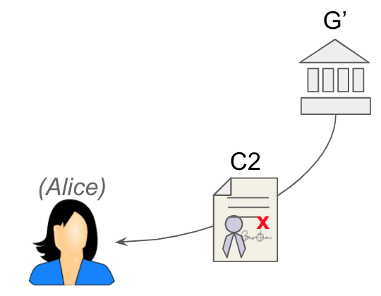

# Aries RFC 0559: Privacy-Preserving Proof of Uniqueness
- Authors: [Daniel Hardman](mailto:daniel.hardman@gmail.com), Drummond Reed, Lovesh Harchandani, Jason Law, Brent Zundel
- Status: [PROPOSED](/README.md#proposed)
- Since: 2020-10-21
- Status Note: documents ideas mentioned at RWOT 9 (Sep 2019) and in informal conversations before and since. This is a defensive publication by the Aries community, to prevent such ideas from being encumbered by patents.  
- Start Date: 2019-02-13 (first formal writeup of the concepts)
- Tags: [concept](/tags.md#concept)

## Summary

Documents two techniques that, while preserving holder privacy, can guarantee a single use of a verifiable credential by any given unique holder -- the so-called "one person one vote" outcome that's often desirable in VC use cases.

## Motivation

Many actions need to be constrained such that a given actor (usually, a human being) can only perform the action once. In government and stockholder elections, we want each voter to cast a single vote. At national borders, we want a visa to allow entrance only a single time before a visitor leaves. In refugee camps, homeless shelters, and halfway houses, we want each guest to access food or medication a single time per distribution event.

Solving this problem without privacy is relatively straightforward. We require credentials that disclose a person’s identity, and we track the identities to make sure each is authorized once. This pattern can be used with physical credentials, or with their digital equivalent.

The problem is that each actor’s behavior is tracked with this method, because it requires the recording of identity. Instead of just enforcing one-person-one-vote, we create a history of every instance when person X voted, which voting station they attended, what time they cast their vote, and so forth. We create similar records about personal travel or personal medication usage. Such information can be abused to surveil, to harass, to intrude, or to spam.

What we need is a way to prove that an action is associated with a unique actor, and thus enforce the one-actor-one-action constraint, without disclosing that actor’s identity in a way that erodes privacy. Although we began with examples of privacy for humans, we also want a solution for groups or institutions wishing to remain anonymous, or for devices, software entities, or other internet-of-things actors that have a similar need.

## Tutorial

### Solution 1

This solution allows uniqueness to be imposed on provers during an arbitrary context chosen by the verifier, with no unusual setup at issuance time. For example, a verifier could decide to constrain a particular credential holder to proving something only once per hour, or once during a given contest or election. The price of this flexibility is that the credential holder must have a digital credential that already has important uniqueness guarantees (e.g., a driver's license, a passport, etc).

In contrast, [solution 2](#solution-2) imposes uniqueness at issuance time, but requires no  other credential with special guarantees.

#### Components

The following components are required to solve this problem:

##### A
**one issuance to identified holder** &mdash; A trustworthy process that issues verifiable credentials exactly once to an *identified holder*. (This is not new. Governments have such processes today to prevent issuing two driver’s licenses or two passports to the same person.)

##### B
**one issuance to anonymous holder** &mdash; A method of issuing a credential only once to an *anonymous holder*. (This is not new. Scanning a biometric from an anonymous party, and then checking it against a list of known patterns with no additional metadata, is one way to do this. There are other, more cryptographic methods, as discussed below.)

##### C
**strong binding** &mdash; A mechanism for strongly associating credentials with a specific credential holder, such that they are not usable by anyone other than the proper holder. (This is not new. Embedding a biometric such as a fingerprint or a photo in a credential is a simple example of such a mechanism.)

##### D 
**linking mechanism** &mdash; A mechanism for proving that it is valid to combine information from multiple credentials because they describe the same credential holder, without revealing the common link between those credentials. (An easy and familiar way to prove combinability is to embed a common characteristic in each credential. For example, two credentials that are both about a person with the same social security number can be assumed to describe the same person. What is required here goes one step further--we need a way to prove that two credentials contain the same data, or were built from the same data, without revealing that data at all. This is also not new. Cryptographic commitments provide one possible answer.)

##### E
**proving without revealing** &mdash; A method for proving the correctness of information derived from a credential, without sharing the credential information itself. (This is not new. In cryptographic circles, one such technique is known as a zero-knowledge proof. It allows Alice to hold a credential that contains her birthdate, but to prove she is over 65 years old instead of revealing the birthdate itself.)

#### Walkthru

We will describe how this solution uses components A-E to help a fictional voter, Alice, in an interaction with a fictional government, G. Alice wishes to remain anonymous but still cast her vote in an election; G wishes to guarantee one-citizen-one-vote, but to retain no additional information that would endanger Alice’s privacy. Extrapolating from a voting scenario to other situations that require uniqueness is left as an exercise for the reader.

The solution works like this:

1. Alice receives a voter credential, C1, from G. C1 strongly identifies Alice, perhaps containing her name, address, birthdate, and so forth. It is possession of this credential that proves a right to vote. G issues only one such credential to each actor. ([component A](#a))

2. C1 is bound to Alice so it can’t be used by anyone else. ([component C](#c))

3. C1 also contains data provided by Alice, and derived from a secret that only Alice knows, such that Alice can link C1 to other credentials with similarly derived data because she knows the secret. ([component D](#d))

    
  
    Steps 1-3: Alice receives a voter credential from G.

4. Alice arrives to vote and asserts her privilege to a different government agency, G’, that administers the election.

5. G’ chooses a random identifier, X, for the anonymous person (Alice) that wants to vote.

6. G’ asks this anonymous voter (Alice) to provide data suitable for embedding in a new credential, such that the new credential and her old credential can be proved combinable. ([component D](#d)).

7. G’ verifies that it has not issued a credential to this anonymous person previously. ([component B](#b))

8. G’ issues a new credential, C2, to the anonymous voter. C2 contains the random identifier X, plus the data that Alice provided in step 6. (This means the party playing the role of *Verifier* temporarily becomes a JIT *Issuer*.)

    
  
    Steps 4-8: Anonymous (Alice) receives a unique credential from G’.

9. G’ asks the anonymous voter to prove, without revealing any identifying information from C1 ([component E](#e)) the following assertions:
    * They possess a C1 and C2 that are combinable ([component D](#d))
    * The C2 possessed by this anonymous voter contains the randomly-generated value X that was just chosen and embedded in the C2 issued by G’. At this point X is revealed.

    

    Step 9: Alice proves C1 and C2 are combinable and C2 contains X.

This solves the problem because:

* Each actor can only receive one C1 from G.
* Each actor can only receive one C2 from G’.
* C1 cannot be shared or transferred.
* It is valid to combine information from C1 and C2 (they belong to the same actor), because of the first assertion in step 9.
* C2 is the same C2 that was just generated for the person asking to vote (it could not have been substituted), because it contains X as demonstrated by the second assertion in step 9.
* No identifying information in C1 is revealed.

Both credentials are required. If a person only has C1, then there is no way to enforce single usage while remaining anonymous. If a person only has C2, then there is no reason to believe the unique person who shows up to vote actually deserves the voting privilege. It is the combination that proves uniqueness of the person in the voting event, plus privilege to cast a vote. Zero-knowledge proving is also required, or else the strongly identifying information in C1 may leak.

As mentioned earlier, this same mechanism can be applied to scenarios besides voting, and can be used by actors other than individual human beings. G (the issuer of C1) and G’ (the verifier of C1 and issuer of C2) do not need to be related entities, as long as G1 trusts G. What is common to all applications of the technique is that uniqueness is proved in a context chosen by the verifier, privilege is based on previously issued and strongly identifying credentials, and yet the anonymity of the credential holder is preserved.

#### Building in Aries

Ingredients to build this solution are available in Aries or other Hyperledger projects (Ursa, Indy) today:

* The behavior of [component A](#a) could be enforced by a [machine-readable governance framework](../0430-machine-readable-governance-frameworks/README.md).

* [Component B](#b) can be built using an approach described [here](https://github.com/WebOfTrustInfo/rwot9-prague/blob/master/topics-and-advance-readings/zkp-safety.md#technique-2-prevent-link-secret-reuse); a more general description was published much earlier, in a [seminal "Clone Wars" paper](https://eprint.iacr.org/2006/454.pdf) by Camenisch et al.
  
* [Component C](#c) can be accomplished using Indy's link secret construct, which uses Pedersen commitments to embed in a credential a blinded version of a secret known only to the holder. As mentioned earlier, [biometric bindings](https://ieeexplore.ieee.org/document/9031547) are also an option. Depending on requirements for level of assurance, a simple binding by DID control may also work.

* [Component D](#d) is a mainstream feature in Indy's anoncreds library today; it combines credentials by demonstrating mathematically that they each contain a differently blinded derivation of the same link secret. A more general form of this is available in Ursa; it demonstrates that any two fields are equal in two credentials without revealing the field values. [[TODO: need link]].

* [Component E](#e) is available in Indy's anoncreds as well as in recent work done on BBS+ signatures by Mattr [[TODO: need link]].

### Solution 2

This is another solution that accomplishes approximately the same goal as [solution 1](#solution-1). It is particularly helpful in voting. It has much in common with the earlier approach, but differs in that uniqueness must be planned for at time of issuance (instead of being imposed just in time at verification). The issuer signs a serial number to each unique holder, and the holder then makes a Pedersen Commitment to their unique serial number while the voting is open. The holder cannot vote twice or change their vote. The voter’s privacy is preserved.

#### Walkthru

Suppose a poll is being conducted with p number of options as m1, m2, m3,... mp and each poll has a unique id I. Acme Corp is conducting the poll and Alice is considered an eligible voter by Acme Corp because Alice has a credential C from Acme Corp.

##### Goals

* **Ballot privacy**: Alice should be able to participate in the poll without Acme corp finding out which poll option was chosen by Alice.

* **One vote per voter**: Alice should not be able to vote more than once.

* **Immutable Ballot**: Alice should be bound to her ballot, i.e. she should not be able to change her vote.

* **Valid choice**: Alice should not be able to vote for any option than the valid ones, i.e. other than m1, m2, m3,... mp.

* **Verifiability**: Alice should be able to check that her vote is being counted.

* **No preview**: Before the poll terminates, no one should be able to decide the outcome or even the favored option. This avoids bias.
 
Additional condition: In some cases the poll conduction entity, Acme Corp, in this case, may be accused of creating Sybil identities vote to influence the poll. This can be mitigated if an additional constraint is enforced where only those are eligible to vote who can prove that their credential C was issued before the poll started (or at least some time t before the poll started), i.e. Alice should be able to prove to anyone that her credential C was issued to anyone.

##### Setup
Acme corp has hosted an application AS that maintains a merkle tree and the application follows some rules to update the tree. This application should be auditable meaning that anyone should be able to check whether the application is updating the tree as per the rules and the incoming data. Thus this application could be hosted on a blockchain, or within a trusted execution environment like SGX. Also the application server maintains a dynamic set where set membership check is efficient. The merkle tree is readable by all poll participants.

There are 2 different functions defined F1 and F2 both of which take 2 inputs and return one output and they are not invertible, even knowing one input and output should not reveal other input. The output of both on same input must be different. Thus these can be modeled as different hash functions like SHA2 and SHA3 or SHA2 with domain separation. But we want these functions to R1CS friendly so we choose a hash function like MiMC with domain separation.

##### Basic idea
Alice generates a serial number and gets a blind signature from Acme Corp over the serial number. Then Alice creates her vote and sends the "encrypted" vote with the serial number and signature to the application server. Application server accepts the vote if the signature is valid and it has not seen that serial number before. It will then update the merkle tree with the "encrypted" vote and return a signed proof to Alice of the update. When the poll terminates, Alice will then submit the decryption key to the application server which can then decrypt the vote and do the tally.

##### Detailed description
* Acme corp conducts a poll with p choices, m1, m2,..mp. The poll is given a unique identifier I.
* Alice wants to participate in the poll. She has a credential C from Acme with link secret l.
* Alice constructs serial number S using F1. S = F1(l, I).
* Alice blinds S and then obtains a blind signature (blind Schnorr works) from Amce Corp over it. Alice might have proved her ownership of credential C.
* Alice decides to vote for m2. She needs to commit to her vote as a Pedersen commitment. The randomness for the Pedersen commitment r is computed using F2.    r = F2(l, I). The committed vote now becomes gm2.hr. Let V = gm2.hr.
* Alice sends V and S and the signature over S from Acme to application server AS. Alice also sends a proof which proves the following:
* Alice owns a credential C from Acme Corp. This can be done with CL or BBS+ signature. Additionally, it can be proved that C was issued some time ago to achieve characteristic 5.
* Serial number S is constructed from the link secret l of C and poll identifier I using F1. This can be done with Bulletproofs by using proof of knowledge of preimage. We have proving knowledge of preimage implemented. The part about establishing equivalence with link secret l has to be done.
* V is correctly formed in this way gm2.hr. This is a standard Schnorr proof.
* V's randomness r is constructed from the link secret l of C and poll identifier I using F2. Again done with Bulletproofs above and circuit to prove knowledge of opening of Pedersen commitment. The 2nd part is to be implemented.
* V's message m2 is one of m1, m2,..mp. This can be done with set membership proof of committed value with Bulletproofs. We have it implemented already.
* If application server AS accepts a proof, it returns the signed merkle proof of the presence of V in the tree to Alice.
* Alice can anytime check that her V is present in the tree.
* Once poll completes, Alice can reveal opening of V to AS and then result of poll can be computed.
* Before the poll completes (and voter reveals their m and r, no one can know which option has been voted the most or least or not at all. 

## Rationale and alternatives

## Prior art

## Unresolved questions

   
## Implementations

The following lists the implementations (if any) of this RFC. Please do a pull request to add your implementation. If the implementation is open source, include a link to the repo or to the implementation within the repo. Please be consistent in the "Name" field so that a mechanical processing of the RFCs can generate a list of all RFCs supported by an Aries implementation.

*Implementation Notes* [may need to include a link to test results](/README.md#accepted).

Name / Link | Implementation Notes
--- | ---
 | 

