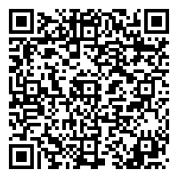
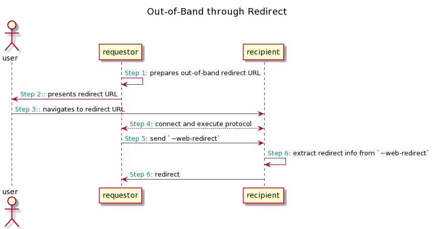
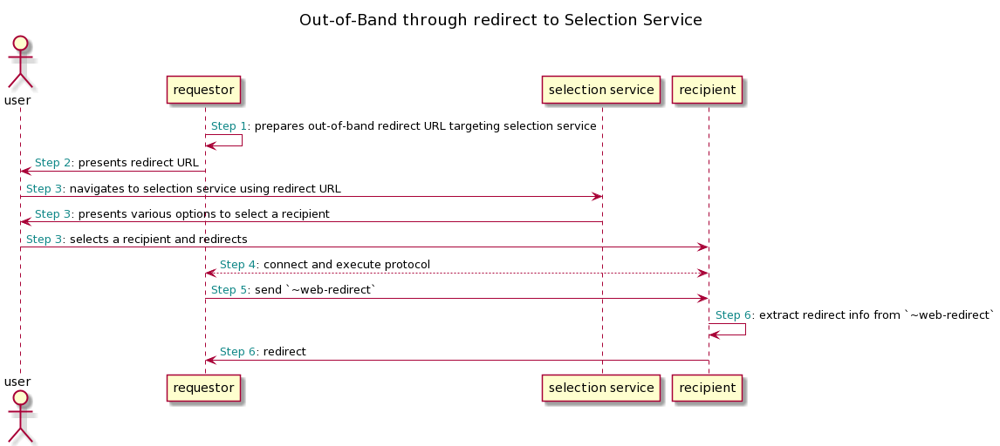

# Aries RFC 0700: Out-of-Band through redirect

- Authors: [Sudesh Shetty](sudesh.shetty@securekey.com)
- Status: [PROPOSED](/README.md#proposed)
- Since: 2021-10-08
- Status Note: implementation is being explored by SecureKey
- Start Date: 2019-10-08
- Tags: [concept](/tags.md#concept), [decorator](/tags.md#decorator)

## Summary

Describes how one party can redirect to another party by passing out-of-band message as a query string and also recommends how to redirect back once protocol is over.  

## Motivation

In current day e-commerce applications, while performing checkout users are usually presented with various payment options, like direct payment options or through some payment gateways. 
User then chooses an option, gets redirected to a payment application and then gets redirected back once transaction is over.  

Similarly, sending an out-of-band invitation through redirect plays an important role in web based applications where an inviter who is aware of invitee application or a selection service should be able to send invitation through redirect.
Once invitee accepts the invitation and protocol gets over, then invitee should also be able to redirect back to URL shared through DIDComm message during protocol execution. 
The redirect can happen within the same device (ex: clicking a link) or between devices (ex: scanning a QR code).

## Scenario

Best example scenario would be how an issuer or a verifier applications trying to connect to holder applications for performing present proof or issuer credential protocol. A user who visits an issuer application can click on
a link or scan a QR code to redirect to a holder application with an out-of-band message in query string (or redirect to a selection service showing available holder applications to choose from). 
User's holder application decodes invitation from query string, performs issue credential protocol and redirects user back to URL it received through DIDComm message from issuer during execution of protocol.


## Tutorial

There are 2 roles in this flow,

- requestor, the one who sends out-of-band invitation using query string to initiate a protocol.
- recipient, the one who receives out-of-band invitation and also the one who is asked to redirect back to requestor once protocol is over. 

### Redirect Invitation URL
A redirect URL from inviter to connect can consist of following elements,

- `domain and path`: domain and path are managed by inviter application and it can be a target application to which this out-of-band invitation is targeted. The target application can be a agent based application or a selection service which can present various application selection options to user.
- `out-of-band message`: A query parameter `oob` containing out-of-band message of Base64URLEncoded json format. Refer [Standard Out-of-Band Message Encoding](https://github.com/hyperledger/aries-rfcs/blob/main/features/0434-outofband/README.md#standard-out-of-band-message-encoding) to learn more.
- `out-of-band message ID`: It seems inevitable that the length of some out-of-band message will be too long to produce a useable redirect URL or QR Code. A query parameter `oobid` containing out-of-band invitation URL which can be resolved to fetch actual invitation message.
Refer [Out-of-Band URL Shortening](https://github.com/hyperledger/aries-rfcs/blob/main/features/0434-outofband/README.md#url-shortening) to learn more.

##### Sample 1: redirect invitation

Invitation:

```json
{
  "@type": "https://didcomm.org/out-of-band/1.0/invitation",
  "@id": "69212a3a-d068-4f9d-a2dd-4741bca89af3",
  "label": "Faber College",
  "goal_code": "issue-vc",
  "goal": "To issue a Faber College Graduate credential",
  "handshake_protocols": ["https://didcomm.org/didexchange/1.0", "https://didcomm.org/connections/1.0"],
  "services": ["did:sov:LjgpST2rjsoxYegQDRm7EL"]
}
```

Whitespace removed:

```jsonc
{"@type":"https://didcomm.org/out-of-band/1.0/invitation","@id":"69212a3a-d068-4f9d-a2dd-4741bca89af3","label":"Faber College","goal_code":"issue-vc","goal":"To issue a Faber College Graduate credential","handshake_protocols":["https://didcomm.org/didexchange/1.0","https://didcomm.org/connections/1.0"],"services":["did:sov:LjgpST2rjsoxYegQDRm7EL"]}
```

Base 64 URL Encoded:

```text
eyJAdHlwZSI6Imh0dHBzOi8vZGlkY29tbS5vcmcvb3V0LW9mLWJhbmQvMS4wL2ludml0YXRpb24iLCJAaWQiOiI2OTIxMmEzYS1kMDY4LTRmOWQtYTJkZC00NzQxYmNhODlhZjMiLCJsYWJlbCI6IkZhYmVyIENvbGxlZ2UiLCAiZ29hbF9jb2RlIjoiaXNzdWUtdmMiLCJnb2FsIjoiVG8gaXNzdWUgYSBGYWJlciBDb2xsZWdlIEdyYWR1YXRlIGNyZWRlbnRpYWwiLCJoYW5kc2hha2VfcHJvdG9jb2xzIjpbImh0dHBzOi8vZGlkY29tbS5vcmcvZGlkZXhjaGFuZ2UvMS4wIiwiaHR0cHM6Ly9kaWRjb21tLm9yZy9jb25uZWN0aW9ucy8xLjAiXSwic2VydmljZSI6WyJkaWQ6c292OkxqZ3BTVDJyanNveFllZ1FEUm03RUwiXX0
```

Example URL: targeting recipient 'recipient.example.com'

```text
http://recipient.example.com/handle?oob=eyJAdHlwZSI6Imh0dHBzOi8vZGlkY29tbS5vcmcvb3V0LW9mLWJhbmQvMS4wL2ludml0YXRpb24iLCJAaWQiOiI2OTIxMmEzYS1kMDY4LTRmOWQtYTJkZC00NzQxYmNhODlhZjMiLCJsYWJlbCI6IkZhYmVyIENvbGxlZ2UiLCAiZ29hbF9jb2RlIjoiaXNzdWUtdmMiLCJnb2FsIjoiVG8gaXNzdWUgYSBGYWJlciBDb2xsZWdlIEdyYWR1YXRlIGNyZWRlbnRpYWwiLCJoYW5kc2hha2VfcHJvdG9jb2xzIjpbImh0dHBzOi8vZGlkY29tbS5vcmcvZGlkZXhjaGFuZ2UvMS4wIiwiaHR0cHM6Ly9kaWRjb21tLm9yZy9jb25uZWN0aW9ucy8xLjAiXSwic2VydmljZSI6WyJkaWQ6c292OkxqZ3BTVDJyanNveFllZ1FEUm03RUwiXX0
```

Out-of-band invitation redirect URLs can be transferred via text message, email, SMS, posting on a website, or QR Code.

Example URL encoded as a QR Code:


##### Sample 2: redirect invitation URL

Invitation URL from requestor which resolves to an out-of-band invitation:

```text
https://requestor.example.com/ssi?id=5f0e3ffb-3f92-4648-9868-0d6f8889e6f3
```

Base 64 URL Encoded:

```text
aHR0cHM6Ly9yZXF1ZXN0b3IuZXhhbXBsZS5jb20vc3NpP2lkPTVmMGUzZmZiLTNmOTItNDY0OC05ODY4LTBkNmY4ODg5ZTZmMw==
```

Example URL: targeting recipient 'recipient.example.com'

```text
http://recipient.example.com/handle?oobid=aHR0cHM6Ly9yZXF1ZXN0b3IuZXhhbXBsZS5jb20vc3NpP2lkPTVmMGUzZmZiLTNmOTItNDY0OC05ODY4LTBkNmY4ODg5ZTZmMw==
```

Out-of-band invitation redirect URLs can be transferred via text message, email, SMS, posting on a website, or QR Code.

Example URL encoded as a QR Code:



### ``~web-redirect`` Decorator
In some scenarios, requestor would require recipient to redirect back after completion of protocol execution to proceed with further processing. For example, a verifier would request a holder application to redirect back 
once present-proof protocol is over so that it can show credential verification results to user and navigate the user to further steps.

The optional `~web-redirect` SHOULD be used in DIDComm message sent by requestor during protocol execution to send redirect information to recipient if required.

This decorator may not be needed in many cases where requestor has control over the flow of application based on protocol status. 
But this will be helpful in cases where an application has little or no control over user's navigation. 
For example, in a web browser where user redirected from a verifier web application to his wallet application in a same window through some wallet selection wizard and some third party logins.  In this case once the protocol execution is over, 
verifier can send a URL to wallet application requesting redirect.  This decorator is also useful switching from wallet mobile app to verifier mobile app in a mobile device.

```json
"~web-redirect": {
  "status": "OK",
  "url": "https://example.com/handle-success/51e63a5f-93e1-46ac-b269-66bb22591bfa"
}
```

where,

- `status`: The value of this property MUST be one of the statuses defined [here](https://github.com/hyperledger/aries-rfcs/blob/main/features/0015-acks/README.md#ack-status)
- `url`: URL to which recipient of this message is requested to redirect.


Some of the DIDComm messages which can use `~web-redirect` details to send redirect request.

- protocol acknowledgment messages
- problem reports
- protocol messages which concludes the protocol, like [Issue Credential](https://github.com/hyperledger/aries-rfcs/blob/main/features/0453-issue-credential-v2/README.md#issue-credential) message.

### Putting all together

#### Sending Invitation to Recipient through redirect



- **Step 1 - requestor prepares out-of-band redirect URL** : requestor prepares URL using encoded JSON invitation or using a URL which resolves to an invitation. 
Domain and target of URL can be a known recipient.

- **Step 2: requestor presents redirect URL to user**: redirect URL can be presented to user as a link, mobile deep link, QR Code, SMS, Email etc. 
For example, user visits a verifier application and presented with link or QRCode to share his or her credentials.

- **Step 3: user redirects to recipient**: user clicks on link or scans QR code and then authenticates himself or herself in redirected application. 
For example, user clicks on a link to share credentials in a verifier application, gets redirected to a holder application and logs in using his or her login credentials.

- **Step 4: recipient accepts invitation, connects with requestor and executes protocol**: recipient application decodes invitation, accepts it and executes DIDComm protocol.
For example, holder application accepts invitation from a verifier, performs present proof and meanwhile shows credential interaction screen to user for consent.

- **Step 5: requestor shares web redirect info to recipient for next step**: requestor sends `~web-redirect` to recipient application through acknowledgement, problem report or any other DIDComm message which concludes protocol.
 For example, verifier sending its success page URL as part of acknowledgement message to user after successful completion present proof protocol.

- **Step 6: user redirected back to requestor**: recipient application extracts redirect info from `~web-redirect` and redirects. 
For example where user is presented with successful credential verification screen and asked to proceed with further steps.


#### Sending Invitation to Selection Service through redirect



This flow is similar to previous flow but target domain and path of invitation redirect URL will be selection service which presents user with various options to choose recipient application of choice.
So in Step 3, user redirects to a selection service which guides user to select right recipient.
For example a scenario where user is presented with various holder application providers to choose from while sharing/saving his or her verifiable credentials.


## Reference

- [Wallet And Credential Interactions](https://identity.foundation/wallet-and-credential-interactions/)

## Rationale and alternatives

How different recipient applications registers with a selection service and establishing trust between requestor, recipient and selection service are out of scope of this RFC.

## Implementations

The following lists the implementations (if any) of this RFC. Please do a pull request to add your implementation. If the implementation is open source, include a link to the repo or to the implementation within the repo. Please be consistent in the "Name" field so that a mechanical processing of the RFCs can generate a list of all RFCs supported by an Aries implementation.

Name / Link | Implementation Notes
--- | ---
 |  |
