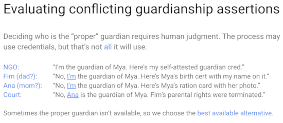

# 0061: Indirect Identity Control
- Author: Daniel Hardman
- Start Date: 2019-05-10

## Status
- Status: [PROPOSED](/README.md#rfc-lifecycle)
- Status Date: 2019-06-04
- Status Note: Currently under study for implementation in various
pilots and POCs.

## Summary

This RFC compares and contrasts three forms of indirect identity control: __delegation__,
__guardianship__, and __controllership__. It then recommends mechanisms that allow identity
technology to model each with flexibility, precision, and safety. These recommendations
can be applied to any decentralized identity and credentialing ecosystem.

## Motivation

In most situations, we expect identity owners to directly control their own identities.
This is the ideal that gives "self-sovereign identity" its name. However, control is
not so simple in many situations:

* A corporation is governed by a Board of Directors, executives, and employees with
  multiple levels of delegated authority. The control relationships are dynamic
  and complex. (__delegation__)

* Parents typically manage the identities of their young children. Adult children may
  need to exercise the identity of a parent with dementia, or of a parent who
  recently passed away. (__guardianship__)

* A self-driving car may be capable of many independent actions, but behind such
  a smart device must be a human entity that takes legal responsibility. (__controllership__)

We need to understand how such situations color the interactions we have
in an identity ecosystem.

## Tutorial

[Appendix C of the Sovrin Glossary V2](
 https://docs.google.com/document/d/1gfIz5TT0cNp2kxGMLFXr19x1uoZsruUe_0glHst2fZ8/edit?pli=1#heading=h.uiq9py7xnmxd)
defines three forms of indirect identity control
relationship--delegation, guardianship, controllership--matching the three
bulleted examples above. Reviewing that document is highly recommended. It is the
product of careful collaboration by experts in many fields, includes useful
examples, and is clear and thorough.

Here, we will simply reproduce two diagrams as a summary:

>Note: The type of delegation described in Appendix C, and the type we focus on
in this doc, is one that crosses identity boundaries. There is another type
that happens _within_ an identity, as Alice delegates work to her various
agents. For the time being, ignore this __intra-identity delegation__; it is
explored more carefully near the end of the [Delegation Details](delegation-details.md) doc.

### Commonalities

All of these forms of identity control share the issue of indirectness. All of them
introduce risks beyond the ones that dominate in direct identity management. All
of them complicate information flows and behavior. And they are inter-related;
guardians and controllers often need to delegate, delegates may become controllers,
and so forth.

The _solutions_ for each ought to have much in common, too--and that is the case. These
forms of indirect identity control use similarly structured credentials in similar
ways, in the context of similarly structured trust frameworks.
Understanding and implementing support for one of them should give developers and
organizations a massive headstart in implementing the others.

Before we provide details about solutions, however, let's explore what's common
and unique about each of the three forms of indirect identity control.

### Compare and Contrast

#### Delegation

Delegation can be either __transparent__ or __opaque__, depending on whether it's
obvious to an external party that a delegate is involved. A lawyer that files a
court motion in their own name, but on behalf of a client, is a transparent delegate.
A nurse who transcribes a doctor's oral instructions may be performing record-keeping
as an opaque delegate, if the nurse is unnamed in the record.

Transparent delegation is safer and provides a better audit trail than opaque delegation.
It is closer to the ethos of self-sovereign identity. However, opaque delegation is
a fact of life; sometimes a CEO wants her personal assistant to send a note or
meeting invitation in a way that impersonates rather than explicitly representing her.

Delegation needs __constraints__. These can take many forms, such as:

##### Constraints

1. Time (for what period(s) delegate has that status)
2. Place (in what physical or virtual locations delegate is approved)
3. Function (legal vs. medical vs. educational)
4. Circumstances (for particular event(s))
5. Biometrics (for delegator involvement)
6. Relationships (who delegate can interact with)
7. Attributes (data/credentials -- what delegate can know or prove about delegator)
8. Agents (what software/devices delegate can use)
9. Cooperation (act as delegate with joint approval of other delegates)
10. Oversight (audit trail, reporting)

Delegation needs to be __revokable__.

Delegates __should not mix identity data__ for themselves with data that may
belong to the delegator.

The rules of how delegation work need to be spelled out in a __trust framework__.

Sometimes, the indirect authority of a delegate should be __recursively extensible__
(allow sub-delegation). Other times, this may be inappropriate.

Use cases and other specifics of delegation are explored in greater depth in the
[Delegation Details](delegation-details.md) doc.

#### Guardianship

Guardianship has all the bolded properties of delegation: transparent or opaque styles,
constraints, revocation, the need to not mix identity data, the need for a
trust framework, and the potential for recursive extensibility. It also adds some
unique considerations.

Since guardianship does not always derive from dependent consent (that is,
the dependent is often unable to exercise sovereignty), the dependent in a guardianship
relationship is particularly vulnerable to abuse from _within_.

Because of this risk, guardianship is the most likely of the three forms of
indirect control to require an __audit trail__ and to involve legal formalities.
Its trust frameworks are typically the most nuanced and complex.

Guardianship is also the form of indirect identity control with the most complications
related to __privacy__.

Guardianship must have a __basis__ -- a justification that explains why the guardian
has that status. Not all bases are equally strong; a child lacking an obvious parent
may receive a temporary guardian, but this guardian's status could change if a parent
is found. Having a formal basis allows conflicting guardianship claims to be adjudicated.

    

Either the guardian _role_ or specific guardianship _duties_ may be delegated. An
example of the former is when a parent leaves on a long, dangerous trip, and appoints
a grandparent to be guardian in their absence. An example of the latter is when a
parent asks a grandparent to drive a child to the school to sign up for the soccer
team. When the guardian _role_ is delegated, the result is a new guardian. When
only guardianship _duties_ are delegated, this is simple delegation and ceases to
be guardianship.

Use cases and other specifics of guardianship are explored in greater depth in the
[Guardianship Details](guardianship-details.md) doc.

#### Controllership

Controllership shares nearly all bolded features with delegation. It is usually
transparent because things are assumed not to control themselves.

Like guardianship, controllership has a basis. Usually, it is rooted in property
ownership, but occasionally it might derive from court appointment. Also like
guardianship, either the _role_ or specific _duties_ of controllership may be
delegated. When controllership involves animals instead of machines, it may
have risks of abuse and complex protections and trust frameworks.

Unlike guardianship, controlled things usually require minimal privacy. However,
things that constantly identify their controller(s) in a correlatable way may undermine
the privacy of controllers in unexpected ways.

Use cases and other specifics of controllership are explored in greater depth in the
[Controllership Details](controllership-details.md) doc.

### Solution

We recommend that all three forms of indirect identity control be modeled with some
common ingredients:

#### Ingredients

* A __proxy trust framework__ that specifies the rules and conventions in force
 for a particular class of indirect identity control use cases.
* A __proxy credential__ that binds a controlled entity to its proxy and
 clarifies the nature and limits of the control for that specific relationship.
* A __proxy challenge__ that evaluates the proxy credential in a particular
 context, proving or disproving the legitimacy of indirect control and creating
 opportunities for auditing and enforcement.

Here, "proxy" is used as a generic cover term for all three forms of indirect
identity control. Each ingredient has a variant for each form (e.g., __delegation
credential__, __guardianship credential__, __controllership credential__), and
they have minor differences. However, they work so similarly that they'll be
described generically, with differences noted where necessary.

##### Proxy Trust Framework

A proxy trust framework is a published, versioned document (or collection
of documents) that's accessible by URI. Writing one doesn't have to be a
massive undertaking; see the [sample guardianship trust framework](
guardianship-sample/trust-framework.md) for a simple example).

It should answer at least the following questions:

1. What is the trust framework's __formal name__, __version__, and __URI__?
(The name cannot include a `/` character due to how it's paired with
version in [credential `type` fields](#cred-type-field). The version must follow
[semver](https://semver.org) rules.)
1. In what __geos__ and __legal jurisdictions__ is it valid?
1. On what __bases__ are proxies appointed? (For guardianship, these might
include values like `kinship` and `court_order`. Each basis needs to be formally
defined, named, and published at a URI, because proxy credentials will reference
them. This question is mostly irrelevant to delegation, where the basis is
always an action of the delegator.)
1. What are the __required and recommended behaviors of a proxy (holder), issuer, and
verifier__? How will this be enforced?
1. What __permissions__ vis-a-vis the proxied identity govern proxy actions?
(For a delegate, these might include values like `sign`, `pay`, or `arrange_travel`.
For a guardian, these might include values like `financial`, `medical`, `do_not_resuscitate`,
`foreign_travel`, or `new_relationships`. Like _bases_, permissions need to be
formally defined and referencable by URI.)
1. What are possible __constraints__ on a proxy? (Constraints are bound to a
particular proxies, whereas a permission model is bound to the identity that
the proxy is controlling. Some constraints might include `geo_radius`,
`jurisdiction`, `biometric_consent_freshness`, and so forth. These values also
need to be formally defined and referencable by URI.)
1. What __auditing mechanisms__ are required, recommended, or allowed?
1. What __appeal mechanisms__ are required or supported?
1. What __proxy challenge procedures__ are best practice?
1. What __freshness rules__ are used for revocation testing and offline mode?

##### Proxy Credential

A proxy credential conforms to the [Verifiable Credential Data Model 1.0](
https://w3c.github.io/vc-data-model/). It can use any style of proof or data
format (JSON-LD, JWT, Sovrin ZKP, etc). It is recognizable as a proxy
credential by the following characteristics:

1. Its `@context` field, besides including the "https://www.w3.org/2018/credentials/v1"
 required by Verifiable Credentials in general, also includes a reference to this spec:
 "https://github.com/hyperledger/aries-rfcs/concepts/0080-indirect-identity-control".

[cred type field](#cred-type-field)
2. Its `type` field contains, in addition to "VerifiableCredential", a string in the
format:

where `form` is one of the letters D (for Delegation), G (for Guardianship), or C
(for controllership), `trust framework` is the name that a Proxy Trust
Framework formally declares for itself, `tfver` is its version, and `variant`
is a specific schema named in the trust framework. A regex that matches this
pattern is: `Proxy[.]([DGC])/([^/]+)/(\d+[^/]*)/(.+)`, and an example of a
matching string is: `Proxy.G/UNICEF Vulnerable Populations Trust Framework/1.0/ChildGuardian`.

2.

## Reference

Provide guidance for implementers, procedures to inform testing,
interface definitions, formal function prototypes, error codes,
diagrams, and other technical details that might be looked up.
Strive to guarantee that:

- Interactions with other features are clear.
- Implementation trajectory is well defined.
- Corner cases are dissected by example.

## Drawbacks

Why should we *not* do this?

## Rationale and alternatives

- Why is this design the best in the space of possible designs?
- What other designs have been considered and what is the rationale for not
choosing them?
- What is the impact of not doing this?

## Prior art

Discuss prior art, both the good and the bad, in relation to this proposal.
A few examples of what this can include are:

- Does this feature exist in other SSI ecosystems and what experience have
their community had?
- For other teams: What lessons can we learn from other attempts?
- Papers: Are there any published papers or great posts that discuss this?
If you have some relevant papers to refer to, this can serve as a more detailed
theoretical background.

This section is intended to encourage you as an author to think about the
lessons from other implementers, provide readers of your proposal with a
fuller picture. If there is no prior art, that is fine - your ideas are
interesting to us whether they are brand new or if they are an adaptation
from other communities.

Note that while precedent set by other communities is some motivation, it
does not on its own motivate an enhancement proposal here. Please also take
into consideration that Aries sometimes intentionally diverges from common
identity features.

## Unresolved questions

- What parts of the design do you expect to resolve through the
enhancement proposal process before this gets merged?
- What parts of the design do you expect to resolve through the
implementation of this feature before stabilization?
- What related issues do you consider out of scope for this 
proposal that could be addressed in the future independently of the
solution that comes out of this doc?
