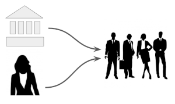
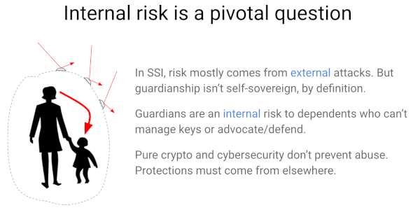

# 0061: Indirect Identity Control
- Author: Daniel Hardman
- Start Date: 2019-05-10

## Status
- Status: [PROPOSED](/README.md#rfc-lifecycle)
- Status Date: 2019-06-04
- Status Note: Currently under study for implementation in various
pilots and POCs.

## Summary

This RFC compares and contrasts three forms of indirect identity control: __delegation__,
__guardianship__, and __controllership__. It then recommends mechanisms that allow identity
technology to model each with flexibility, precision, and safety. These recommendations
can be applied to any decentralized identity and credentialing ecosystem.

## Motivation

In most situations, we expect identity owners to directly control their own identities.
This is the ideal that gives "self-sovereign identity" its name. However, control is
not so simple in many situations:

* A corporation is governed by a Board of Directors, executives, and employees with
  multiple levels of delegated authority. The control relationships are dynamic
  and complex. (__delegation__)

* Parents typically manage the identities of their young children. Adult children may
  need to exercise the identity of a parent with dementia, or of a parent who
  recently passed away. (__guardianship__)

* A self-driving car may be capable of many independent actions, but behind such
  a smart device must be a human entity that takes legal responsibility. (__controllership__)

We need to understand how such situations color the interactions we have
in an identity ecosystem.

## Tutorial

[Appendix C of the Sovrin Glossary V2](
 https://docs.google.com/document/d/1gfIz5TT0cNp2kxGMLFXr19x1uoZsruUe_0glHst2fZ8/edit?pli=1#heading=h.uiq9py7xnmxd)
defines three forms of indirect identity control
relationship--delegation, guardianship, controllership--matching the three
bulleted examples above. Reviewing that document is highly recommended. It is the
product of careful collaboration by experts in many fields, includes useful
examples, and is clear and thorough.

Here, we will simply reproduce two diagrams as a summary:

>Note: The type of delegation described in Appendix C, and the type we focus on
in this doc, is one that crosses identity boundaries. There is another type
that happens _within_ an identity, as Alice delegates work to her various
agents. For the time being, ignore this __intra-identity delegation__; we
will return to it [near the end](#intra-identity delegation).

### Common Foundations

All of these forms of identity control share the issue of indirectness. All of them
introduce risks beyond the ones that dominate in direct identity management. All
of them complicate information flows and behavior. And they are inter-related;
guardians and controllers often need to delegate, delegates may become controllers,
and so forth.

The _solutions_ for each ought to have much in common, too--and that is the case. These
forms of indirect identity control use similarly structured credentials in similar
ways, in the context of similarly structured trust frameworks.
Understanding and implementing support for one of them should give developers and
organizations a massive headstart in implementing the others.

Before we provide details about what's common in their solutions, however, let's explore
them a bit more deeply as separate problems. This will make the unique and common aspects
more obvious.

#### Delegation

Delegation can be either __transparent__ or __opaque__, depending on whether it's
obvious to an external party that a delegate is involved. A lawyer that files a
court motion in their own name, but on behalf of a client, is a transparent delegate.
A nurse who transcribes a doctor's oral instructions may be performing record-keeping
as an opaque delegate, if the nurse is unnamed in the record.

Transparent delegation is safer and provides a better audit trail than opaque delegation.
It is closer to the ethos of self-sovereign identity. However, opaque delegation is
a fact of life; sometimes a CEO wants her personal assistant to send a note or
meeting invitation in a way that impersonates rather than explicitly representing her.

Delegation needs __constraints__. These can take many forms, such as:

##### Constraints

1. Time (for what period(s) delegate has that status)
2. Place (in what physical or virtual locations delegate is approved)
3. Function (legal vs. medical vs. educational)
4. Circumstances (for particular event(s))
5. Biometrics (for delegator involvement)
6. Relationships (who delegate can interact with)
7. Attributes (data/credentials -- what delegate can know or prove about delegator)
8. Agents (what software/devices delegate can use)
9. Cooperation (act as delegate with joint approval of other delegates)
10. Oversight (audit trail, reporting)

Delegation needs to be __revokable__.

Delegates __should not mix identity data__ for themselves with data that may
belong to the delegator.

The rules of how delegation work need to be spelled out in a __trust framework__.

Sometimes, the indirect authority of a delegate should be __recursively extensible__
(allow sub-delegation). Other times, this may be inappropriate.

#### Guardianship

Except for recursive extension, guardianship has all the bolded properties of delegation.
Guardianship also adds some unique considerations.

Since guardianship does not always derive from the choices of the dependent (that is,
the dependent is often unable to exercise sovereignty), the dependent in a guardianship
relationship is particularly vulnerable to abuse from _within_.

Because of this risk, guardianship is the most likely of the three forms of
indirect control to require an __audit trail__ and to involve legal formalities.

Guardianship is also the form of indirect identity control with the most complications
related to __privacy__.

Guardianship must have a __basis__ -- a justification that explains why the guardian
has that status. Not all bases are equally strong; a child lacking an obvious parent
may receive a temporary guardian, but this guardian's status could change if a parent
is found. Having a formal basis allows conflicting guardianship claims to be adjudicated.

#### Controllership

It often requires legal adjudication, and
therefore

The theory of delegation with DIDs and credentials has been explored thoughtfully
in many following places. The emergent consensus is:

1. __Formal delegation is best accomplished with a credential__. This creates an audit
trail, makes it possible to declare and enforce limits on what the delegate can do,
takes advantage of standard verification and revocation features, and makes recursive
delegation possible but not automatic.

2. __Informal__ (undeclared, invisible) __delegation could be accomplished
by granting access to a shared wallet__. However, this [introduces risks of
abuse](https://docs.google.com/presentation/d/1-nEPpomAhhm6HPZf9C1o-rEljSNNKj-i4NuXjIW8BLI/edit#slide=id.g572b6fbf26_0_63)
that make it unsuitable for use cases requiring high standards of
security, accountability, and privacy.

For more information about how delegation works, see [delegation
details](delegation.md).

### Implementing Guardianship

Guardianship is

## Reference

Provide guidance for implementers, procedures to inform testing,
interface definitions, formal function prototypes, error codes,
diagrams, and other technical details that might be looked up.
Strive to guarantee that:

- Interactions with other features are clear.
- Implementation trajectory is well defined.
- Corner cases are dissected by example.

## Drawbacks

Why should we *not* do this?

## Rationale and alternatives

- Why is this design the best in the space of possible designs?
- What other designs have been considered and what is the rationale for not
choosing them?
- What is the impact of not doing this?

## Prior art

Discuss prior art, both the good and the bad, in relation to this proposal.
A few examples of what this can include are:

- Does this feature exist in other SSI ecosystems and what experience have
their community had?
- For other teams: What lessons can we learn from other attempts?
- Papers: Are there any published papers or great posts that discuss this?
If you have some relevant papers to refer to, this can serve as a more detailed
theoretical background.

This section is intended to encourage you as an author to think about the
lessons from other implementers, provide readers of your proposal with a
fuller picture. If there is no prior art, that is fine - your ideas are
interesting to us whether they are brand new or if they are an adaptation
from other communities.

Note that while precedent set by other communities is some motivation, it
does not on its own motivate an enhancement proposal here. Please also take
into consideration that Aries sometimes intentionally diverges from common
identity features.

## Unresolved questions

- What parts of the design do you expect to resolve through the
enhancement proposal process before this gets merged?
- What parts of the design do you expect to resolve through the
implementation of this feature before stabilization?
- What related issues do you consider out of scope for this 
proposal that could be addressed in the future independently of the
solution that comes out of this doc?
