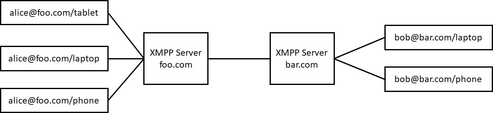

# 0024: DIDComm over XMPP
- Authors: Oskar van Deventer (oskar.vandeventer@tno.nl), Galit Rahim (galit.rahim@tno.nl), Alexander Blom (alexander.blom@bloqzone.com)
- Start Date: 2019-04-23

## Status
- Status: [PROPOSED](/README.md#rfc-lifecycle)
- Status Date: 2019-06-14
- Status Note: Supersedes [Indy DIDComm-over-XMPP](https://github.com/Oskar-van-Deventer/indy-hipe/tree/master/text/didcom-over-xmpp), moving from Indy to Aries.

## Summary

While DIDComm leaves its users free to choose any underlying communication protocol, for peer-to-peer DID relationships with one or both parties behind a firewall actually getting the messages to the other party is not straightforward.  

Fortunately this is a classical problem, encountered by all realtime communication protocols, and it is therefore natural to use one of these protocols to deal with the obstacles posed by firewalls. The DIDComm-over-XMPP feature provides an architecture to exchange DIDComm connection protocol messages over XMPP, using XMPP to solve any firewall issues.

DIDComm-over-XMPP enables:

- Initiation, use, maintenance and termination of a trusted electronic relationship
- DIDComm agents being available for incoming DIDComm messages despite being behind a firewall
- Binding of that relationship to a human-to-human communication channel

and all of this in spite of the presence of firewalls.

*Editor's note: A reference should be added to [Propose HIPE: Transports  #94](https://github.com/hyperledger/indy-hipe/pull/94)*

## Motivation

Currently, all examples of service endpoint in the W3C DID specification use HTTP. This assumes that the endpoint is running an HTTP server and firewalls have been opened to allow this traffic to pass through. This assumption typically fails for DIDComm agents behind LAN firewalls or using cellular networks. As a consequence, such DIDComm agents can be expected to be unavailable for incoming DIDComm messages, whereas several use cases require this. The following is an example of this.

A consumer contacts a customer service agent of his health insurance company, and is subsequently asked for proof of identity before getting answers to his personal health related questions. DIDcom could be of use here, replacing privacy sensitive and time consuming questions in order to establish the consumers' identity with an exchange of verifiable credentials using DIDcom.  In that case, the agent would just send a DIDComm message to the caller to link the ongoing human-to-human communication session to a DIDComm agent-to-agent communication session. The DIDComm connection protocol would then enable the setting up and maintenance of a trusted electronic relationship, to be used to exchange verifiable credentials. Replace insurance company with any sizeable business to consumer company and one realizes that this use case is far from insignificant.

Unfortunately, by itself, the parties DIDcom agents will be unable to bypass the firewalls involved and exchange DIDcom messages. Therefore XMPP is called to the rescue to serve as the transport protocol which is capable with firewalls. Once the firewalls issue is solved, DIDcom can be put to use in all of these cases.  

**The XMPP protocol is a popular protocol for chat and messaging. It has a client-server structure that bypasses any firewall issues.**

## Tutorial

The DIDComm-over-XMPP feature provides an architecture for the transport of DIDComm messages over an XMPP network, using XMPP to bypass any firewalls at the receiving side.

### DIDComm

The DIDComm wire message format is specified in [HIPE 0028-wire-message-format](https://github.com/hyperledger/indy-hipe/tree/master/text/0028-wire-message-format). It can carry among others the DIDComm connection protocol, as specified in [Hyperledger Indy Hipe 0031](https://github.com/hyperledger/indy-hipe/tree/master/text/0031-connection-protocol). The purpose of the latter protocol is to set up a trusted electronic relationship between two parties (natural person, legal person, ...). Technically, the trust relationship involves the following

- Univocal identification of the parties within the context of the relationship
- Secure exchange of keys to encrypt and verify messages between agents of the parties
- Secure exchange of service end points to be reachable at in the future
- Secure exchange of verifiable credentials and other messages that require secure exchange

W3C specifies [Data Model and Syntaxes for Decentralized Identifiers (DIDs)](https://w3c-ccg.github.io/did-spec/). This specification introduces Decentralized Identifiers, DIDs, for identification. A DID can be resolved into a DID Document that contains the associated keys and service endpoints, see also W3C's [A Primer for Decentralized Identifiers](https://w3c-ccg.github.io/did-primer/). W3C provides a [DID Method Registry](https://w3c-ccg.github.io/did-method-registry/) for a complete list of all known DID Method specifications. Many of the DID methods use an unambiguous source of truth to resolve a DID Document, e.g. a well governed public blockchain. An exception is the [Peer DID method](https://dhh1128.github.io/peer-did-method-spec/index.html) that relies on the peers, i.e. parties in the trusted electronic relationship to maintain the DID Document.

### XMPP

Extensible Messaging and Presence Protocol (XMPP) is a communication protocol for message-oriented middleware based on XML (Extensible Markup Language). It enables the near-real-time exchange of structured yet extensible data between any two or more network entities. Designed to be extensible, the protocol has been used also for publish-subscribe systems, signalling for VoIP, video, file transfer, gaming, the Internet of Things applications such as the smart grid, and social networking services.

Unlike most instant messaging protocols, XMPP is defined in an open standard and uses an open systems approach of development and application, by which anyone may implement an XMPP service and interoperate with other organizations' implementations. Because XMPP is an open protocol, implementations can be developed using any software license and many server, client, and library implementations are distributed as free and open-source software. Numerous freeware and commercial software implementations also exist.

XMPP uses 3 types of messages:

| Message Type  | Description                               |
| ------------- |:-------------:                            |
| PRESENSE      | Inform listeners that agent is online     |
| MESSAGE       | Sending message to other agent            |
| IQ MESSAGE    | Asking for response from other agent      |





## DIDComm over XMPP

### Use of MESSAGE (normative)

A DIDComm wire message shall be sent send as plaintext XMPP MESSAGE, without any additional identifiers.

### Service endpoint (normative)

A DIDComm-over-XMPP service shall comply to the following.

1. The id shall have a DID fragment "#xmpp".
2. The type shall be "XmppService". 
3. The serviceEndpoint
   - shall not have a resource part (i.e. "/...resource...")
   - shall comply to the following [ABNF](https://tools.ietf.org/html/rfc5234).

```
xmpp-service-endpoint = "xmpp:" userpart "@did." domainpart
  userpart = 1\*CHAR
  domainpart = 1\*CHAR 1\*("." 1\*char)
  CHAR = %x01-7F
```

The reason for not allowing a resources part is that DIDComm messages are addressed to the person/entity associated with the DID, and not to any particular device. 

A receiving XMPP client shall identify an incoming XMPP message as a DIDComm message, if the serviceEndpoint complies to the above. It shall pass any DIDComm message to its DIDComm agent.

The following is an example of a complient DIDComm-over-XMPP service endpoint.

```
{
  "service": [{
    "id": "did:example:123456789abcdefghi#xmpp",
    "type": "XmppService",
    "serviceEndpoint": "xmpp:bob@did.bar.com"
  }]
}
```

### Userpart generation (informative)

There are multiple methods how the userpart of the DIDComm-over-XMPP serviceEndpoint may be generated.

*Editor's note: Should the description below be interpreted as informative, or should there be any signalling to indicate which userpart-generating method was used?*

**Method 1: Same userpart as for human user**

In this method, the userpart is the same as used for human-to-human XMPP-based chat, and the resource part is removed. Here is an example.

```
Human-to-human XMPP address: xmpp:alice@foo.com/phone
-->
DIDComm-over-XMPP serviceEndpoint: xmpp:alice@did.foo.com
```

The advantage of this method is its simplicity. An XMPP servicer needs to be configured only once to support this convention. No further registration actions are needed by any of the the users for its XMPP clients.

The disadvantage of this method is that it creates a strong correlation point, which may conflict with privacy requirements.

*Editor's note: More advantages or disadvantages?*

A typical application of Method 1 is when there is an ongoing human-to-human (or human-to-bot) chat session that uses XMPP and the two parties what to set up a pairwise DID relationship. One can skip Step 0 "Invitation to Connect" ([HIPE 0031](https://github.com/hyperledger/indy-hipe/tree/master/text/0031-connection-protocol)) and immediately perform Step 1 "Connection Request".

**Method 2: Random userpart**

In this method, the userpart is randomly generated by either the XMPP client or the XMPP server, and it is rotated at a regular basis. Here is an example.

```
DIDComm-over-XMPP serviceEndpoint: xmpp:RllH91rcFdE@did.foo.com 
```

The advantage of this method is low correlation and hence high privacy. If the DIDComm-over-XMPP serviceEndpoint is rotated after each set of XMPP exchange ("session"), then it cannot be correlated with subsequent XMPP exchanges.

The disadvantage of this method is the high operational complexity of this method. It requires a client to keep a reserve of random XMPP addresses with the XMPP server. It significantly increases the routing tables of the XMPP server. It also places a burden on both DIDComm agents, because of the rapid rotation of DID Documents.

*Editor's note: More advantages or disadvantages?*

## Reference
[reference]: #reference

For use of XMPP, it is recommended to use [Openfire Server](https://www.igniterealtime.org/projects/openfire/) open source project, including 2 plugins to enable server caching and message carbon copy. This will enable sending DIDcom to mulitple endpoints of the same person.

*Editor's note: Add references to the 2 plugins*

XMPP servers handle messages sent to a user@host (or "bare") XMPP address with no resource by delivering that message only to the resource with the highest priority for the target user. Some server implementations, however, have chosen to send these messages to all of the online resources for the target user. If the target user is online with multiple resources when the original message is sent, a conversation ensues on one of the user's devices; if the user subsequently switches devices, parts of the conversation may end up on the alternate device, causing the user to be confused, misled, or annoyed.

To solve this is is recommended to use the plugin "Message Carbons". It will ensure that all of target user devices get both sides of all conversations in order to avoid user confusion. As a pleasant side-effect, information about the current state of a conversation is shared between all of a user's clients that implement this protocol.

*Editor's note: Add reference to "Message Carbons"*

## Drawbacks
[drawbacks]: #drawbacks

*Editor's note: Add drawbacks*

## Rationale and alternatives
[alternatives]: #alternatives

All service endpoint examples from W3C's [Data Model and Syntaxes for Decentralized Identifiers (DIDs)](https://w3c-ccg.github.io/did-spec/) are HTTP. So if a consumer would want to be reachable for incoming DIDComm messages, then it should run an HTTP service on its consumer device and take actions to open firewalls (and handle network-address translations) towards its device. Such scenario is technically completely unrealistic, not to mention the security implications of such scenario.

XMPP was specifically designed for incoming messages to consumer devices. XMPP's client-server structure overcomes any firewall issues.

## Prior art
[prior-art]: #prior-art

*Editor's note: Add prior art*

## Unresolved questions
[unresolved]: #unresolved-questions

*Editor's note: Any unresolved questions?*

## Security considerations
[security]: #security-considerations

*Editor's note: Add security considerations*
