# 0028: Introduce Protocol 1.0

- Authors: Daniel Hardman, Sam Curren, Stephen Curran, Tobias Looker
- Start Date: 2019-03-27

## Status
- Status: [PROPOSED](/README.md#rfc-lifecycle)
- Status Date: 2019-04-15
- Status Note: Referenced in some discussions about the peer DID method spec and n-wise
  DIDs, but not yet implemented.

## Summary

Describes how a go-between can introduce two parties that
it already knows, but that do not know each other.

## Motivation
[motivation]: #motivation

Introductions are a fundamental activity in human relationships. They allow
us to bootstrap contact information and trust. They are also a source of
virality. We need a standard way to do introductions in an SSI ecosystem,
and it needs to be flexible, secure, privacy-respecting, and well documented.

## Tutorial
[tutorial]: #tutorial

### Name and Version

This is the Introduce 1.0 protocol. It is uniquely identified by the URI:

    "did:sov:BzCbsNYhMrjHiqZDTUASHg;spec/introduce/1.0"

### Key Concepts

##### Basic Use Case

Introductions target scenarios like this:

>Alice knows Bob and Carol, and can talk to each of them. She 
wants to introduce them in a way that allows a relationship to form.

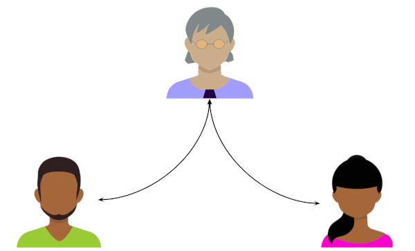

This use case is worded carefully; it is far more adaptable than it may
appear at first glance. The [Advanced Use Cases](#advanced-use-cases)
section later in the doc explores many variations. But the early part
of this document focuses on the simplest reading of the use case.

##### Goal

When we introduce two friends, we may hope that a new friendship ensues.
But technically, the introduction is complete when we provide the
opportunity for a relationship--what the parties do with that opportunity
is a separate question.

Likewise, the goal of our formal introduction protocol should be crisply
constrained. Alice wants to gather consent and contact information
from Bob and Carol; then she wants to invite them to connect. What they
do with her invitation after that is not under her control, and is outside
the scope of the introduction.

This suggests an important insight about the relationship between the
introduce protocol and the [DID exchange protocol](
../0023-did-exchange/README.md):
*they overlap*. The invitation to form a relationship, which
begins the connection protocol, is also the final step in an
introduction.

Said differently, *the goal of the introduce protocol is to start the
connect protocol*.

##### Transferring Trust

[TODO: talk about how humans do introductions instead of just introducing
themselves to strangers because it raises trust. Example of Delta Airlines
introducing you to Heathrow Airport; you trust that you're really talking
to Heathrow based on Delta's asertion.]

### Roles

There are three [TODO:do we want to support introducing more than 2 at a time?]
participants in the protocol, but only two roles.

The __introducer__ begins the process and must know the other two parties.
Alice is the introducer in the diagram above. The other two participants
are both __introducees__.

### States

In a successful introduction, the introducer state progresses from
`[start] -> arranging -> delivering -> confirming (optional) -> [done]`.

Meanwhile, each introducee progresses from `[start] -> deciding -> waiting
-> [done]`.

Of course, errors and optional choices complicate the possibilities. The
full state machine for each party are:

[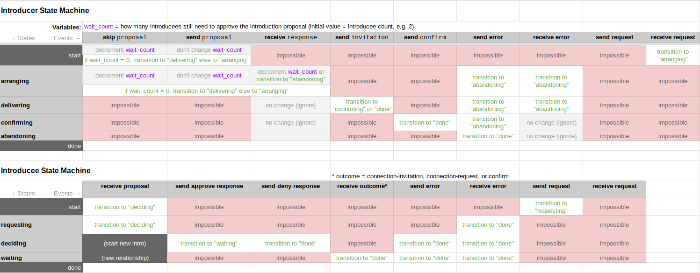](https://docs.google.com/spreadsheets/d/1jjLQMCXWCN3nuXUg8mSpJQlzXGlYeo1n0W9yNuYJQLM/edit)

The subtleties are explored in the [Advanced Use Cases](#advanced-use-cases)
section.

### Messages

##### `proposal`

This message informs an introducee that an introducer wants to perform
an introduction, and requests approval to do so. It works the same way
that proposals do in [double-opt-in introductions](
https://avc.com/2009/11/the-double-optin-introduction/) in the
non-agent world:
    
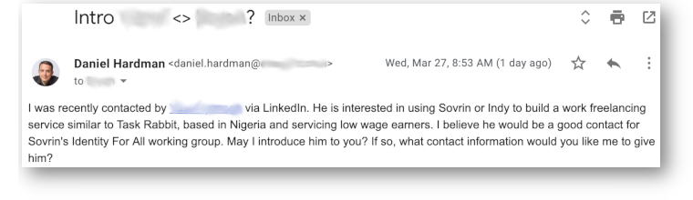

The DIDComm message looks like this:

[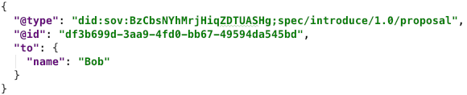](simple-proposal.json)

The `to` field contains an __introducee descriptor__ that provides
context about the introduction, helping the party receiving the proposal
to evaluate whether they wish to accept it. Depending on how much context
is available between introducer and introducee independent of the formal
proposal message, this can be as simple as a name, or something fancier (see
[Advanced Use Cases](#advanced-use-cases) below). 

##### `response`

A standard example of the message that an introducee sends in response
to an introduction proposal would be:

[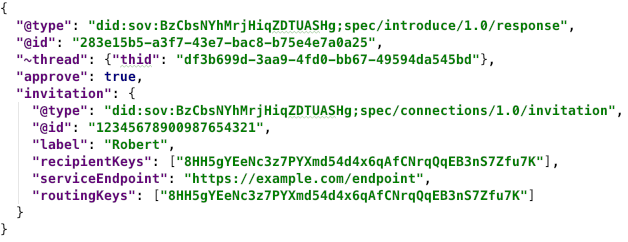](simple-response-did.json)

A simpler response, also valid, might look like this:

[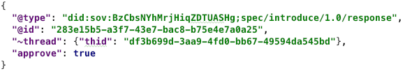](simple-response-other.json)

The difference between the two forms is whether the response contains
a valid `connection-invitation` message. Normally, it should--but sometimes,
an introducee may not be able to (or may not want to) share a DIDComm 
endpoint to facilitate the introduction. In such cases, the stripped-down
variant may be the right choice. See the [Advanced Use Cases](#advanced-use-cases)
section for more details.

At least one of the more complete variants must be received by an
introducer to successfully complete the introduction, because the final step in
the protocol is to begin the [connection protocol](
https://github.com/hyperledger/indy-hipe/blob/master/text/0031-connection-protocol/README.md)
by forwarding the `connection-invitation` message from one introducee
to the other.

##### `connection-invitation`

This message is not a member of the `introductions/1.0` message family;
it is not even adopted. It is part of the `connections/1.0` family, and
is no different from the message that two parties would generate when one
invites the other with no intermediary, except that:

* It is delivered by the introducer, not by either of the introducees.
* It has a `~thread` decorator that identifies the introduction as
its parent thread.
* If introducees already have DIDComm capabilities, it can be delivered over
standard DIDComm channels. If one of the introducees does NOT have a DID-based
channel with the introducer, then the invitation must be delivered to that
introducee/invitee, using the non-DIDComm channel. [TODO: is there a way for
the introducer, rather than the other introducee, to "sponsor" the introducee
that needs SSI onboarding?]
* If the invitation is delivered over a DIDComm channel, it is unusual
in that it is from a party other than the one that owns the channel.

##### `request`

An optional message in this family is one that asks for an introduction to be
made. This message also uses the `introducee descriptor` block, to tell
the potential introducer which introducee is the object of the sender's
interest:

[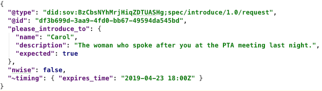](request.json)

This message is not part of any state machine; it can be sent at any time,
and when it is received, the recipient can choose whether or not to honor
it in their own way, on their own schedule. However, a `~please_ack` decorator
could be used to make it more interactive, and a `problem-report` could be
returned if the recipient chooses not to honor it.

### Advanced Use Cases

Any of the parties can be an organization or thing instead of a person. 

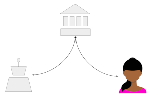

Bob and Carol may actually know each other already, without Alice realizing
it. The introduction may be rejected. It may create a new pairwise
relationship between Bob and Carol that is entirely invisible to Alice.
Or it may create an n-wise relationship in which Alice, Bob, and Carol know
one another by the same identifiers.

Some specific examples follow.

#### One introducee can't do DIDComm

The [connection protocol](
https://github.com/hyperledger/indy-hipe/blob/master/text/0031-connection-protocol/README.md)
allows the invited party to be onboarded (acquire software and an agent)
as part of the workflow.

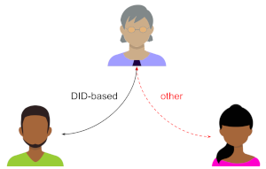

Introductions support this use case, too. In such a case, the introducer
sends a standard `proposal` to the introducee that DOES have DIDComm
capabilities, but conveys the equivalent of a `proposal` over a
non-DIDComm channel to the other introducee. The `response` from the
DIDComm-capable introducee must include a `connection-invitation` with
a deep link for onboarding, and this is sent to the introducee that needs
onboarding.

#### Neither introducee can do DIDComm

In this case, the introducer first goes through onboarding via the
connection protocol with one introducee. Once that introducee can do DIDComm,
the previous workflow is used.

#### Introducer doesn't have DIDComm capabilities

This might happen if AliceCorp wants to connect two of its customers.
AliceCorp may not be able to talk to either of its customers over
DIDComm channels, but it doesn't know whether they can talk to each
other that way.

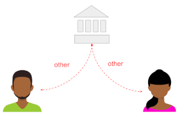

In this case, the introducer conveys the same information that a
`proposal` would contain, using non-DIDComm channels. As long as one
of the introducees sends back some kind of response that includes
approval and a `connection-invitation`, the invitation can be
delivered. The entire interaction is DIDComm-less.

#### One introducee has a public DID with a standing invitation

This might happen if Alice wants to introduce Bob to CarolCorp, and
CarolCorp has published a `connection-invitation` for general use.

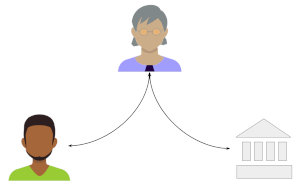

As introducer, Alice simply has to forward CarolCorp's `connection-invitation`
to Bob. No `proposal` message needs to be sent to CarolCorp;
this is the `skip proposal` event shown in the introducer's
state machine.

#### Proposal initiated by introducee
[TODO: Alice is still doing the intro, but Bob now asks Alice to introduce
him to Carol. Is this the same proposal message type, just with a field
indicating that he's proposing to Alice that *she* do the intro? Or is it
a different message?]

#### Requesting confirmation
[TODO: A field in the `response` where an introducee asks to be notified
that the introduction has been made?]

#### Other stuff
* Using acks to report status of introduction efforts.
* Timeouts.
* Introducing multiple parties at the same time?

[TODO: What if Alice is introducing Bob, a public entity with no connection to
her, to Carol, a private person? Can she just relay Bob's invitation that
he published on his website? Are there security or privacy implications?
What if she is introducing 2 public entities and has a connection to neither?]

## Reference
[reference]: #reference

### `proposal`

In the tutorial narrative, only a simple proposal was presented. A
fancier version might be:

[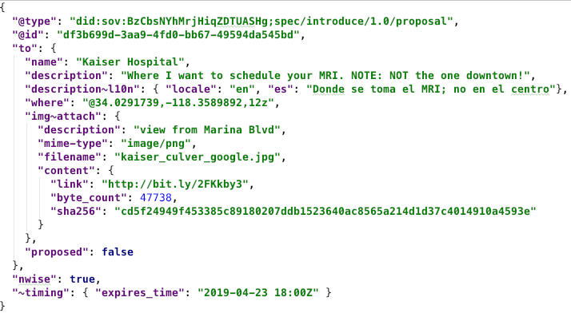](fancy-proposal.json)

This adds a number of fields to the introducee descriptor. Each is optional
and may be appropriate in certain circumstances. Most should be self-explanatory,
but the `proposed` field deserves special comment. This tells whether the
described introducee has received a proposal of their own, or will be
introduced without that step.

This example also adds the `nwise` field to the proposal. When `nwise` is
present and its value is `true`, the proposal is to establish an nwise
relationship in which the introducer participates, as opposed to a pairwise
relationship in which only the introducees participate.

[TODO: do we care about having a response signed? Security? MITM?]

### Errors
[TODO: What can go wrong.]

### Localization
[TODO: the `description` field in an introducee descriptor. Error codes/catalog.]

## Drawbacks

Why should we *not* do this?

## Rationale and alternatives

- Why is this design the best in the space of possible designs?
- What other designs have been considered and what is the rationale for not
choosing them?
- What is the impact of not doing this?

## Prior art

Discuss prior art, both the good and the bad, in relation to this proposal.
A few examples of what this can include are:

- Does this feature exist in other SSI ecosystems and what experience have
their community had?
- For other teams: What lessons can we learn from other attempts?
- Papers: Are there any published papers or great posts that discuss this?
If you have some relevant papers to refer to, this can serve as a more detailed
theoretical background.

This section is intended to encourage you as an author to think about the
lessons from other implementers, provide readers of your proposal with a
fuller picture. If there is no prior art, that is fine - your ideas are
interesting to us whether they are brand new or if they are an adaptation
from other communities.

Note that while precedent set by other communities is some motivation, it
does not on its own motivate an enhancement proposal here. Please also take
into consideration that Indy sometimes intentionally diverges from common
identity features.

## Unresolved questions

- What parts of the design do you expect to resolve through the
enhancement proposal process before this gets merged?
- What parts of the design do you expect to resolve through the
implementation of this feature before stabilization?
- What related issues do you consider out of scope for this 
proposal that could be addressed in the future independently of the
solution that comes out of this doc?
