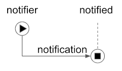

# Abandon Connection Protocol 1.0

## Summary

Describes how parties using [peer DIDs](
https://openssi.github.io/peer-did-method-spec) can notify one another
that they are abandoning the connection.

## Motivation

We need a way to tell another party that we are abandoning the connection.
This is not strictly required, but it is good hygiene.

## Tutorial

### Name and Version

This RFC defines the `abandon_connection` protocol, version 1.x, as identified by the
following [PIURI](../../../concepts/0003-protocols/uris.md#piuri):

    did:sov:BzCbsNYhMrjHiqZDTUASHg;spec/abandon_connection/1.0

Of course, subsequent evolutions of the protocol will replace `1.0` with
an appropriate update per [semver](../../../concepts/0003-protocols/semver.md)
rules.

### Roles

This is a [classic one-step notification](
https://github.com/hyperledger/aries-rfcs/blob/master/concepts/0003-protocols/README.md#types-of-protocols),
so it uses the predefined roles of `notifier` and `notified`.



### State Machines

No state changes _during_ this protocol, although overarching state could
change once it completes. Therefore no state machines are required.
 
### Messages

##### `announce`

This message is used to announce that a party is abandoning the relationship. In a self-sovereign
paradigm, abandoning a relationship can be done unilaterally, and does not require formal
announcement. Indeed, sometimes a formal announcement is impossible, if one of the parties
is offline. So while using this message is encouraged and best practice, it is not mandatory.

An `announce` message from Alice to Bob looks like this:

```json
{
  "@type": "did:sov:BzCbsNYhMrjHiqZDTUASHg;spec/abandon_connection/1.0/announce",
  "@id": "c17147d2-ada6-4d3c-a489-dc1e1bf778ab",
  "~please_ack": {}
}
```

If Bob receives a message like this, he should assume that Alice no longer considers
herself part of "us", and take appropriate action. This could include destroying
data about Alice that he has accumulated over the course of their relationship,
removing her peer DID and its public key(s) and endpoints from his wallet, and so
forth. The nature of the relationship, the need for a historical audit trail, regulatory
requirements, and many other factors may influence what's appropriate; the protocol
simply requires that the message be understood to have permanent termination semantics.

It may be desirable to use the [`~please_ack` decorator](
../../0015-acks/README.md#requesting-an-ack-please_ack)
to request acknowledgment that the severance has been processed. The example shows
this, but including it is optional.

##### `ack`

The [`ack` message](../../0015-acks/README.md#explicit-acks) is [adopted](
../../../concepts/0003-protocols/template.md#adopted-messages) into this protocol. If an
`announce` message includes the
`~please_ack` decorator and the ack is sent, it looks something like this:

```json
{
"@type": "did:sov:BzCbsNYhMrjHiqZDTUASHg;spec/abandon_connection/1.0/ack",
"@thread": { "thid": "c17147d2-ada6-4d3c-a489-dc1e1bf778ab" }
}
```
