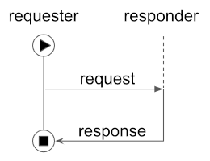
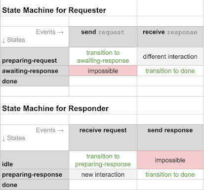

# Query Connection State Protocol 1.0

## Summary

Describes how parties using [peer DIDs](
https://openssi.github.io/peer-did-method-spec) can ask one another
to resolve DIDs to DID docs. This is considered a minor protocol
because synchronizing DID docs, not simply resolving a peer
DID to a DID doc, will be the more common and more robust operation.
See the [Sync Connection Protocol](../README.md).

## Motivation

We need a way to ask another party to do simple resolution of peer
DIDs for us.

## Tutorial

### Name and Version

This RFC defines the `query_connection_state` protocol, version 1.x, as identified by the
following [PIURI](../../../concepts/0003-protocols/uris.md#piuri):

    did:sov:BzCbsNYhMrjHiqZDTUASHg;spec/query_connection_state/1.0

Of course, subsequent evolutions of the protocol will replace `1.0` with
an appropriate update per [semver](../../../concepts/0003-protocols/semver.md)
rules.

### Roles

This is a [classic two-step request-response interaction](
https://github.com/hyperledger/aries-rfcs/blob/master/concepts/0003-protocols/README.md#types-of-protocols),
so it uses the predefined roles of `requester` and `responder`.



### State Machines

The state machines for this protocol are standard, too:

[](https://docs.google.com/spreadsheets/d/1smY8qhG1qqGs0NH9g2hV4b7mDqrM6MIsmNI93tor2qk/edit)
 
### Messages

##### `state_request`

This message is sent by the `requester`. It asks the `responder` to report the
state it knows for a particular connection. It is essentially a request for a DID doc,
so it plays the same role as DID resolution to a DID doc when a ledger is queried. It
looks like this:

```JSON
{
  "@type": "did:sov:BzCbsNYhMrjHiqZDTUASHg;spec/query_connection_state/1.0/state_request",
  "@id": "6a4986dd-f50e-4ed5-a389-718e61517207",
  "for": "did:peer:11-479cbc07c3f991725836a3aa2a581ca2029198aa420b9d99bc0e131d9f3e2cbe",
  "as_of_hash": "d48f058771956a305e12a3b062a3ac81bd8653d7b1a88dd07db8f663f37bf8e0",
  "as_of_time": "2019-07-23 18:05:06.123Z"
}
```

The properties of this message include:

* `@type` and `@id`: Required. Standard for DID Comm messages.
* `for`: Required. A DID that identifies which state is being queried.
* `as_of_time`: Optional. The timestamp for which state is being queried. If
this property is omitted or equal to `null`, and `as_of_hash` is also
omitted, then the state as of "now" is what the sender is asking for.
* `as_of_hash`: Optional, and mutually exclusive with `as_of_time`. Identifies
a specific state that is being queried, by
the [hash of that state](#state-hashes). Optional. Using this property
is somewhat unusual, because the sender of the message has to know
to know of a state's hash, without knowing the state itself. This may be
helpful for advanced use cases.

The two optional properties are rarely used. The simplest and most
common form of the message contains only `@type`, `@id`, and `for`.

Familiar DID Communications [decorators](
../../../concepts/0011-decorators/README.md) can be used with this message.
For example, to note that the request will expire or grow stale if
not serviced quickly, [`~timing.expires_time` or `~timing.stale_time`](
../../0032-message-timing/README.md#tutorial)
can be added. Other decorators could be used to describe the preferred
route to use in the return response, and so forth.

##### `state_response`

This message is the response to a `state_request` message, and looks like this:

```jsonc
{
  "@type": "did:sov:BzCbsNYhMrjHiqZDTUASHg;spec/query_connection_state/1.0/state_response",
  "@id": "1517207d-f50e-4ed5-a389-6a4986d718e6",
  "~thread": { "thid": "6a4986dd-f50e-4ed5-a389-718e61517207" },
  "for": "did:peer:11-479cbc07c3f991725836a3aa2a581ca2029198aa420b9d99bc0e131d9f3e2cbe",
  "did_doc": { 
      // full content of resolved variant of DID Doc here  
  },
  "as_of_time": "2019-07-23 18:05:06.123Z"
}
```
