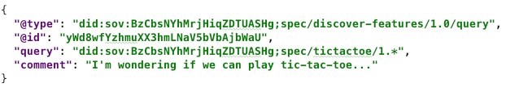
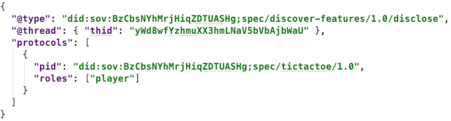
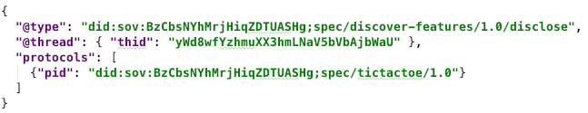
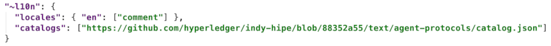
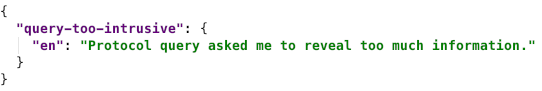

# 0031: Discover Features Protocol 1.0
- Author: Daniel Hardman
- Start Date: 2018-12-17

## Status
- Status: [ACCEPTED](/README.md#rfc-lifecycle)
- Status Date: 2019-05-01
- Status Note: Reached FCP status in Indy. Implemented in at least two codebases.
  Supersedes [Indy RFC PR #73](https://github.com/hyperledger/indy-hipe/pull/73).

## Summary

Describes how agents can query one another to discover which features
it supports, and to what extent.

## Motivation
[motivation]: #motivation

Though some agents will support just one protocol and will be
statically configured to interact with just one other party, many
exciting uses of agents are more dynamic and unpredictable. When
Alice and Bob meet, they won't know in advance which features are
supported by one another's agents. They need a way to find out.

## Tutorial
[tutorial]: #tutorial

This RFC introduces a protocol for discussing the protocols an agent
can handle. The identifier for the message family used by this protocol is
`discover-features`, and the fully qualified URI for its definition is:

    did:sov:BzCbsNYhMrjHiqZDTUASHg;spec/discover-features/1.0
    
### Roles

There are two roles in the `discover-features` protocol: `requester` and
`responder`. The requester asks the responder about the protocols it
supports, and the responder answers. Each role uses a single message type.

### States

This is a classic two-step request~response interaction, so it uses the
predefined state machines for any `requester` and `responder`:

### Messages
##### `query` Message Type

A `discover-features/query` message looks like this:

Query messages say, "Please tell me what your capabilities are with
respect to the protocols that match this string." This particular example
asks if another agent knows any 1.x versions of the [tictactoe protocol](
../../concepts/0003-protocols/tictactoe/README.md
).

The `query` field may use the * wildcard. By itself, a query with just
the wildcard says, "I'm interested in anything you want to share with
me." But usually, this wildcard will be to match a prefix that's a little
more specific, as in the example that matches any 1.x version.

Any agent may send another agent this message type at any time.
Implementers of agents that intend to support dynamic relationships
and rich features are *strongly* encouraged to implement support
for this message, as it is likely to be among the first messages
exchanged with a stranger.

##### `disclose` Message Type

A `discover-features/disclose` message looks like this:

The `protocols` field is a JSON array of __protocol support descriptor__
objects that match the query. Each descriptor has a `pid` that contains
a protocol version (fully qualified message family identifier such as
`did:sov:BzCbsNYhMrjHiqZDTUASHg;spec/tictactoe/1.0`), plus a `roles`
array that enumerates the roles the responding agent
can play in the associated protocol.

Response messages say, "Here are some protocols I support that matched
your query, and some things I can do with each one."

##### Sparse Responses

Responses do not have to contain exhaustive detail. For example, the following
response is probably just as good:

The reason why less detail probably suffices is that agents do not need to
know everything about one another's implementations in order to start an
interaction--usually the flow will organically reveal what's needed. For
example, the `outcome` message in the `tictactoe` protocol isn't needed
until the end, and is optional anyway. Alice can start a tictactoe game
with Bob and will eventually see whether he has the right idea about
`outcome` messages.

The missing `roles` in this response does not say, "I support no roles
in this protocol." It says, "I support the protocol but
I'm providing no detail about specific roles."

Even an empty `protocols` map does not say, "I support no protocols
that match your query." It says, "I'm not telling you that I support any
protocols that match your query." An agent might not tell another that
it supports a protocol for various reasons, including: the trust that
it imputes to the other party based on cumulative interactions so far,
whether it's in the middle of upgrading a plugin, whether it's currently
under high load, and so forth. And responses to a `discover-features` request are
not guaranteed to be true forever; agents can be upgraded or downgraded,
although they probably won't churn in their protocol support from moment
to moment.

### Privacy Considerations

Because the regex in a `request` message can be very inclusive, the `discover-features`
protocol could be used to mine information suitable for agent fingerprinting,
in much the same way that browser fingerprinting works. This is antithetical
to the ethos of our ecosystem, and represents bad behavior. Agents should
use `discover-features` to answer legitimate questions, and not to build detailed
profiles of one another. However, fingerprinting may be attempted
anyway.

For agents that want to maintain privacy, several best practices are
recommended:

##### Follow selective disclosure.

Only reveal supported features based on trust in the relationship.
Even if you support a protocol, you may not wish to use it in
every relationship. Don't tell others about protocols you do
not plan to use with them.

Patterns are easier to see in larger data samples. However, a pattern
of ultra-minimal data is also a problem, so use good judgment about
how forthcoming to be.

##### Vary the format of responses.

Sometimes, you might prettify your agent plaintext message one way,
sometimes another.

##### Vary the order of items in the `protocols` array.

If more than one key matches a query, do not always return them in
alphabetical order or version order. If you do return them in order,
do not always return them in ascending order.

##### Consider adding some spurious details.

If a query could match multiple message families, then occasionally
you might add some made-up message family names as matches. If a regex
allows multiple versions of a protocol, then sometimes you might use some
made-up *versions*. And sometimes not. (Doing this too aggressively
might reveal your agent implementation, so use sparingly.)

##### Vary how you query, too.

How you ask questions may also be fingerprintable.
 
## Reference

### Localization

The `query` message contains a `comment` field that is localizable.
This field is optional and may not be often used, but when it is,
it is to provide a human-friendly justification for the query. An
agent that consults its master before answering a query could present
the content of this field as an explanation of the request.

All message types in this family thus have the following implicit
decorator:

### Message Catalog

As shown in the above `~l10n` decorator, all agents using this protocol have
[a simple message catalog](catalog.json) in scope. This allows agents to
send [`problem-report`s](
https://github.com/hyperledger/indy-hipe/blob/6a5e4fe2/text/error-handling/README.md#the-problem-report-message-type
) to complain about something related to `discover-features` issues.
The catalog looks like this:

For more information, see the [localization
RFC](https://github.com/hyperledger/indy-hipe/blob/569357c6/text/localized-messages/README.md).

## Unresolved questions

- Do we want to support the discovery of features that are not protocol-related?
