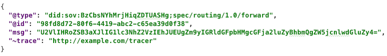
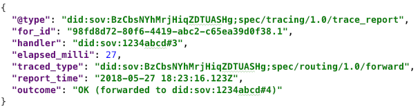
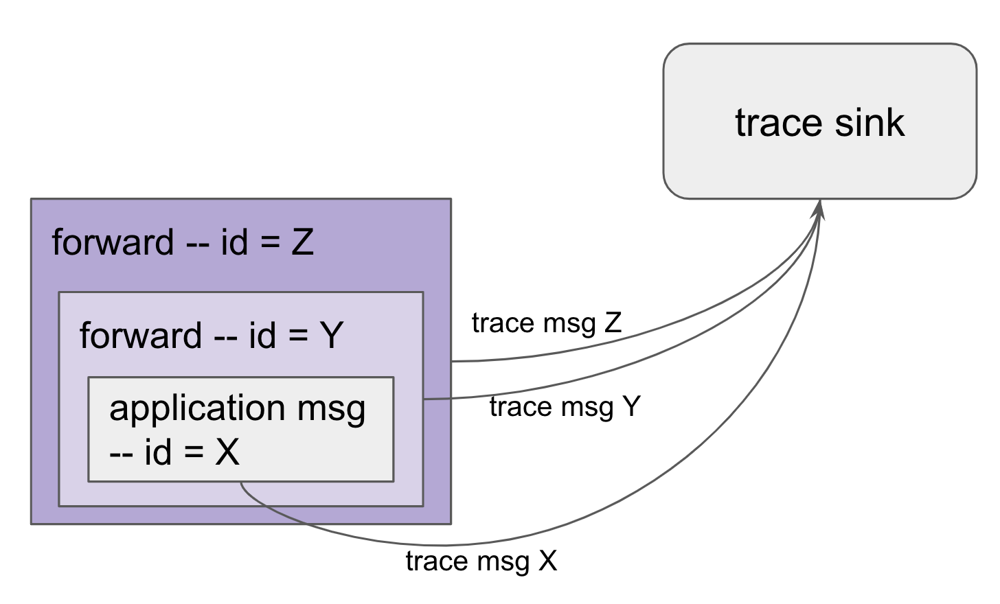

# 0034: Message Tracing
- Author: Daniel Hardman
- Start date: 2018-10-24

## Status
- Status: [PROPOSED](/README.md#rfc-lifecycle)
- Status Date: 2018-10-24
- Status Note: Not yet implemented broadly, but Evernym has been
  exploring it as a solution to some debugging needs.

## Summary

Define a mechanism to track what happens in a complex DIDComm
interactions, to make troubleshooting and auditing easier.

## Motivation

Anyone who has searched trash and spam folders for a missing email knows that
when messages don't elicit the expected reaction, troubleshooting can be tricky.
Aries-style agent-to-agent communication is likely to manifest many of the same
challenges as email, in that it may be routed to multiple places, by multiple parties,
with incomplete visibility into the meaning or state associated with individual
messages. Aries's communication is even more opaque than ordinary email, in that it
is transport agnostic and encrypted...

In a future world where DIDComm technology is ubiquitous, people may send
messages from one agent to another, and wonder why nothing happened, or why a
particular error is reported. They will need answers.

Also, developers and testers who are working with DIDComm-based protocols need a way
to debug. 

## Tutorial

### Basics
[basics]: #basics

Many systems that deliver physical packages offer a "cerified delivery" or
"return receipt requested" feature. To activate the feature, a sender affixes
a special label to the package, announcing who should be notified, and how.
Handlers of the package then cooperate to satisfy the request.

 

__DIDComm thread tracing__ works on a similar principle. When tracing is
desired, a sender adds to the normal message metadata a special [decorator](
../../concepts/0011-decorators/README.md) that
the message handler can see. If the handler notices the decorator
and chooses to honor the request, it emits a notification to provide tracing.

The main complication is that DIDComm message routing uses nested layers of
encryption. What is visible to one message handler may not be visible to
another. Therefore, the decorator must be repeated in every layer of nesting
where tracing is required. Although this makes tracing somewhat verbose, it
also provides precision; troubleshooting can focus only on one problematic
section of an overall route, and can degrade privacy selectively.

### Decorator

Tracing is requested by decorating the JSON plaintext of an DIDComm message (which will
 often be a __forward__ message, but could also be the terminal message unpacked
 and handled at its final destination) with the
`~trace` attribute. Here is the simplest possible example:

This example asks the handler of the message to perform an HTTP POST of a __trace report__
about the message to the URI `http://example.com/tracer`. 

The service listening for trace reports--called the __trace sink__--
doesn't have to have any special characteristics, other than support for
HTTP 1.1 or SMTP (for `mailto:` URIs) and the ability to receive small plaintext
payloads rapidly. It may use TLS, but it is not required to. If TLS is used, the
parties that submit reports should accept the certificate without strong checking,
even if it is expired or invalid. The rationale for this choice is:

1. It is the *sender*'s trust in the tracing service, not the *handler*'s trust, that matters.
2. Tracing is inherently unsafe and non-privacy-preserving, in that it introduces
   an eavesdropper and a channel with uncertain security guarantees. Trying to secure the
   eavesdropper is a waste of effort.
3. Introducing a strong dependency on PKI-based trust into a protocol that exists to improve
   PKI feels wrong-headed.
4. When tracing is needed, the last thing we should do is create another fragility to
   troubleshoot.
   
### Trace Reports

The body of the HTTP request (the _trace report_) is a JSON document that looks like this:

### Subtleties

##### Message IDs

If messages have a different `@id` attribute at each hop in a delivery chain, then a trace
of the message at hop 1 and a trace of the message at hop 2 will not appear to have any
connection when the reports are analyzed together.

To solve this problem, traced messages use an ID convention that permits ordering.
Assume that the inner application message has a base ID, _X_. Containing
messages (e.g., `forward` messages) have IDs in the form _X_.1, _X_.2, _X_.3,
and so forth -- where numbers represent the order in
which the messages will be handled. Notice in the sample trace report above that the
`for_id` of the trace report message is `98fd8d72-80f6-4419-abc2-c65ea39d0f38.1`.
This implies that it is tracing the first hop of
inner, application message with id `98fd8d72-80f6-4419-abc2-c65ea39d0f38`.

##### Delegation

Sometimes, a message is sent before it is fully wrapped for all hops in its route.
This can happen, for example, if Alice's edge agent delegates to Alice's cloud agent
the message preparation for later stages of routing.

In such cases, tracing for the delegated portion of the route should default to
inherit the tracing choice of the portion of the route already seen. To override
this, the `~trace` decorator placed on the initial message from Alice's edge to
Alice's cloud can include the optional `full-route` attribute, with its value set
to `true` or `false`.

This tells handlers that are wrapping subsequent portions of a routed message to
either propagate or truncate the routing request in any new `forward` messages
they compose.

##### Timing and Sequencing

Each trace report includes a UTC timestamp from the reporting handler.
This timestamp should be computed at the instant a trace report is
prepared--not when it is queued or delivered. Even so, it offers only a
rough approximation of when something happened. Since system clocks
from handlers may not be synchronized, there is no guarantee of precision or
of agreement among timestamps.

In addition, trace reports may be submitted asynchronously with respect to the
message handling they document. Thus, a trace report could arrive out of sequence, even
if the handling it describes occurred correctly. This makes it vital to order trace
reports according to the ID sequencing convention described above.

##### Tracing the original sender

The original sender may not run a message handling routine that triggers tracing.
However, as a best practice, senders that enable tracing should send a trace report
when they send, so the beginning of a routing sequence is documented. This report
should reference _X_.0 in `for_id`, where _X_ is the ID of the inner application
message for the final recipient.

##### Handling a message more than once

A particular handler may wish to document multiple phases of processing for a message.
For example, it may choose to emit a trace report when the message is received, and
again when the message is "done." In such cases, the proper sequence of the two messages,
both of which will have the same `for_id` attribute, is given by the relative sequence
of the timestamps.

Processing time for each handler--or for phases within a handler--is given by the
`elapsed_milli` attribute.

##### Privacy

Tracing inherently compromises privacy. It is totally voluntary, and handlers should not
honor trace requests if they have reason to believe they have been inserted for
nefarious purposes. However, the fact that the trace reports can only be requested
by the same entities that send the messages, and that they are encrypted in the same
way as any other plaintext that a handler eventually sees, puts privacy controls in
the hands of the ultimate sender and receiver.

##### Tracing entire threads

If a sender wishes to enable threading for an entire multi-step interaction between
multiple parties, the `full_thread` attribute can be included on an inner application,
with its value set to `true`. This signals to recipients that the sender wishes to
have tracing turned on until the interaction is complete. Recipients may or may not
honor such requests. If they don't, they may choose to send an error to the sender
explaining why they are not honoring the request.

## Reference

### Trace decorator (`~trace`)

Value is any URI. At least `http`, `https`, and `mailto` should be supported. If
mail is sent, the message subject should be "trace report for ?", where ? is the
value of the `for_id` attribute in the report, and the email body should contain the
plaintext of the report, as utf8.

### Trace Report Attributes

* `@type`: Should always be `"did:sov:BzCbsNYhMrjHiqZDTUASHg;spec/tracing/1.0/trace_report"`,
   or some evolved version thereof. Required for version control and to support trace sinks
   that process other HTTP payloads as well.
* `for_id`: The ID of the message that the handler is looking at when it composes the
   trace report. Required.
* `handler`: A string that identifies the handler in a way that's useful for troubleshooting purposes.
   For example, it might identify a particular agent by DID+keyref, or it might be a friendly
   string like "iPhone" or "AgentsRUs Cloud Agent, geocaching extension v1.3.7". Optional but
   encouraged.
* `elapsed_milli`: How many milliseconds did the handler have this message before composing
   the trace report? If the same handler emits more than one trace report, how long has it
   been since the last trace was composed? Optional but encouraged.
* `traced_type`: What was the message type of the traced message? Optional but encouraged.
* `report_time`: What was the UTC timestamp of the system clock of the handler
   when the handler composed the trace report? ISO 8601 format with millisecond precision.
   Optional but encouraged.
* `outcome`: A string that describes the outcome of the message handling. The string MUST
  begin with one of the following tokens: `"OK"` (meaning the handler completed its processing
  successfully; `"ERR"` (the handler failed), or `"PEND"` (the handler is still working on the
  message and does not know the final outcome). After this token, the string SHOULD contain
  a parenthetical explanation suitable for use by humans that want to troubleshoot. For `forward`
  messages that have an outcome of `OK`, the recommended explanation is something like 
  `"(forwarded to did:sov:1234abcd#4)"`.

## Drawbacks

Tracing makes network communication quite noisy. It imposes a burden on message handlers.
It may also incur performance penalties.

## Rationale and alternatives

Wireshark and similar network monitoring tools could give some visibility into agent-to-agent
interactions. However, it would be hard to make sense of bytes on the wire, due to encryption
and the way individual messages may be divorced from routing or thread context.

Proprietary tracing could be added to the agents built by particular vendors. However, this
would have limited utility if an interaction involved software not made by that vendor.

## Prior art
The message threading RFC and the error reporting RFC touch on similar subjects, but are
distinct.

## Unresolved questions
None.