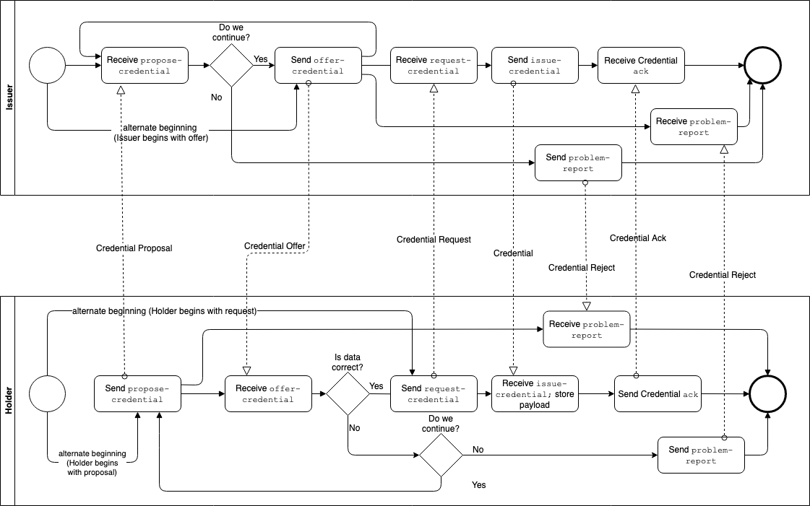

# 0036: Issue Credential Protocol 1.0

- Author: Nikita Khateev
- Start Date: 2019-01-30

## Status

- Status: [PROPOSED](/README.md#rfc-lifecycle)
- Status Date: 2019-05-28
- Status Note: This supersedes the Issue Credential part of [Indy HIPE PR #89](
https://github.com/hyperledger/indy-hipe/blob/2e85595e9a948a2fbfd58400191d112caff5a14b/text/credential-exchange-message-family/README.md). See [RFC 0037](../0037-present-proof/README.md) for the presentation part of the same Indy HIPE PR.

## Summary

Formalization and generalization of existing message formats used for issuing a credential according to existing RFCs about message formats.

## Motivation

We need a standard protocol for issuing credentials.

## Tutorial

The Issue Credential protocol consists of these messages:

* Propose Credential - Prover to Issuer (optional)
* Offer Credential - Issuer to Prover (optional for some credential implementations; required for Hyperledger Indy)
* Request Credential - Prover to Issuer
* Issue Credential - Issuer to Prover

In addition, the [`ack`](../0015-acks/README.md) and [`problem-report`](../0035-report-problem/README.md) messages are adopted into the protocol for confirmation and error handling.

#### Choreography Diagram:



#### Propose Credential

An optional message sent by the Prover to the Issuer to initiate the protocol or in response to a `offer-credential` message when the Prover wants some adjustments made to the credential data offered by Issuer. In Hyperledger Indy, where the `request-credential` message can **only** be sent in response to an `offer-credential` message, the `propose-credential` message must be used if the Prover wants to initiate the protocol. Schema:

```json
{
    "@type": "did:sov:BzCbsNYhMrjHiqZDTUASHg;spec/issue-credential/1.0/propose-credential",
    "@id": "<uuid-propose-credential>",
    "comment": "some comment",
    "credential_proposal": <json-ld object>,
    "schema_id": "Schema ID string",
    "cred_def_id": "Credential Definition ID string"
}
```

Description of attributes:

* `comment` -- a field that provides some human readable information about this Credential Proposal;
* `credential_proposal` -- a JSON-LD object that represents the credential data that Prover wants to receive. It matches the schema of [Credential Preview](#preview-credential);
* `schema_id` -- optional filter to request credential based on particular Schema
* `cred_def_id` -- optional filter to request credential based on particular Credential Definition

#### Offer Credential

A message sent by the Issuer to the Prover to initiate the protocol when required by the Credential flow. In Hyperledger Indy, this message is required. In credential implementations where this message is optional, an Issuer can use the message to negotiate the issuing following receipt of a `request-credential` message. Schema:

```json
{
    "@type": "did:sov:BzCbsNYhMrjHiqZDTUASHg;spec/issue-credential/1.0/offer-credential",
    "@id": "<uuid-offer>",
    "comment": "some comment",
    "credential_preview": <json-ld object>,
    "offers~attach": [
        {
            "@id": "libindy-cred-offer-0",
            "mime-type": "application/json",
            "data": {
                "base64": "<bytes for base64>"
            }
        }
    ]
}
```

Description of fields:

* `comment` -- a field that provides some human readable information about this Credential Offer;
* `credential_preview` -- a JSON-LD object that represents the credential data that Issuer is willing to issue. It matches the schema of [Credential Preview](#preview-credential);
* `offers~attach` -- an array of attachments defining the offered formats for the credential.
  * For Indy, the attachment contains data from libindy about the credential offer, base64 encoded. The following JSON is an example of the `libindy-offer` attachment content. For more information see the [Libindy API](https://github.com/hyperledger/indy-sdk/blob/57dcdae74164d1c7aa06f2cccecaae121cefac25/libindy/src/api/anoncreds.rs#L280).

```json
{
   "schema_id": string,
   "cred_def_id": string,
   "nonce": string,
   "key_correctness_proof" : <key_correctness_proof>
}
```

This message may have payment request decorator, see [payment section below](#payments-while-credential-exchange)

#### Request Credential

A message sent by the Prover to the Issuer to request the issuance of a Credential. Where supported by the Credential implementation, this message initiates the protocol. In Hyperledger Indy, this message can only be sent in response to an Offer Credential message. Schema:

```json
{
    "@type": "did:sov:BzCbsNYhMrjHiqZDTUASHg;spec/issue-credential/1.0/request-credential",
    "@id": "<uuid-request>",
    "comment": "some comment",
    "requests~attach": [
        {
            "@id": "libindy-cred-req-0",
            "mime-type": "application/json",
            "data": {
                "base64": "<bytes for base64>"
            }
        },
    ]
}
```

Description of Fields:

* `comment` -- a field that provides some human readable information about this request.
* `requests~attach` -- an array of attachments defining the requested formats for the credential.
  * For Indy, the attachment contains data from libindy about the credential request, base64 encoded. The following JSON is an example of the `libindy-cred-req-0` attachment content. For more information see the [Libindy API](https://github.com/hyperledger/indy-sdk/blob/57dcdae74164d1c7aa06f2cccecaae121cefac25/libindy/src/api/anoncreds.rs#L658).

```json
{
  "prover_did" : string,
  "cred_def_id" : string,
  "blinded_ms" : <blinded_master_secret>,
  "blinded_ms_correctness_proof" : <blinded_ms_correctness_proof>,
  "nonce": string
}
```

This message may have payment confirmation decorator, see [payment section below](#payments-while-credential-exchange)

#### Issue Credential

This message contains the credentials being issued and is sent in response to a valid Request Credential message. Schema:

```json
{
    "@type": "did:sov:BzCbsNYhMrjHiqZDTUASHg;spec/issue-credential/1.0/issue-credential",
    "@id": "<uuid-credential>",
    "comment": "some comment",
    "credentials~attach": [
        {
            "@id": "libindy-cred-0",
            "mime-type": "application/json",
            "data": {
                "base64": "<bytes for base64>"  
            }
        }
    ]
}
```

Description of fields:

* `comment` -- a field that provides some human readable information about the issued Credential.
* `credentials~attach` -- an array of attachments containing the issued credentials.
  * For Indy, the attachment contains data from libindy about credential to be issued, base64 encoded. The following JSON is an example of the `libindy-cred-0` attachment content. For more information see the [Libindy API](https://github.com/hyperledger/indy-sdk/blob/57dcdae74164d1c7aa06f2cccecaae121cefac25/libindy/src/api/anoncreds.rs#L338).

```json
{
    "schema_id": string,
    "cred_def_id": string,
    "rev_reg_def_id": Optional<string>,
    "values": <see cred_values_json above>,
    "signature": <signature>,
    "signature_correctness_proof": <signature_correctness_proof>
}
```

#### Preview Credential

This is not a message but an inner object for other messages in this protocol. It is used construct a preview of the data for the credential that is to be issued. Schema:

```json
{
    "@type": "did:sov:BzCbsNYhMrjHiqZDTUASHg;spec/issue-credential/1.0/credential-preview",
    "attributes": [
        {
            "name": "attribute name",
            "mime-type": "type",
            "encoding": "encoding",
            "value": "value"
        },
        ...
    ]
}
```

The main element is `attributes`. It is an array of objects, each with the following fields:

* `name` -- string with attribute name;
* `mime-type` -- type of attribute
* `encoding` -- encoding of value, if applicable: `"base64"` indicates base64
* `value` -- value of credential

## Threading

Threading can be used to initiate a sub-protocol during an issue credential protocol instance. For example, during credential issuance, the Issuer may initiate a child thread to execute the `Present Proof` sub-protocol to have the Prover prove attributes about themselves before issuing the credential.

Details about threading can be found in the [message id and threading](../../concepts/0008-message-id-and-threading/README.md) RFC.

## Payments while credential exchange

There is a high probability that some networks would like to use some implementation of payment (e.g. utility token) for balance in ecosystem. The value flow already presents while CX but it looks one way for simple case: issuer gives value to hodler (credential which can be used by holder for his needs) but doesn’t receive anything back. To resolve this case some payment may be charged by Issuer from Holder per credential. In general different payment flows are possible. Like a holder may provide proof to verifier for some data analysis or other Verifier’s need and in this case Verifier may pay to Holder.
So both processes described in this RFC (issuance) and [presentation](../0037-present-proof/README.md) may be tied with payments.
Also there is a good chance that payment flow may be combined with other message flows, so it may be considered as decorator. This decorator is optional.

### Payment decorators
These decorators are out of subject of this RFC, see [Payment decorators RFC](../0075-payment-decorators/README.md)

### Payment flow
Payment request may be included to Credential Offer msg from Issuer to Holder. And receipt should be provided in this case in Credential Request by Issuer.
While credential presentation the Verifier may pay to Holder as compensation for Holder for disclosing data. Payment receipt should be included into Presentation Request. Verifier may skip it in first request, but in this case Holder may request payment by sending back Presentation Proposal with appropriate decorator inside it.

### Limitations
Smart contracts may be missed in ecosystem, so operation "issue credential after payment received" is not atomic. It’s possible case that malicious issuer will charge first and then will not issue credential in fact. But this situation should be easily detected and appropriate penalty should be applied in such type of networks.


## Negotiation and Preview

Negotiation prior to issuing the credential can be done using the `offer-credential` and `propose-credential` messages. A common negotiation use case would be about the data to go into the credential. For that, the `credential_preview` element is used.

## Reference

* [VCX](https://github.com/hyperledger/indy-sdk/tree/master/vcx/libvcx/src/api) -- this implementation might not be perfect and needs to be improved, you can gather some info on parameters purpose from it
* A pre-RFC (labelled version 0.1) implementation of the protocol was implemented by a number of groups in the Hyperledger Indy community leading up to IIW28 in April 2019. The protocol defined and implemented can be reviewed [here](https://hackmd.io/@QNKW9ANJRy6t81D7IfgiZQ/HkklVzww4?type=view). It was the basis of the [IIWBook demo](https://vonx.io/how_to/iiwbook) from BC Gov and collaborators.

## Drawbacks

Why should we *not* do this?

## Rationale and alternatives

- Why is this design the best in the space of possible designs?
- What other designs have been considered and what is the rationale for not
choosing them?
- What is the impact of not doing this?

## Prior art

Similar (but simplified) credential exchanged was already implemented in [von-anchor](https://von-anchor.readthedocs.io/en/latest/).

## Unresolved questions

- We might need to propose a new MIME type for credential (the same way as .docx is not processed as generic xml). The issue in W3C/vc-data-model: https://github.com/w3c/vc-data-model/issues/421
- It is a common practice when changing some attributes in credential to revoke the old credential and issue a new one. It might be useful to have an element in the `offer-credential` message to indicate a connection between a now revoked credential and the new credential being offered.
- We might need some explicit documentation for nested `@type` fields.
- There should be a way to ask for some payment with `offer-credential` and to send a payment (or payment receipt) in the request-credential.
