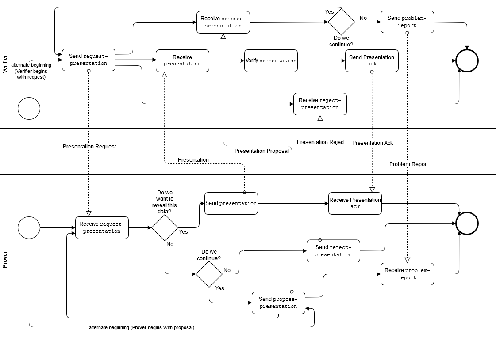

# Aries RFC 0037: Present Proof Protocol 1.0

- Authors: Nikita Khateev
- Status: [ACCEPTED](/README.md#accepted)
- Since: 2019-05-28
- Status Note:  See [RFC 0036](../0036-issue-credential/README.md) for the issue credential part of the same Indy HIPE PR.
- Supersedes: [Indy HIPE PR #89](https://github.com/hyperledger/indy-hipe/blob/2e85595e9a948a2fbfd58400191d112caff5a14b/text/credential-exchange-message-family/README.md); also [Credential Exchange 0.1 -- IIW 2019](https://hackmd.io/@QNKW9ANJRy6t81D7IfgiZQ/HkklVzww4?type=view)
- Start Date: 2019-01-30
- Tags: [feature](/tags.md#feature), [protocol](/tags.md#protocol), [credentials](/tags.md#credentials), [test-anomaly](/tags.md#test-anomaly)

## Summary

Formalization and generalization of existing message formats used for presenting a proof according to existing RFCs about message formats.

## Motivation

We need to define a standard protocol for presenting a proof.

## Tutorial

The present proof protocol consists of these messages:

* Propose Proof - Prover to Verifier (optional)
* Request Proof - Verifier to Prover
* Present Proof - Prover to Verifier

In addition, the [`ack`](../0015-acks/README.md) and [`problem-report`](../0035-report-problem/README.md) messages are adopted into the protocol for confirmation and error handling.

This protocol is about the messages to support the presentation of verifiable claims, not about the specifics of particular verifiable presentation mechanisms. This is challenging since at the time of writing this version of the protocol, there is only one supported verifiable presentation mechanism(Hyperledger Indy). [DIDComm attachments](../../concepts/0017-attachments/README.md) are deliberately used in messages to try to make this protocol agnostic to the specific verifiable presentation mechanism payloads. Links are provided in the message data element descriptions to details of specific verifiable presentation implementation data structures.

Diagrams in this protocol were made in draw.io. To make changes:

- upload the drawing HTML from this folder to the [draw.io](https://draw.io) site (Import From...GitHub), 
- make changes,
- export the picture and HTML to your local copy of this repo, and
- submit a pull request.

### Choreography Diagram:



### Propose Presentation

An optional message sent by the Prover to the verifier to initiate a proof presentation process, or in response to a `request-presentation` message when the Prover wants to propose using a different presentation format. Schema:

```json
{
    "@type": "did:sov:BzCbsNYhMrjHiqZDTUASHg;spec/present-proof/1.0/propose-presentation",
    "@id": "<uuid-propose-presentation>",
    "comment": "some comment",
    "presentation_proposal": <json-ld object>
}
```

Description of attributes:

* `comment` -- a field that provides some human readable information about the proposed presentation.
* `presentation_proposal` -- a JSON-LD object that represents the presentation example that Prover wants to provide. It should follow the schema of [Presentation Preview](#presentation-preview);

### Request Presentation

From a verifier to a prover, the `request-presentation` message describes values that need to be revealed and predicates that need to be fulfilled. Schema:

```json
{
    "@type": "did:sov:BzCbsNYhMrjHiqZDTUASHg;spec/present-proof/1.0/request-presentation",
    "@id": "<uuid-request>",
    "comment": "some comment",
    "request_presentations~attach": [
        {
            "@id": "libindy-request-presentation-0",
            "mime-type": "application/json",
            "data":  {
                "base64": "<bytes for base64>"
            }
        }
    ]
}
```

Description of fields:

* `comment` -- a field that provides some human readable information about this request for a presentation.
* `request_presentations~attach` -- an array of attachments defining the acceptable formats for the presentation.
  * For Indy, the attachment contains data from libindy about the presentation request, base64-encoded, as returned from `libindy`. For more information see the [Libindy API](https://github.com/hyperledger/indy-sdk/blob/57dcdae74164d1c7aa06f2cccecaae121cefac25/libindy/src/api/anoncreds.rs#L1214).

### Presentation

This message is a response to a Presentation Request message and contains signed presentations. Schema:

```json
{
    "@type": "did:sov:BzCbsNYhMrjHiqZDTUASHg;spec/present-proof/1.0/presentation",
    "@id": "<uuid-presentation>",
    "comment": "some comment",
    "presentations~attach": [
        {
            "@id": "libindy-presentation-0",
            "mime-type": "application/json",
            "data": {
                "base64": "<bytes for base64>"
            }
        }
    ]
}
```

Description of fields:

* `comment` -- a field that provides some human readable information about this presentation.
* `presentations~attach` -- an array of attachments containing the presentation in the requested format(s).
  * For Indy, the attachment contains data from libindy that is the presentation, base64-encoded, as returned from `libindy`. For more information see the [Libindy API](https://github.com/hyperledger/indy-sdk/blob/57dcdae74164d1c7aa06f2cccecaae121cefac25/libindy/src/api/anoncreds.rs#L1404).

#### Verifying Claims of Indy-based Verifiable Credentials

Claims in Hyperledger Indy-based verifiable credentials are put into the credential in two forms, `raw` and `encoded`. `raw` is the actual data value, and `encoded` is the (possibly derived) integer value that is used in presentations. At this time, Indy does not take an opinion on the method used for encoding the raw value. This will change with the Rich Schema work that is underway in the Indy/Aries community, where the encoding method will be part of the credential metadata available from the public ledger.

Until the Rich Schema mechanism is deployed, the Aries issuers and verifiers must agree on an encoding method so that the verifier can check that the `raw` value returned in a presentation corresponds to the proven `encoded` value. The following is the encoding algorithm that MUST be used by Issuers when creating credentials and SHOULD be verified by Verifiers receiving presentations:

- keep any 32-bit integer as is
- for data of any other type:
  - convert to string (use string "None" for null)
  - encode via utf-8 to bytes
  - apply SHA-256 to digest the bytes
  - convert the resulting digest bytes, big-endian, to integer
  - stringify the integer as a decimal.

An example implementation in Python can be found [here](https://github.com/hyperledger/aries-cloudagent-python/blob/0000f924a50b6ac5e6342bff90e64864672ee935/aries_cloudagent/messaging/util.py#L106).

A gist of test value pairs can be found [here](https://gist.github.com/swcurran/78e5a9e8d11236f003f6a6263c6619a6).

### Presentation Preview

This is not a message but an inner object for other messages in this protocol. It is used to construct a preview of the data for the presentation. Its schema follows:

```jsonc
{
    "@type": "did:sov:BzCbsNYhMrjHiqZDTUASHg;spec/present-proof/1.0/presentation-preview",
    "attributes": [
        {
            "name": "<attribute_name>",
            "cred_def_id": "<cred_def_id>",
            "mime-type": "<type>",
            "value": "<value>",
            "referent": "<referent>"
        },
        // more attributes
    ],
    "predicates": [
        {
            "name": "<attribute_name>",
            "cred_def_id": "<cred_def_id>",
            "predicate": "<predicate>",
            "threshold": <threshold>
        },
        // more predicates
    ]
}
```

The preview identifies attributes and predicates to present.

#### Attributes

The mandatory `"attributes"` key maps to a list (possibly empty to propose a presentation with no attributes) of specifications, one per attribute. Each such specification proposes its attribute's characteristics for creation within a presentation.

##### Attribute Name

The mandatory `"name"` key maps to the name of the attribute.

##### Credential Definition Identifier

The optional `"cred_def_id"` key maps to the credential definition identifier of the credential with the current attribute. Note that since it is the holder who creates the preview and the holder possesses the corresponding credential, the holder must know its credential definition identifier.

If the key is absent, the preview specifies attribute's posture in the presentation as a self-attested attribute. A self-attested attribute does not come from a credential, and hence any attribute specification without the `"cred_def_id"` key cannot use a `"referent"` key as per [Referent](#referent) below.

##### MIME Type and Value

The optional `mime-type` advises the verifier how to render a binary attribute, to judge its content for applicability before accepting a presentation containing it. Its value parses case-insensitively in keeping with MIME type semantics of [RFC 2045](https://tools.ietf.org/html/rfc2045). If `mime-type` is missing, its value is null.

The optional `value`, when present, holds the value of the attribute to reveal in presentation:

* if `mime-type` is missing (null), then `value` is a string. In other words, implementations interpret it the same as any other key+value pair in JSON
* if `mime-type` is not null, then `value` is always a base64-encoded string that represents a binary BLOB, and `mime-type` tells how to interpret the BLOB after base64-decoding.

An attribute specification must specify a `value`, a `cred_def_id`, or both: 

* if `value` is present and `cred_def_id` is absent, the preview proposes a self-attested attribute;
* if `value` and `cred_def_id` are both present, the preview proposes a verifiable claim to reveal in the presentation;
* if `value` is absent and `cred_def_id` is present, the preview proposes a verifiable claim not to reveal in the presentation.

##### Referent

The optional `referent` can be useful in specifying multiple-credential presentations. Its value indicates which credential 
will supply the attribute in the presentation. Sharing a `referent` value between multiple attribute specifications indicates that the holder's same credential supplies the attribute.

Any attribute specification using a `referent` must also have a `cred_def_id`; any attribute specifications sharing a common `referent` value must all have the same `cred_def_id` value (see [Credential Definition Identifier](#credential-definition-identifier) above).

For example, a holder with multiple account credentials could use a presentation preview such as

```jsonc
{
    "@type": "did:sov:BzCbsNYhMrjHiqZDTUASHg;spec/present-proof/1.0/presentation-preview",
    "attributes": [
        {
            "name": "account",
            "cred_def_id": "BzCbsNYhMrjHiqZDTUASHg:3:CL:1234:tag",
            "value": "12345678",
            "referent": "0"
        },
        {
            "name": "streetAddress",
            "cred_def_id": "BzCbsNYhMrjHiqZDTUASHg:3:CL:1234:tag",
            "value": "123 Main Street",
            "referent": "0"
        },
    ],
    "predicates": [
    ]
}
```

to prompt a verifier to request proof of account number and street address from the same account, rather than potentially an account number and street address from distinct accounts.

#### Predicates

The mandatory `"predicates"` key maps to a list (possibly empty to propose a presentation with no predicates) of predicate specifications, one per predicate. Each such specification proposes its predicate's characteristics for creation within a presentation.

##### Attribute Name

The mandatory `"name"` key maps to the name of the attribute.

##### Credential Definition Identifier

The mandatory `"cred_def_id"` key maps to the credential definition identifier of the credential with the current attribute. Note that since it is the holder who creates the preview and the holder possesses the corresponding credential, the holder must know its credential definition identifier.

##### Predicate

The mandatory `"predicate"` key maps to the predicate operator: `"<"`, `"<="`, `">="`, `">"`. 

##### Threshold Value

The mandatory `"threshold"` key maps to the threshold value for the predicate.

## Negotiation and Preview

Negotiation prior to the presentation can be done using the `propose-presentation` and `request-presentation` messages. A common negotiation use case would be about the data to go into the presentation. For that, the `presentation-preview` element is used.

## Reference

* [VCX](https://github.com/hyperledger/indy-sdk/tree/master/vcx/libvcx/src/api) -- this implementation might not be perfect and needs to be improved, you can gather some info on parameters purpose from it
* A pre-RFC (labeled version 0.1) implementation of the protocol was implemented by a number of groups in the Hyperledger Indy community leading up to IIW28 in April 2019. The protocol can be found [here](https://hackmd.io/@QNKW9ANJRy6t81D7IfgiZQ/HkklVzww4?type=view). It was the basis of the [IIWBook demo](https://vonx.io/how_to/iiwbook) from BC Gov and collaborators.

## Drawbacks

The presentation preview as proposed above does not allow nesting of predicate logic along the lines of "A and either B or C if D, otherwise A and B", nor cross-credential-definition predicates such as proposing a legal name from either a financial institution or selected government entity.

The presentation preview may be indy-centric, as it assumes the inclusion of at most one credential per credential definition. In addition, it prescribes exactly four predicates and assumes mutual understanding of their semantics (e.g., could `">="` imply a lexicographic order for non-integer values, and if so, where to specify character collation algorithm?).

Finally, the inclusion of non-revocation timestamps may become desirable at the preview stage; the standard as proposed does not accommodate such.

## Rationale and alternatives

- Why is this design the best in the space of possible designs?
- What other designs have been considered and what is the rationale for not
choosing them?
- What is the impact of not doing this?

## Prior art

Similar (but simplified) credential exchange was already implemented in [von-anchor](https://von-anchor.readthedocs.io/en/latest/).

## Unresolved questions

- We might need some explicit documentation for nested `@type` fields.
- There might need to be a way to associate a payment with the present proof protocol.

## Implementations

The following lists the implementations (if any) of this RFC. Please do a pull request to add your implementation. If the implementation is open source, include a link to the repo or to the implementation within the repo. Please be consistent in the "Name" field so that a mechanical processing of the RFCs can generate a list of all RFCs supported by an Aries implementation.

Name / Link | Implementation Notes
--- | ---
 |  |
