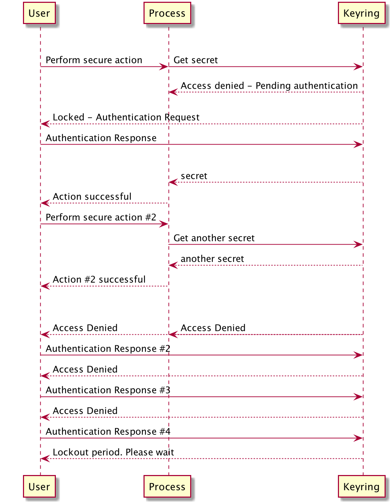
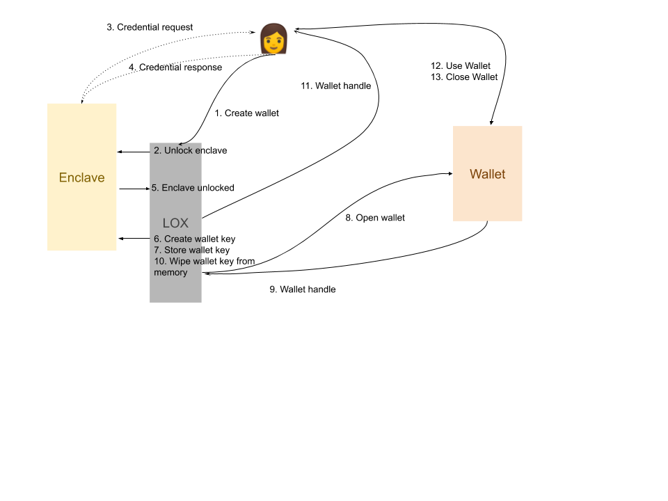

# 0042: LOX -- A more secure pluggable framework for protecting wallet keys
- Author: Michael Lodder (mike@sovrin.org)
- Start Date: 2019-05-30

## Status
- Status: [PROPOSED]
- Status Date: 2019-05-30
- Status Note:

## Summary

Wallets are protected by secrets that must live outside of the wallet.
This document proposes the Lox framework for managing the wallet access key(s).

## Motivation
Wallets currently use a single key to access the wallet. The key is provided directly or derived from a password.
However, this is prone to misuse as most developers have little experience in key management. Right now there are no recommendations for protecting a key provided by Aries
forcing implementors to choose methods based on their company's or organization's policies or practices.

Here Millenial Mike demonstrates this process.


Some implementors have no policy or practice in place at all to follow leaving them to make bad decisions about managing wallet key storage and protection.
For example, when creating an API token for Amazon's AWS, Amazon generates
a secret key on a user's behalf and is downloaded to a CSV file. Many programmers do not know how to best
protect these downloaded credentials because they must be used in a program to make API calls.
They don't which of the following is the best option. They typically:

- Put these credentials directly in the program like most do as constant variables but this is a terrible option because attackers can analyze the code and extract it.
- Use environment variables. If so, should it passed as at the command level or put in a global variable registry? Both are susceptible to sniffing memory, process information, or inspecting command history.
- Read a config file that contains the credentials but must rely on the security of the operating system to manage access control.

The less commonly used or known solution involves keyrings, hardware security modules (HSM), trusted execution environments (TEE), and secure enclaves.

### Keyrings

Keyrings come preinstalled with modern operating systems without requiring installing additional software, but other keyrings software packages can be installed that function in a similar way.
Operating systems protect keyring contents in encrypted files with access controls based on the logged in user and process accessing them.
The keyring can only be unlocked if the same user, process, and keyring credentials are used when the keyring is created.
Keyring credentials can be any combination of passwords, pins, keys, cyber tokens, and biometrics.
In principle, a system's keyring should be able to keep credentials away from `root` (as in, the attacker can use the credential as long as they have access, but they can't extract the credential for persistence and assuming no other attacks like Foreshadow).
[Mac OS X](https://developer.apple.com/documentation/security), [Windows](https://docs.microsoft.com/en-us/windows/desktop/api/wincred/), Linux [Gnome-Keyring](https://wiki.gnome.org/Projects/GnomeKeyring) and [KWallet](https://docs.kde.org/trunk5/en/kdeutils/kwallet5/kwallet5.pdf), [Android](https://developer.android.com/training/articles/keystore), and [iOS](https://developer.apple.com/documentation/security/certificate_key_and_trust_services/keys/storing_keys_in_the_secure_enclave) have built-in enclaves that are protected by the operating system.

Some systems back keyrings with hardware to increase security. The following flow chart illustrates how a keyring functions.



 
### Secure Enclaves

Secure enclaves are used to describe HSMs, TPMs, and TEEs. 
An explaination of how secure enclaves work is detailed [here](https://github.com/hyperledger/indy-hipe/tree/master/text/0013-wallets#enclave-wrapping).


### Details

To avoid the overuse of repeating each of these to describe a highly secure environment, the term enclave will be used to indicate all of them synonymously.
Enclaves are specially designed to safeguard secrets but can be complex to use with varying APIs and libraries and are accessed using multiple various combinations of credentials.
However, these complexities cause many to avoid using them.

Where to put the wallet access credentials that are directly used by applications or people is called the top-level credential problem.
Lox aims to provide guidance and aid in adopting best practices and developing code to address the top level credential problem–-the credential used to protect all others–the keys to the kingdom–or a secret that is used directly by Aries that if compromised would yield disastrous consequences and
give access to the wallet.

## Tutorial

Lox is a layer that is designed to be an API for storing secrets with pluggable backends that implement reasonable defaults
but is flexible to support various others that may be used.

The default enclave will be the operating system keychain. Lox will also allow for
many different enclaves that are optimal for storing keys like YubiKey, Hashicorp Vault, Intel SGX, or other methods supported by Hyperledger Ursa.
Other hardware security modules can be plugged into the system via USB or accessed via the cloud. Trusted Platform Modules (TPMs) now come standard with 
many laptops and higher end tablets. Communication to enclaves can be done using drivers or over Unix or TCP sockets, or the Windows Communication Framework.

The goal of Lox is to remove the complexity of the various enclaves by choosing the best secure defaults and hiding details that are prone to be misused or misunderstood, making it easier to secure the wallet.



## Reference

Currently, there are two methods that are used to open a wallet: provide the wallet encryption key or use a password based key derivation function to derive the key.
Neither of these methods is directly terrible but there are concerns. Where should the symmetric encryption key be stored? What settings should be chosen for Argon2id?
Argon2id also does not scale horizontally because settings that are secure for a desktop can be very slow to execute on a mobile device in the order of tens of seconds to minutes.
To make it usable, the settings must be dialed down for the mobile device, but this allows faster attacks from a hacker. Also, passwords are often weak in that they are short, easily guessed, and have low entropy.

Lox, on the other hand, allows a wallet user to access a wallet providing the **ID** of the credential that will be used to open the wallet, then letting the secure enclave handle authenticating the owner and securing access control.
The enclave will restrict access to the currently logged in user so even an administrator cannot read the enclave contents or even access the hardware or TEE.

For example, a user creates a new wallet and instead of specifying a key, can specify an **ID** like `youthful_burnell`. The user is prompted to provide the enclave credentials like biometrics, pins, authenticator tokens, etc.
If successful, Lox creates the wallet access key, stores it in the enclave, opens the wallet, and securely wipes the memory holding the key.
The calling program can even store the **ID** value since this alone is not enough to access the enclave. The program must also be running as the same owner of the secret. This allows static agents to
store the **ID** in a config file without having to store the key.

Enclaves will usually remain unlocked until certain events occur like: when the system goes to sleep, after a set time interval passes, the user logs out. When the event occurs, the enclave reverts to its locked state which requires providing the credentials again.
These settings can be modified if needed like only going to the locked state after system boot up.

The benefits provided by Lox are these

1. Avoid having Aries users reinvent the wheel when they manage secrets just like an enclave but in less secure ways.
2. Securely create keys with sufficient entropy from trusted cryptographic sources.
3. Safely use keys and wipe them from memory when finished to limit side-channel attacks.
4. Support for pluggable enclave backends by providing a single API. This flexible architecture allows for the wallet key to be protected by a different enclave on each system its stored.
5. Hide various enclave implementations and complexity to increase misuse-resistance.

The first API iteration proposal includes the following functions

```
function lox_create_wallet(wallet_name: String, config: Map<String, ...>)
function lox_open_wallet(wallet_name: String, config: Map<String, ...>)
```

`wallet_name` can be any human readable string. This value will vary based on the enclaves requirements as some allow different characters than others.
`config` can include anything needed to specify the enclave and access it like a service name, remote IP address, and other miscellaneous settings. If nothing is specified,
the operating system's default enclave will be used.

Lox will be used to access the wallet in addition to providing the raw key for those that do not want to use Lox and want to continue to manage their own keys in their own way.
Essentially a raw key provided to the wallet is setting the enclave backend to be a null provider.
The function for deriving the wallet key from a password should be deprecated for reasons described earlier and use Lox instead.

## Drawbacks

This adds another layer to wallet security. The APIs must be thought through to accommodate as many possible enclaves that could be used as possible.
Hardware enclave vendor APIs are similar but are all different and have not unified behind a common standard yet.
Trying to account for all of these will be difficult and may require changes to the API.

## Prior art

A brief overview of enclaves and their services have been discussed in the [Indy wallet HIPE](https://github.com/hyperledger/indy-hipe/tree/master/text/0013-wallets). 

## Unresolved questions

- What enclaves should be supported besides the default provided by the operating system?
