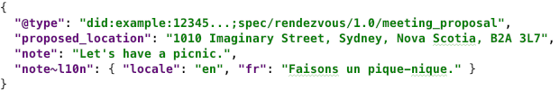
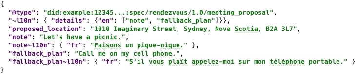
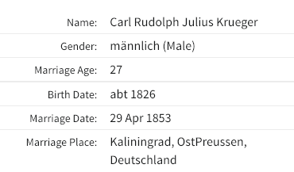

# 0043: l10n (Locali[s|z]ation)
- Author: Daniel Hardman
- Start Date: 2018-11-30

## Status
- Status: [PROPOSED](/README.md#rfc-lifecycle)
- Status Date: 2019-04-01
- Status Note: Broadly socialized within the Indy community,
  and used in some of the other RFCs. Not yet implemented
  to any significant degree.

## Summary

Defines how to send a [DIDComm](../../concepts/0005-didcomm/README.md)
message in a way that facilitates interoperable
localization, so humans communicating through agents can interact without
natural language barriers.

## Motivation

The primary use case for DIDComm is to support automated processing,
as with messages that lead to credential issuance, proof exchange, and so
forth. Automated processing may be the *only* way that certain [agents](
../../concepts/0004-agents/README.md) can
process messages, if they are devices or pieces of software run by
organizations with no human intervention.

However, humans are also a crucial component of the DIDComm ecosystem, and
many interactions have them as either a primary or a secondary audience. In
credential issuance, a human may need to accept terms and conditions from the
issuer, even if their agent navigates the protocol. Some protocols, like a
chat between friends, may be entirely human-centric. And in any protocol
between agents, a human may have to interpret errors.

When humans are involved, locale and potential translation into various
natural languages becomes important. Normally, localization is the concern
of individual software packages. However, in DIDComm,
the participants may be using different software, and the localization may
be a cross-cutting concern--Alice's software may need to send a localized
message to Bob, who's running different software. It therefore becomes useful
to explore a way to facilitate localization that allows interoperability
without imposing undue burdens on any implementer or participant.

>NOTE: JSON-LD also describes a localization mechanism. We have chosen not
to use it, for reasons [enumerated in the RFC about JSON-LD
compatibility](../../concepts/0047-json-ld-compatibility/README.md#internationalization-and-localization).

# Tutorial
[tutorial]: #tutorial

Here we introduce some flexible and easy-to-use conventions. Software that
uses these conventions should be able to add localization value in several ways,
depending on needs.

### Introducing `~l10n`

The default assumption about locale with respect to all DIDComm messages
is that they are locale-independent, because they are going to be processed
entirely by automation. [Dates should be in ISO 8601 format, typically in UTC](
../../concepts/0074-didcomm-best-practices/README.md#date-time-conventions).
Numbers should use JSON formatting rules (or, if embedded in strings, the "C"
locale). Booleans and null values use JSON keywords.

Strings tend to be somewhat more interesting. An agent message may contain many
strings. Some will be keys; others may be values. Usually, *keys* do not need to
be localized, as they will be interpreted by software (though see [
Advanced Use Case](#advanced-use-case) for an example that *does*). Among string
*values*, some may be locale-sensitive, while others may not. For example, consider
the following fictional message that proposes a meeting between Alice and Bob:

[](sample1.json)

Here, the string value named `proposed_location` need not be changed, no matter what
language Bob speaks. But `note` might be worth localizing, in case Bob speaks
French instead of English.

We can't assume all text is localizable. This would result in silly processing,
such as trying to translate the `first_name` field in a driver's license:


The `~l10n` [decorator](../../concepts/0011-decorators/README.md)
 (so-named because "localization" has 10 letters between "l" and "n") may be added
 to the `note` field to meet this need:

[](field-scope.json)

>If you are not familiar with this notion of *field decorators*, please review
the [section about scope in the RFC on decorators](
../../concepts/0011-decorators/README.md#decorator-scope
).

### Decorator at Message Scope

The example above is minimal. It shows a French __localized alternative__ for
the string value of `note` in the `note~l10n.fr` field. Any number of these
alternatives may be provided, for any set of locales. Deciding whether to use
one depends on knowing the locale of the content that's already in `note`, so
`note~l10n.locale` is also provided.

But suppose we evolved our message type, and it ended up having 2 fields that
were localization-worthy. Both would likely use the same locale in their values,
but we don't really want to repeat that locale twice. The preferred way to handle
this is to decorate the *message* with semantics that apply message-wide, and to
decorate *fields* with semantics that apply just to field instances or to fields
in the abstracts. Following this pattern puts our example message into a more
canonical form:

[](message-scope.json)

### Decorator at Message Type Scope

Now we are declaring, at message scope, that `note` and `fallback_plan` are
localizable and that their locale is `en`.

It is worth noting that this information is probably true of *all* instances of
messages of this type--not just this particular message. This raises the possibility
of declaring the localization data at an evey higher level of abstraction. We do
this by moving the decorator from a message *instance* to a message *type*. Decorators
on a message *type* are declared in a section of the associated RFC named
*Localization* (or "Localisation", for folks that like a different locale's
spelling rules :-). In our example, the relevant section of the RFC might
look like this:

[](localization-section.md)

This snippet contains one unfamiliar construct, `catalogs`, which will be discussed
below. Ignore that for a moment and focus on the rest of the content.
As this snippet mentions, the JSON fragment for `~l10n` that's displayed in the
running text of the RFC should also be checked in to github with the RFC's
markdown as `<message type name>~l10n.json`, so automated tools can consume
the content without parsing markdown.

Notice that the markdown section is hyperlinked back to this RFC so developers
unfamiliar with the mechanism will end up reading *this* RFC for more details.

With this decorator on the message type, we can now send our original message,
with no message or field decorators, and localization is still fully defined:

[](sample1.json)

Despite the terse message, its locale is known to be English, and the `note`
field is known to be localizable, with current content also in English.

One benefit of defining a `~l10n` decorator for a message family is that
developers can add localization support to their messages without changing
field names or schema, and with only a minor semver revision to a message's
version.

We expect most message types to use localization features in more or less this
form. In fact, if localization settings have much in common across a message
family, the `Localization` section of a RFC may be defined not just for a
message *type*, but for a whole message *family*.

### Message Codes and Catalogs 

When the same text values are used over and over again (as opposed to the sort of
unpredictable, human-provided text that we've seen in the `note` field thus far),
it may be desirable to identify a piece of text by a code that describes its meaning,
and to publish an inventory of these codes and their localized alternatives. By
doing this, a message can avoid having to include a huge inventory of localized
alternatives every time it is sent.

We call this inventory of message codes and their localized alternatives a **message
catalog**. Catalogs may be helpful to track a list of common errors (think of
symbolic constants like `EBADF` and `EBUSY`, and the short explanatory strings
associated with them, in Posix's &lt;errno.h&gt;). Catalogs let translation be done
once, and reused globally. Also, the code for a message can be searched on the web,
even when no localized alternative exists for a particular language. And the message
text in a default language can undergo minor variation without invalidating
translations or searches.

If this usage is desired, a special subfield named `code` may be included inside the map
of localized alternatives:

[](with-code.json)

Note, however, that a code for a localized message is not useful unless we know what
that code means. To do that, we need to know where the code is defined. In other words,
codes need a namespace or context. Usually, this namespace or context comes from the
message family where the code is used, and codes are defined in the same RFC where the
message family is defined.

Message families that support localized text with predictable values should thus
include or reference an official catalog of codes for those messages. A catalog
is a dictionary of `code` --> localized alternatives mappings. For example:

[](catalog.json)

To associate this catalog with a message type, the RFC defining the message type
should contain a "Message Catalog" section that looks like this:


 
Note the verbiage about an official, immutable URL. This is important because
localized alternatives for a message code could be an attack vector if the
message catalog isn't handled correctly. If a hacker is able to change the
content of a catalog, they may be able to change how a message is interpreted
by a human that's using localization support. For example, they could suggest
that the `en` localized alternative for code "warn-suspicious-key-in-use` is
"Key has been properly verified and is trustworthy." By having a tamper-evident
version of the catalog (e.g., in github or published on a blockchain), devlopers
can write software that only deals with canonical text or dynamically translated
text, never with something the hacker can manipulate.

In addition, the following best practices are recommended to maximize catalog
usefulness:

1. Especially when displaying localized error text, software should also display
the underlying code. (This is desirable anyway, as it allows searching the web
for hints and discussion about the code.)

2. Software that regularly deals with localizable fields of key messages should
download a catalog of localizable alternatives in advance, rather than fetching
it just in time.

##### Connecting `code` with its catalog

We've described a catalog's structure and definition, but we haven't
yet explained how it's referenced. This is done through the `catalogs`
field inside a `~l10n` decorator. There was an example above, in the
example of a "Localization" section for a RFC. The field name, `catalogs`, is
plural; its value is an array of URIs that reference specific
catalog versions. Any catalogs listed in this URI are searched, in the
order given, to find the definition and corresponding localized
alternatives for a given `code`.
 
A `catalogs` field can be placed in a `~l10n` decorator at various scopes.
If it appears at the message or field level, the catalogs it lists are
searched before the more general catalogs.

### Advanced Use Case

>This section is not normative in this version of the RFC. It is considered
experimental for now.

Let's consider a scenario that pushes the localization features to their
limit. Suppose we have a family of DIDComm messages that's designed to
exchange genealogical records. The main message type, `record`, has a
fairly simple schema: it just contains `record_type`, `record_date`, and
`content`. But `content` is designed to hold arbitrary sub-records from
various archives: probate paperwork from France, military
discharge records from Japan, christening certificates from Germany.

Imagine that the UX we want to build on top of these messages is similar
to the one at Ancestry.com:



Notice that the names of fields in this UX are all given in English.
But how likely is it that a christening certificate from Germany
will have English field names like "Birth Data" and "Marriage Date"
in its JSON?

The `record` message behind data like this might be:

[](localized-keys-record.json)

In order to translate this data, not just *values* but also *keys* need to have
associated `~l10n` data. We do this with a `locales` array. This allows us to
specify very complex locale settings--including multiple locales in the same
message, and locales on keys. We may still have the `~l10n.locale` array and
similar fields to establish defaults that are overridden in `~l10n.locales`:

```JSON
"~l10n": { 
  "locales": {
    "de": ["content.key@*", "content.Geburtstag", "content.Heiratsdatum"]
  }
}
```

This says that all fields under `content` have *names* that are German, and
that the `content.Geburtstag` and `content.Heiratsdatum` field *values* (which are of type
date) are also represented in a German locale rather than the default ISO 8601.

Besides supporting key localization, having a `~l10n.locales` array on a message,
message type, or message family scope is an elegant, concise way to cope with messages
that have mixed field locales (fields in a variety of locales).

# Drawbacks
[drawbacks]: #drawbacks

The major problem with this feature is that it introduces complexity. However,
it is complexity that most developers can ignore unless or until they care
about localization. Once that becomes a concern, the complexity provides
important features--and it remains nicely encapsulated.

# Rationale and alternatives
[alternatives]: #alternatives

We could choose not to support this feature.

We could also use [JSON-LD's `@language` feature](https://w3c.github.io/json-ld-syntax/#string-internationalization).
However, this feature has a number of limitations, as [documented in the RFC
about JSON-LD compatibility](../../concepts/0047-json-ld-compatibility/README.md#internationalization-and-localization).

# Prior art
[prior-art]: #prior-art

Java's property bundle mechanism, Posix's gettext() function, and many other localization
techniques are well known. They are not directly applicable, mostly because they don't address
the need to communicate with software that may or may not be using the same underlying
mapping/localization mechanism.

# Unresolved questions
[unresolved]: #unresolved-questions

- Is encoding for units (e.g., the metric system vs. the British Imperial system)
  something that should be associated with locale?
