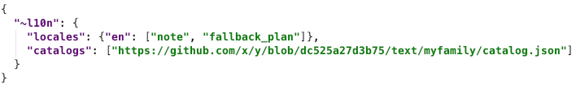

##### Localization

By default, all instances of this message type carry [localization metadata](
https://github.com/hyperledger/indy-hipe/pull/64) in the form of an implicit
`~l10n` decorator that looks like this:

This `~l10n` JSON fragment is checked in next to the narrative content of
this RFC as <a target="_blank" href="l10n.json">l10n.json</a>.

Individual messages can use the `~l10n` decorator to supplement or
override these settings.