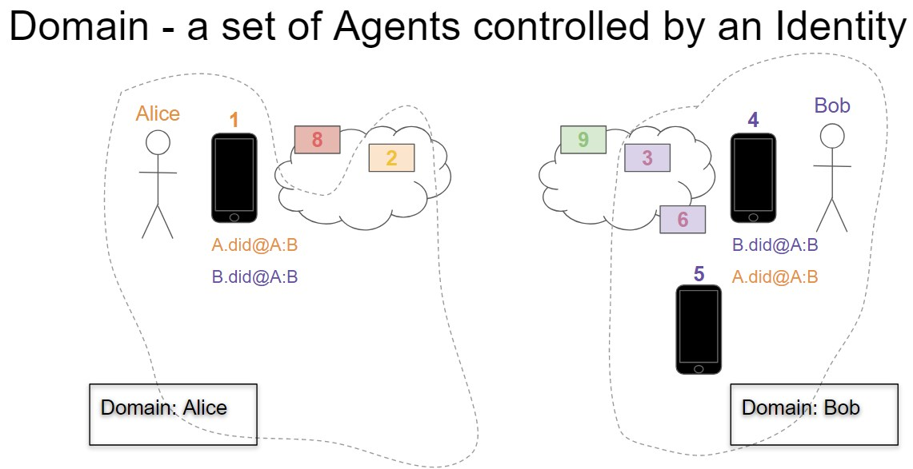

# 0067: DIDComm DID document conventions
- Author: Tobias Looker (tobias.looker@mattr.global), Stephen Curran (swcurran@gmail.com)
- Start Date: 04/15/2019

## Status
- Status: [PROPOSED](/README.md#rfc-lifecycle)
- Status Date: 06/10/2019
- Status Note: This revises the former [INDY HIPE](https://github.com/hyperledger/indy-hipe/pull/92)

## Summary

Explain the DID document conventions required to enable DID communications.

## Motivation

Standardization of these conventions is essential to promoting interoperability of DID communications.

## Tutorial

### DID documents

A DID document is the associated data model to a DID, it contains important associated cryptographic information and a declaration of capabilities the DID supports. 

Of particular interested to this RFC is the definition of [service endpoints](https://w3c-ccg.github.io/did-spec/#service-endpoints). The primary object of this RFC is to document the DID communication service type and describe the associated conventions.

### Service Conventions

As referenced above within the [DID specification](https://w3c-ccg.github.io/did-spec/#did-documents) lies a section called [service endpoints](https://w3c-ccg.github.io/did-spec/#service-endpoints), this section of the DID document is reserved for `any type of service the entity wishes to advertise, including decentralized identity management services for further discovery, authentication, authorization, or interaction`.

When a DID document wishes to express support for DID communications, the following service definition is defined.

```json
{
  "service": [{
    "id": "did:example:123456789abcdefghi#did-communication",
    "type": "did-communication",
    "priority" : 0,
    "recipientKeys" : [ "did:example:123456789abcdefghi#1" ],
    "routingKeys" : [ "did:example:123456789abcdefghi#1" ],
    "serviceEndpoint": "https://agent.example.com/"
  }]
}
```

- id : Required by the [Service Endpoints Spec](https://w3c-ccg.github.io/did-spec/#service-endpoints).
- type : Required by the [Service Endpoints Spec](https://w3c-ccg.github.io/did-spec/#service-endpoints). It is mandatory that this field is set to `did-communication`
- priority : This represents the priority of the service endpoint, used for distinction when multiple `did-communication` service endpoints are present in a single DID document. It is mandatory that this field is set to an unsigned integer with the default value of `0`.
- recipientKeys : This is an array of [did key references](https://w3c-ccg.github.io/did-spec/#public-keys) used to denote the default recipients of an endpoint. (*note-1*)
- routingKeys: This is an array of [did key references](https://w3c-ccg.github.io/did-spec/#public-keys), ordered from most destward to most srcward, used to denote the individual routing hops in between the sender and recipients. See [TBC]() for more information on how routing is intended to operate.
- serviceEndpoint : Required by the [Service Endpoints Spec](https://w3c-ccg.github.io/did-spec/#service-endpoints). This URL based endpoint is used to declare how the message should be sent. DID communication is transport agnostic, and therefore leverages existing application level transport protocols. However for each transport defined, which is identified by the URL scheme e.g `http`, a set of transport specific considerations are defined see [transports](../0025-didcomm-transports/README.md) for more details.

>Notes
>1. The keys featured in this array must resolve to keys of the same type, for example a mix `Ed25519VerificationKey2018` or `RsaVerificationKey2018` in the same array is invalid.

### Message Preparation Conventions

Below describes the process under which a DID communication message is prepared and sent to a DID based on the conventions declared in the associated DID document. The scenario in which the below is predicated has the following conditions.
    - The sender possesses the DID document for the intended recipient(s) of a DID communication message.
    - The sender has created a [content level message](../../concepts/0021-didcomm-message-anatomy/README.md) that is now ready to be prepared for sending to the intended recipient(s). 

1. The sender resolves the relevant `did-communication` service of the intended recipient(s) DID document.
2. The sender resolves the recipient keys present in the `recipientKeys` array of the service declaration.
3. Using the resolved keys, the sender takes the content level message and packs it inside an [encrypted envelope](../../concepts/0021-didcomm-message-anatomy/README.md) for the recipient keys. (*note-2*)
4. The sender then inspects the `routingKeys` array, if it is found to be empty, then the process skips to step 5. Otherwise, the sender prepares a content level message of type `forward`. The resolved keys from the `recipientKeys` array is set as the contents of the `to` field in the forward message and the encrypted envelope from the previous step is set as the contents of the `msg` field in the forward message. Following this, for each element in the `routingKeys` array the following sub-process is repeated:
    1. The sender resolves the current key in the routing array and takes the outputted encrypted envelope from the previous step and packs it inside a new encrypted envelope for the current key.
    2. The sender prepares a content level message of type `forward`. The current key in the routing array is set as the contents of the `to` field in the forward message and the encrypted envelope from the previous step is set as the contents of the `msg` field in the forward message.
5. Resolve the service endpoint:
    - If the endpoint is a valid DID URL, check that it resolves to another DID service definition. If the resolution is successful the process from step 2. is repeated using the message outputted from this process as the input message. 
    - If the service endpoint is not a DID URL, send the message using the transport protocol declared by the URL's scheme.  

> Notes
>1. There are two main situations that an agent will be in prior to preparing a new message.
>>-  The agent is responding to a message that has just been received and has the context of the sender key of the previous message. In this case, a targeted lookup of the `did-communication` service definition can be done to find the service definition that features the sender key as a recipient key which would ensure that the response was delivered back to the sender.
>>-  The agent is creating a new message to a connection and will use the default `did-communication` service definition for preparation of a message. In this case, the default `did-communication` service definition would be used by resolving the lowest priority service definition from the connections DID document.
>
>2. When preparing this envelope the sender has two main choices to make around properties to include in envelope
>>- Whether to include sender information
>>- Whether to include a non-reputable signature

### Example: Domain and DID document

The following is an example of an arbitrary pair of domains that will be helpful in providing context to conventions defined above.



In the diagram above:

- Alice has
  - 1 Edge Agent - "1"
  - 1 Cloud Agent - "2"
  - 1 Domain Endpoint - "8"
- Bob has
  - 2 Edge Agents - "4", "5"
  - 2 Cloud Agents - "3", "6"
  - 1 Domain Endpoint - "9"

#### Bob's DID document for his Relationship with Alice

Bob’s domain has 3 devices he uses for processing messages - two phones (4 and 5) and a cloud-based agent (6). As well, Bob has one agent that he uses as a mediator (3) that can hold messages for the two phones when they are offline. However, in Bob's relationship with Alice, he ONLY uses one phone (4) and the cloud-based agent (6). Thus the key for device 5 is left out of the DID document (see below). For further privacy preservation, Bob also elects to use a shared domain endpoint (agents-r-us), giving him an extra layer of isolation from correlation. This is represented by the `serviceEndpoint` in the service definition not directly resolving to an endpoint URI rather resolving to another `did-communication` service definition which is owned and controlled by the endpoint owner (agents-r-us). 

Bobs DID document given to Alice

```json
{
  "@context": "https://w3id.org/did/v1",
  "id": "did:example:1234abcd",
  "publicKey": [
    {"id": "3", "type": "RsaVerificationKey2018",  "controller": "did:example:1234abcd","publicKeyPem": "-----BEGIN PUBLIC X…"},
    {"id": "4", "type": "RsaVerificationKey2018",  "controller": "did:example:1234abcd","publicKeyPem": "-----BEGIN PUBLIC 9…"},
    {"id": "6", "type": "RsaVerificationKey2018",  "controller": "did:example:1234abcd","publicKeyPem": "-----BEGIN PUBLIC A…"}
  ],
  "authentication": [
    {"type": "RsaSignatureAuthentication2018", "publicKey": "did:example:1234abcd#4"}
  ],
  "service": [
    {
      "id": "did:example:123456789abcdefghi;did-communication",
      "type": "did-communication",
      "priority" : 0,
      "recipientKeys" : [ "did:example:1234abcd#4" ],
      "routingKeys" : [ "did:example:1234abcd#3" ],
      "serviceEndpoint" : "did:example:xd45fr567794lrzti67;did-communication"
    }
  ]
}
```

Agents r Us DID document - resolvable by Alice

```json
{
  "@context": "https://w3id.org/did/v1",
  "id": "did:example:xd45fr567794lrzti67",
  "publicKey": [
    {"id": "1", "type": "RsaVerificationKey2018",  "controller": "did:example:xd45fr567794lrzti67","publicKeyPem": "-----BEGIN PUBLIC X…"},
  ],
  "authentication": [
    {"type": "RsaSignatureAuthentication2018", "publicKey": "did:example:xd45fr567794lrzti67#1"}
  ],
  "service": [
    {
      "id": "did:example:xd45fr567794lrzti67;did-communication",
      "type": "did-communication",
      "priority" : 0,
      "recipientKeys" : [ "did:example:xd45fr567794lrzti67#1" ],
      "routingKeys" : [ ],
      "serviceEndpoint" : "http://agents-r-us.com"
    }
  ]
}
```

#### Message Preparation Example

Alices agent goes to prepare a message `desired_msg` for Bob.

1. Alices agent resolves the above DID document `did:example:1234abcd` for Bob and resolves the `did-communication` service definition.
2. Alices agent then packs `desired_msg` in an encrypted envelope message to the resolved keys defined in the `recipientKeys` array. 
3. Because the the `routingKeys` array is not empty, a content level message of type `forward` is prepared where the `to` field of the forward message is set to the resolved keys and the `msg` field of the forward message is set to the encrypted envelope from the previous step.
4. The resulting forward message from the previous step is then packed inside another encrypted envelope for the first and only key in the `routingKeys` array.
5. Inspection of the service endpoint, reveals it is a did url and leads to resolving another `did-communication` service definition, this time owned and controlled by `agents-r-us`.
6. Because in the `agents-r-us` service definition there is a recipient key. A content level message of type `forward` is prepared where the `to` field of the forward message is set to the recipient key and the `msg` field of the forward message is set to the encrypted envelope from the previous step.
7. This content message is then packed in a encrypted envelope for the recipient key in `agents-r-us` service definition.
8. Finally as the endpoint listed in the serviceEndpoint field for the `agents-r-us` `did-communication` service definition is a valid endpoint URL, the message is transmitted in accordance with the URL's protocol.

## Reference

## Rationale and alternatives

## Prior art

- [DID Communication Message Anatomy](../0025-didcomm-transports/README.md)
- [DID Communication Encryption Envelope](../0019-encryption-envelope/README.md)

## Unresolved questions

The following remain unresolved:

- The convention for packing the message for the required routes is dependent on the array order of key references, which could be viewed as a weak/brittle convention.