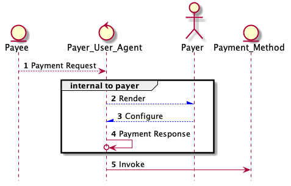

# 00xx: Payment Decorators
- Author: Sam Curren (sam@sovrin.org), Daniel Hardman (daniel.hardman@gmail.com), Tomislav Markovski
- Start Date: 2019-04-22

## Status
- Status: [PROPOSED](/README.md#rfc-lifecycle)
- Status Date: 2019-06-11
- Status Note: Still being studied. This supersedes [Indy HIPE PR #129](
https://github.com/hyperledger/indy-hipe/pull/129).

## Summary
[summary]: #summary

Defines the `~payment_request`, `payment_internal_response`, and `~payment_receipt` decorators.
These offer standard payment features in all DIDComm interactions, and let DIDComm take advantage
of the [W3C's Payment Request API]( https://www.w3.org/TR/payment-request/) in an interoperable way.

## Motivation
[motivation]: #motivation

Instead of inventing custom messages for payments in each protocol, arbitrary messages
can express payment semantics with payment decorators. Individual protocol specs should
clarify on which messages and under which conditions the decorators are used.

## Tutorial

The [W3C's Payment Request API](https://www.w3.org/TR/payment-request/) governs interactions
between three parties:

1. payer
2. payee
3. payment method

The payer is usually imagined to be a person operating a web browser,
the payee is imagined to be an online store, and the payment method might be something like
a credit card processing service. The payee emits a [PaymentRequest](
https://www.w3.org/TR/payment-request/#paymentrequest-interface) JSON structure (step 1
below); this causes the payee to be prompted (step 2, "Render"). The payer decides
whether to pay, and if so, which payment method and options she prefers (step 3, "Configure").
The payer's choices are embodied in a [PaymentResponse](
https://www.w3.org/TR/payment-request/#paymentresponse-interface)
JSON structure (step 4). This is then used to select the appropriate codepath and inputs to
invoke the desired payment method (step 5).

[](payment-request-api-flow.puml)

Notice that this flow does not include anything coming back to the payer. In this API,
the PaymentResponse structure embodies a response from the payer to the payer's own agent,
expressing choices about which credit card to use and which shipping options are desired;
it's not a response that crosses identity boundaries. That's reasonable because this is
the Payment __Request__ API, not a Payment Roundtrip API. It's only about requesting
payments, not completing payments or reporting results. Also, each payment method will
have unique APIs for fulfillment and receipts; the W3C Payment Request spec does not
attempt to harmonize them, though some work in that direction is underway in the
separate [Payment Handler API](https://www.w3.org/TR/payment-handler/) spec.

In DIDComm, the normal emphasis is on interactions between parties with different identities.
This makes PaymentResponse and the communication that elicits it (steps 2-4) a bit
unusual from a DIDComm perspective; normally DIDComm would use the word "response"
for something that comes back from Bob, after Alice asks Bob a question. It also makes
the scope of the W3C API feel incomplete, because we'd like to be able to model
the entire flow, not just part of it.

The DIDComm payment decorators map to the W3C API as follows:

* DIDComm's `payment_request` decorator is exactly equivalent to the JSON representation
of PaymentRequest in the W3C API, including all internal fields and semantics, and the
use of camelCase.
* DIDComm's `payment_internal_response` decorator is exactly equivalent to the JSON
representation of PaymentResponse in the W3C API. However, we never expect it to appear
on messages that cross a sovereign domain boundary. It is only relevant if Alice has
two agents that want to confer about Alice's choices in responding to a `payment_request`,
and is thus not relevant to interoperability. However, it is defined so internal
conversations about Alice's choices may leverage a standard mechanism, if they like.
* DIDComm's `payment_receipt` decorator has no analog in the W3C spec, because it
encapsulates proof from payer to payee, that payment has actually taken place.
* Neither DIDComm nor the W3C spec define messages for the interaction between payer
and payment method handler. Rather, both allow this communication to be proprietary.
At a future date, perhaps standardization will happen here.

## Reference

### `~payment_request`

Please see the [PaymentRequest interface docs in the W3C spec](
https://www.w3.org/TR/payment-request/#paymentrequest-interface) for a full
reference, or [Section 2, Examples of Usage](https://www.w3.org/TR/payment-request/#examples-of-usage)
in the W3C spec for a narration that builds a PaymentRequest
from first principles.

The following is a sample `~payment_request` decorator with some
interesting details to suggest what's possible:

```json
{
  "~payment_request": {
    "methodData": [
      {
        "supportedMethods": "basic-card",
        "data": {
          "supportedNetworks": ["visa", "mastercard"],
          "payeeId": "12345"
        },
      },
      {
        "supportedMethods": "sovrin",
        "data": {
          "supportedNetworks": ["sov", "sov:test", "ibm-indy"],
          "payeeId": "XXXX"
        },
      }
    ],
    "details": {
      "id": "super-store-order-123-12312",
      "displayItems": [
        {
          "label": "Sub-total",
          "amount": { "currency": "USD", "value": "55.00" },
        },
        {
          "label": "Sales Tax",
          "amount": { "currency": "USD", "value": "5.00" },
          "type": "tax"
        },
      ],
      "total": {
        "label": "Total due",
        // The total is USD$65.00 here because we need to
        // add shipping (below). The selected shipping
        // costs USD$5.00.
        "amount": { "currency": "USD", "value": "65.00" }
      },
      "shippingOptions": [
        {
          "id": "standard",
          "label": "Ground Shipping (2 days)",
          "amount": { "currency": "USD", "value": "5.00" },
          "selected": true,
        },
        {
          "id": "drone",
          "label": "Drone Express (2 hours)",
          "amount": { "currency": "USD", "value": "25.00" }
        }
      ],
      "modifiers": [
        {
          "additionalDisplayItems": [{
            "label": "Card processing fee",
            "amount": { "currency": "USD", "value": "3.00" },
          }],
          "supportedMethods": "basic-card",
          "total": {
            "label": "Total due",
            "amount": { "currency": "USD", "value": "68.00" },
          },
          "data": {
            "supportedNetworks": ["visa"],
          },
        },
        {
          "supportedMethods": "sovrin",
          "total": {
            "label": "Total due",
            "amount": { "currency": "SOV", "value": "2254" },
          },
        },
      ]
    },
    "options": {
      "requestPayerEmail": false,
      "requestPayerName": true,
      "requestPayerPhone": false,
      "requestShipping": true
    }
  }
}
```

The `details.id` field contains an invoice number, shopping cart ID, or similar
identifier that unambiguously identifies the goods and services for which payment
is requested. The `payeeId` field would contain a payment address for cryptocurrency
payment methods, or a merchant ID for credit cards. The `modifiers` section shows
how the requested payment amount should be modified if the `basic-card` method
is selected. That specific example is discussed in greater detail in the W3C spec.
It also shows how the currency could be changed if a token-based method is selected
instead of a fiat-based method. See the separate [W3C spec on Payment Method IDs](
https://www.w3.org/TR/payment-method-id/).

Note that [standard DIDComm localization](../0043-l10n/README.md) can be used
to provide localized alternatives to the `label` fields; this is a DIDComm-specific
extension.

This example shows `options` where the payee is requesting self-attested
data from the payer. DIDComm offers the option of replacing this simple approach with
a sophisticated presentation request based on verifiable credentials. The simple approach
is fine where self-attested data is enough; the VC approach is useful when assurance
of the data must be higher (e.g., a verified email address), or where fancy logic about
what's required (Name plus either Email or Phone) is needed.

The DIDComm `payment_request` decorator may be combined with the `~timing.expires_time`
decorator to express the idea that the payment must be made within a certain time
period or else the price or availability of merchandise is not guaranteed.

### `~payment_internal_response`

This decorator exactly matches [PaymentResponse](
https://www.w3.org/TR/payment-request/#paymentresponse-interface) from the W3C
API and will not be further described here. A useful example of a response
is given in the [related Basic Card Response doc](
https://www.w3.org/TR/payment-method-basic-card/#dom-basiccardresponse).

### `~payment_receipt`

This decorator on a message indicates that a payment has been made. It looks like
this (note the snake_case since we are not matching a W3C spec):

```json
{
  "~payment_receipt": {
      "request_id": "super-store-order-123-12312",
      "selected_method": "sovrin",
      "selected_shippingOption": "standard",
      "transaction_id": "abc123",
      "proof": "directly verifiable proof of payment",
      "payeeId": "XXXX",
      "amount": { "currency": "SOV", "value": "2254" }
  }
}
```

**request_id**: This contains the `details.id` of `~payment_request` that this payment receipt satisfies.

**selected_method**: Which payment method was chosen to pay.

**selected_shippingOption**: Which shipping option was chosen.

**transaction_id**: A transaction identifier that can be checked by the payee to verify that funds were transferred,
and that the transfer relates to this payment request instead of another. This might be a ledger's transaction ID,
for example.

**proof**: Optional. A base64-encoded blob that contains directly verifiable proof that the
transaction took place. This might be useful for payments enacted by a [triple-signed receipt](
http://opentransactions.org/wiki/index.php/Triple-Signed_Receipts)
mechanism, for example. When this is present, `transaction_id` becomes optional. For ledgers
that support state proofs, the state proof could be offered here.

### Example

Here is a rough description of how these decorators might be used in a [protocol to issue
credentials](../0036-issue-credential/README.md). We are not guaranteeing that
the message details will remain up-to-date as that protocol evolves; this is only for
purposes of general illustration.

#### Credential Offer

This message is sent by the issuer; it indicates that payment is requested for the
credential under discussion.

```json
{
    "@type": "did:sov:BzCbsNYhMrjHiqZDTUASHg;spec/issue_credential/1.0/offer_credential",
    "@id": "5bc1989d-f5c1-4eb1-89dd-21fd47093d96",
    "cred_def_id": "KTwaKJkvyjKKf55uc6U8ZB:3:CL:59:tag1",
    "~payment_request": {
        "methodData": [
          {
            "supportedMethods": "ETH",
            "data": {
              "payeeId": "0xD15239C7e7dDd46575DaD9134a1bae81068AB2A4"
            },
          }
        ],
        "details": {
          "id": "0a2bc4a6-1f45-4ff0-a046-703c71ab845d",
          "displayItems": [
            {
              "label": "commercial driver's license",
              "amount": { "currency": "ETH", "value": "0.0023" },
            }
          ],
          "total": {
            "label": "Total due",
            "amount": { "currency": "ETH", "value": "0.0023" }
          }
        }
      },
    "credential_preview": <json-ld object>,
    ///...
}
```

#### Example Credential Request

This Credential Request is sent to the issuer, indicating that they have paid the requested amount.

```json
{
    "@type": "did:sov:BzCbsNYhMrjHiqZDTUASHg;spec/issue_credential/1.0/request_credential",
    "@id": "94af9be9-5248-4a65-ad14-3e7a6c3489b6",
    "~thread": { "thid": "5bc1989d-f5c1-4eb1-89dd-21fd47093d96" },
    "cred_def_id": "KTwaKJkvyjKKf55uc6U8ZB:3:CL:59:tag1",
    "~payment_receipt": {
      "request_id": "0a2bc4a6-1f45-4ff0-a046-703c71ab845d",
      "selected_method": "ETH",
      "transaction_id": "0x5674bfea99c480e110ea61c3e52783506e2c467f108b3068d642712aca4ea479",
      "payeeId": "0xD15239C7e7dDd46575DaD9134a1bae81068AB2A4",
      "amount": { "currency": "ETH", "value": "0.0023" }
    }

	///...
}
```

## Drawbacks

TBD

## Rationale and alternatives

- We could allow each message family to indicate payment information independently. This would be very flexible, but tedious and very messy.
- We could not include payment information in messages, but that would limit useful applications.

## Prior art

* [Indy HIPE PR #129]( https://github.com/hyperledger/indy-hipe/pull/129) contains an earlier
version of this thinking.

## Unresolved questions

* What about a receipt that covers multiple invoices?
* The W3C spec allows almost free variation in the fields used to communicate to specific
payment methods. Do we want to standardize? Do we need to link to specific payment method
definitions? Do we need to define our new payment methods (e.g., cryptocurrency-based)
to be aligned with existing ones?
