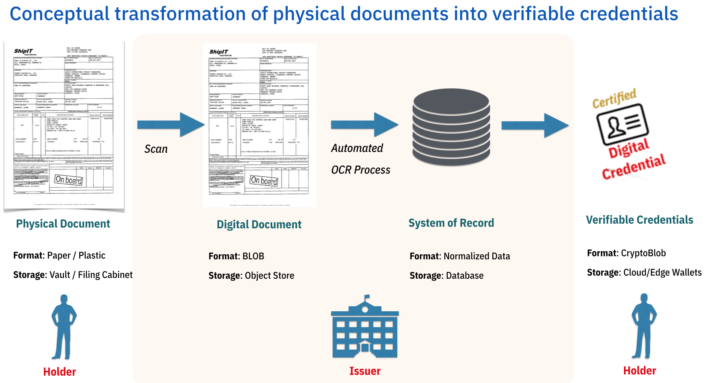
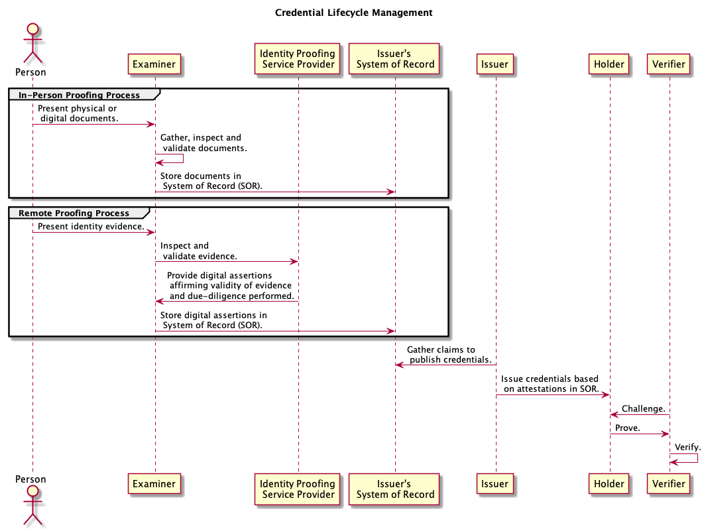
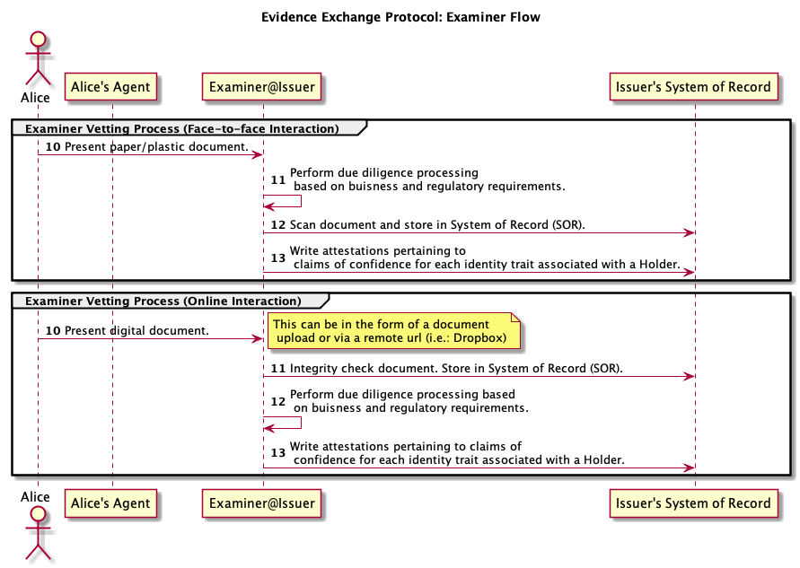
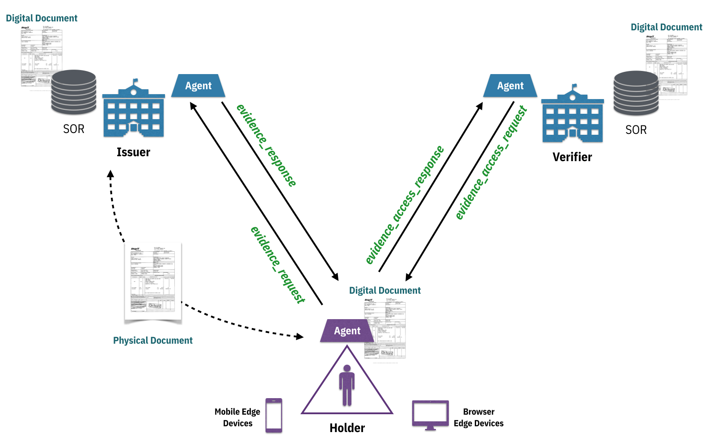
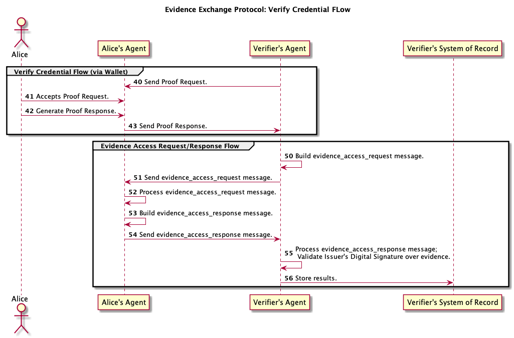

# Aries RFC 0116: Evidence Exchange Protocol 0.9

- Authors: [Dan Gisolfi](mailto:dan.gisolfi@gmail.com)
- Status: [PROPOSED](/README.md#proposed)
- Since: 2019-07-26
- Status Note: Revised to address both physical and digital identity proofing methods and NIST assurance levels.
- Start Date: 2019-07-05
- Tags: feature, protocol

## Summary

The goal of this protocol is to allow Holders to provider an inquiring Verifier with a secure and trusted mechanism for obtaining access to the foundational evidence that enabled the Issuer the assurances necessary to create the [Verifiable Credential(s)](./eep_glossary.md) that the Holder has presented to the Verifier. To this end, a P2P evidence exchange protocol is required that will allow parties using [Pair-wise Peer DIDs](https://github.com/openssi/peer-did-method-spec) to exchange evidence in support of the issuance of *Verified Credentials* without any dependencies on a  centralized storage facility.

## Motivation

During the identity verification process, an entity *may* require access to the genesis documents used to establish digital credentials issued by a credential issuing entity or [Credential Service Provider (CSP)](./eep_glossary.md).  In support of the transition from existing business verification processes to emerging business processes that rely on digitally verified credentials using protocols such as [0036-issue-credential](https://github.com/hyperledger/aries-rfcs/tree/master/features/0036-issue-credential) and [0037-present-proof](https://github.com/hyperledger/aries-rfcs/tree/master/features/0037-present-proof), we need to establish a protocol that allow entities to make this transition while remaining compliant with business and regulatory requirements. Therefore, **we need a mechanism for Verifiers to obtain access to vetted evidence (physical or digital information or documentation) without requiring a relationship or interaction with the Issuer**.

>While this protocol *should* be supported by all persona, its relevance to decentralized identity ecosystems is highly dependent on the business policies of a market segment of Verifiers. For more details see the [Persona](#persona) section.

While technology advancements around identity verification are improving, business policies (most often grounded in risk mitigation) will not change at the same rate of speed. For example, just because a financial institution in Singapore is willing to rely on the KYC due-diligence processing of another institution, we should not assume that the banks in another geolocation (i.e: Hong Kong) can embrace the same level of trust. For this reason, we must enable Verifiers with the option to obtain evidence that backs any assertions made by digital credential issuers.

Based on a *web-of-trust* and cryptographic processing techniques, Verifiers of digital credentials can fulfill their identity proofing workflow requirements. However, business policies and regulatory compliance may require them to have evidence for oversight activities such as but not limited to government mandated Anti-Money Laundering (AML) Compliance audits.

Verifiers or relying parties (RPs) of digital credentials need to make informed decisions about the risk of accepting a digital identity before trusting the digital credential and granting associated privileges. To mitigate such risk, the Verifier may need to understand the strength of the identity proofing process. According to a *December 2015 - NIST Information Technology Laboratory Workshop Report*, [Measuring Strength of Identity Proofing](https://www.nist.gov/sites/default/files/nstic-strength-identity-proofing-discussion-draft.pdf), there are two (2) identity proofing methods that can be leveraged by a CSP:

| Proofing Method | Description |
| --- | --- |
| In-Person Identity Proofing | Holder is required to present themselves and their documentation directly to a trained representative of an identity proofing agency. |
| Remote Identity Proofing | Holder is not expected to present themselves or their documents at a physical location. Validation and verification of presented data (including digital documents) is performed programmatically against one or more corroborating authoritative sources of data.|

If the In-Person Identity Proofing method is used, the strength can easily be determined by allowing the Verifier to gain access to any [Original Documents](./eep_glossary.md) used by the Issuer of a [Derived Credential](./eep_glossary.md). In the situation where a Remote Identity Proofing method is used, confidence in the strength of the identity proofing process can be determined by allowing the Verifier to gain access to [Digital Assertions](./eep_glossary.md) used by the Issuer of a *Derived Credential*.

### Problem Scope

This protocol is intended to address the following challenging questions:

1. What evidence (information or documentation) was used to establish the level of certitude necessary to allow an Issuer to issue a *Verifiable Credential*?

2. For each [Identity Proofing Inquiry](./eep_glossary.md) (challenge) such as Address, Identity, Photo and Achievement, which forms of evidence was used by the Issuer of the *Verifiable Credential*?

3. When the Issuer's Examinier relies on an [Identity Proofing Service Provider (IPSP)](./eep_glossary.md) as part of its Remote Identity Proofing process:

   1. Can the IPSP provide a *Digital Assertion* in association with the [Identity Instrument](./eep_glossary.md) they have vetted as part of their service to the Examiner?

   2. Can the Issuer provide a *Digital Assertion* in association with its certitude in the reliability of its due-diligence activity that is dependent on 3rd parties?

4. When the Issuer relies on trained examiners for its In-Person Identity Proofing process, can the Issuer provide access to the digitally scanned documents either by-value or by-reference?

### Assurance Levels

Organizations that implement [Identity Proofing](./eep_glossary.md) generally seek to balance cost, convenience, and security for both the Issuer and the Holder. Examples of these tradeoffs include:

* Adjusting the complexity of a Remote Identity Proofing process to improve user experience can reduce the quality of the verification process;
* Overly complex proofing processes can result in increased abandonment which is unacceptable to some service providers;
* Overly generalized processes based on expected population characteristics (e.g., national origin, country of residency) can lead to persons that are unable to complete proofing as they may not share such characteristics.

To mitigate the risk associated with such tradeoffs, the *NIST 800-63A Digital Identity Guidelines* outline three (3) levels of identity proofing assurance. These levels describe the degree of due-diligence performed during an *Identity Proofing Process*. See [Section 5.2 Identity Assurance Levels Table 5-1](https://pages.nist.gov/800-63-3/sp800-63-3.html#sec5).

> Users of this protocol will need to understand the *type of evidence that was collected and how it was confirmed* so that they can adhere to any business processes that require **IAL2** or **IAL3**  assurance levels supported by *Strong* or *Superior* forms of evidence.

### Dematerialization of physical documents

Today, entities (businesses, organizations, government agencies) maintain existing processes for the gathering, examination and archiving of physical documents. These entities may retain a copy of a physical document, a scanned digital copy or both. Using manual or automated procedures, the information encapsulated within these documents is extracted and stored as personal data attestations about the document presenter within a system of record (SOR).



As decentralized identity technologies begin to be adopted, these entities can transform these attestations into *Verifiable Credentials*.

### Understanding KYC

*Know Your Customer (KYC)* is a process by which entities (business, governments, organizations) obtain information about the identity and address of their customers. This process helps to ensure that the services that the entity provides are not misused. KYC procedures vary based on geolocation and industry. For example, the KYC documents required to open a bank account in India versus the USA may differ but the basic intent of demonstrating proof of identity and address are similar. Additionally, the KYC documents necessary to meet business processing requirements for enrollment in a university may differ from that of onboarding a new employee.

Regardless of the type of KYC processing performed by an entity, there may be regulatory or business best practice requirements that mandate access to any *Original Documents* presented as evidence during the KYC process. As entities transition from paper/plastic based identity proofing practices to *Verifiable Credentials* there may exist (albeit only for a transitional period) the need to gain access to the [Identity Evidence](./eep_glossary.md) that an Issuer examined before issuing credentials.

This process is time consuming and costly for the credential Issuer and often redundant and inconvenient for the Holder. Some industry attempts have been made to establish centrally controlled B2B sharing schemas to help reduce such impediments to the Issuer. These approaches are typically viewed as vital for the betterment of the Issuers and Verifiers and are not designed for or motivated by the data privacy concerns of the Holder. The purpose of this protocol is to place the Holder at the center of the P2P C2B exchange of *Identity Evidence* while allowing Verifiers to gain confidence in identity proofing assurance levels.

### Evidence Vetting Workflow

The [Verifiable Credentials Specification](https://www.w3.org/TR/verifiable-claims-data-model/) describes three key stakeholders in an ecosystem that manages digital credentials: Issuers, Holders and Verifiers. However, before an Issuer can attest to claims about a Holder, an *Examiner* must perform the required vetting, due diligence, regulatory compliance and other tasks needed to establish confidence in making a claim about an identity trait associated with a Holder. The actions of the Examiner may include physical validation of information (i.e.: comparison of real person to a photo) as well as reliance on third party services as part of its vetting process. Depending on the situational context of a credential request or the type of privileges to be granted, the complexity of the vetting process taken by an examiner to confirm the truth about a specific trait may vary.



An identity Holder may present to an Examiner *Identity Evidence* in the form of a physical document or other forms of *Identity Instruments* to resolve *Identity Proofing Inquires*. The presentment of these types of evidence may come in a variety of formats:

* `Paper/Plastic`: Typically associated with a face to face interaction for the exchange of documents.
* `Digital Copy`: Typically associated with an online exchange whereby the the Holder uploads a scanned image of the original source (Paper/Plastic) document.
* `URL`: Holder can provide a link to a digital document version of the original source (Paper/Plastic) document on some 3rd Party file storage solution:
  * Document Storage Provider (Dropbox, iCloud)
  * Credential Issuing Agent (Retail Bank, Credit Union, Verification Service Provider)

### Evidence Access Matrix

>Note: Assumption herein is that original documents are never forfeited by an individual.


| Original Source Format | Issuer Archived Format | Verifier Business Process Format | Protocol Requirement |
| --- | --- | --- |
| Paper/Plastic | Paper-Copy | n/a | n/a |
| Paper/Plastic | Digital Copy | Digital Copy | Access by Value |
| Paper/Plastic | Digital Copy | URL | Access by Reference |
| Digital Copy | Digital Copy | Digital Copy | Access by Value |
| Digital Copy | Digital Copy | URL | Access by Reference |
| Digital Scan | Digital Copy | Digital Copy  | Digital Assertion |
| URL | Digital Copy | Digital Copy | Access by Value |
| URL | Digital Copy | URL | Access by Reference |

### Why a Peer DID Protocol?

In a decentralized identity ecosystem where peer relationships no longer depend on a centralized authority for the source of truth, why should a Verifier refer to some 3rd party or back to the issuing institution for capturing *Identity Evidence*?

* Centralized Shared-KYC Providers: While there seems to be a [trend to build shared ledgers](#reference) that manage the exchange of KYC documents and data, we can not ignore the user-centric privacy by design principle that is foundational to decentralized identity solutions. Pair-wise Peer DIDs offer an alternative approach that is independent of any central source of truth, and are intended to be cheap, fast, scalable, and secure. The [advantages of Pair-wise Peer DIDs](https://github.io/peer-did-method-spec/index.html#advantages) make them suitable for most private relationships between people, organizations, and things.
* Issuer Communications: B2B interactions between a Verifier of a credential and the Issuer of the credential injects unnecessary correlation and behavior privacy risks for the Holder.

## Solution Concepts

### Protocol Assumptions

1. Holder *must* present *Identity Evidence* access to Verifier such that Verifier can be assured that the Issuer vetted the evidence.
2. Some business processes and/or regulatory compliance requirements *may* demand that a Verifier gains access to the *Original Documents* vetted by a credential Issuer.
3. Some Issuers *may* accept digital access links to documents as input into vetting process. This is often associated with Issuers who will accept copies of the *Original Documents*.
4. Some Issuer *may* accept *Digital Assertions* from *IPSPs* as evidence of their due-diligence process. Examples of such *IPSPs* are: [Acuant](https://www.acuantcorp.com/), [Au10tix](https://www.au10tix.com/), [IWS](https://www.iwsinc.com/products/cloudid/), [Onfido](https://onfido.com/us/) and [1Kosmos](https://onekosmos.com/).

### Protocol Objectives

In order for a Verifier to avoid or reduce evidence vetting expenses it must be able to:

* be convinced that a trusted entity has performed the necessary vetting;
* know, if required, that access to the original vetted evidence is possible.

This implies that the protocol *must* address the following evidence concerns:

| Interaction Type | Challenge | Protocol Approach |
| --- | --- |
| Examiner-to-Holder | How does Issuer provide Holder with proof that it has **vetted** *Identity Evidence*? |Issuer signs hash of the evidence and presents signature to Holder. |
| Holder-to-Verifier | How does Holder **present** Verifier with evidence that the Issuer of a Credential vetted *Identity Evidence*? |Holder presents verifier with digitally signed hash of evidence, public DID of Issuer and access to a copy of the digital evidence. |
| Verifier-to-FileStorageProvider | How does Verifier **access** the evidence in digital format (base64)? | Issuer or Holder must provide secure access to a digital copy of the document. |
| Verifier-to-Verifier | How does Verifier **validate** that Issuer attests to the vetting of the *Identity Evidence* for personal data claims encapsulated in issued credentials? | Verifier gains access to the digital evidence, fetches the public key associated with the Issuer's DID and validates Issuer's signature of document hash. |

### Protocol Outcome

This protocol is intended to be a compliment to the foundational (issuance, verification) protocols for credential lifecycle management in support of the [Verifiable Credentials Specification](https://www.w3.org/TR/verifiable-claims-data-model/). Overtime, it is assumed that the exchange of *Identity Evidence* will no longer be necessary as digital credentials become ubiquitous. In the meantime, the trust in and access to *Identity Evidence* can be achieved in private peer to peer relationships using the [Peer DID Spec](https://github.com/openssi/peer-did-method-spec).

### Persona

This protocol addresses the business policy needs of a market segment of Verifiers. [Agent Software](https://docs.google.com/document/d/1gfIz5TT0cNp2kxGMLFXr19x1uoZsruUe_0glHst2fZ8/edit#heading=h.2mgh3opwe21u) used by the following persona is required to support this market segment.

| Persona | Applicability |
| --- | --- |
| Examiner | Entities that perform In-Person and/or Remote Identity Proofing processes and need to support potential requests for evidence in support of the issuance of *Verifiable Credentials* based on the results of such processes. |
| Issuer | Entities with the certitude to share with a Holder supporting evidence for the due-diligence performed in association with attestations backing an issued *Verifiable Credential*. |
| Holder | A recipient of a *Verifiable Credential*, that desires to proactively gather supporting evidence of such a credential incase a Verifier should inquire.  |
| Verifier | Entities that require access to *Original Documents* or *Digital Assertions* because they can not (for business policy reasons) rely on the identity proofing due-diligence of others. These entities may refer to a *Trust Score* based on their own business heuristics associated with the type of evidence supplied: *Original Documents*, *Digital Assertions*. |

### User Stories

An example of the applicability of this protocol to real world user scenarios is discussed in the context of a [decentralized digital notary](./digital_notary_usecase.md) where the credential issuing institution is not the issuer of the original source document(s) or digital assertions.

### Evidence Types

In the context of this protocol, *Identity Evidence* represents physical or digital information-based artifacts that support a belief to common *Identity Proofing Inquires* (challenges):

* **Proof of Identity**: Are you who you claim to be?
* **Proof of Address**: Do you reside at a valid and confirmed place of residence?
* **Proof of Photo**: Can you present either a physical or digital image that can be compared with corroborating authoritative sources of data?
* **Proof of Achievement**: Have you accomplished what you claim to have achieved?
* **Proof of Privilege**: Have you been granted certain rights or affiliations?

The following, *non-exhaustive*, list of physical information-based artifacts (documents) are used as evidence when confronted with common identity related inquires. They are often accompanied with a recent photograph. Since this protocol is intended to be agnostic of business and regulatory processes, the types of acceptable documents will vary.

| Proof Type | Sample Documents |
| --- | --- |
| Address | Passport, Voter’s Identity Card, Utility Bill (Gas, Electric, Telephone/Mobile), Bank Account Statement, Letter from any recognized public authority or public servant, Credit Card Statement, House Purchase deed, Lease agreement along with last 3 months rent receipt, Employer’s certificate for residence proof |
| Identity | Passport, [PAN Card](https://en.wikipedia.org/wiki/Permanent_account_number), Voter’s Identity Card, Driving License, Photo identity proof of Central or State government, Ration card with photograph, Letter from a recognized public authority or public servant, Bank Pass Book bearing photograph, Employee identity card of a listed company or public sector company, Identity card of University or board of education |
| Photo | Passport, Pistol Permit, Photo identity proof of Central or State government |
| Achievement | Diploma, Certificate |
| Privilege | Membership/Loyalty Card, Health Insurance Card |

These forms of *Identity Evidence* are examples of trusted credentials that an Examiner relies on during their vetting process.



## Tutorial

The evidence exchange protocol builds on the attachment decorator within DIDComm using the the [Inlining Method](https://github.com/hyperledger/aries-rfcs/blob/master/concepts/0017-attachments/README.md#inlining) for *Digital Assertions* and the [Appending Method](https://github.com/hyperledger/aries-rfcs/blob/master/concepts/0017-attachments/README.md#appending) for *Original Documents*.

The protocol is comprised of the following messages and associated actions:

| Interaction Type | Message | Process Actions |
| --- | --- |
| Holder to Issuer | Request Evidence | Holder reviews the list of credentials it has received from the Issuer and sends an ```evidence_request``` message to Issuer's agent. |
| Issuer to Holder | Evidence Response | Issuer collects *Identity Evidence* associated with each requested credential ID and sends an ```evidence_response``` message to Holder's agent. Upon receipt, the Holder stores evidence data in Wallet. |
| Verifier to Holder | Evidence Access Request | Verifier builds and sends an ```evidence_access_request``` message to Holder's agent. |
| Holder to Verifier | Evidence Access Response | Holder builds and sends an ```evidence_access_response``` message to the Verifier's agent. Verifier fetches requested *Identity Evidence* and performs digital signature validation on each. Verifier stores evidence in system of record.|



### Request Evidence Message

This message should be used as an accompaniment to an [issue credential message](https://github.com/hyperledger/aries-rfcs/tree/master/features/0036-issue-credential#issue-credential). Upon receipt and storage of a credential the Holder should compose an ```evidence_request``` for each credential received from the Issuer. The Holder may use this message to get an update for new and existing credentials from the Issuer.

```json
{
  "@type": "did:sov:BzCbsNYhMrjHiqZDTUASHg;spec/evidence_exchange/1.0/evidence_request",
  "@id": "6a4986dd-f50e-4ed5-a389-718e61517207",
  "for": "did:peer:1-F1220479cbc07c3f991725836a3aa2a581ca2029198aa420b9d99bc0e131d9f3e2cbe",
  "as_of_time": "2019-07-23 18:05:06.123Z",
  "credentials": ["cred-001", "cred-002"],
  "request-type": "by-value"
}
```

Description of attributes:

* `credentials`: A list of credential IDs associated with this pair-wise relationship with the Issuer.
* `request-type`: Stipulates how the Holder's Agent will manage the document access. If ```by-value```, then a copy of the document will be stored by the Holder. If ```by-reference```, then the storage provider service used by the Issuer will be the source of the document and any access control mechanisms will also need to be conveyed.


### Evidence Response Message

This message is required for an Issuer Agent in response to an ```evidence_request``` message. The format of the ```~attach``` attribute will be determined by the value of the ```request_type``` attribute in the associated request message from the Holder. If the Issuer relied on one or more *IPSPs* during the *Identity Proofing Process*, then this message will also include an inline attachment using the ```examiner_assertions``` attribute.

```json
{
  "@type": "did:sov:BzCbsNYhMrjHiqZDTUASHg;spec/evidence_exchange/1.0/evidence_response",
  "@id": "1517207d-f50e-4ed5-a389-6a4986d718e6",
  "~thread": { "thid": "6a4986dd-f50e-4ed5-a389-718e61517207" },
  "for": "did:peer:1-F1220479cbc07c3f991725836a3aa2a581ca2029198aa420b9d99bc0e131d9f3e2cbe",
  "as_of_time": "2019-07-23 18:05:06.123Z",
  "credentials": [
    { "@id": "cred-001",
      "evidence": [
        {"evidence_type": "Address", "evidence_ref": ["#kycdoc1", "#kycdoc4"]},
        {"evidence_type": "Identity", "evidence_ref": ["#kycdoc2"]},
        {"evidence_type": "Photo", "evidence_ref": null}
      ]
    },
    { "@id": "cred-002",
      "evidence": [
        {"evidence_type": "Address", "evidence_ref": ["#kycdoc1","#kycdoc3"]},
        {"evidence_type": "Identity", "evidence_ref": ["#kycdoc3"]},
        {"evidence_type": "Photo", "evidence_ref": ["#kycdoc1"]}
      ]
    }
  ],
  "examiner_assertions": [ ... ],
  "~attach": [ ... ]
}
```

Description of attributes:

* `credentials`: A list of credential IDs each containing an array of evidence.
  * `@id`: Corresponds to each ID associated with the list of credential IDs supplied by the Holder in the ```evidence_request``` message.
  * `evidence`: An array of evidence attachments associated with each type of evidence the Issuer has established for a specific credential.
    * `evidence_type`: Stipulates the type of KYC Document proofing (Address, Identity or Photo) that the Issuer performed for a set of attachments.
    * `evidence_ref`: An array of attachment reference IDs pertaining to the list of evidence used by the Issuer to establish confidence about the Holder.
* `examiner_assertions`: An array of inline attachments for *Digital Assertions*.
* `~attach`: An array of appended attachments for *Original Documents* either by-value or by-reference.

#### Examiner Assertions

```json
{
  "examiner_assertions": [
    {
      "@id": "kycdoc4",
      "approval_timestamp": "2017-06-21 09:04:088",
      "description": "driver's license",
      "vetting_process": {
        "method": "remote",
        "technology": "api"
      },
      "ipsp_did": "~3d5nh7900fn4",
      "ipsp_claim": <base64 of the file>,
      "ipsp_claim_sig": "3vvvb68b53d5nh7900fn499040cd9e89fg3kkh0f099c0021233728cf67945faf",
      "examinerSignature": "f67945faf9e89fg3kkh3vvvb68b53d5nh7900fn499040cd3728c0f099c002123"
    }
  ]
}
```
Description of attributes:

* `approval_timestamp`: Date and time associated with when the Issuer approved assertion from IPSP.
* `description`: A human readable description of the type of document.
* `vetting_process`: Meta-data that allows the Issuer to specify the type of due diligence performed on the vetted evidence.
  * `methods`: One of two possible identity proofing methods: *in-person*, or *remote*.
  * `technology`: Free form description of the approach used to perform the validation. Possible values include but are not limited to: *barcode*, *api*, *human-visual*.
* `ipsp_did`: The DID of the *Identity Proofing Service Provider (IPSP)*.
* `ipsp_claim`: Base64 encoding of the evidence that the IPSP used to perform its verification service.
* `ipsp_claim_sig`: Required RSA/SHA-256 Signature of the IPSP's claim. This is required for downstream processing by the Verifier so that the Holder can demonstrate that the IPSP actually performed a verification service.
* `examinerSignature`: Required RSA/SHA-256 Signature of the evidence. This is required for downstream processing by the Verifier so that the Holder can demonstrate that the Issuer attests to assessment (assertion) made by the IPSP.

#### By-value Attachments

```json
{
  "~attach": [
    {
      "@id": "kycdoc1",
      "mime-type": "image/png",
      "filename": "nys_dl.png",
      "lastmod_time": "2017-06-21 09:04:088",
      "description": "driver's license",
      "vetting_process": {
        "method": "in-person",
        "technology": "barcode"
      },
      "data": {
        "base64": <base64 of the file>
      },
      "examinerSignature": "f67945faf9e89fg3kkh3vvvb68b53d5nh7900fn499040cd3728c0f099c002123"
    },
    {
      "@id": "kycdoc2",
      "mime-type": "application/pdf",
      "filename": "con_ed.pdf",
      "lastmod_time": "2017-11-18 10:44:068",
      "description": "ACME Electric Utility Bill",
      "vetting_process": {
        "method": "in-person",
        "technology": "human-visual"
      },
      "data": {
        "base64": <base64 of the file>
      },
      "examinerSignature": "945faf9e8999040cd3728c0f099c002123f67fg3kkh3vvvb68b53d5nh7900fn4"
    },
    {
      "@id": "kycdoc3",
      "mime-type": "image/jpg",
      "filename": "nysccp.jpg",
      "lastmod_time": "2015-03-19 14:35:062",
      "description": "State Concealed Carry Permit",
      "vetting_process": {
        "method": "in-person",
        "technology": "barcode"
      },
      "data": {
        "sha256": "1d9eb668b53d99c002123f1ffa4db0cd3728c0f0945faf525c5ee4a2d4289904",
        "base64": <base64 of the file>
      },
      "examinerSignature": "5nh7900fn499040cd3728c0f0945faf9e89kkh3vvvb68b53d99c002123f67fg3"
    }
  ]
}
```

This message adheres to the attribute [content formats outlined in the Aries Attachments RFC ](https://github.com/hyperledger/aries-rfcs/blob/master/concepts/0017-attachments/README.md#base64) with the following additions:

* `mime-type`: Describes the MIME type of the attached content. Optional but recommended.
* `filename`: A hint about the name that might be used if this attachment is persisted as a file. It is not required, and need not be unique. If this field is present and mime-type is not, the extension on the filename may be used to infer a MIME type.
* `lastmod_time`: A hint about when the content in this attachment was last modified.
* `description`: A human readable description of the type of document.
* `vetting_process`: See [Examiner Assertions](#examiner-assertions)
* `sha256`: *Optional hash of the content*. Can be useful as an integrity check by Holder.
* `examinerSignature`: Required RSA/SHA-256 Signature of the document. This is required for downstream processing by the Verifier so that the Holder can demonstrate that the Issuer was the attesting source of the *Original Document*.

#### By-reference Attachments

```json
{
  "~attach": [
    {
      "@id": "kycdoc1",
      "mime-type": "image/png",
      "filename": "nys_dl.png",
      "lastmod_time": "2017-06-21 09:04:088",
      "description": "driver's license",
      "vetting_process": {
        "method": "in-person",
        "technology": "barcode"
      },
      "data": {
        "sha256": "1d9eb668b53d99c002123f1ffa4db0cd3728c0f0945faf525c5ee4a2d4289904",
        "links": [
          { "url": "https://www.dropbox.com/s/r8rjizriaHw8T79hlidyAfe4DbWFcJYocef5/myDL.png",
            "accesscode": "some_secret"
          }
        ]
      },
      "examinerSignature": "f67945faf9e89fg3kkh3vvvb68b53d5nh7900fn499040cd3728c0f099c002123"
    },
    {
      "@id": "kycdoc2",
      "mime-type": "application/pdf",
      "filename": "con_ed.pdf",
      "lastmod_time": "2017-11-18 10:44:068",
      "description": "ACME Electric Utility Bill",
      "vetting_process": {
        "method": "remote",
        "technology": "api"
      },
      "data": {
        "sha256": "1d4db525c5ee4a2d42899040cd3728c0f0945faf9eb668b53d99c002123f1ffa",
        "links": [
          { "url": "https://mySSIAgent.com/w8T7AfkeyJYo4DbWFcmyocef5eyH",
            "accesscode": "some_secret"
          }
        ]
      },
      "examinerSignature": "945faf9e8999040cd3728c0f099c002123f67fg3kkh3vvvb68b53d5nh7900fn4"
    },
    {
      "@id": "kycdoc3",
      "mime-type": "image/jpg",
      "filename": "nysccp.jpg",
      "lastmod_time": "2015-03-19 14:35:062",
      "description": "State Concealed Carry Permit",
      "vetting_process": {
        "method": "in-person",
        "technology": "barcode"
      },
      "data": {
        "sha256": "b53d99c002123f1ffa2d42899040cd3728c0f0945fa1d4db525c5ee4af9eb668",
        "links": [
          { "url": "https://myssiAgent.com/mykeyoyHw8T7Afe4DbWFcJYocef5",
            "accesscode": null
          }
        ]
      },
      "examinerSignature": "5nh7900fn499040cd3728c0f0945faf9e89kkh3vvvb68b53d99c002123f67fg3"
    }
  ]
}
```

This message adheres to the attribute [content formats outlined in the Aries Attachments RFC ](https://github.com/hyperledger/aries-rfcs/blob/master/concepts/0017-attachments/README.md#base64) and builds on the [By Value Attachments](#by-value-attachments) with the following additions:

* `links`: A list of zero or more locations at which the content may be fetched.
  * `url`: Link to the external document.
  * `accesscode`: If required, the passcode need to authenticate access to the url.

Upon completion of the Evidence Request and Response exchange, the Holder's Agent is now able to present any Verifier that has accepted a specific Issuer credential with the supporting evidence from the Issuer. This evidence, depending on the Holder's preferences may be direct or via a link to an external resource. For example, regardless of the delivery method used between the Issuer and Holder, the Holder's Agent may decide to fetch all documents and store them itself and then provide Verifiers with by-reference access upon request.

### Evidence Access Request Message

Upon the successful processing of a [credential proof presentation message](https://github.com/hyperledger/aries-rfcs/tree/master/features/0037-present-proof#presentation), a Verifier may desire to request supporting evidence for the processed credential. This ```evidence_access_request``` message is built by the Verifier and sent to the  Holder's agent. Similar to the ```request_evidence``` message, the Verifier may use this message to get an update for new and existing credentials associated with the Holder. The intent of this message is for the Verifier to establish trust by obtaining a copy of the available evidence and performing the necessary content validation.

```json
{
  "@type": "did:sov:BzCbsNYhMrjHiqZDTUASHg;spec/evidence_exchange/1.0/evidence_access_request",
  "@id": "7c3f991836-4ed5-f50e-7207-718e6151a389",
  "for": "did:peer:1-F1220479cbc07c3f991725836a3aa2a581ca2029198aa420b9d99bc0e131d9f3e2cbe",
  "as_of_time": "2019-07-23 18:05:06.123Z",
  "credentials": [
      { "@id": "cred-001", "issuerDID": "~BzCbsNYhMrjHiqZD" },
      { "@id": "cred-002", "issuerDID": "~BzCbsNYhMrjHiqZD" }
  ]
}
```

Description of attributes:

* `credentials`: A list of credential IDs that the Verifier desires proof of evidence.
  * `@id`: Credential ID derived from a validated credential exchange (*proof presentment*).
  * `issuerDID`: The public DID of the Issuer that issued the credential represented by the associated ID. This DID is derived from the credential validation process.



This protocol is intended to be flexible and applicable to a variety of use cases. While our discussion has circulated around the use of the protocol as follow-up to the processing of a credential proof presentment flow, the fact is that the protocol can be used at any point after a Pair-wise DID Exchange has been successfully established and is therefore in the [complete state](https://github.com/hyperledger/aries-rfcs/tree/master/features/0023-did-exchange#complete) as defined by the DID Exchange Protocol. An `IssuerDID` (or DID of the an entity that is one of the two parties in a private pair-wise relationship) is assumed to be known under all possible conditions once the relationship is in the complete state.

### Evidence Access Response Message

This message is required for a Holder Agent in response to an ```evidence_access_request``` message. The format of the ```~attach``` attribute will be determined by the storage management preferences of the Holder's Agent. As such the Holder can respond by-value or by-reference. To build the response, the Holder will validate that the supplied Issuer DID corresponds to the credential represented by the supplied ID. If the Issuer relied on one or more *IPSPs* during the *Identity Proofing Process*, then this message will also include an inline attachment using the ```examiner_assertions``` attribute. Upon successful processing of a ```evidence_access_response``` message, the Verifier will store evidence details in its system of record.

```json
{
  "@type": "did:sov:BzCbsNYhMrjHiqZDTUASHg;spec/evidence_exchange/1.0/evidence_access_response",
  "@id": "1517207d-f50e-4ed5-a389-6a4986d718e6",
  "~thread": { "thid": "7c3f991836-4ed5-f50e-7207-718e6151a389" },
  "for": "did:peer:1-F1220479cbc07c3f991725836a3aa2a581ca2029198aa420b9d99bc0e131d9f3e2cbe",
  "as_of_time": "2019-07-23 18:05:06.123Z",
  "credentials": [
    { "@id": "cred-001",
      "evidence": [
        {"evidence_type": "Address", "evidence_ref": ["#kycdoc1", "#kycdoc4"]},
        {"evidence_type": "Identity", "evidence_ref": ["#kycdoc2"]},
        {"evidence_type": "Photo", "evidence_ref": null}
      ]
    },
    { "@id": "cred-002",
      "evidence": [
        {"evidence_type": "Address", "evidence_ref": ["#kycdoc1","#kycdoc3"]},
        {"evidence_type": "Identity", "evidence_ref": ["#kycdoc3"]},
        {"evidence_type": "Photo", "evidence_ref": ["#kycdoc1"]}
      ]
    }
  ],
  "examiner_assertions": [ ... ],
  "~attach": [ ...
  ]
}
```

This message adheres to the attribute [content formats outlined in the Aries Attachments RFC ](https://github.com/hyperledger/aries-rfcs/blob/master/concepts/0017-attachments/README.md#base64) and leverages the same [Evidence Response Message](#evidence-response-message) attribute descriptions.

## Reference

* Centralized Shared-KYC Trends
  * [R3 KYC Registry](http://www.euromoneyseminars.com/articles/3600987/r3-building-shared-kyc-blockchain-service-with-banks.html)
  [Dutch Banks](https://www.moneylaundering.com/news/largest-dutch-banks-plan-shared-kyc-database/)
  * [Canadian Banks](https://www.itworldcanada.com/article/canadas-big-5-banks-launch-blockchain-based-digital-identity-service-with-securekey/417406)
  * [Deutsche Bank and HSBC Shared-KYC POC](https://www.ibm.com/blogs/insights-on-business/banking/blockchain-kyc-game-changing-regtech-innovation/)
* Sample KYC Documentation requirements
  * [NYS Document Guide for Identification Services](https://process.dmv.ny.gov/documentguide/)
  * [TSA Travelers Guide](https://www.tsa.gov/travel/security-screening/identification)
  * [USA Identity Documents](https://en.wikipedia.org/wiki/Identity_documents_in_the_United_States)
  * [Aadhaar KYC Concepts](http://vikaspedia.in/social-welfare/financial-inclusion/know-your-customer-guidelines#section-2)

## Drawbacks

This protocol does not vary much from a generic document exchange protocol. It can be argued that a special KYC Document exchange protocol is not needed. However, given the emphasis placed on KYC compliance during the early days of DIDComm adoption, we want to make sure that any special cases are addressed upfront so that we avoid adoption derailment factors.

## Rationale and alternatives

As noted in the [references](#reference) section, there are a number of trending KYC Document proofing options that are being considered. Many leverage the notion of a centralized blockchain ledger for sharing documents. This effectively places control outside of the Holder and enables the sharing of documents in a B2B manner. Such approaches do not capitalize on the [advantages of Pair-wise Peer DIDs](https://github.io/peer-did-method-spec/index.html#advantages).

## Prior art

This protocol builds on the foundational capabilities of DIDComm messages, most notable being the [attachment decorator](https://github.com/hyperledger/aries-rfcs/blob/master/concepts/0017-attachments/README.md) within DIDComm.

## Unresolved questions

1. Should this be a separate protocol or an update to issuer-credential?
1. What is the best way to handle access control for by-reference attachments?
1. Are there best practices to be considered for when/why/how a Holder's Agent should store and manage attachments?
1. Can this protocol help bootstrap a prototype for a Digital Notary and thereby demonstrate to the broader ecosystem the unnecessary attention being placed on alternative domain specific credential solutions like ISO-18013-5(mDL)?

## Implementations

The following lists the implementations (if any) of this RFC. Please do a pull request to add your implementation. If the implementation is open source, include a link to the repo or to the implementation within the repo. Please be consistent in the "Name" field so that a mechanical processing of the RFCs can generate a list of all RFCs supported by an Aries implementation.

Name / Link | Implementation Notes
--- | ---
 |  |
