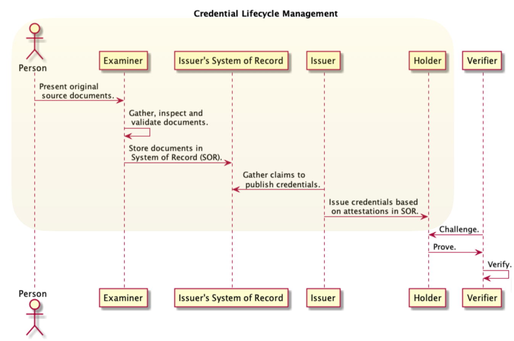
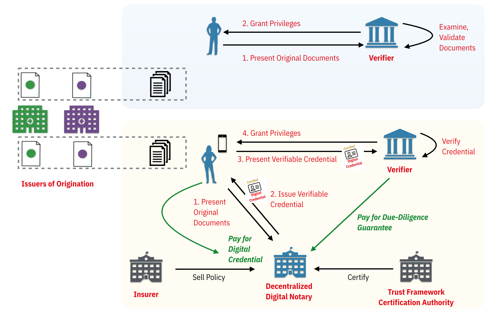

# Decentralized Digital Notary

## Preface
The intent of this document is to describe the concepts of a [Decentralized Digital Notary](./eep_glossary.md) with respect to the bootstrapping of the decentralized identity ecosystem and to demonstrate using *example user stories*[1](#commentary) the applicability of the [Evidence Exchange Protocol](./README.md).  

## Overview

### Problem Statement
How do we bootstrap the digital credential ecosystem when many of the issuing institutions responsible for foundational credentials (i.e.: brith certificate, drivers license, etc) *tend to be laggards*[2](#commentary) when it comes to the adoption of emerging technology? What if we did not need to rely on these issuing institutions and instead leveraged the attestations of [trusted third parties](https://en.m.wikipedia.org/wiki/Trusted_third_party)?

### Concept
During the identity verification process, an entity may require access to the genesis documents from the Issuers of Origination before issuing credentials. We see such requirements in some of the routine identity instrument interactions of our daily lives such as obtaining a Driver's License or opening a Bank Account.

We assume that government agencies such and the [DMV](https://en.wikipedia.org/wiki/Department_of_Motor_Vehicles) (*drivers license*) and Vital Records (brith certificate) will not be early adopters of digital credentials yet their associated [Tier 1 Proofs](./eep_glossary.md) are critical to the the creation of a network effect for the digital credential ecosystem.

We therefore need a forcing function that will disrupt behavior. Image a trusted business entity, a *Decentralized Digital Notary (DDN)*, that would take the responsibility of vouching for the existence of [Original Documents](./eep_glossary.md) (or [Digital Assertions](./eep_glossary.md)) and have the certitude to issue verifiable credentials attesting to personal data claims made by the [Issuer of Origination](./eep_glossary.md).

Today (*blue shaded activity*), an individual receives *Original Documents* from issuing institutions and presents these as evidence to each Verifier. Moving forward (*beige shaded activity*), as a [wide range of businesses](#applicable-businesses) consider acting as DDNs, our reliance on *Issuers of Origination* to be the on-ramps for an individuals digital identity experience diminishes. Overtime, our dependency on the proactive nature of such institutions becomes mute. Furthermore, the more successful DDNs become the more reactionary the laggards will need to be to protect their value in the ecosystem.

### Applicable Businesses

Any entity that has the breath and reach to connect with consumers at scale would be an ideal candidate for the role of a DDN. Some examples include:

* Retail Banks
* Credit Unions
* Regional Rural Banks (India)
* Mobile Field Agents
* Background Screening Service Providers

The monetization opportunities for such businesses will also vary. The linkages between proof-of-identity and proof-of-value can be achieved in several manners:

1. Individual pays for issuance of certificates
1. Verifier pays the underwriter with a payment instrument (i.e.: fiat or cryptocurrency). The payment is for the service of underwriting the screening of an individual so that the Verifier does not have to do it.


## Stories
Presented herein are a series of user stories that incorporate the concepts of a DDN and the ability of a verifier to gain access to Issuer vetted [Identity Evidence](./eep_glossary.md) using the [Evidence Exchange Protocol](./README.md).

The stories focus on the daily lifecycle activities of a two individuals who needs to open a brokerage account and/or update a Life Insurance Policy.

### Persona
| Name | Role |
| --- | --- |
| Eric | An individual that desires to open a brokerage account. |
| Stacy | An individual that desires to open a brokerage account and also apply a Life Insurance Policy. |
| Retail Bank | DDN (Issuer) |
| Thomas | Notary at the Retail Bank familiar with the DDN Process. |
| Brokerage Firm | Verifier |
| Dropbox | Document Management Service |
| iCertitude | A hypothetical [IPSP](./eep_glossary.md) that provides a mobile convenient identity verification service that is fast, trusted and  reliable.  |
| Financial Cooperative | A small local financial institution that is owned and operated by its members. It has positioned itself as a DDN (Issuer) by OEMing the iCertitude platform. |

### Identity Proofing (Examination) Process

#### Financial Cooperative (DDN Awareness)
Eric is a member of his neighborhood Financial Cooperative. He received an email notification that as a new member benefit, the bank is now offering members with the ability to begin their digital identity journey. Eric is given access to literature describing the extend to the bank's offering and a video of the process for how to get started. Eric watches the video, reads the online material and decides to take advantage of the banks offer.

#### Financial Cooperative (3rd Party Remote Vetting Process)
Following his banks instructions, Eric downloads, installs and configures a Wallet App on his smartphone from the list of apps recommended by the bank. He also downloads the bank's iCertitude app.
He uses the iCertitude Mobile app to step through a series of ID Proofing activities that allow the bank to establish a NIST IAL3 assurance rating. These steps include the scanning or some biometrics as well as his plastic drivers license. Upon completion of these activities, which are all performed using his smartphone without any human interactions with the bank, Eric receives a invite in his Wallet App to accept a new verifiable credential which is referred to as a *Basic Assurance Credential*. Eric opens the Wallet App, accepts the new credential and inspects it.

#### Retail Bank (DDN Awareness)
Stacy is a member of her neighborhood Retail Bank. She received an email notification that as a new member benefit, the bank is now offering members with the ability to begin their digital identity journey. Stacey is given access to literature describing the extend to the bank's offering and a video of the process for how to get started. Stacey watches the video, reads the online material and decides to make an appointment with her local bank notary and fill out the preliminary online forms.

#### Retail Bank (Paper Vetting Process)
Stacey attends her appointment with Thomas. She came prepared to request digital credentials for the following *Official Documents*: SSN, Birth Certificate, proof of employment (paystub) and proof of address (utility bill). Thomas explains to Stacey that given the types of KYC Documents she desires to be digitally notarized, bank policy is to issue a single digital credential that attests to all the personal data she is prepared to present. The bank refers to this verifiable credential as the *Basic KYC Credential* and they use a common schema that is used by many DDNs in the [Sovrin ecosystem](http://sovrin.org).

>Note: This story depicts one approach. Clearly, the bank's policy could be to have a schema and credential for each *Original Document*.  

Stacy supplied Thomas with the paper based credentials for each of the aforementioned documents. Thomas scans each document and performs the necessary vetting process according to business policies. Thomas explains that while the bank can issue Stacey her new digital credential for a fee of $10 USD renewable annually, access to her scanned documents would only be possible if she opts-in to the digital document management service on her online banking account. Through this support she is able to provide digital access to the scanned copies of her paper credentials that were vetted by the bank. Stacey agrees to opt-in.

While Stacey is waiting for her documents to be digitally notarized, she downloads, installs and configures a Wallet App on her smartphone from the list of apps recommended by the bank. Upon completion of the vetting process, Thomas returns all *Original Documents* back to Stacey and explains to her where she can now request the delivery of her new digital credential in her online account. Stacey leaves the bank with her first digital credential on her device.

#### Retail Bank (Hybrid Vetting Process)
During Stacey's preparation activity when she was filling out the  preliminary online forms before her appointment with Thomas, she remembered that she had scanned her recent proof of employment (paystub) and proof of address (utility bill) at home and stored them on her Dropbox account. She decides to use the section of the form to grant the bank access (url and password) to these files. When she attends her appointment with Thomas, the meeting is altered only by the fact that she has limited her requirement of physical document presentment. However, Thomas does explain to her that bank policy is that the bank does not use remote links in their digital document management service. Instead, the bank uses the Dropbox link to obtain a copy, perform the vetting process and then store the copy in-house and allow Stacey to gain access to a link for the document stored at the bank.  

#### Credential Management
Later that evening, Stacey decides to explore her new Digital Credential features within her online bank account. She sees that she has the ability to request access to the vetted resources the bank has used to vouch for her digital identity. She opens her Wallet App and sends a `evidence_request` message to the bank. Within a few seconds she receives and processes the bank's `evidence_response` message. Her Wallet App allows her to view the evidence available to her:

| Issuer | Credential | Evidence Type | Original Document |
| --- | --- | --- |
| Retail Bank | Basic KYC Credential | Address | Utility Bill |
| Retail Bank | Basic KYC Credential | Address | Employment PayStub |
| Retail Bank | Basic KYC Credential | Identity | SSN |
| Retail Bank | Basic KYC Credential | Identity | Birth Certificate |
| Retail Bank | Basic KYC Credential | Photo | Bank Member Photo |

Recalling his review of the bank's new digital identity journey benefits, Eric decides to use his Wallet App to request access to the vetted resources the bank used to vouch for his new *Basic Assurance Credential*. He uses the Wallet App to initiate a `evidence_request` and `evidence_response` message flow.

### Verification Process

#### Brokerage Account (*Digital Assertion Evidence*)
Eric decides to open a new brokerage account with a local Brokerage Firm. He opens the firms account registration page using his laptop web browser. The firm allows him to establish a new account and obtain a brokerage member credential if he can provide digitally verifiable proof of identity and address. Eric clicks to begin the onboarding process. He scans a QRCode using his Wallet App and accepts a connection request from the firm. He then receives a proof request from the firm and his Wallet App parsing the request and suggests he can respond using attributes from his *Basic Assurance Credential*. He responds to the proof request. Upon verification of his proof response, the firm sends Eric an offer for a *Brokerage Membership Credential* which he accepts. The firm also sends him an `evidence_access_request` and an explanation that the firm's policy for regulatory reasons is to obtain access to proof that the proper due-diligence was performed for Address, Identity and Photo. Eric uses his Wallet App to instruct his Cloud Agent to send an `evidence_access_response`. Upon processing of Eric's response, the firm establishes a *Trust Score* based on their policy for evidence based only on *Digital Assertions* and Remote Proofing processes.  

#### Brokerage Account (*Document Evidence*)
Stacey decides she will open a new brokerage account with a local Brokerage Firm. She opens the firms account registration page using her laptop web browser. The firm allows her to establish a new account and obtain a brokerage member credential if she can provide digitally verifiable proof of identity, address and employment. Stacey clicks to begin the onboarding process. She scans a QRCode using her Wallet App and accepts a connection request from the firm. Using her Wallet App she responds to the proof request using digital credentials from her employer and her Retail Bank. Upon verification of her proof response, the firm sends Stacey an offer for a *Brokerage Membership Credential* which she accepts. The firm also sends her an `evidence_access_request` and an explanation that the firm's policy for regulatory reasons is to obtain access to the proof that the proper due-diligence was performed for Address, Identity, Photo and Employment. Stacey uses her Wallet App to instruct her Cloud Agent to send an `evidence_access_response`.  Upon processing of Stacey's response, the firm establishes a *Trust Score* based on their policy for evidence based on *Original Documents* and In-person Proofing processes.

#### Life Insurance Policy (*DIDComm Doc Sharing*)
Stacey receives notification from her Insurance Company that they require an update to her life insurance policy account. The firm has undertaken a digital transformation strategy that impacts her 15yr old account. She has been given access to a new online portal and the choices on how to supply digital copies of her SSN and Birth Certificate. Stacey is too busy to take time to visit the Insurance Company to provide *Original Documents* for their vetting and digitization. She decides to submit her notarized digital copies.  She opens the companies account portal page using her laptop web browser. Stacey registers, signs in and scans a QRCode using her Wallet App. She accepts a connection request from the firm. She then responds to an `evidence_access_request` for proof of that KYC due-diligence was performed for Identity and Photo. Stacey uses her Wallet App to instruct her Cloud Agent to send an `evidence_access_response`.

## Commentary

1. The concepts of a digital notary can be applied today in application domains such as (but not limited to) indirect auto lending and title management (auto, recreational vehicle, etc).
2. Since 2015, [AAMVA](https://www.aamva.org/mDL-Resources/) in conjunction with the [ISO JTC1/SC27/WG10 18013-5 mDL Team](https://www.iso.org/standard/69084.html) has been working on a single credential solution for cross jurisdictional use amongst DMVs. This public sector activity is a key source of IAM industry motivation for alternative solutions to Credential Lifecycle Management. Government agencies will eventually need to address discussions around technical debit investments and defacto open source standards.
