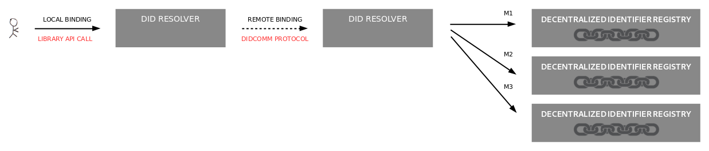

# Aries RFC 0124: DID Resolution Protocol 0.9

- Authors: [Markus Sabadello](markus@danubetech.com), 
  [Luis Gómez Alonso](luis.gomezalonso@sicpa.com)
- Status: [PROPOSED](/README.md#proposed)
- Since: 2019-07-13
- Status Note: Not implemented, but has been discussed as part of the [Aries DID Resolution](https://github.com/hyperledger/aries-rfcs/issues/101) work.
- Start Date: 2019-07-08
- Tags: [feature](/tags.md#feature), [protocol](/tags.md#protocol)

## Summary

Describes a DIDComm **request-response** protocol that can send a request to a remote DID Resolver
to resolve DIDs and dereference DID URLs.

## Motivation

DID Resolution is an important feature of Aries. It is a prerequisite for the `unpack()` function in
[DIDComm](https://github.com/hyperledger/aries-rfcs/tree/master/concepts/0005-didcomm), especially in
[Cross-Domain Messaging](../../concepts/0094-cross-domain-messaging/README.md), since cryptographic
keys must be discovered from DIDs in order to enable trusted communication between the
[agents](https://github.com/hyperledger/aries-rfcs/tree/master/concepts/0004-agents) associated with DIDs.
DID Resolution is also required for other operations, e.g. for verifying credentials or for discovering
[DIDComm service endpoints](../../features/0067-didcomm-diddoc-conventions/README.md).

Ideally, DID Resolution should be implemented as a local API (**TODO:** link to other RFC?). In some
cases however, the DID Resolution function may be provided by a remote service. This RFC describes
a DIDComm **request-response** protocol for such a remote DID Resolver.

## Tutorial

DID Resolution is a function that returns a DID Document for a DID. This function
can be accessed via "local" bindings (e.g. SDK calls, command line tools) or "remote"
bindings (e.g. HTTP(S), DIDComm).

A DID Resolver MAY invoke another DID Resolver in order to delegate (part of) the
DID Resolution and DID URL Dereferencing algorithms. For example, a DID Resolver
may be invoked via a "local" binding (such as an Aries library call), which in turn
invokes another DID Resolver via a "remote" binding (such as HTTP(S) or DIDComm).

### Name and Version

This defines the `did_resolution` protocol, version 0.1, as identified by the
following [PIURI](https://github.com/hyperledger/aries-rfcs/blob/master/concepts/0003-protocols/uris.md#piuri):

    https://didcomm.org/did_resolution/0.1

### Key Concepts

DID Resolution is the process of obtaining a DID Document for a given DID. This is one of four required operations that can be performed on any DID ("Read"; the other ones being "Create", "Update", and "Deactivate"). The details of these operations differ depending on the DID method. Building on top of *DID Resolution*, *DID URL Dereferencing* is the process of obtaining a resource for a given DID URL. Software and/or hardware that is able to execute these processes is called a DID Resolver.

- **DID Resolver**: Software and/or hardware that is capable of DID Resolution and optionally DID URL Dereferencing for at least one DID method.
- **DID Resolution**: An algorithm that takes a DID plus additional options as input and produces a DID Document or a DID Resolution Result as output. This algorithm relies on the "Read" operation of the applicable DID method.
- **DID URL Dereferencing**: An algorithm that takes a DID URL plus additional options as input and produces a DID Document, a DID Resolution Result, or various other types of resources as output. This algorithm relies on DID Resolution.
- **DID Method**: A definition of how a specific DID scheme can be implemented on a specific distributed ledger or network, including the precise method(s) by which DIDs are resolved and deactivated and DID Documents are written and updated.

### Roles

There are two *parties* and two *roles* (one for each party) in the `did_resolution` protocol: A `requester` and `resolver`.

The `requester` wishes to resolve DIDs or dereference DID URLs.

The `resolver` conforms with the [DID Resolution Specification](https://w3c-ccg.github.io/did-resolution/). It is capable of
resolving DIDs for at least one DID method.

### States

##### States for `requester` role

|                      | EVENTS:         | send `resolve`                      | receive `resolve_result` |
| -------------------- | --------------- | ------------------------------------ | -------------------------- |
| **STATES**           |                 |                                      |                            |
| preparing-request    |                 | transition to "awaiting-response"    | *different interaction*    |
| awaiting-response    |                 | *impossible*                         | transition to "done"       |
| done                 |                 |                                      |                            |

##### States for `resolver` role

|                      | EVENTS:         | receive `resolve`                   | send `resolve_result`    |
| -------------------- | --------------- | ------------------------------------ | -------------------------- |
| **STATES**           |                 |                                      |                            |
| awaiting-request     |                 | transition to "resolving"            | *impossible*               |
| resolving            |                 | *new interaction*                    | transition to "done"       |
| done                 |                 |                                      |                            |

##### States for `requester` role in a failure scenario

|                      | EVENTS:         | send `resolve`                      | receive `resolve_result` |
| -------------------- | --------------- | ------------------------------------ | -------------------------- |
| **STATES**           |                 |                                      |                            |
| preparing-request    |                 | transition to "awaiting-response"    | *different interaction*    |
| awaiting-response    |                 | *impossible*                         | error reporting       |
| problem reported                 |                 |                                      |                            |

##### States for `resolver` role in a failure scenario

|                      | EVENTS:         | receive `resolve`                   | send `resolve_result`    |
| -------------------- | --------------- | ------------------------------------ | -------------------------- |
| **STATES**           |                 |                                      |                            |
| awaiting-request     |                 | transition to "resolving"            | *impossible*               |
| resolving            |                 | *new interaction*                    | error reporting       |
| problem reported                |                 |                                      |                            |

### Messages

All messages in this protocol are part of the "did_resolution 0.1" message
family uniquely identified by this DID reference: `https://didcomm.org/did_resolution/0.1`

##### `resolve` message

The protocol begins when the `requester` sends a `resolve` message
to the `resolver`. It looks like this:

	{
		"@type": "https://didcomm.org/did_resolution/0.1/resolve",
		"@id": "xhqMoTXfqhvAgtYxUSfaxbSiqWke9t",
		"did": "did:sov:WRfXPg8dantKVubE3HX8pw",
		"input_options": {
			"result_type": "did-document",
			"no_cache": false
		}
	}

`@id` is required here, as it establishes a [message thread](../../concepts/0008-message-id-and-threading/README.md)
that makes it possible to connect a subsequent response to this request.

`did` is required.

`input_options` is optional.

For further details on the `did` and `input_options` fields, see
[Resolving a DID](https://w3c-ccg.github.io/did-resolution/#resolving) in the DID Resolution Spec.

##### `resolve_result` message

The `resolve_result` is the only allowed direct response to the `resolve` message.
It represents the result of the [DID Resolution](https://w3c-ccg.github.io/did-resolution/#resolving) function and contains a DID Document.

It looks like this:

	{
		"@type": "https://didcomm.org/did_resolution/0.1/resolve_result",
		"~thread": { "thid": "xhqMoTXfqhvAgtYxUSfaxbSiqWke9t" },
		"did_document": {
			"@context": "https://w3id.org/did/v0.11",
			"id": "did:sov:WRfXPg8dantKVubE3HX8pw",
			"service": [{
				"type": "did-communication",
				"serviceEndpoint": "https://agent.example.com/"
			}],
			"publicKey": [{
				"id": "did:sov:WRfXPg8dantKVubE3HX8pw#key-1",
				"type": "Ed25519VerificationKey2018",
				"publicKeyBase58": "~P7F3BNs5VmQ6eVpwkNKJ5D"
			}],
			"authentication": ["did:sov:WRfXPg8dantKVubE3HX8pw#key-1"]
		}
	}

If the `input_options` field of the `resolve` message contains an entry `result_type` with value `resolution-result`, then the
`resolve_result` message contains a more extensive [DID Resolution Result](https://w3c-ccg.github.io/did-resolution/#did-resolution-result),
which includes a DID Document plus additional metadata:

	{
		"@type": "https://didcomm.org/did_resolution/0.1/resolve_result",
		"~thread": { "thid": "xhqMoTXfqhvAgtYxUSfaxbSiqWke9t" },
		"did_document": {
			"@context": "https://w3id.org/did/v0.11",
			"id": "did:sov:WRfXPg8dantKVubE3HX8pw",
			"service": [{
				"type": "did-communication",
				"serviceEndpoint": "https://agent.example.com/"
			}],
			"publicKey": [{
				"id": "did:sov:WRfXPg8dantKVubE3HX8pw#key-1",
				"type": "Ed25519VerificationKey2018",
				"publicKeyBase58": "~P7F3BNs5VmQ6eVpwkNKJ5D"
			}],
			"authentication": ["did:sov:WRfXPg8dantKVubE3HX8pw#key-1"]
		},
		"resolver_metadata": {
			"driverId": "did:sov",
			"driver": "HttpDriver",
			"retrieved": "2019-07-09T19:73:24Z",
			"duration": 1015
		},
		"method_metadata": {
			"nymResponse": { ... },
			"attrResponse": { ... }
		}
	}
##### `problem-report` failure message

The `resolve_result` will also report failure messages in case of impossibility to resolve a DID.
It represents the problem report indicating that the resolver could not resolve the DID, and the reason of the failure.
It looks like this:

	{
		"@type": "https://didcomm.org/did_resolution/0.1/resolve_result",
		"~thread": { "thid": "xhqMoTXfqhvAgtYxUSfaxbSiqWke9t" },
		"explain_ltxt": "Could not resolve DID did:sov:WRfXPg8dantKVubE3HX8pw not found by resolver xxx",
            ...
	}

## Reference

- [Aries DID Resolution](https://github.com/hyperledger/aries-rfcs/issues/101)
- [DID Spec](https://w3c-ccg.github.io/did-spec/)
- [DID Resolution Spec](https://w3c-ccg.github.io/did-resolution/)
- [Peer DID Method](https://openssi.github.io/peer-did-method-spec/)
- [Universal Resolver](https://uniresolver.io/)

### Messages

In the future, additional messages `dereference` and `dereference_result` may be defined in addition
to `resolve` and `resolve_result` (see [Unresolved questions](#unresolved-questions)).

### Message Catalog

Status and error codes will be inherited from the [DID Resolution Spec](https://w3c-ccg.github.io/did-resolution/).

## Drawbacks

Using a remote DID Resolver should only be considered a fallback when a local DID Resolver
cannot be used. Relying on a remote DID Resolver raises the question of who operates it, can you trust
its responses, and can MITM and other attacks occur? There is essentially a chicken-and-egg problem
insofar as the purpose of DID Resolution is to discover metadata needed for trustable interaction with
an entity, but the precondition is that interation with a DID Resolver must itself be trustable.

Furthermore, the use of remote DID Resolvers may introduce central bottlenecks and undermine important
design principles such as decentralization.

See [Binding Architectures](https://w3c-ccg.github.io/did-resolution/#binding-architectures)
and [w3c-ccg/did-resolution#28](https://github.com/w3c-ccg/did-resolution/issues/28) for additional
thoughts.

The security and trust issues may outweigh the benefits.
Defining and implementing this RFC may lead developers to underestimate or ignore these issues associated with remote DID Resolvers.

## Rationale and alternatives

Despite the drawbacks of remote DID Resolvers, in some situations they can be useful, for example
to support DID methods that are hard to implement in local agents with limited hard- and software
capabilities.

A special case of remote DID Resolvers occurs in the case of the [Peer DID Method](https://openssi.github.io/peer-did-method-spec/), where each
party of a relationship essentially acts as a remote DID Resolver for other parties, i.e. each
party fulfills both the `requester` and `resolver` roles defined in this RFC.

An alternative to the DIDComm binding defined by this RFC is an HTTP(S) binding, which is defined
by the [DID Resolution Spec](https://w3c-ccg.github.io/did-resolution/#bindings-https).

## Prior art

Resolution and dereferencing of identifiers have always played a key role in digital identity infrastructure.

 * [Yadis](https://en.wikipedia.org/wiki/Yadis) was an early discovery protocol.
 * [XRI Resolution](http://docs.oasis-open.org/xri/2.0/specs/xri-resolution-V2.0.html) defined the XRDS format and
 a protocol for discovering them from HTTP(S) URIs and XRIs. The XRDS format later evolved into XRD and JRD.
 * [WebFinger](https://tools.ietf.org/html/rfc7033) is an HTTP-based protocol for discovering JRD documents about identifiers.

## Unresolved questions

This RFC inherits a long list of unresolved questions and issues that currently exist in the
[DID Resolution Spec](https://w3c-ccg.github.io/did-resolution/).

We need to decide whether the DID Resolution and DID URL Dereferencing functions (`resolve()` and `dereference()`)
should be exposed as the same message type, or as two different message types (including two different responses).

## Implementations

The following lists the implementations (if any) of this RFC. Please do a pull request to add your implementation. If the implementation is open source, include a link to the repo or to the implementation within the repo. Please be consistent in the "Name" field so that a mechanical processing of the RFCs can generate a list of all RFCs supported by an Aries implementation.

Name / Link | Implementation Notes
--- | ---
 |  |
