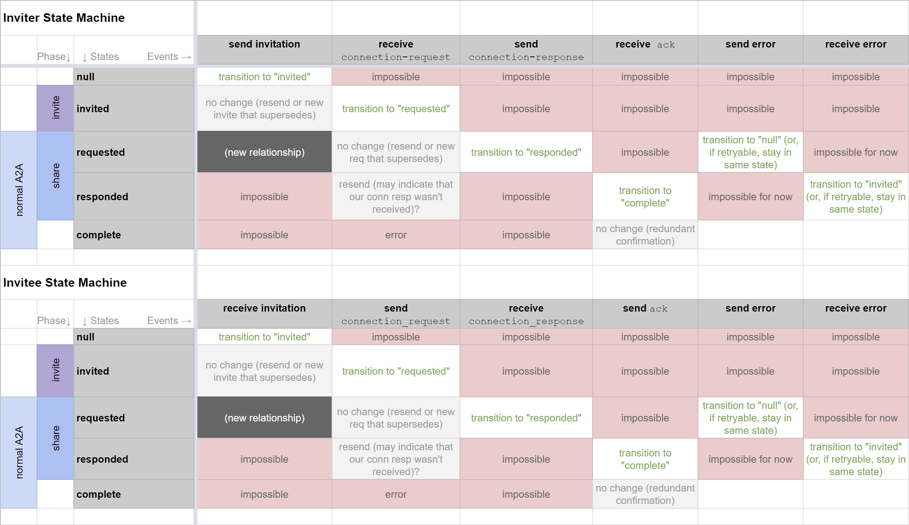

# 0160: Connection Protocol
- Authors: [Ryan West](ryan.west@sovrin.org), [Daniel Bluhm](daniel.bluhm@sovrin.org), Matthew Hailstone, Stephen Curran, [Sam Curren](sam@sovrin.org)
- Status: [ACCEPTED](/README.md#accepted)
- Since: 2019-08-06
- Status Note: This is the protocol with existing uses. It is expected that [RFC 0023 DID Exchange](../../features/0023-did-exchange/README.md) will replace this protocol.
- Supersedes: [HIPE 0031 - Connection Protocol](https://github.com/hyperledger/indy-hipe/tree/master/text/0031-connection-protocol)
- Start Date: 2018-06-29
- Tags: feature, protocol

## Summary

This RFC describes the protocol to establish connections between agents. 

## Motivation

Indy agent developers want to create agents that are able to establish connections with each other and exchange secure information over those connections. For this to happen there must be a clear connection protocol.

## Tutorial

We will explain how a connection is established, with the roles, states, and messages required.

### Roles

Connection uses two roles: __inviter__ and __invitee__.

The _inviter_ is the party that initiates the protocol with an `invitation` message. This party
must already have an agent and be capable of creating DIDs and endpoints
at which they are prepared to interact. It is desirable but not strictly required that inviters
have the ability to help the invitee with the process and/or costs associated with acquiring
an agent capable of participating in the ecosystem. For example, inviters may often be sponsoring institutions. The inviter sends a `connection-response` message at the end of the _share_ phase.

The _invitee_ has less preconditions; the only requirement is that this party be capable of
receiving invitations over traditional communication channels of some type, and acting on
it in a way that leads to successful interaction. The invitee sends a `connection-request` message at the beginning of the _share_ phase.

In cases where both parties already possess SSI capabilities, deciding who plays the role of inviter and invitee might be a casual matter of whose phone is handier.

### States

#### null

No connection exists or is in progress

#### invited

The invitation has been shared with the intended _invitee_(s), and they have not yet sent a _connection_request_.

#### requested

A _connection_request_ has been sent by the _invitee_ to the _inviter_ based on the information in the _invitation_. 

#### responded

A _connection_response_ has been sent by the _inviter_ to the _invitee_ based on the information in the _connection_request_.

#### complete

The connection is valid and ready for use.



### Errors

[errors]: #errors

There are no errors in this protocol during the invitation phase. For the request and response, there are two error messages possible for each phase: one for an active rejection and one for an unknown error. These errors are sent using a **problem_report** message type specific to the connection message family. The following list details `problem-code`s that may be sent:

**request_not_accepted** - The error indicates that the request has been rejected for a reason listed in the error_report. Typical reasons include not accepting the method of the provided DID, unknown endpoint protocols, etc. The request can be resent _after_ the appropriate corrections have been made.

**request_processing_error** - This error is sent when the inviter was processing the request with the intent to accept the request, but some processing error occurred. This error indicates that the request should be resent as-is.

**response_not_accepted** - The error indicates that the response has been rejected for a reason listed in the error_report. Typical reasons include not accepting the method of the provided DID, unknown endpoint protocols, invalid signature, etc. The response can be resent _after_ the appropriate corrections have been made.

**response_processing_error** - This error is sent when the invitee was processing the response with the intent to accept the response, but some processing error occurred. This error indicates that the response should be resent as-is.

No errors are sent in timeout situations. If the inviter or invitee wishes to retract the messages they sent, they record so locally and return a `request_not_accepted` or `response_not_accepted` error when the other party sends a request or response .

#### Error Message Example

```
{
  "@type": "did:sov:BzCbsNYhMrjHiqZDTUASHg;spec/connections/1.0/problem_report",
  "@id": "5678876542345",
  "~thread": { "thid": "<@id of message related to problem>" },
  "~i10n": { "locale": "en"},
  "problem-code": "request_not_accepted", // matches codes listed above
  "explain": "Unsupported DID method for provided DID."
}
```

#### Error Message Attributes

- The `@type` attribute is a required string value that denotes that the received message is a problem_report within the connections family.
- The `~thread` attribute provides a context for the problem, referring to the message which contains the problem.
- Use of `~i10n` is encouraged, with at least locale defined for the message.
- The `problem-code` attribute contains one of a fixed set of codes defined in the list above.
- The `explain` attribute contains a human readable message which indicates the problem.

### Flow Overview

The _inviter_ gives provisional connection information to the _invitee_. 
The _invitee_ uses provisional information to send a DID and DID Doc to the _inviter_.
The _inviter_ uses sent DID Doc information to send a DID and DID Doc to the _invitee_.
The *invitee* sends the *inviter* an ack or any other message that confirms the response was received.

## 0. Invitation to Connect

[0-invitation]: #0-invitation

An invitation to connect may be transferred using any method that can reliably transmit text. The result  must be the essential data necessary to initiate a [Connection Request](#1-connection-request) message. A connection invitation is an agent message with agent plaintext format, but is an **out-of-band communication** and therefore not communicated using wire level encoding or encryption. The necessary data that an invitation to connect must result in is:

- suggested label

- publicly resolvable did

  OR

- suggested label

- recipientKeys

- serviceEndpoint

- routingKeys (optional)

  This information is used to create a provisional connection to the _inviter_. That connection will be made complete in the `connection_response` message.

These attributes were chosen to parallel the attributes of a DID Document for increased meaning. It is worth noting that `recipientKeys` and `routingKeys` must be inline keys, not DID key references when contained in an invitation. As in the DID Document with `Ed25519VerificationKey2018` key types, the key must be base58 encoded.

When considering routing and options for invitations, keep in mind that the more detail is in the connection invitation, the longer the URL will be and (if used) the more dense the QR code will be. Dense QR codes can be harder to scan.

The _inviter_ will either use an existing invitation DID, or provision a new one according to the did method spec. They will then create the invitation message in one of the following forms.

Invitation Message with Public Invitation DID:

```json
{
    "@type": "did:sov:BzCbsNYhMrjHiqZDTUASHg;spec/connections/1.0/invitation",
    "@id": "12345678900987654321",
    "label": "Alice",
    "did": "did:sov:QmWbsNYhMrjHiqZDTUTEJs"
}
```

Invitation Message with Keys and URL endpoint:

```json
{
    "@type": "did:sov:BzCbsNYhMrjHiqZDTUASHg;spec/connections/1.0/invitation",
    "@id": "12345678900987654321",
    "label": "Alice",
    "recipientKeys": ["8HH5gYEeNc3z7PYXmd54d4x6qAfCNrqQqEB3nS7Zfu7K"],
    "serviceEndpoint": "https://example.com/endpoint",
    "routingKeys": ["8HH5gYEeNc3z7PYXmd54d4x6qAfCNrqQqEB3nS7Zfu7K"]
}
```

Invitation Message with Keys and DID Service Endpoint Reference:

```json
{
    "@type": "did:sov:BzCbsNYhMrjHiqZDTUASHg;spec/connections/1.0/invitation",
    "label": "Alice",
    "recipientKeys": ["8HH5gYEeNc3z7PYXmd54d4x6qAfCNrqQqEB3nS7Zfu7K"],
    "serviceEndpoint": "did:sov:A2wBhNYhMrjHiqZDTUYH7u;routeid",
    "routingKeys": ["8HH5gYEeNc3z7PYXmd54d4x6qAfCNrqQqEB3nS7Zfu7K"]
}
```

##### Implicit Invitation

Any Public DID serves as an implicit invitation. If an _invitee_ wishes to connect to any Public DID, They designate their own label and skip to the end of the Invitation Processing step. There is no need to encode the invitation or transmit the invitation. 

##### Routing Keys

If `routingKeys` is present and non-empty, additional forwarding wrapping will be necessary for the request message. See the explanation in the Request section.

##### Agency Endpoint

The endpoint for the connection is either present in the invitation or available in the DID Document of a presented DID. If the endpoint is not a URI but a DID itself, that DID refers to an Agency.

In that case, the `serviceEndpoint` of the DID must be a URI, and the `recipientKeys` must contain a single key. That key is appended to the end of the list of `routingKeys` for processing. For more information about message forwarding and routing, see [RFC 0094](../../concepts/0094-cross-domain-messaging/README.md).

#### Standard Invitation Encoding

Using a standard invitation encoding allows for easier interoperability between multiple projects and software platforms. Using a URL for that standard encoding provides a built in fallback flow for users who are unable to automatically process the invitation. Those new users will load the URL in a browser as a default behavior, and will be presented with instructions on how to install software capable of processing the invitation. Already onboarded users will be able to process the invitation without loading in a browser via mobile app URL capture, or via capability detection after being loaded in a browser.

The standard invitation format is a URL with a Base64URLEncoded json object as a query parameter. 

The Invitation URL format is as follows, with some elements described below:

```text
https://<domain>/<path>?c_i=<invitationstring>
```

`<domain>` and `<path>` should be kept as short as possible, and the full URL should return human readable instructions when loaded in a browser. This is intended to aid new users. The `c_i` query parameter is required and is reserved to contain the invitation string. Additional path elements or query parameters are allowed, and can be leveraged to provide coupons or other promise of payment for new users. 

The `<invitationstring>` is an agent plaintext message (not a wire level message) that has been base64 url encoded. For brevity, the json encoding should minimize unnecessary white space.

```javascript
invitation_string = b64urlencode(<invitation_message>)
```

During encoding, whitespace from the json string should be eliminated to keep the resulting invitation string as short as possible.

##### Example Invitation Encoding

Invitation:

```json
{
    "@type": "did:sov:BzCbsNYhMrjHiqZDTUASHg;spec/connections/1.0/invitation",
    "@id": "12345678900987654321",
    "label": "Alice",
    "recipientKeys": ["8HH5gYEeNc3z7PYXmd54d4x6qAfCNrqQqEB3nS7Zfu7K"],
    "serviceEndpoint": "https://example.com/endpoint",
    "routingKeys": ["8HH5gYEeNc3z7PYXmd54d4x6qAfCNrqQqEB3nS7Zfu7K"]
}
```

Base 64 URL Encoded, with whitespace removed:

```text
eyJAdHlwZSI6ImRpZDpzb3Y6QnpDYnNOWWhNcmpIaXFaRFRVQVNIZztzcGVjL2Nvbm5lY3Rpb25zLzEuMC9pbnZpdGF0aW9uIiwiQGlkIjoiMTIzNDU2Nzg5MDA5ODc2NTQzMjEiLCJsYWJlbCI6IkFsaWNlIiwicmVjaXBpZW50S2V5cyI6WyI4SEg1Z1lFZU5jM3o3UFlYbWQ1NGQ0eDZxQWZDTnJxUXFFQjNuUzdaZnU3SyJdLCJzZXJ2aWNlRW5kcG9pbnQiOiJodHRwczovL2V4YW1wbGUuY29tL2VuZHBvaW50Iiwicm91dGluZ0tleXMiOlsiOEhINWdZRWVOYzN6N1BZWG1kNTRkNHg2cUFmQ05ycVFxRUIzblM3WmZ1N0siXX0=
```

Example URL:

```text
http://example.com/ssi?c_i=eyJAdHlwZSI6ImRpZDpzb3Y6QnpDYnNOWWhNcmpIaXFaRFRVQVNIZztzcGVjL2Nvbm5lY3Rpb25zLzEuMC9pbnZpdGF0aW9uIiwiQGlkIjoiMTIzNDU2Nzg5MDA5ODc2NTQzMjEiLCJsYWJlbCI6IkFsaWNlIiwicmVjaXBpZW50S2V5cyI6WyI4SEg1Z1lFZU5jM3o3UFlYbWQ1NGQ0eDZxQWZDTnJxUXFFQjNuUzdaZnU3SyJdLCJzZXJ2aWNlRW5kcG9pbnQiOiJodHRwczovL2V4YW1wbGUuY29tL2VuZHBvaW50Iiwicm91dGluZ0tleXMiOlsiOEhINWdZRWVOYzN6N1BZWG1kNTRkNHg2cUFmQ05ycVFxRUIzblM3WmZ1N0siXX0=
```

Invitation URLs can be transferred via any method that can send text, including an email, SMS, posting on a website, or via a QR Code. 

Example URL encoded as a QR Code:


#### Invitation Publishing

The _inviter_ will then publish or transmit the invitation URL in a manner available to the intended _invitee_. After publishing, we have entered the _invited_ state.

#### Invitation Processing

When they _invitee_ receives the invitation URL, there are two possible user flows that depend on the SSI preparedness of the individual. If the individual is new to the SSI universe, they will likely load the URL in a browser. The resulting page will contain instructions on how to get started by installing software or a mobile app. That install flow will transfer the invitation message to the newly installed software.
A user that already has those steps accomplished will have the URL received by software directly. That sofware can read the invitation message directly out of the `c_i` query parameter, without loading the URL.

If they _invitee_ wants to accept the connection invitation, they will use the information present in the invitation message to prepare the request

## 1. Connection Request

[1-connection-request]: #1-connection-request

The connection request message is used to communicate the DID document of the _invitee_ to the _inviter_ using the provisional connection information present in the _connection_invitation_ message.

The _invitee_ will provision a new DID according to the DID method spec. For a Peer DID, this involves creating a matching peer DID and key. The newly provisioned DID and DID Doc is presented in the connection_request message as follows:

#### Example

```json
{
  "@id": "5678876542345",
  "@type": "did:sov:BzCbsNYhMrjHiqZDTUASHg;spec/connections/1.0/request",
  "label": "Bob",
  "connection": {
    "did": "B.did@B:A",
  	"did_doc": {
        "@context": "https://w3id.org/did/v1"
      	// DID Doc contents here.
    }
  }
}
```

#### Attributes

- The `@type` attribute is a required string value that denotes that the received message is a connection request.
- The `label` attribute provides a suggested label for the connection. This allows the user to tell multiple connection offers apart. This is not a trusted attribute.
- The `connection` attribute contains the `did` and `did_doc` attributes. This format maintains consistency with the Response message where this attribute is signed.
- The `did` indicates the DID of the user requesting the connection.
- The `did_doc` contains the DID doc for the requesting user. If the DID method for the presented DID is not a peer method and the DID Doc is resolvable on a ledger, the `did_doc` attribute is optional.

#### Request Transmission

The Request message is encoded according to the standards of the Agent Wire Level Protocol, using the `recipientKeys` present in the invitation. 

If the `routingKeys` attribute was present and non-empty in the invitation, each key must be used to wrap the message in a forward request, then encoded according to the Agent Wire Level Protocol. This processing is in order of the keys in the list, with the last key in the list being the one for which the `serviceEndpoint` possesses the private key.

The message is then transmitted to the `serviceEndpoint`.

We are now in the `requested` state.

#### Request processing

After receiving the connection request, the _inviter_ evaluates the provided DID and DID Doc according to the DID Method Spec.

The _inviter_ should check the information presented with the keys used in the wire-level message transmission to ensure they match.

If the _inviter_ wishes to accept the connection, they will persist the received information in their wallet. They will then either update the provisional connection information to rotate the key, or provision a new DID entirely. The choice here will depend on the nature of the DID used in the invitation.

The _inviter_ will then craft a connection response using the newly updated or provisioned information.

#### Request Errors

See [Error Section](#errors) above for message format details.

**request_rejected**

Possible reasons:

- unsupported DID method for provided DID
- Expired Invitation
- DID Doc Invalid
- Unsupported key type
- Unsupported endpoint protocol

**request_processing_error**

- unknown processing error

## 2. Connection Response

[2-connection-response]: #3-connection-response

The connection response message is used to complete the connection. This message is required in the flow, as it updates the provisional information presented in the invitation.

#### Example

```json
{
  "@type": "did:sov:BzCbsNYhMrjHiqZDTUASHg;spec/connections/1.0/response",
  "@id": "12345678900987654321",
  "~thread": {
    "thid": "<@id of request message>"
  },
  "connection": {
    "did": "A.did@B:A",
  	"did_doc": {
      "@context": "https://w3id.org/did/v1"
      // DID Doc contents here.
    }
  }
}
```

The above message is required to be signed as described in HIPE ???. The `connection` attribute above will be base64URL encoded and included as part of the `sig_data` attribute of the signed field. The result looks like this:

```json
{
  "@type": "did:sov:BzCbsNYhMrjHiqZDTUASHg;spec/connections/1.0/response",
  "@id": "12345678900987654321",
  "~thread": {
    "thid": "<@id of request message>"
  },
  "connection~sig": {
    "@type":"did:sov:BzCbsNYhMrjHiqZDTUASHg;spec/signature/1.0/ed25519Sha512_single",
    "signature": "<digital signature function output>",
    "sig_data": "<base64URL(64bit_integer_from_unix_epoch||connection_attribute)>",
    "signers": "<signing_verkey>"
  }
}
```

The `connection` attribute has been removed and it's contents combined with the timestamp  and encoded into the `sig_data` field of the new `connection~sig` attribute.

Upon receipt, the signed attribute will be automatically unpacked and the signature verified. Signature information will be stored as message context, and the `connection` attribute will be replaced in it's original format before processing continues.

The signature data must be used to verify against the invitation's `recipientKeys` for continuity. 

#### Attributes

- The `@type` attribute is a required string value that denotes that the received message is a connection request.
- The `~thread` block contains a `thid` reference to the `@id` of the request message. 
- The `connection` attribute contains the `did` and `did_doc` attributes to enable simpler signing.
- The `did` attribute is a required string value and denotes DID in use by the _inviter_. Note that this may not be the same DID used in the invitation.
- The `did_doc` attribute contains the associated DID Doc. If the DID method for the presented DID is not a peer method and the DID Doc is resolvable on a ledger, the `did_doc` attribute is optional.

In addition to a new DID, the associated DID Doc might contain a new endpoint. This new DID and endpoint are to be used going forward in the connection.

#### Response Transmission

The message should be packaged in the wire level format, using the keys from the request, and the new keys presented in the internal did doc. 

When the message is transmitted, we are now in the `responded` state.

#### Response Processing

When the _invitee_ receives the `response` message, they will verify the `change_sig` provided. After validation, they will update their wallet with the new connection information. If the endpoint was changed, they may wish to execute a Trust Ping to verify that new endpoint.

#### Response Errors

See [Error Section](#errors) above for message format details.

**response_rejected**

Possible reasons:

- unsupported DID method for provided DID
- Expired Request
- DID Doc Invalid
- Unsupported key type
- Unsupported endpoint protocol
- Invalid Signature

**response_processing_error**

- unknown processing error

## 3. Connection Acknowledgement

[3-connection-ack]: #3-connection-ack

After the Response is received, the connection is technically complete. This remains unconfirmed to the *inviter* however. The *invitee* SHOULD send a message to the *inviter*. As any message will confirm the connection, any message will do. 

Frequently, the parties of the connection will want to trade credentials to establish trust. In such a flow, those message will serve the function of acknowledging the connection without an extra confirmation message.

If no message is needed immediately, a trust ping can be used to allow both parties confirm the connection.

After a message is sent, the *invitee* in the `complete` state. Receipt of a message puts the *inviter* into the `complete` state.

#### Next Steps

The connection between the _inviter_ and the _invitee_ is now established. This connection has no trust associated with it. The next step should be the exchange of proofs to build trust sufficient for the purpose of the relationship.

#### Connection Maintenance

Upon establishing a connection, it is likely that both Alice and Bob will want to perform some relationship maintenance such as key rotations. Future RFC updates will add these maintenance features.

## Reference

- https://docs.google.com/document/d/1mRLPOK4VmU9YYdxHJSxgqBp19gNh3fT7Qk4Q069VPY8/edit#heading=h.7sxkr7hbou5i
- [Agent to Agent Communication Video](https://drive.google.com/file/d/1PHAy8dMefZG9JNg87Zi33SfKkZvUvXvx/view)
- [Agent to Agent Communication Presentation](https://docs.google.com/presentation/d/1H7KKccqYB-2l8iknnSlGt7T_sBPLb9rfTkL-waSCux0/edit#slide=id.p)
- Problem_report message adopted into message family, following form defined by the [Report Problem RFC](../../features/0035-report-problem/README.md)
- Useful QR Code Generator: https://zxing.appspot.com/generator/

## Drawbacks

- Public invitations (say, a slide at the end of a presentation) all use the same DID. This is not a problem for public institutions, and only provides a minor increase in correlation over sharing an endpoint, key, and routing information in a way that is observable by multiple parties.


## Prior art

- This process is similar to other key exchange protocols.


## Unresolved questions

- Should we eliminate the public DID option, and they just present an invitation with the connection key from their public DID Doc?
- Should invitations have `@id`s?
## Implementations

The following lists the implementations (if any) of this RFC. Please do a pull request to add your implementation. If the implementation is open source, include a link to the repo or to the implementation within the repo. Please be consistent in the "Name" field so that a mechanical processing of the RFCs can generate a list of all RFCs supported by an Aries implementation.

Name / Link | Implementation Notes
--- | ---
[Aries Framework - .NET](https://github.com/hyperledger/aries-framework-dotnet) | passed agent connectathon tests, Feb 2019
[Streetcred.id](https://streetcred.id/) | passed agent connectathon tests, Feb 2019
[Aries Cloud Agent - Python](https://github.com/hyperledger/aries-cloudagent-python) | ported from VON codebase that passed agent connectathon tests, Feb 2019
[Aries Static Agent - Python](https://github.com/hyperledger/aries-staticagent-python) | implemented July 2019
[Aries Protocol Test Suite](https://github.com/hyperledger/aries-protocol-test-suite) | ported from Indy Agent codebase that provided agent connectathon tests, Feb 2019
[Indy Cloud Agent - Python](https://github.com/hyperledger/indy-agent/python) | passed agent connectathon tests, Feb 2019 