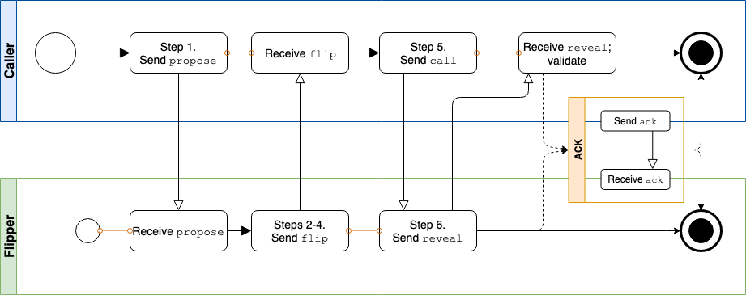

# Aries RFC 0193: Coin Flip Protocol 1.0 

- Authors: [Daniel Hardman](daniel.hardman@gmail.com), [Patrick Stürmlinger](patrick@mindf.org)
- Status: [PROPOSED](/README.md#proposed)
- Since: 2019-08-19
- Status Note: minor update in late 2020 
- Start Date: 2019-08-19
- Tags: [feature](/tags.md#feature), [protocol](/tags.md#protocol)

## Summary

Specifies a safe way for two parties who are remote from one another and who do not trust one another to pick a random, binary outcome that neither can manipulate.

## Motivation

To guarantee fairness, it is often important to pick one party in a protocol to make a choice about what to do next. We need a way to do this that it more or less mirrors the randomness of flipping a coin.

## Tutorial

### Name and Version

This defines the `coinflip` protocol, version 1.x, as identified by the
following [PIURI](https://github.com/hyperledger/aries-rfcs/blob/master/concepts/0003-protocols/uris.md#piuri):

    https://github.com/hyperledger/aries-rfcs/features/0193-coin-flip/1.0
    
### Roles

There are 2 roles in the protocol: __Recorder__ and __Caller__. These role names parallel the roles in a physical coin flip: the _Recorder_ performs a process that freezes/records the state of a flipped coin, and the _Caller_ announces the state that they predict, before the state is known. If the caller predicts the state correctly, then the caller chooses what happens next; otherwise, the recorder chooses.

### Algorithm

Before describing the messages, let's review the algorithm that will be used. This algorithm is not new; it is a simple commitment scheme [described on wikipedia](https://en.wikipedia.org/wiki/Commitment_scheme) and implemented in various places. The RFC merely formalizes a simple commitment scheme for DIDComm in a way that the Caller chooses a side without knowing whether it's `win` or `lose`.

1. Recorder chooses a random [UUID](https://tools.ietf.org/html/rfc4122). A [version 4 UUID](https://tools.ietf.org/html/rfc4122#section-4.4) is recommended, though any UUID version should be accepted. Note that the UUID is represented in lower case, with hyphens, and without enclosing curly braces. Suppose this value is `01bf7abd-aa80-4389-bf8c-dba0f250bb1b`. This UUID is called __salt__.

2. Recorder builds two __side strings__ by salting `win` and `lose` with the _salt_ -- i.e., `win01bf7abd-aa80-4389-bf8c-dba0f250bb1b` and `lose01bf7abd-aa80-4389-bf8c-dba0f250bb1b`. Recorder then computes a SHA256 hash of each side string, which are `0C192E004440D8D6D6AF06A7A03A2B182903E9F048D4E7320DF6301DF0C135A5` and `C587E50CB48B1B0A3B5136BA9D238B739A6CD599EE2D16994537B75CA595C091` for our example, and randomly selects one _side string_ as side1 and the other one as side2. Recorder sends them to Caller using the [`propose` message described below](#propose). Those hashes do commit Recorder to all inputs, without revealing which one is `win` or `lose`, and it's the Recorder's way of posing the Caller the question, "underside or topside"?

3. Caller announces their committed choice -- for instance, `side2`, using the ['call' message described below](#call). This commits Caller to a particular side of the virtual coin.

4. Recorder uses a ['reveal' message](#reveal) to reveal the _salt_. Caller is now able to rebuild both _side strings_ and both parties discover whether Caller guessed the `win` side or not. If Caller guessed the `win` side, Caller won. Otherwise Recorder won. Neither party is able to manipulate the outcome. This is guaranteed by Caller being able to verify that Recorder proposed two valid options, i.e. one side winning and one side losing, and Recorder knowing not to reveal any disclosed information before Caller made their choice.

### States

The algorithm and the corresponding states are pictured in the following diagram:



<blockquote>
Note: This diagram was made in draw.io. To make changes:

- upload the drawing HTML from this folder to the [draw.io](https://draw.io) site (Import From... Device), 
- make changes,
- export the picture as PNG and HTML to your local copy of this repo, and
- submit a pull request.
</blockquote>

This diagram only depicts the so-called "happy path". It is possible to experience problems for various reasons. If either party detects such an event, they should abandon the protocol and emit a [`problem-report` message](../0035-report-problem/README.md) to the other party. The `problem-report` message is [adopted into this protocol](../../0000-template-protocol.md#adopted-messages) for that purpose. Some values of `code` that may be used in such messages include:

* `bad-message-sequence`: The message was sent out of order.
* `bad-field-value`: The message contained a field with an invalid value. The offending fields are named in the `problem_items` array. 

## Reference

### Messages

#### `propose`

The protocol begins when Caller sends to Recorder a `propose` message that embodies Step 1 in the [algorithm above](#algorithm). It looks like this:

```jsonc
{
  "@type": "https://github.com/hyperledger/aries-rfcs/features/0193-coin-flip/1.0/propose",
  "@id": "518be002-de8e-456e-b3d5-8fe472477a86",
  "side1": "C587E50CB48B1B0A3B5136BA9D238B739A6CD599EE2D16994537B75CA595C091",
  "side2": "0C192E004440D8D6D6AF06A7A03A2B182903E9F048D4E7320DF6301DF0C135A5",
  "comment": "Make your choice and let's who goes first.",
  "choice-id": "did:sov:SLfEi9esrjzybysFxQZbfq;spec/tictactoe/1.0/who-goes-first",
  "caller-wins": "did:example:abc123",  // Meaning of value defined in superprotocol
  "recorder-wins": "did:example:xyz456", // Meaning of value defined in superprotocol
  // Optional; connects to superprotocol
  "~thread": { 
    "pthid": "a2be4118-4f60-bacd-c9a0-dfb581d6fd96" 
  }
}
```

The `@type` and `@id` fields are standard for DIDComm. The `side1` and `side2` fields convey the data required by Step 2 of the algorithm. The optional `comment` field follows [localization conventions](../0043-l10n/README.md) and is irrelevant unless the coin flip intends to invite human participation. The `~thread.pthid` [decorator](../../concepts/0011-decorators/README.md) is optional but should be common; it [identifies the thread of the parent interaction](../../concepts/0008-message-id-and-threading/README.md#threaded-messages) (the [superprotocol](../../concepts/0003-protocols/README.md#composable)).

The `choice-id` field formally names a choice that a superprotocol has defined, and tells how the string values of the `caller-wins` and `recorder-wins` fields will be interpreted. In the example above, the choice is defined in the [Tic-Tac-Toe Protocol](../../concepts/0003-protocols/tictactoe/README.md#key-concepts), which also specifies that `caller-wins` and `recorder-wins` will contain DIDs of the parties playing the game. Some other combinations that might make sense include:

* In an auction protocol that uses a coin flip to break a tie between two bids of equal value, `choice-id` might be a string like `prefix/myauctionproto/1.0/bid-tie-break`, and the values of the `*-wins` fields might be the `id` properties of specific bid messages.

* In a protocol that models an American football game, the `choice-id` might be a string like `prefix/amfootball/1.0/who-kicks-off`, and the values of the `*-wins` fields might be the strings "home" and "visitor".

* In a protocol that models radioactive halflife, the decay of a particular neutron might use `choice-id` of `prefix/halflife/1.0/should-decay`, and the `*-wins` fields might be the strings "yes" and "no".

The [`~timing.expires_time` decorator](../0032-message-timing/README.md#tutorial) may be used to impose a time limit on the processing of this message. If used, the protocol must restart if the subsequent `call` message is not received by this time limit.

#### `call`

This message is sent from Caller to Recorder, and embodies Step 3 of [the algorithm](#algorithm). It looks like this:

```jsonc
{
  "@type": "https://github.com/hyperledger/aries-rfcs/features/0193-coin-flip/1.0/call",
  "@id": "1173fe5f-86c9-47d7-911b-b8eac7d5f2ad",
  "choice": "side2",
  "comment": "I pick side 2.",
  "~thread": { 
    "thid": "518be002-de8e-456e-b3d5-8fe472477a86",
    "sender_order": 1 
  }
}
```

Note the use of `~thread.thid` and `sender_order: 1` to connect this `call` to the preceding `propose`.

The [`~timing.expires_time` decorator](../0032-message-timing/README.md#tutorial) may be used to impose a time limit on the processing of this message. If used, the protocol must restart if the subsequent `reveal` message is not received by this time limit.

#### `reveal`

This message is sent from Recorder to Caller, and embodies Step 4 of [the algorithm](#algorithm). It looks like this:

```jsonc
{
  "@type": "https://github.com/hyperledger/aries-rfcs/features/0193-coin-flip/1.0/reveal",
  "@id": "e2a9454d-783d-4663-874e-29ad10776115",
  "salt": "01bf7abd-aa80-4389-bf8c-dba0f250bb1b",
  "winner": "caller",
  "comment": "You win.",
  "~please_ack": {},
  "~thread": { 
    "thid": "518be002-de8e-456e-b3d5-8fe472477a86",
    "sender_order": 1 
  }
}
```

Note the use of `~thread.thid` and `sender_order: 1` to connect this `reveal` to the preceding `call`.

The Caller should validate this message as follows:

* Confirm that SHA256 hashes of `win` and `lose` salted with _salt_ results in the two _side strings_ from the `propose` message. This check is important because it eliminates the possibility that the Recorder could introduce variation to the commitment.

Having validated the message thus far, Caller determines the winner by checking if the self computed hash of `win<salt>` equals the given hash at the `propose` message at the position chosen with the `call` message or not. If yes, then the value of the `winner` field must be `caller`; if not, then it must be `recorder`. The `winner` field must be present in the message, and its value must be correct, for the `reveal` message to be deemed fully valid. This confirms that both parties understand the outcome, and it prevents a Recorder from asserting a false outcome that is accepted by careless validation logic on the Caller side.

The [`~please_ack` decorator](../0317-please-ack/README.md) is optional. If a superprotocol specifies the next step after a Coin Flip with sufficient precision, it may be unnecessary. However, it should be supported by implementations. The resulting `ack` message, if sent, is hereby [adopted into the Coin Flip protocol](../0015-acks/README.md#adopting-acks).

The [`~timing.expires_time` decorator](../0032-message-timing/README.md#tutorial) may be used to impose a time limit on the processing of this message. If used, the protocol must restart if the subsequent `ack` or the next message in the superprotocol is not received before the time limit.

## Drawbacks

The protocol is a bit chatty.

## Rationale and alternatives

It may be desirable to pick among more than 2 alternatives. This RFC could be extended easily to provide more options than win and lose. The algorithm itself would not change.

## Prior art

As mentioned in the introduction, the algorithm used in this protocol is a simple and well known form of cryptographic commitment, and is documented on Wikipedia. It is not new to this RFC.

## Unresolved questions

- Do we need to use hashlink so we can move to a new hash algorithm if SHA256 is ever broken?
   
## Implementations

The following lists the implementations (if any) of this RFC. Please do a pull request to add your implementation. If the implementation is open source, include a link to the repo or to the implementation within the repo. Please be consistent in the "Name" field so that a mechanical processing of the RFCs can generate a list of all RFCs supported by an Aries implementation.

| Name / Link | Implementation Notes |
| ----------- | -------------------- |
|             |

