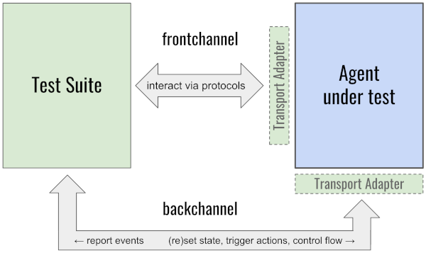

# 0270: Protocol Test Suite
- Authors: [Daniel Hardman](daniel.hardman@gmail.com)
- Status: [PROPOSED](/README.md#proposed)
- Since: 2019-10-25
- Status Note: Codifies some thinking about scope and mental model that are already baked into the `aries-protocol-test-suite` repo. Provides some new thinking as well.
- Supersedes: Partially, and in some ways, [Indy HIPE 0015](https://github.com/hyperledger/indy-hipe/blob/master/text/0015-agent-test-suite-interface/README.md) and [Indy HIPE 0016](https://github.com/hyperledger/indy-hipe/blob/master/text/0016-agent-test-suite-v1/README.md). Also, represents answers to questions that the community first posed in [this HackMD doc](https://hackmd.io/JW5b9xYCRGKqyqhVevTZ_g) and first attempted to answer in the [indy-agent repo](https://github.com/hyperledger/indy-agent).
- Start Date: 2018-10-25
- Tags: feature

## Summary

Describes the goals, scope, and interoperability contract of the Aries Protocol Test Suite. Does NOT serve as a design doc or a developer guide; see the [aries-protocol-test-suite repo](https://github.com/hyperledger/aries-protocol-test-suite) for that.

## Motivation

The Aries Protocol Test Suite makes SSI interoperability publicly and objectively measurable. It is a major deliverable of the Aries project as a whole--not a minor detail that only test zealots care about. It's important that the entire SSI community understand what it offers, how it works, what its results mean, and how it should be used.

## Tutorial

Interoperability is a buzzword in the SSI/decentralized identity space. We all want it.

Without careful effort, though, interoperability is subjective and slippery. If products A and B implement the same spec, or if they demo cooperation in a single workflow, does that mean they can be used together? How much? For how long? Across which release boundaries? With what feature caveats?

We need a methodology that gives crisp answers to questions like these--and it needs to be more efficient than continuously exercising every feature of every product against features of every other product.

However, it's important to temper our ambitions. Standards, community specs, and reference implementations exist, and many of them come with tests or test suites of their own. Products can test themselves with these tools, and with custom tests written by their dev staffs, and make rough guesses about interoperability. The insight we're after is a bit different.

### Goals

What we need is a tool that achieves these goals:

1. **Evaluate practical interoperability** of [agents](../../concepts/0004-agents/README.md) and [other software that offers SSI features](../../concepts/0004-agents/README.md#the-agent-ness-continuum).
 
   Focus on remote interactions that deliver business value: [high-level protocols](../../concepts/0003-protocols/README.md) built atop [DIDComm](../../concepts/0005-didcomm/README.md), such as [credential issuance](../0036-issue-credential/README.md), [proving](../0037-present-proof), and [introducing](../0028-introduce/README.md), where each [participant](../../concepts/0003-protocols/roles-participants-etc.md#participants) uses different software. DID methods, ledgers, crypto libraries, credential implementationss, and DIDComm infrastructure should have separate tests that are out of scope here. None of these generate deep insight into whether packaged software is interoperable enough to justify purchase decisions; that's the gap we need to plug.
   
2. **Describe results in a formal, granular, reproducible way** that supports comparison between agents A and B, and between A at two different points of time or in two different configurations.

    This implies a structured report, as well as support for versioning of the suite, the agents under test, and the results.

3. **Track the collective community state of the art**, so measurements are comprehensive and up-to-date, and so new ideas automatically encounter pressure to be vetted for interoperability.
 
    The test suite isn't a compliance tool, and it should be unopinionated about what's important and what's not. However, it should embody a broad list of testable features--[certainly, ones that are standard](/README.md#accepted), and often, [ones that are still maturing](/README.md#demonstrated).
    
### Dos and Don'ts

Based on the preceding context, the following rules guide our understanding of the test suite scope:

* **DO** organize testing around protocols, as this is the major way that interoperability questions manifest. "Can agent X issue credentials in a way that agent Y accepts?" is a question about whether X and Y support a common protocol.
* **DO** test many protocols.
* **DO** allow easy extension for new protocols, both as contributions inside the codebase and as external code added after the test suite is installed.
* **DO** evaluate unhappy paths (timeouts, brownouts, graceful handling of version incompatibilities, [reporting](../0035-report-problem/README.md), [troubleshooting](../0034-message-tracing/README.md)...), since practical interoperability is often a function of robustness in suboptimal circumstances. 
* **DO** test all relevant versions of each protocol. 
* **DO** test roles in a protocol separately, and DO test only one agent at a time. The question isn't *"Does agent X support the issuance protocol?"* but rather *"Does agent X support* role Y *in the issuance protocol?"* All roles in a protocol other than the one role for the one tested agent should be played by the test suite. 
* **DO** test required and optional [decorators](../../concepts/0011-decorators/README.md) to the extent that they are relevant to interoperability.
* **DO** distinguish between required and optional features of a protocol in results.
* **DO** provide value for agents that talk over transports besides HTTP: BlueTooth, SMTP, AMQP, and so forth -- but DON'T get bogged down in all the permutations of transport and routing.
* **DO** describe results in a formally defined data structure that can be prettified in various ways.
* **DO** allow the test suite to be an automated step in a CI/CD pipeline.

 
 
* **DON'T** attempt to replace proper unit, functional, or integration tests for agents.
* **DON'T** attempt to replace pen-testing or security analyses.
* **DON'T** attempt to replace formal methods (proofs of correctness/eventual consistency/security guarantees)
* **DON'T** test governance, policy, regulatory compliance, or similar high-level concerns outside fundamental interoperability. 
* **DON'T** require manual interaction.
* **DON'T** artificially link one protocol's results to another's.
* **DON'T** attempt to release the test suite in synch with other Aries artifacts. Rather, use an independent release cadence that many uncoordinated agent projects can leverage per their own convenience.
* **DON'T** impose uncomfortable process, tool, or architecture constraints on builders of agents. A developer should be able to start using the test suite after their agent is designed and built, with little or no retrofit friction.
* **DON'T** require that the test suite be runnable by an independent third party; trust results as reported by an agent's own developers. The suite might be relevant in a certification process, but is not intended to embody a certification process in and of itself.
* **DON'T** impose build-time, install-time, or test-time dependencies that unduly burden agent developers or test suite contributors.

### General Approach

We've chosen to pursue these goals by maintaining a modular protocol test suite as a deliverable of the Aries project. The test suite is an agent in its own right, albeit an agent with unusual behaviors and features. Currently the suite lives in the `aries-protocol-test-suite` repo, but the location and codebase could change without invalidating this RFC; those are implementation details. The contract between the test suite and our identity community is:

#### Test Suite Contract

1. The suite is packaged for local installation.

    Packaging could take various convenient forms. Those testing an agent install the suite in an environment that they control, where their agent is already running, and then configure the suite to talk to their agent.
    
2. The suite engages in protocol interactions with the **agent under test** using DIDComm over HTTP.

    Agents that interact over other transports can use transport adapters provided by the test suite, or write their own. HTTP is the least common denominator transport into which any other transports are reinterpreted. Adapting is the job of the agent developer, not the test suite--but the suite will try to make this as easy as possible.
    
    <figure id="channels">
    
      <figcaption>channels used by test suite</figcaption>
    </figure>
    
3. The suite also interacts with the agent under test using a backchannel.
 
    This lets the agent's initial state be set and reset with precision, guarantees its choices at forks in a workflow, eliminates any need for manual interaction, and captures notifications from the agent about errors. For more details, see [Backchannel](#backchannel) below.

4. The suite doesn't probe for agent features; it just runs the subset of its test inventory that are declared relevant to an agent under test in its configuration.

This lets simple agents do simple integrations with the test suite, and avoid lots of unnecessary error handling. 

## Reference

## Drawbacks

Why should we *not* do this?

## Rationale and alternatives

## Prior art

Discuss prior art, both the good and the bad, in relation to this proposal.
A few examples of what this can include are:

- Does this feature exist in other SSI ecosystems and what experience have
their community had?
- For other teams: What lessons can we learn from other attempts?
- Papers: Are there any published papers or great posts that discuss this?
If you have some relevant papers to refer to, this can serve as a more detailed
theoretical background.

This section is intended to encourage you as an author to think about the
lessons from other implementers, provide readers of your proposal with a
fuller picture. If there is no prior art, that is fine - your ideas are
interesting to us whether they are brand new or if they are an adaptation
from other communities.

Note that while precedent set by other communities is some motivation, it
does not on its own motivate an enhancement proposal here. Please also take
into consideration that Aries sometimes intentionally diverges from common
identity features.

## Unresolved questions

- What parts of the design do you expect to resolve through the
enhancement proposal process before this gets merged?
- What parts of the design do you expect to resolve through the
implementation of this feature before stabilization?
- What related issues do you consider out of scope for this 
proposal that could be addressed in the future independently of the
solution that comes out of this doc?
   
## Implementations

The following lists the implementations (if any) of this RFC. Please do a pull request to add your implementation. If the implementation is open source, include a link to the repo or to the implementation within the repo. Please be consistent in the "Name" field so that a mechanical processing of the RFCs can generate a list of all RFCs supported by an Aries implementation.

*Implementation Notes* [may need to include a link to test results](README.md#accepted).

Name / Link | Implementation Notes
--- | ---
 | 

