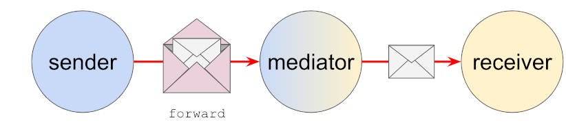
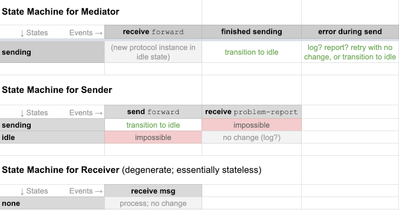
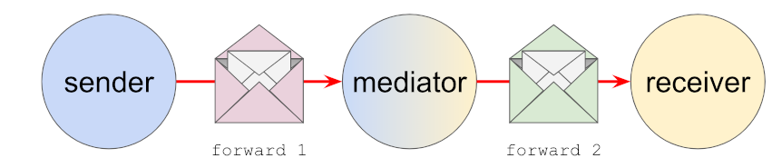

# 0274: Routing Protocol 2.0
- Authors: Tomislav Markovski, Devin Fisher, Daniel Hardman
- Status: [PROPOSED](/README.md#proposed)
- Since: 2019-10-30
- Status Note: Barely submitted.  
- Supersedes: the use of the `forward` message described in [RFC 0094](../../concepts/cross-domain-messaging/README.md) -- but not RFC 0094 as a whole. See note in summary below.
- Start Date: 2018-10-29
- Tags: feature, protocol

## Summary

Explains a protocol that [mediators](../../concepts/mediators-and-relays/README.md) use to route messages. This protocol is essential to cross-domain messaging in DIDComm, as it lets agents receive messages even when they don't have a publicly reachable service endpoint.
 
 The protocol is an evolution of the early use of the `forward` message first described in [RFC 0094](../../concepts/cross-domain-messaging/README.md). It supersedes the message definition there, but not the rest of that RFC; all of the conceptual model in RFC 0094 still applies.
 
 The protocol in this RFC is given the version number 2.0 because it introduces a breaking change in how the payload of the `forward` message is managed.

## Motivation

We need a standard way to deliver messages to agents that have no public service endpoint, such as mobile agents or agents that operate behind a firewall.

## Tutorial

>Please review the mental model for routing as described in [RFC 0094: Cross-Domain Messaging](../../concepts/cross-domain-messaging/README.md) and [RFC 0046: Mediators and Relays](../../concepts/mediators-and-relays/README.md). All of the concepts described in those RFCs still apply here, and the discussion below assumes you understand them.

### Why an update?

This updated protocol exists because we learned some things from our first implementation of routing, embodied in the `forward` message described in RFC 0094:

1. Routing is no different from any other [high-level protocol built atop DIDComm](../../concepts/0003-protocols/README.md):
    * It has [parties and participants and roles](../../concepts/0003-protocols/roles-participants-etc.md).
    * It needs a [formal description of its state evolution](../../concepts/0003-protocols/state-details.md).
    * It needs to be tested by the [protocol test suite](http://example.com/todo-fix-this), and it needs to have its implementations tracked.
    * Support for it should be discoverable over the [Discover Features Protocol](../0031-discover-features/README.md).
    * It may wish to [adopt](../../concepts/0003-protocols/template.md#adopted-messages) common protocol features like [message timing for timeouts and profiling](../0032-message-timing/README.md), [message tracing for troubleshooting](../0034-message-tracing/README.md), and a [mechanism to report problems](../0035-report-problem/README.md).
    
2. The old way we bundled payloads into a `forward` message was unnecessarily customized. We can use the more generic payload attachment mechanism described in [RFC 0017: Attachments](../../concepts/0017-attachments). This should eliminate some redundant code, improve robustness, and add some extra flexibility.

3. We'd like a way to integrate DIDComm message routing with privacy-preserving mix networks like TOR. We don't want DIDComm to depend on mix networks, but we need to rationalize their co-existence.

### What's new

If you understood the old protocol, then the new one will look quite familiar. The main differences are:

* Payloads are now standard attachments instead of being incorporated with a custom embedding strategy. This allows a single `forward` message to have multiple attached payloads, and it allows forwarded payloads to have custom delivery options (e.g., an indirection that causes the payloads to be fetched from a CDN).

* Some additional, optional fields are defined in a `forward` message.

* The protocol's use of other standard features is explored more explicitly.

### Name and Version

The name of this protocol is "Routing Protocol", and its [version](../../concepts/0003-protocols/semver.md) is "2.0". It is uniquely identified by the [PIURI](../../concepts/0003-protocols/uris.md#piuri):

    https://didcomm.org/routing/2.0

### Roles

There are 3 roles in the protocol: `sender`, `mediator`, and `receiver`. The sender emits messages of type `forward` to the `mediator`. The mediator unpacks (decrypts) the payload of an encrypted `forward` message and passes on the result (an opaque blob that probably contains a differently encrypted payload) to the `receiver`.



>Note: the protocol is one-way; the return route for communication might not exist at all, or if it did, it could invert the roles of sender and receiver and use the same mediator, or it could use one or more different mediators, or it could use no mediator at all. This is a separate concern partly specified by the service endpoints in the DID docs of the sender and receiver, and partly explored in [RFC 0092: Transports Return Route](../0092-transport-return-route/README.md). 

>Note: When the mediator is the routing agent of a single identity subject like Alice, the logical receiver is Alice herself, but the physical receiver may manifest as multiple edge devices (a phone, a laptop, a tablet). From the perspective of this protocol, multiplexing the send from mediator to receiver is out of scope for interoperability--compatible and fully supported, but not required or specified in any way.

In this protocol, the sender and the receiver never interact directly; they only interact via the mediator.
  
The sender can decorate the `forward` message in standard DIDComm ways: using [`~timing.expires_time`, `~timing.delay_milli` and `~timing.wait_until_time`](../0032-message-timing/README.md#tutorial) to introduce timeouts and delays, and so forth. However, the mediator is NOT required to support or implement any of these mixin semantics; only the core forwarding behavior is indispensable. If a mediator sees a decorator that requests behavior it doesn't support, it MAY return a [`problem-report`](../0035-report-problem/README.md) to the sender identifying the unsupported feature, but it is not required to do so, any more than other recipients of DIDComm messages would be required to complain about unsupported decorators in messages they receive.

>One particular decorator is worth special mention here: [`~please_ack`](../0015-acks/README.md#requesting-an-ack-please_ack). This decorator is intended to be processed by ultimate recipients, not mediators. It imposes a burden of backward-facing communication that mediators should not have. Furthermore, it may be used to probe a delivery chain in a way that risks privacy for the receiver. Therefore, senders SHOULD NOT use this, and mediators SHOULD NOT honor it if present. If a sender wishes to troubleshoot, the [message tracing](../0034-message-tracing/README.md) mechanism is recommended.

### States

Since data flow is normally one-way, and since the scope of the protocol is a single message delivery, a simplistic way to understand it might be as two instances of the stateless [notification pattern](../../concepts/0003-protocols/notification.png), unfolding in sequence.

However, this doesn't quite work on close inspection, because the mediator is at least potentially stateful with respect to any particular message; it needs to be if it wants to implement delayed delivery or retry logic. (Or, as noted earlier, the possibility of sending to multiple physical receivers. Mediators are not required to implement any of these features, but the state machine needs to account for their possibility.) Plus, the notification terminology obscures the sender and receiver roles. So we use the following formalization:

[](https://docs.google.com/spreadsheets/d/1zxm3cPZ1UDQPDpYJjGmg_qY8451WMk105HBSARJkvDI/edit#gid=0)

### Messages

The only message in this protocol is the `forward` message. It has the following structure:

```jsonc
{
    "@id": "uuid value" // optional; only useful for tracing
    "@type": "https://didcomm.org/routing/2.0/forward",
    "to"   : "did:foo:1234abcd",
    "payloads~attach": [
        // An array of attached payloads, generally assumed
        // to be DIDComm encrypted envelopes, but theoretically
        // able to be other message types as well.
    ]
}
```

Unlike the 1.0 version of the routing protocol, the value of the `to` field is a DID, not a key. This hides details about the internals of a sovereign domain from external parties. The sender will have had to multiplex encrypt for all relevant recipient keys, but doesn't need to know how routing happens to those keys. The mediator and the receiver may have coordinated about how distribution to individual keys takes place (see [RFC 0211: Route Coordination](../0211-route-coordination/README.md)), but that is outside the scope of concerns of this protocol. 

The attachment(s) in the `payloads~attach` field are able to use the full power of DIDComm attachments, including features like instructing the receiver to download the payloads from a CDN.

### Rewrapping Mode (experimental)

Normally, the payload attached to ("inside") the `forward` message received by the mediator is transmitted directly to the receiver with no further packaging. However, optionally, the mediator can attach the opaque payload to a new `forward` message, which then acts as a fresh outer envelope for the second half of the delivery. This [rewrapping Mode](#rewrapping-mode) means that the "onion" of packed messages stays the same size rather than getting smaller as a result of the forward operation:


 
Rewrapping mode is invisible to senders, but mediators need to know about it, since they change their behavior as a result. Receivers also need to know about it, because it causes them to receive a double-packaged message instead of a singly-packaged one. The outer envelope is a `forward` message where `to` is the receiver itself.

Why is such indirection useful?

* It lets the mediator decorate messages with timing and tracing mixins. (This would otherwise be impossible, since the inner payload will be tamper-evident and encrypted.)
* It allows for dynamic routing late in the delivery chain. For example, a receiver who is concerned about eavesdroppers could ask the mediator to use rewrapping mode, to forward the rewrapped message on to  

## Reference

Provide guidance for implementers, procedures to inform testing,
interface definitions, formal function prototypes, error codes,
diagrams, and other technical details that might be looked up.
Strive to guarantee that:

- Interactions with other features are clear.
- Implementation trajectory is well defined.
- Corner cases are dissected by example.

## Drawbacks

Why should we *not* do this?

## Rationale and alternatives

- Why is this design the best in the space of possible designs?
- What other designs have been considered and what is the rationale for not
choosing them?
- What is the impact of not doing this?

## Prior art

Discuss prior art, both the good and the bad, in relation to this proposal.
A few examples of what this can include are:

- Does this feature exist in other SSI ecosystems and what experience have
their community had?
- For other teams: What lessons can we learn from other attempts?
- Papers: Are there any published papers or great posts that discuss this?
If you have some relevant papers to refer to, this can serve as a more detailed
theoretical background.

This section is intended to encourage you as an author to think about the
lessons from other implementers, provide readers of your proposal with a
fuller picture. If there is no prior art, that is fine - your ideas are
interesting to us whether they are brand new or if they are an adaptation
from other communities.

Note that while precedent set by other communities is some motivation, it
does not on its own motivate an enhancement proposal here. Please also take
into consideration that Aries sometimes intentionally diverges from common
identity features.

## Unresolved questions

- What parts of the design do you expect to resolve through the
enhancement proposal process before this gets merged?
- What parts of the design do you expect to resolve through the
implementation of this feature before stabilization?
- What related issues do you consider out of scope for this 
proposal that could be addressed in the future independently of the
solution that comes out of this doc?
   
## Implementations

The following lists the implementations (if any) of this RFC. Please do a pull request to add your implementation. If the implementation is open source, include a link to the repo or to the implementation within the repo. Please be consistent in the "Name" field so that a mechanical processing of the RFCs can generate a list of all RFCs supported by an Aries implementation.

*Implementation Notes* [may need to include a link to test results](README.md#accepted).

Name / Link | Implementation Notes
--- | ---
 | 

