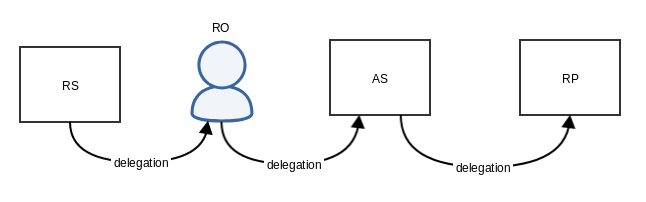
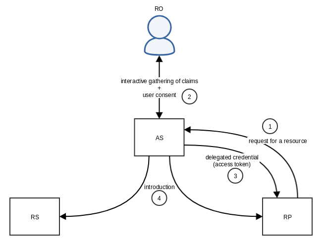
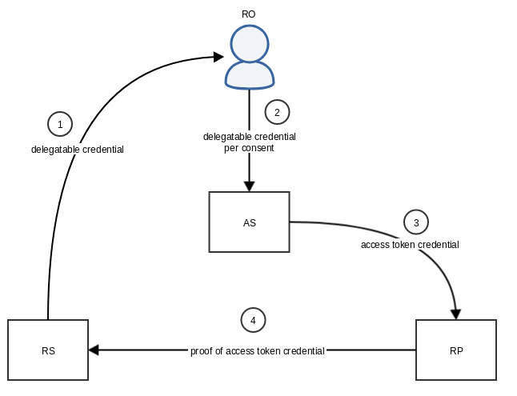
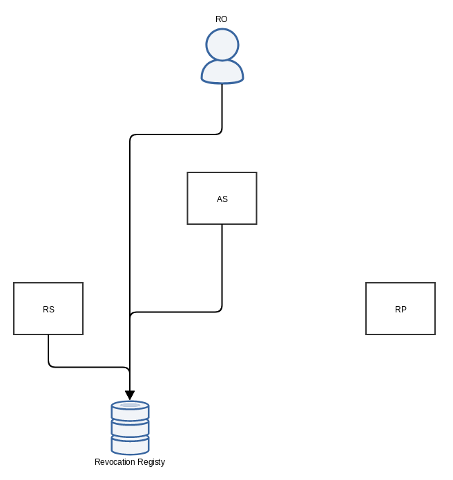

# Aries RFC 0309: DIDAuthZ
- Authors: [George Aristy](george.aristy@gmail.com) SecureKey Technologies
- Status: [PROPOSED](/README.md#proposed)
- Since: 2019-11-14
- Status Note: This RFC is under development.
- Supersedes:
- Start Date: 2019-09-27
- Tags: [feature](/tags.md#feature), [credentials](/tags.md#credentials)

## Summary

DIDAuthZ is an attribute-based resource discovery and authorization protocol
for Layer 2 of the ToIP Stack<sup>[1]</sup>. It enables a requesting party to
discover protected resources and obtain credentials that grant limited access
to these resources with the authorization of their owner. These credentials
can be configured such that the requesting party may further delegate unto
others the authority to access these resources on their behalf.

## Motivation

In the online world, individuals frequently consent to a service provider
gaining access to their protected resources located on a different service
provider. Individuals are challenged with an authentication mechanism,
informed of the resources being requested, consent to the use of their
resources, and can later revoke access at any time. OAuth 2.0<sup>[6]</sup>,
and other frameworks built on top of it, were developed to address this need.

A DIDComm protocol<sup>[2]</sup> can address these use cases and enhance them
with secure end-to-end encryption<sup>[3]</sup> independent of the transport
used. The risk of correlation of the individual's relationships with other
parties can be mitigated with the use of peer DIDs<sup>[4]</sup>. With a
sufficiently flexible grammar, the encoding of the access scope can be
fine-grained down to the individual items that are requested, congruent with
the principle of selective disclosure<sup>[5]</sup>.

It is expected that future higher-level protocols and governance
frameworks<sup>[1]</sup> can leverage DIDAuthZ to enable authorized sharing
of an identity owner's attributes held by a third party.

## Tutorial

### Roles

DIDAuthZ adapts the following roles from OAuth 2.0<sup>[6]</sup> and UMA
2.0<sup>[7]</sup>:

|||
|---|---|
|**Resource Server (RS)**|An agent holding the protected resources. These resources MAY be credentials of which the subject MAY be a third party identity owner. The RS is also a resource owner at the root of the chain of delegation.|
|**Resource Owner (RO)**|An agent capable of granting access to a protected resource. The RO is a delegate of the RS to the extent encoded in a credential issued by the RS.|
|**Authorization Server (AS)**|An agent that protects, on the resource owner's behalf, resources held by the resource server. The AS is a delegate of the RO capable of issuing and refreshing access credentials.|
|**Requesting Party (RP)**|An agent that requests access to the resources held by the resource server. The RP is a delegate of the AS to the extent encoded in a credential issued by the AS.|
|||



### Transaction Flow

The requesting party initiates a transaction by communicating directly with
the authorization server with prior knowledge of their location.



**(1) RP requests a resource**

The requesting party requests the authorization server for a resource. A
description of the resource requested and the desired access is included in
this request.

> **TODO** does the request need to also include proof of "user engagement"?

**(2) AS requests authorization from the RO**

The authorization server processes the request and determines if the resource owner's
authorization is needed. The authorization server MUST obtain the resource owner's
authorization if no previous grant of authorization is found in valid state. Otherwise,
the authorization server MAY issue new access credentials to the requesting party without
any interaction with the resource owner. In such a case, the authorization server MUST
revoke all access credentials previously issued to the requesting party.

The authorization server interacts with the resource owner through their existing
DIDComm connection to obtain their authorization.

**(3) AS issues an access token to the RP**

The authorization server issues access credentials to the requesting party.

**(4) AS introduces the RP to the RS**

The authorization server connects the requesting party to the resource server via
the Introduce Protocol<sup>[9]</sup>.

### Access Credentials

Access credentials are chained delegate credentials<sup>[17]</sup> used to access
the protected resources. Embedded in them is proof of the chain of delegation
and authorization.



**(1) RS delegates unto RO**

The resource server issues a credential to the resource owner that identifies
the latter as the owner of a subset of resources hosted by the former. It also
identifies the resource owner's chosen authorization server in their respective
role. The resources will also have been registered at the authorization server.

**(2) RO delegates unto AS**

The resource owner issues a grant-type credential to the authorization server
at the end of each AS-RO interaction. This credential is derived from the one
issued by the RS. It authorizes the AS to authorize access to the RP with a set
scope.

**(3) AS issues access credential to RP**

The authorization server issues an access credential to the requesting party
derived from the grant credential issued by the resource owner for this
transaction. This credential encodes the same access scope as found in the
parent credential.

**(4) RP presents proof of access credential to RS**

The requesting party shows proof of this access credential when attempting to
access the resource on the resource server.

### Revocation

The resource server makes available a revocation registry and grants read/write access
to both the resource owner and the authorization server.



## Reference

### Discovery of authorization servers

The resource owner advertises their chosen authorization server to other parties with
a new type of `service` definition in their DID document<sup>[8]</sup>:

```json
{
  "@context": ["https://www.w3.org/ns/did/v1", "https://w3id.org/security/v1"],
  "id": "did:example:123456789abcdefghi",
  "publicKey": [{
    "id": "did:example:123456789abcdefghi#keys-1",
    "type": "Ed25519VerificationKey2018",
    "controller": "did:example:123456789abcdefghi",
    "publicKeyBase58": "H3C2AVvLMv6gmMNam3uVAjZpfkcJCwDwnZn6z3wXmqPV"
  }],
  "service": [{
    "id": "did:example:123456789abcdefghi#did-authz",
    "type": "did-authz",
    "serviceEndpoint": "did:example:xyzabc456#auth-svc"
  }]
}
```
> **TODO** define json-ld context for new service type

The mechanisms by which the resource owner discovers authorization servers
are beyond the scope of this specification.

Authorization servers MUST make available a DID document containing metadata
about their service endpoints and capabilities at a well-known location.

> **TODO** define "well-known locations" in several transports

> **TODO** register well-known URI for http transport as per IETF RFC 5785

### Discovery of revocation registry

> **TODO**

### Resources

#### Describing resources

> **TODO**

#### Describing access scope

> **TODO**

#### Registering resources

> **TODO**

#### Requesting resources

> **TODO**

#### Protocol messages

> **TODO**

### Gathering consent from the resource owner

> **TODO** didcomm messages

### Credentials

> **TODO** format of these credentials, JWTs or JSON-LDs?

> **TODO**

## Drawbacks

(None)

## Rationale and alternatives

- Why is this design the best in the space of possible designs?
- What other designs have been considered and what is the rationale for not
choosing them?
- What is the impact of not doing this?

## Prior art

**Aries RFC 0167**

The *Data Consent Lifecycle*<sup>[10]</sup> is a reference implementation of
data privacy agreements based on the GDPR framework<sup>[11]</sup>. The
identity owner grants access to a verifier in the form of a proof of
possession of a credential issued by the issuer. The identity owner may grant
access to several verifiers in this manner. Access cannot be revoked on a
per-verifier basis. To revoke access to a verifier, the identity owner's
credential needs to be revoked, which in turn revokes all existing proofs the
identity owner may have provided. The identity owner does not have the means
to revoke access to a third party without directly involving the issuer.

**OAuth 2.0**

OAuth 2.0<sup>[6]</sup> is a role-based authorization framework in widespread
use that enables a third-party to obtain limited access to HTTP services on
behalf of a resource owner. The access token's scope is a simple data
structure composed of space-delimited strings more suitable for a role-based
authorization model than an attribute-based model.

Although allowing for different types of tokens to be issued to clients as
credentials, only the use of bearer tokens was formalized<sup>[12]</sup>. As
a result, most implementations use bearer tokens as credentials. An expiry is
optionally set on these tokens, but they nevertheless pose an unacceptable
security risk in an SSI context and other contexts with high-value resources
and need extra layers of security to address the risks of theft and
impersonation. M. Jones and D. Hardt recommend the use of TLS to protect
these tokens <sup>[12]</sup>, but this transport is not guaranteed as a
DIDComm message travels from the sender to the recipient. The specification
for mac tokens<sup>[13]</sup> never materialized and its TLS Channel Binding
Support was never specified, therefore not solving the issue of unwanted TLS
termination in a hop. There is ongoing work in the draft for OAuth 2.0 Token
Binding<sup>[14]</sup> that binds tokens to the cryptographic key material
produced by the client, but it also relies on TLS as the means of transport.

**OpenID Connect 1.0**

OIDC<sup>[15]</sup> is "a simple layer on top of the OAuth 2.0 protocol" that
standardizes simple data structures that contain claims about the end-user's
identity.

Being based upon OAuth 2.0, it suffers from the same security weaknesses -
see the extensive section on Security Considerations that references the
OAuth 2.0 Thread Model and Security Considerations<sup>[16]</sup>.

**User-Managed Access 2.0**

UMA<sup>[7]</sup> is an extension to OAuth 2.0 that formalizes the
authorization server's role as a delegate of the resource owner in order for
the latter to grant access to requesting parties asynchronously and
independently from the time of access. It relies on pre-defined resource
scopes<sup>18</sup> and is thus more suited to role-based access control.

## Unresolved questions

- What parts of the design do you expect to resolve through the
enhancement proposal process before this gets merged?
- What parts of the design do you expect to resolve through the
implementation of this feature before stabilization?
- What related issues do you consider out of scope for this 
proposal that could be addressed in the future independently of the
solution that comes out of this doc?
   
## Implementations

The following lists the implementations (if any) of this RFC. Please do a pull request to add your implementation. If the implementation is open source, include a link to the repo or to the implementation within the repo. Please be consistent in the "Name" field so that a mechanical processing of the RFCs can generate a list of all RFCs supported by an Aries implementation.

Name / Link | Implementation Notes
--- | ---
 | 

## References

1. Matthew Davie, Dan Gisolfi, Daniel Hardman, John Jordan, Darrell O'Donnell, Drummond Reed: *[Aries RFC 0289: Trust over IP Stack](../../concepts/0289-toip-stack/README.md)*, status PROPOSED
2. Daniel Hardman: *[Aries RFC 0005 - DIDComm](../../concepts/0005-didcomm/README.md)*, status DEMONSTRATED
3. Kyle Den Hartog, Stephen Curran, Mike Lodder: *[Aries RFC 0019 - Encryption Envelope](../0019-encryption-envelope/README.md)*, status ACCEPTED
4. Oskar Deventer, Christian Lundkvist, Marton Csernai, Kyle Den Hartor, Markus Sabadello, Sam Curren, Dan Gisolfi, Mike Varley, Sven Hammannn, John Jordan, Lovesh Harchandani, Devin Fisher, Tobias Looker, Brent Zundel, Stephen Currant: *[Peer DID Method Specification](https://openssi.github.io/peer-did-method-spec/index.html)*, W3C Editor's Draft 16 October 2019
5. The Sovrin Foundation: *[The Sovrin Glossary](https://sovrin.org/library/glossary/)*, v2.0
6. Ed. D. Hardt: [*IETF RFC 6749 - The OAuth 2.0 Authorization Framework*](https://tools.ietf.org/html/rfc6749), October 2012
7. Ed. E. Maler, M. Machulak, J. Richer, T. Hardjono: *[IETF I-D - User-Managed Access (UMA) 2.0 Grant for OAuth 2.0 Authorization](https://tools.ietf.org/html/draft-maler-oauth-umagrant-00)*, February 2019
8. Drummond Reed, Manu Sporny, Dave Longley, Christopher Allen, Ryan Grant, Markus Sabadello: *[Decentralized Identifiers (DIDs) v1.0](https://w3c.github.io/did-core/)*,  W3C First Public Working Draft 07 November 2019
9. Daniel Hardman, Sam Curren, Stephen Curran, Tobias Looker, George Aristy: *[Aries RFC 0028 - Introduce Protocol 1.0](../0028-introduce/README.md)*, status PROPOSED
10. Jan Lindquist, Dativa; Paul Knowles, Dativa; Mark Lizar, OpenConsent; Harshvardhan J. Pandit, ADAPT Centre, Trinity College Dublin: *[Aries RFC 0167 - Data Consent Lifecycle](../../concepts/0167-data-consent-lifecycle/README.md)*, status PROPOSED
11. Intersoft Consulting: *[General Data Protection Regulation](https://gdpr-info.eu/)*, November 2019
12. M. Jones, D. Hardt: *[IETF RFC 6750 - The OAuth 2.0 Authorization Framework: Bearer Token Usage](https://tools.ietf.org/html/rfc6750)*, October 2012
13. J. Richer, W. Mills, P. Hunt: *[IETF I-D - OAuth 2.0 Message Authentication Code (MAC) Tokens](https://tools.ietf.org/html/draft-ietf-oauth-v2-http-mac-05)*, January 2014
14. M. Jones, B. Campbell, J. Bradley, W. Denniss: *[IETF I-D - OAuth 2.0 Token Binding](https://tools.ietf.org/html/draft-ietf-oauth-token-binding-08)*, October 2018
15. N. Sakimura, J. Bradley, M. Jones, B. de Medeiros, C. Mortimore: *[OpenID Connect Core 1.0](https://openid.net/developers/specs/)*, November 2014
16. T. Lodderstedt, M. McGloin, P. Hunt: *[OAuth 2.0 Thread Model nd Security Considerations](https://tools.ietf.org/html/rfc6819)*, January 2013
17. Daniel Hardman, Lovesh Harchandani: *[Aries RFC 0104 - Chained Credentials](../../concepts/0104-chained-credentials/README.md)*, status PROPOSED
18. E. Maler, M. Machulak, J. Richer, T. Hardjono: *[Federated Authorization for User-Managed Access (UMA) 2.0](https://tools.ietf.org/html/draft-maler-oauth-umafedauthz-00)*, February 2019