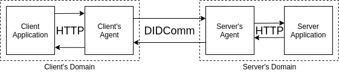

# 0335: HTTP Over DIDComm
- Authors: [Filip Burlacu](filip.burlacu@securekey.com) (SecureKey)
- Status: [PROPOSED](/README.md#proposed)
- Since: 2019-12-03
- Status Note: implementation is being explored by SecureKey  
- Supersedes:
- Start Date: 2019-11-26
- Tags: feature, protocol

## Summary

Allows HTTP traffic to be routed over a DIDComm channel, so applications built to communicate over HTTP can make use of DID-based communication.

## Motivation

This protocol allows a client-server system that doesn't use DIDs or DIDComm to piggyback on top of a DID-based infrastructure, gaining the benefits of DIDs by using agents as HTTP proxies.

Example use case: 
Carl wants to apply for a car loan from his friendly neighborhood used car dealer. The dealer wants a proof of his financial stability from his bank, but he doesn't want to expose the identity of his bank, and his bank doesn't want to develop a custom in-house system (using DIDs) for anonymity. HTTP over DIDComm allows Carl to introduce his car dealer to his bank, using Aries agents and protocols, while all they need to do is install a standard agent to carry arbitrary HTTP messages.

HTTP over DIDComm turns a dev + ops problem, of redesigning and deploying your server and client to use DID communication, into an ops problem - deploying Aries infrastructure in front of your server and to your clients.

Using HTTP over DIDComm as opposed to HTTPS between a client and server offers some key benefits:
- The client and server can use methods provided by Aries agents to verify their trust in the other party - for example, by presenting verifiable credential proofs. In particular, this allows decentralized client verification and trust, as opposed to client certs.
- The client and server can be blind to each others' identities (for example, using fresh peer DIDs and communicating through a router), even while using their agents to ensure trust.

## Tutorial

#### Name and Version

This is the HTTP over DIDComm protocol. It is uniquely identified by the URI:

    "https://didcomm.org/http-over-didcomm/1.0"

#### Concepts

> This RFC assumes that you are familiar with [DID communication](/concepts/0005-didcomm/README.md), and the [`~purpose` decorator](/features/0351-purpose-decorator/README.md).

This protocol introduces a new message type which carries an HTTP message, and a method by which an Aries agent can serve as an HTTP proxy. The Aries agent determines the target agent to route the HTTP message through (for example, by parsing the HTTP message's request target), and when the target agent receives the message, it serves the message over HTTP.

The specifics of determining the target agent or route are not part of this specification, allowing room for a wide array of uses:
-  A network of enterprise servers behind agents, with the agents being a known, managed pool, with message routing controlled by business logic.
- A privacy mix network, with in-browser agents making requests, and routing agents sending messages on random walks through the network until an agent serves the request over the public internet.
- A network of service providers behind a routing network, accessed by clients, with any provider able to handle the same class of requests, so routing is based on efficiency/load.
- A network of service providers behind a routing network, accessed by clients, where the routing network hides the identity of the service provider and client from each other.


### Protocol Flow
This protocol takes an HTTP request-response loop and stretches it out across DIDComm, with agents in the middle serving as DIDComm [relays](/concepts/0046-mediators-and-relays/README.md), passing along messages.

The entities involved in this protocol are as follows:
- The **client** and **server**: the HTTP client and server, which could communicate via HTTP, but in this protocol communicate over DIDComm.
- The **client agent**: the aries agent which receives the HTTP request from the client, and converts it to a DIDComm message, which it sends to the server agent, and translates the reply from the server agent into an HTTP response.
- The **server agent**: the aries agent which receives the DIDComm request message from the client agent, creates an HTTP request for the server, receives the HTTP response, and translates it into a DIDComm message which it sends to the client agent.
 


Before a message can be sent, the server must register with its agent using the `~purpose` decorator, registering on one or more purpose tags.

When a client sends an HTTP request to a client agent, the agent may need to maintain an open connection, or store a record of the client's identity/IP address, so the client can receive the coming response.

The client agent can include some logic to decide whether to send the message, and may need to include some logic to decide where to route the message (note that in some architectures, another agent along the route makes the decision, so the agent might always send to the same target). If it does, it constructs a request DIDComm message (defined below) and sends it to the chosen server agent.

The route taken by the DIDComm message between the client and server agents is not covered by this RFC.

The server agent receives the request DIDComm message. It can include some logic to decide whether to permit the message to continue to the server. If so, it makes an HTTP request using the data in the request DIDComm message, and sends it to the server.

Note: in some use-cases, it might make sense for the server agent to act as a transparent proxy, so the server thinks its talking directly to the client, while in others it might make sense to override client identity information so the server thinks it's connecting to the server agent, for example, as a gateway. In this case, the client agent could anonymize the request, rather than leaving it up to the server agent.

This same anonymization can be done in the other direction as well.

The communication happens in reverse when the server sends an HTTP response to its agent, which may again decide whether to permit it to continue. If so, the contents of the HTTP response are encoded into a response DIDComm message (defined below), sent to the client agent, which also makes a go/no-go decision, does some logic (for example, looking up its thread-id to client database) to figure out where the original request in this thread came from, encodes the response data into an HTTP response, and sends that response to the client.

#### Message Format

DIDComm messages for this protocol look as follows:

##### `request`

```
{
  "@type": "https://didcomm.org/http-over-didcomm/1.0/request",
  "@id": "2a0ec6db-471d-42ed-84ee-f9544db9da4b",
  "~purpose": [],
  "method": <method>,
  "resource-uri": <resource uri value>,
  "version": <version>,
  "headers": [],
  "body": b64enc(body)
}
```

The `body` field is optional.

The `resource-uri` field is also optional - if omitted, the server agent needs to set the uri based on the server that is being sent the message.

Each element of the `headers` array is an object with two elements:
`{"name": "<header-name>", "value": "<header-value>"}`.

##### `response`

```
{
  "@type": "https://didcomm.org/http-over-didcomm/1.0/response",
  "@id": "63d6f6cf-b723-4eaf-874b-ae13f3e3e5c5",
  "~thread": {
    "thid": "2a0ec6db-471d-42ed-84ee-f9544db9da4b",
    "sender_order": 1
  },
  "status": {
      "code":"",
      "string":""
  },
  "version": <version>,
  "headers": [],
  "body": b64enc(body)
}
```

Responses need to indicate their target - the client who sent the request. Response DIDComm messages must include a `~thread` decorator so the client agent can correlate thread IDs with its stored HTTP connections.

The `body` field is optional.

Each element of the `headers` array is an object with two elements:
`{"name": "<header-name>", "value": "<header-value>"}`.

#### Receiving HTTP Messages Over DIDComm

Aries agents intended to receive HTTP-over-DIDComm messages have many options for how they handle them, with configuration dependent on intended use. For example:
- Serve the message over the internet, configured to use a DNS, etc.
- Send the message to a specific server, set in configuration, for an enterprise system where a single server is behind an agent.
- Send the message to a server which registered for the message's purpose.

In cases where a specific server or application is always the target of certain messages, the server/application should register with the server agent on the specific purpose decorator. In cases where the agent may need to invoke additional logic, the agent itself can register a custom handler.

An agent may implement filtering to accept or reject requests based on any combination of the purpose, sender, and request contents.

##### Purpose Value

The purpose values used in the message should be values whose meanings are agreed upon by the client and server. For example, the purpose value can:
 - indicate the required capabilities of the server that handles a request
 - contain an anonymous identifier for the server, which has previously been communicated to the client.

For example, to support the use of DIDComm as a client-anonymizing proxy, agents could use a purpose value like "web-proxy" to indicate that the HTTP request  (received by the server agent) should be made on the web.

## Reference

##### Determining the recipient DID by the Resource URI

In an instance of the HTTP over DIDComm protocol, it is assumed that the client agent has the necessary information to be able to determine the DID of the server agent based on the resource-uri provided in the request. It's reasonable to implement a configuration API to allow a sender or administrator to specify the DID to be used for a particular URI.

##### -Alive & Timeout

The client agent should respect the timeout parameter provided in a keep-alive header if the request header is a keep-alive connection.

If a client making an HTTP request expects a response over the same HTTP connection, its agent should keep this connection alive while it awaits a DIDComm response from the server agent, which it should recognize by the `~thread` decorator in the response message. Timing information can be provided in an optional [`~timing`](/features/0032-message-timing/README.md) decorator. 


Agents implementing this RFC can make use of the [`~transport`](/features/0092-transport-return-route/README.md) decorator to enable response along the same transport.

##### When the Client Agent is the Server Agent

There is a degenerate case of this protocol where the client and server agents are the same agent. In this case, instead of constructing DIDComm messages, sending them to yourself, and then unpacking them, it would be reasonable to take incoming HTTP messages, apply any pre-send logic (filtering, etc), apply any post-receive logic, and then send them out over HTTP, as a simple proxy.

To support this optimization/simplification, the client agent should recognize if the recipient DID is its own, after determining the DID from the resource URI.

#####  HTTP Error Codes
Failures within the DIDComm protocol can inform the status code returned to the client. 

If the client agent waits for the time specified in the request keep-alive timeout field, it should respond with a standard 504 gateway timeout status.

Error codes which are returned by the server will be transported over DIDComm as normal.

##### Why HTTP/1.x?
The DIDComm messages in this protocol wrap HTTP/1(.x) messages for a few reasons:
 - Wire-level benefits of HTTP/2 are lost by wrapping in DIDComm and sending over another transport (which could itself be HTTP/2)
 - DIDComm is not, generally, intended to be a streaming or latency-critical transport layer, so HTTP responses, for example, can be sent complete, including their bodies, instead of being split into frames which are sent over DIDComm separately.

The agents are free to support communicating with the client/server using HTTP/2 - the agents simply wait until they've received a complete request or response, before sending it onwards over DIDComm.

##### HTTPS

The client and server can use HTTPS to communicate with their agents - this protocol only specifies that the messages sent *over DIDComm* are HTTP, not HTTPS.

##### Partial use of HTTP over DIDComm

This protocol specifies the behaviour of clients, servers, and their agents. However, the client-side and server-side are decoupled by design, meaning a custom server or client, which obeys all the semantics in this RFC while diverging on technical details, can interoperate with other compliant applications.

For example, a client-side agent can construct `request` messages based on internal logic rather than a request from an external application. On the server side, an agent can handle requests and send responses directly by registering its own listener on a purpose value, rather than having a separate application register.

## Drawbacks

You might find the cost too high, with wrapping your messages into HTTP messages, and then wrapping those into DIDComm envelopes. This cost includes the time it takes to wrap and unwrap payloads, as well as the increase in message size. Small messages and simple formats would benefit from being encoded as JSON payloads within custom DIDComm message formats, instead of being wrapped in HTTP messages within DIDComm messages. Large data might benefit from being sent over another channel, encrypted, with identification, decryption, and authentication information sent over DIDComm.

## Rationale and alternatives

The main alternative to the method proposed in this RFC is to implement DIDComm in your non-DIDComm applications, if you want them to be able to communicate with each other over DIDComm.

Another alternative to sending HTTP messages over DIDComm is sending *HTTPS* over DIDComm, by establishing a TLS connection between the client and server over the DIDComm transport. This offers some tradeoffs and drawbacks which make it an edge case - it identifies the server with a certificate, it breaks the anonymity offered by DIDComm, and it is not necessary for security since DIDComm itself is securely encrypted and authenticated, and DIDComm messages can be transported over HTTPS as well.

## Prior art

VPNs and onion routing (like Tor) provide solutions for similar use cases, but none so far use DIDs, which enable more complex use cases with privacy preservation.

TLS/HTTPS, being HTTP over TLS, provides a similar transport-layer secure channel to HTTP over DIDComm. Note, this is why this RFC doesn't specify a means to perform HTTPS over DIDComm - DIDComm serves the same role as TLS does in HTTPS, but offers additional benefits:
- Verifiable yet anonymous authentication of the client, for example, using delegated credentials.
- Access to DIDComm mechanisms, such as using the introduce protocol to connect the client and server.

## Unresolved questions

- What parts of the design do you expect to resolve through the
enhancement proposal process before this gets merged?
  - Likely some specifics of go/no-go or routing logic
- What parts of the design do you expect to resolve through the
implementation of this feature before stabilization?
  - The routing and logic specifics of certain use cases
- What related issues do you consider out of scope for this 
proposal that could be addressed in the future independently of the
solution that comes out of this doc?
   
## Implementations

The following lists the implementations (if any) of this RFC. Please do a pull request to add your implementation. If the implementation is open source, include a link to the repo or to the implementation within the repo. Please be consistent in the "Name" field so that a mechanical processing of the RFCs can generate a list of all RFCs supported by an Aries implementation.

*Implementation Notes* [may need to include a link to test results](README.md).

Name / Link | Implementation Notes
--- | ---
 | 

