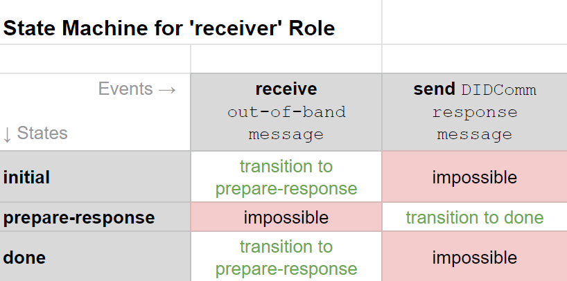
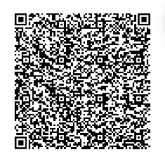

# Aries RFC 0434: Out-of-Band Protocols

- Authors: [Ryan West](ryan.west@sovrin.org), [Daniel Bluhm](daniel.bluhm@sovrin.org), Matthew Hailstone, [Stephen Curran](swcurran@cloudcompass.ca), [Sam Curren](sam@sovrin.org), [George Aristy](george.aristy@securekey.com)
- Status: [PROPOSED](/README.md#proposed)
- Since: 2020-03-01
- Status Note: This RFC extracts the `invitation` messages from the [DID Exchange](../../features/0023-did-exchange/README.md) protocol (and perhaps [Connection](../../features/0160-connection-protocol/README.md)), and replaces the combined `present_proof/1.0/request` combined with the `~service` decorator to define an ephemeral (connection-less) challenge.
- Supersedes: Invitation Message in [0160-Connections](https://github.com/hyperledger/aries-rfcs/blob/9b0aaa39df7e8bd434126c4b33c097aae78d65bf/features/0160-connection-protocol/README.md#0-invitation-to-connect) and Invitation Message in [0023-DID-Exchange](https://github.com/hyperledger/aries-rfcs/blob/9b0aaa39df7e8bd434126c4b33c097aae78d65bf/features/0023-did-exchange/README.md#0-invitation-to-exchange).
- Start Date: 2020-03-01
- Tags: [feature](/tags.md#feature), [protocol](/tags.md#protocol)
- Protocol Name: Out-of-Band Invitation, Out-of-Band Request
- Version: 1.0, 1.0
- URI: `http://didcomm.org/oob-invitation/%VER`, `http://didcomm.org/oob-request/%VER`

## Summary

Out-of-band protocols are used when you wish to engage with another agent and you don't have a DIDComm connection to use for the interaction.

## Motivation

The use of the `invitation` in the [Connection](../../features/0160-connection-protocol/README.md) and [DID Exchange](../../features/0023-did-exchange/README.md) protocols has been relatively successful, but has some shortcomings, as follows.

### Connection Reuse

A common pattern we have seen in the early days of Aries agents is a user with a browser getting to a point where a connection is needed between the website's (enterprise) agent and the user's mobile agent. A QR invitation is displayed, scanned and a protocol is executed to establish a connection. Life is good!

However, with the current invitation processes, when the same user returns to the same page, the same process is executed (QR code, scan, etc.) and a new connection is created between the two agents. There is no way for the user's agent to say "Hey, I've already got a connection with you. Let's use that one!"

We need the ability to reuse a connection.

### Connection Establishment Versioning

In the existing Connections and DID Exchange `invitation` handling, the _inviter_ dictates what connection establishment protocol all _invitee_'s will use. A more sustainable approach is for the _inviter_ to offer the _invitee_ a list of supported protocols and allow the _invitee_ to use one that it supports.

### Handling of all Out-of-Band Messages

We currently have two sets of out-of-band messages that cannot be delivered via DIDComm because there is no channel. We'd like to align those messages into a single "out of band" RFC so that their handling can be harmonized inside an agent, and a common QR code handling mechanism can be used.

### URLs and QR Code Handling

We'd like to have the specification of QR handling harmonized into a single RFC (this one).

## Tutorial

### Key Concepts

There are currently two out-of-band (OOB) protocols: one for inviting someone to connect, and one for processing one-off "ephemeral" messages. They solve different problems, but their handling has so much in common that it's convenient to put them in the same RFC and describe them together. If we find other OOB use cases, we'll probably add them to this RFC as well. We nonetheless declare them as separate protocols so they can be versioned separately, queried separately in the Feature Discovery protocol, and so forth.

Out-of-band protocols are used when you don't know if you have a connection with another user. This could be because you are trying to establish a new connection with that agent, you have connections but don't know who the other party is, or if you want to have a connection-less interaction. Since there is no DIDComm connection to use for the messages of this protocol, the messages are plaintext and sent out of band, such as via a QR code. Since the delivery of out-of-band messages will often be via QR codes, this RFC also covers the use of QR codes.

Two well known use cases for using an out-of-band protocol are:

- A user on a web browser wants to execute a protocol (for example, to issue a verifiable credential) between the website operator's agent and a user's agent. To enable the execution of the protocol, the two agents must have a connection. An out-of-band message is used to trigger the creation of a new, or the reuse an existing, connection.
- A website operator wants to request something from a user on their site where there is no (known) connection with the user.

In both cases, there is only a single out-of-band protocol message sent. The message responding to the out-of-band message is a DIDComm message from an appropriate protocol.

Note that the website-to-agent model is not the only such interaction enabled by the out-of-band protocol, and a QR code is not the only delivery mechanism for out-of-band messages. However, they are useful as examples of the purpose of the protocol.

### Roles

Each out-of-band protocol has two roles: __sender__ and __receiver__.

#### sender

The agent that generates the out-of-band message and makes it available to the other party.

#### receiver

The agent that receives the out-of-band message and decides how to respond. There is no out-of-band protocol message with which the receiver will respond. Rather, if they respond, they will use a message from another protocol that the sender understands.

### States

The state machines for the sender and receiver are a bit odd for the out-of-band protocol because it consists of a single message that kicks of a co-protocol and ends when evidence of the co-protocol's launch is received, in the form of some response. In the following state machine diagrams we generically describe the response message from the *receiver* as being a DIDComm message without associating the message with a specific protocol.

The *sender* state machine is as follows:

[](https://docs.google.com/spreadsheets/d/1o1szGCMx6FzrxfAKV76IEYmeKRJqvV3gd1r3Qfv1Q9o/edit#gid=1176419697)

Note the "optional" reference under the second event in the `await-response` state. That is to indicate that an out-of-band message might be a single use message with a transition to done, or reusable message (received by many receivers) with a transition back to `await-response`.

The *receiver* state machine is as follows:

[](https://docs.google.com/spreadsheets/d/1o1szGCMx6FzrxfAKV76IEYmeKRJqvV3gd1r3Qfv1Q9o/edit#gid=10874521)

Worth noting is the first event of the `done` state, where the receiver may receive the message multiple times. This represents, for example, an agent returning to the same website and being greeted with the same QR code each time.

### Messages

There are two out-of-band protocols, each consisting of a single message. In both cases, the message is emitted by the *sender*.

#### Message Type: `https://didcomm.org/oob-invitation/%VER/invitation`

```jsonc
{
  "@type": "https://didcomm.org/oob-invitation/%VER/invitation",
  "@id": "<id used for context as pthid>",
  "label": "Faber College",
  "goal-code": "issue-vc",
  "goal": "To issue a Faber College Graduate credential",
  "protocols": [
      "https://didcomm.org/didexchange/1.0",
      "https://didcomm.org/connections/1.0"
      ]
  "service": ["did:sov:LjgpST2rjsoxYegQDRm7EL"]
}
```

The items in the message are:

- `@type` - the DIDComm message type
- `@id` - the unique ID of the message. The ID should be used as the **parent** thread ID (`pthid`) for the response message, rather than the more common thread ID (`thid`) of the response message. This enables multiple uses of a single out-of-band message.
- `label` - [optional] a self-attested string that the receiver may want to display to the user, likely about who sent the out-of-band message.
- `goal-code` - [optional] a self-attested code the receiver may want to display to the user or use in automatically deciding what to do with the out-of-band message.
- `goal` - [optional] a self-attested string that the receiver may want to display to the user about the context-specific goal of the out-of-band message.
- `protocols` - array of protocols in the order of preference of the sender that the receiver can use in responding to the message. As implied by the message type of invitation, these are not arbitrary protocols but rather protocols that result in the establishment of a connection.
- `service` - an item that is the equivalent of the service block of a DIDDoc that the receiver is to use in responding to the message. Additional details below.

Both the `goal-code` and `goal` fields should be used with the [localization service decorator](../0043-l10n/README.md). The two fields are to enable both human and machine handling of the out-of-band message. `goal-code` is to specify a generic, protocol level outcome for sending the out-of-band message (e.g. issue verifiable credential, request proof, etc.) that is suitable for machine handling and possibly human display, while `goal` provides context specific guidance, targeting mainly a person controlling the receiver's agent. The list of `goal-code` values is provided in the [Message Catalog](#message-catalog) section of this RFC.

While the _receiver_ is expected to respond with an initiating message from the chosen protocol using a specified service, the receiver may be able to respond by reusing an existing connection. Specifically, if a connection they have was created from an out-of-band `invitation` from the same public DID of a new `invitation`, the receiver **SHOULD** use the existing connection in responding to the `invitation`. The selected `protocol` being used by the receiver may have a specific message type to use for this purpose.

#### Message Type: `https://didcomm.org/oob-request/%VER/request`

```jsonc
{
  "@type": "https://didcomm.org/oob-request/%VER/request",
  "@id": "<id used for context as pthid>",
  "label": "Faber College",
  "request~attach" [
    {
        "@id": "request-0",
        "mime-type": "application/json",
        "data": {
            "base64": "<bytes for base64>"
        }
    }
  ]
  "service": ["did:sov:LjgpST2rjsoxYegQDRm7EL"]
}
```

The items in the message are:

- `@type` - see `invitation`
- `@id` - see `invitation`
- `label` - see `invitation`
- `goal-code` - see `invitation`
- `goal` - see `invitation`
- `request~attach` - an attachment decorator containing an array of request messages associated with the out-of-band `request`. Any of the forms of an attachment can be used, including embedded or linked.
- `service` - see `invitation`

See the note under the `invitation` message type about the `goal-code` and `goal` fields.

While the _receiver_ is expected to respond with a response message from the request protocol and using a specified service, the receiver may respond by reusing an existing connection. Specifically, if a connection they have was created from an out-of-band `invitation` from the same public DID of the `request`, the receiver **MAY** use the existing connection in responding.

#### The `service` Item

As mentioned in the description, the `service` item array is intended to be analogous to the `service` block of a DIDDoc. There are two forms of entries in the `service` item array:

- a public DID that is resolved to retrieve it's DIDDoc service block, and
- an inline service block.

The following is an example of a two entry array, one of each form:

```jsonc
{
  "@type": "https://didcomm.org/oob-invitation/%VER/invitation",
  "@id": "<id used for context as pthid>",
  "label": "Faber College"
  "protocols": ["https://didcomm.org/didexchange/1.0"]
  "service": [
      {
        "id": "#inline"
        "type": "did-communication",
        "recipientKeys": ["did:key:z6MkpTHR8VNsBxYAAWHut2Geadd9jSwuBV8xRoAnwWsdvktH"],
        "routingKeys": [],
        "serviceEndpoint": "https://example.com:5000"
      },
      "did:sov:LjgpST2rjsoxYegQDRm7EL"
  ]
}
```

The processing rules for the service block are:

- Use only entries where the `type` is equal to `did-communication`.
  - Entries without a `type` are assumed to be `did-communication`.
- The sender **MUST** put the array into their order of preference, and, as such, the receiver **SHOULD** prefer the entries in order.

The attributes in the inline form parallel the attributes of a DID Document for increased meaning. The `recipientKeys` and `routingKeys` within the inline block decorator **MUST** be [`did:key` references](https://digitalbazaar.github.io/did-method-key/).

As defined in the [DIDComm Cross Domain Messaging RFC](https://github.com/hyperledger/aries-rfcs/tree/master/concepts/0094-cross-domain-messaging), if `routingKeys` is present and non-empty, additional forwarding wrapping are necessary in the response message.

When considering routing and options for out-of-band messages, keep in mind that the more detail in the message, the longer the URL will be and (if used) the more dense (and harder to scan) the QR code will be.

##### Service Endpoint

The service endpoint used to transmit the response is either present in the out-of-band message or available in the DID Document of a presented DID. If the endpoint is itself a DID, the `serviceEndpoint` in the DIDDoc of the resolved DID **MUST** be a URI, and the `recipientKeys` must contain a single key. That key is appended to the end of the list of `routingKeys` for processing. For more information about message forwarding and routing, see [RFC 0094 Cross Domain Messaging](https://github.com/hyperledger/aries-rfcs/tree/master/concepts/0094-cross-domain-messaging).

### Adoption Messages

The `problem_report` message **MAY** be adopted by the out-of-band protocol if the agent wants to respond with problem reports to invalid messages, such as attempting to reuse a single-use invitation.

### Constraints

An existing connection can only be reused based on a public DID in an out-of-band message. It would be nice to have a way to be able to reuse an existing connection to the same entity even if there is no public DID in the out-of-band message.

## Reference

### Messages Reference

The full description of the messages can be found in the [Tutorial](#messages) section of this RFC.

### Localization

The `goal-code` and `goal` fields should have localization applied. See the purpose of those fields in the [message type definitions](#messages) section and the [message catalog](#message-catalog) section (immediately below).

### Message Catalog

#### `goal-code`

The following values are defined for the `goal-code` field:

Code (cd) | English (en)
--- | ---
issue-vc | To issue a credential
request-proof | To request a proof
create-account | To create an account with a service
p2p-messaging | To establish a peer-to-peer messaging relationship

#### `goal`

The `goal` localization values are use case specific and localization is left to the agent implementor to enable using the techniques defined in the [~l10n RFC](../0043-l10n/README.md).

### Roles Reference

The roles are defined in the [Tutorial](#roles) section of this RFC.

### States Reference

#### initial

No out-of-band messages have been sent.

#### await-response

The __sender__ has shared an out-of-band message with the intended _receiver_(s), and the _sender_ has not yet received all of the responses. For a single-use out-of-band message, there will be only one response; for a multi-use out-of-band message, there is no defined limit on the number of responses.

#### prepare-response

The _receiver_ has received the out-of-band message and is preparing a response. The response will not be an out-of-band protocol message, but a message from another protocol chosen based on the contents of the out-of-band message.

#### done

The out-of-band protocol has been completed. Note that if the out-of-band message was intended to be available to many receivers (a multiple use message), the _sender_ returns to the _await-response_ state rather than going to the _done_ state.

### Errors

There is an optional courtesy error message stemming from an out-of-band message that the _sender_ could provide if they have sufficient recipient information. If the out-of-band message is a single use message **and** the sender receives multiple responses **and** each receiver's response includes a way for the sender to respond with a DIDComm message, all but the first **MAY** be answered with a `problem_report`.

#### Error Message Example

```jsonc
{
  "@type"            : "https://didcomm.org/oob-invitation/%VER/problem_report",
  "@id"              : "5678876542345",
  "~thread"          : { "pthid": "<@id of the OutofBand message>" },
  "description"      : {
                          "en": "The request has expired.",
                          "code": "expired-request"
                       },
  "impact"           : "thread"
}
```

An equivalent "expired-invitation" problem-code is also required.

See the [problem-report](https://github.com/hyperledger/aries-rfcs/tree/master/features/0035-report-problem) protocol for details on the items in the example.

### Flow Overview

In an out-of-band message the _sender_ gives information to the _receiver_ about the kind of DIDComm protocol response messages it can handle and how to deliver the response. The receiver uses that information to determine what DIDComm protocol/message to use in responding to the sender, and (from the service item) how to deliver the response to the sender.

The handling of the response is specified by the protocol used.

> To Do: Make sure that the following remains in the DID Exchange/Connections RFCs
>
> Any Public DID that expresses support for DIDComm by defining a  [`service`](https://w3c.github.io/did-core/#service-endpoints) that follows the [DIDComm conventions](../0067-didcomm-diddoc-conventions/README.md#service-conventions) serves as an implicit invitation. If an _invitee_ wishes to connect to any Public DID, they need not wait for an out-of-band invitation message. Rather, they can designate their own label and initiate the appropriate protocol (e.g. [0160-Connections](https://github.com/hyperledger/aries-rfcs/blob/9b0aaa39df7e8bd434126c4b33c097aae78d65bf/features/0160-connection-protocol/README.md#0-invitation-to-connect) or [0023-DID-Exchange](https://github.com/hyperledger/aries-rfcs/blob/9b0aaa39df7e8bd434126c4b33c097aae78d65bf/features/0023-did-exchange/README.md#0-invitation-to-exchange)) for establishing a connection.

### Standard Out-of-Band Message Encoding

Using a standard out-of-band message encoding allows for easier interoperability between multiple projects and software platforms. Using a URL for that standard encoding provides a built in fallback flow for users who are unable to automatically process the message. Those new users will load the URL in a browser as a default behavior, and may be presented with instructions on how to install software capable of processing the message. Already onboarded users will be able to process the message without loading in a browser via mobile app URL capture, or via capability detection after being loaded in a browser.

The standard out-of-band message format is a URL with a Base64URLEncoded json object as a query parameter.

The URL format is as follows, with some elements described below:

```text
https://<domain>/<path>?oob=<outofbandMessage>
```

`<domain>` and `<path>` should be kept as short as possible, and the full URL should return human readable instructions when loaded in a browser. This is intended to aid new users. The `oob` query parameter is required and is reserved to contain the out-of-band message string. Additional path elements or query parameters are allowed, and can be leveraged to provide coupons or other promise of payment for new users.

> To do: We need to rationalize this approach `https://` approach with the use of a special protocol (e.g. `didcomm://`) that will enable handling of the URL on mobile devices to automatically invoke an installed app on both Android and iOS. A user must be able to process the out-of-band message on the device of the agent (e.g. when the mobile device can't scan the QR code because it is on a web page on device).

The `<outofbandMessage>` is an agent plaintext message (not a DIDComm message) that has been base64 url encoded.

```javascript
outofband_message = b64urlencode(<outofbandMessage>)
```

During encoding, whitespace from the json string should be eliminated to keep the resulting out-of-band message string as short as possible.

#### Example Out-of-Band Message Encoding

Invitation:

```json
{
  "@type": "https://didcomm.org/oob-invitation/1.0/invitation",
  "@id": "69212a3a-d068-4f9d-a2dd-4741bca89af3",
  "label": "Faber College",
  "goal-code": "issue-vc",
  "goal": "To issue a Faber College Graduate credential"
  "protocols": ["https://didcomm.org/didexchange/1.0", "https://didcomm.org/connections/1.0"],
  "service": ["did:sov:LjgpST2rjsoxYegQDRm7EL"]
}
```

Whitespace removed:

```jsonc
{"@type":"https://didcomm.org/oob-invitation/1.0/invitation","@id":"69212a3a-d068-4f9d-a2dd-4741bca89af3","label":"Faber College", "goal-code":"issue-vc","goal":"To issue a Faber College Graduate credential","protocols":["https://didcomm.org/didexchange/1.0","https://didcomm.org/connections/1.0"],"service":["did:sov:LjgpST2rjsoxYegQDRm7EL"]}
```

Base 64 URL Encoded:

```text
eyJAdHlwZSI6Imh0dHBzOi8vZGlkY29tbS5vcmcvb29iLWludml0YXRpb24vMS4wL2ludml0YXRpb24iLCJAaWQiOiI2OTIxMmEzYS1kMDY4LTRmOWQtYTJkZC00NzQxYmNhODlhZjMiLCJsYWJlbCI6IkZhYmVyIENvbGxlZ2UiLCJnb2FsLWNvZGUiOiJpc3N1ZS12YyIsImdvYWwiOiJUbyBpc3N1ZSBhIEZhYmVyIENvbGxlZ2UgR3JhZHVhdGUgY3JlZGVudGlhbCIicHJvdG9jb2xzIjpbImh0dHBzOi8vZGlkY29tbS5vcmcvZGlkZXhjaGFuZ2UvMS4wIiwiaHR0cHM6Ly9kaWRjb21tLm9yZy9jb25uZWN0aW9ucy8xLjAiXSwic2VydmljZSI6WyJkaWQ6c292OkxqZ3BTVDJyanNveFllZ1FEUm03RUwiXX0=
```

Example URL:

```text
http://example.com/ssi?oob=eyJAdHlwZSI6Imh0dHBzOi8vZGlkY29tbS5vcmcvb29iLWludml0YXRpb24vMS4wL2ludml0YXRpb24iLCJAaWQiOiI2OTIxMmEzYS1kMDY4LTRmOWQtYTJkZC00NzQxYmNhODlhZjMiLCJsYWJlbCI6IkZhYmVyIENvbGxlZ2UiLCJnb2FsLWNvZGUiOiJpc3N1ZS12YyIsImdvYWwiOiJUbyBpc3N1ZSBhIEZhYmVyIENvbGxlZ2UgR3JhZHVhdGUgY3JlZGVudGlhbCIicHJvdG9jb2xzIjpbImh0dHBzOi8vZGlkY29tbS5vcmcvZGlkZXhjaGFuZ2UvMS4wIiwiaHR0cHM6Ly9kaWRjb21tLm9yZy9jb25uZWN0aW9ucy8xLjAiXSwic2VydmljZSI6WyJkaWQ6c292OkxqZ3BTVDJyanNveFllZ1FEUm03RUwiXX0=
```

Out-of-band message URLs can be transferred via any method that can send text, including an email, SMS, posting on a website, or QR Code.

Example URL encoded as a QR Code:



Example Email Message:

```email
To: alice@alum.faber.edu
From: studentrecords@faber.edu
Subject: Your request to connect and receive your graduate verifiable credential

Dear Alice,

To receive your Faber College graduation certificate, click here to [connect](http://example.com/ssi?oob=eyJAdHlwZSI6Imh0dHBzOi8vZGlkY29tbS5vcmcvb29iLWludml0YXRpb24vMS4wL2ludml0YXRpb24iLCJAaWQiOiI2OTIxMmEzYS1kMDY4LTRmOWQtYTJkZC00NzQxYmNhODlhZjMiLCJsYWJlbCI6IkZhYmVyIENvbGxlZ2UiLCJnb2FsLWNvZGUiOiJpc3N1ZS12YyIsImdvYWwiOiJUbyBpc3N1ZSBhIEZhYmVyIENvbGxlZ2UgR3JhZHVhdGUgY3JlZGVudGlhbCIicHJvdG9jb2xzIjpbImh0dHBzOi8vZGlkY29tbS5vcmcvZGlkZXhjaGFuZ2UvMS4wIiwiaHR0cHM6Ly9kaWRjb21tLm9yZy9jb25uZWN0aW9ucy8xLjAiXSwic2VydmljZSI6WyJkaWQ6c292OkxqZ3BTVDJyanNveFllZ1FEUm03RUwiXX0=) with us, or paste the following into your browser:

http://example.com/ssi?oob=eyJAdHlwZSI6Imh0dHBzOi8vZGlkY29tbS5vcmcvb29iLWludml0YXRpb24vMS4wL2ludml0YXRpb24iLCJAaWQiOiI2OTIxMmEzYS1kMDY4LTRmOWQtYTJkZC00NzQxYmNhODlhZjMiLCJsYWJlbCI6IkZhYmVyIENvbGxlZ2UiLCJnb2FsLWNvZGUiOiJpc3N1ZS12YyIsImdvYWwiOiJUbyBpc3N1ZSBhIEZhYmVyIENvbGxlZ2UgR3JhZHVhdGUgY3JlZGVudGlhbCIicHJvdG9jb2xzIjpbImh0dHBzOi8vZGlkY29tbS5vcmcvZGlkZXhjaGFuZ2UvMS4wIiwiaHR0cHM6Ly9kaWRjb21tLm9yZy9jb25uZWN0aW9ucy8xLjAiXSwic2VydmljZSI6WyJkaWQ6c292OkxqZ3BTVDJyanNveFllZ1FEUm03RUwiXX0=

If you don't have an identity agent for holding credentials, you will be given instructions on how you can get one.

Thanks,

Faber College
Knowledge is Good
```

#### URL Shortening

It seems inevitable that the length of some out-of-band message will be too long to produce a useable QR code. Techniques to avoid unusable QR codes have been presented above, including using attachment links for requests, minimizing the routing of the response and eliminating unnecessary whitespace in the JSON. However, at some point an _sender_ may need generate a very long URL. In that case, a URL shortener redirection should be implemented by the sender as follows:

- The sender should generate and track a GUID for the out-of-band message URL.
- The shortened version should be:
  - `https://example.com/ssi?id=5f0e3ffb-3f92-4648-9868-0d6f8889e6f3`
  - Note the replacement of the query parameter `oob` with `id` when using shortened URL.
- On receipt of this form of message, the agent must do an HTTP GET to retrieve the associated, encoded out-of-band message.

With the shortening of the URL, a usable QR code will always be able to be generated.

#### Out-of-Band Message Publishing

The _sender_ will publish or transmit the out-of-band message URL in a manner available to the intended _receiver_. After publishing, the sender is in the _await-response_ state, will the receiver is in the _prepare-response_ state.

#### Out-of-Band Message Processing

When they receiver receives the out-of-band message URL, there are two possible user flows, depending on whether the individual has an Aries agent. If the individual is new to Aries, they will likely load the URL in a browser. The resulting page should contain instructions on how to get started by installing an Aries agent. That install flow will transfer the out-of-band message to the newly installed software.

A user that already has those steps accomplished will have the URL received by software directly. That software will base64URL decode the string and can read the out-of-band message directly out of the `oob` query parameter, without loading the URL.

> **NOTE**: In receiving the out-of-band message, the base64url decode implementation used **MUST**
> correctly decode padded and unpadded base64URL encoded data.

If the receiver wants to respond to the out-of-band message, they will use the information in the message to prepare the request, including:

- the `protocols` or `request~attach` to determine the acceptable response messages, and
- the `service` block to determine how to get the response to the sender.

#### Correlating responses to Out-of-Band messages

The response to an out-of-band message **MUST** set its `~thread.pthid` equal to the `@id` property of the out-of-band message.

Example referencing an explicit invitation:

```jsonc
{
  "@id": "a46cdd0f-a2ca-4d12-afbf-2e78a6f1f3ef",
  "@type": "https://didcomm.org/didexchange/1.0/request",
  "~thread": { "pthid": "032fbd19-f6fd-48c5-9197-ba9a47040470" },
  "label": "Bob",
  "connection": {
    "did": "B.did@B:A",
    "did_doc": {
        "@context": "https://w3id.org/did/v1"
        // DID Doc contents here.
    }
  }
}
```

#### Response Transmission

The response message from the receiver is encoded according to the standards of the DIDComm encryption envelope, using the `service` block present in (or resolved from) the out-of-band message.

##### Reusing Connections

If an out-of-band message has a public DID in the `service` block, and the _receiver_ determines it has previously established a connection with that public DID, the receiver **SHOULD** send its response on the established connection.

For the out-of-band `invitation` message it is expected that the protocols listed will have a message type that allows the receiver to reuse an existing connection.

##### Receiver Error Handling

If the _receiver_ is unable to process the out-of-band message, the receiver may respond with a Problem Report identifying the problem using a DIDComm message. As with an response, the ~thread decorator of the `pthid` **MUST** be the `id` of the out-of-band message. The problem report **MUST** be in the protocol of an expected response. An example of an error that might come up is that the receiver is not able to handle any of the proposed protocols in the out-of-band message. The receiver **MAY** include in the problem report a service decorator that allows the sender to respond to the out-of-band message with a DIDComm message.

#### Response processing

The _sender_ **MAY** look up the corresponding out-of-band message identified in the response's `~thread.pthid` to determine whether it should accept the response. Information about the related  out-of-band message protocol may be required to provide the sender with context about processing the response and what to do after the protocol completes.

##### Sender Error Handling

If the _sender_ receives a problem report message from the receiver, the sender has several options for responding. The sender will receive the message as part of an offered protocol in the out-of-band message.

If the receiver did not include a `~service` decorator in the response, the sender can only respond if it is still in session with the receiver. For example, if the sender is a website that displayed a QR code for the receiver to scan, the sender could create a new, presumably adjusted, out-of-band message, encode it and present it to the user in the same way as before.

If the receiver included a `~service` decorator in the response, the sender can provide a new message to the receiver, even a new version of the original out-of-band message, and send it to the receiver. The new message **MUST** include a `~thread` decorator with the `thid` set to the `id` from the problem report message.

## Drawbacks

- Public out-of-band messages (say, a slide at the end of a presentation) all use the same DID. This is not a problem for public institutions, and only provides a minor increase in correlation over sharing an endpoint, key, and routing information in a way that is observable by multiple parties.

## Prior art

- The out-of-band message/response process is similar to other key exchange protocols.
- The [Connections](https://github.com/hyperledger/aries-rfcs/tree/master/features/0160-connection-protocol) and [DID Exchange](https://github.com/hyperledger/aries-rfcs/tree/master/features/0023-did-exchange) protocols have (or had) their own `invitation` method.
- The `~service` decorator in combination with a request/response-type protocol message (such as present-proof/request) has previously used in place of the out-of-band `request` message.

## Unresolved questions

- It would be nice if an existing connection could be reused even if it was not started by an agent with a public DID.

## Implementations

The following lists the implementations (if any) of this RFC. Please do a pull request to add your implementation. If the implementation is open source, include a link to the repo or to the implementation within the repo. Please be consistent in the "Name" field so that a mechanical processing of the RFCs can generate a list of all RFCs supported by an Aries implementation.

Name / Link | Implementation Notes
--- | ---
 |
