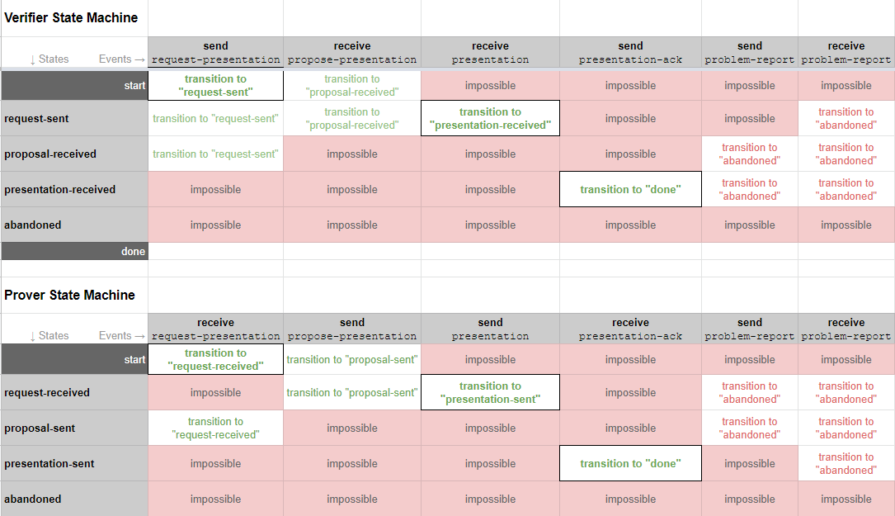

# Aries RFC 0454: Present Proof Protocol 2.0

- Authors: Nikita Khateev, Stephen Curran
- Status: [ACCEPTED](/README.md#accepted)
- Since: 2021-04-15
- Status Note:  See [RFC 0453](../0453-issue-credential-v2/README.md) for the corresponding issue credential protocol.
- Supersedes: [RFC 0037](../0037-present-proof/README.md)
- Start Date: 2020-05-27
- Tags: [feature](/tags.md#feature), [protocol](/tags.md#protocol), [credentials](/tags.md#credentials), [test-anomaly](/tags.md#test-anomaly)

## Version Change Log

### 2.1 - Add ability to request multiple presentations

A minor update to add mechanism for a Verifier to request the Prover submit multiple presentations in the "presentation" message(s), each presentation sourced from different credentials that satisfy the presentation request.
An example use of this capability is an employer (Verifier) requesting multiple "proof of employment" presentations from a job application (Prover), each satisfying the one presentation request.

### 2.0 - Alignment with [RFC 0453 Issue Credential](../0453-issue-credential-v2/README.md)

- The "formats" field is added to all the messages to link the specific attachment IDs with the verifiable presentation format and version of the attachment.
- The details that are part of each message type about the different attachment formats serves as a registry of the known formats and versions.
- Version 2.0 uses &lt;angle brackets&gt; explicitly to mark all values that may vary between instances, such as identifiers and comments.

## Summary

A protocol supporting a general purpose verifiable presentation exchange regardless of the specifics of the underlying verifiable presentation request and verifiable presentation format.

## Motivation

We need a standard protocol for a verifier to request a presentation from a prover, and for the prover to respond by presenting a proof to the verifier. When doing that exchange, we want to provide a mechanism for the participants to negotiate the underlying format and content of the proof.

## Tutorial

### Name and Version

`present-proof`, version 2.1

### Key Concepts

This protocol is about the messages to support the presentation of verifiable claims, not about the specifics of particular verifiable presentation formats. [DIDComm attachments](../../concepts/0017-attachments/README.md) are deliberately used in messages to make the protocol agnostic to specific verifiable presentation format payloads. Links are provided in the message data element descriptions to details of specific verifiable presentation implementation data structures.

Diagrams in this protocol were made in draw.io. To make changes:

- upload the drawing HTML from this folder to the [draw.io](https://draw.io) site (Import From...GitHub),
- make changes,
- export the picture and HTML to your local copy of this repo, and
- submit a pull request.

### Roles

The roles are `verifier` and `prover`.  The `verifier` requests the presentation of a proof and verifies the presentation, while the `prover` prepares the proof and presents it to the verifier. Optionally, although unlikely from a business sense, the `prover` may initiate an instance of the protocol using the `propose-presentation` message.

### Goals

When the goals of each role are not available because of context, goal codes may be specifically included in protocol messages. This is particularly helpful to differentiate between credentials passed between the same parties for several different reasons. A goal code included should be considered to apply to the entire thread and is not necessary to be repeated on each message. Changing the goal code may be done by including the new code in a message. All goal codes are optional, and without default. 

### States

The following states are defined and included in the state transition table below.

#### States for Verifier

* request-sent
* proposal-received
* presentation-received
* abandoned
* done

#### States for Prover

* request-received
* proposal-sent
* presentation-sent
* abandoned
* done

[](https://docs.google.com/spreadsheets/d/1XThILA0_ZiH3voBv5M8-GIt1We9t_Rlg0xaY5jmNVIA/edit)

For the most part, these states map onto the transitions shown in both the state transition table above, and in the choreography diagram ([below](#choreography-diagram)) in obvious ways. However, a few subtleties are worth highlighting:

* The Verifier may indicate in the `request-presentation` message that the Prover may provide multiple Presentations (in one or more `presentation` messages). In that case, the Verifier stays in the `request-state` if the Prover indicates in `presentation` messages that additional
`presentation` messages will be sent. See the messages (below) for how the Verifier and Prover indicate how multiple presentations are to be handled.

* The final states for both the prover and verifier are `done` or `abandoned`, and once reached, no further updates to the protocol instance are expected.

* The `ack-presentation` is sent or not based on the value of `will_confirm` in the `request-presentation`. A verifier may send an `ack-presentation` message in response to the prover including the `~please_ack` decorator in the `presentation` message. Whether an `ack-presentation` is expected or not determines whether the states `presentation-sent` and `presentation-received` are used at all in a protocol instance.

* The `ack-presentation` message should reflect the business validation of the proof (does the proof satisfy the business need?) not just the cryptographic verification. Ideally, those are as tightly aligned as possible.

* When a Prover makes a (counter-)proposal, it transitions to the `proposal-sent` state. This state is only present by implication in the choreography diagram; it essentially equates to the null or begin state in that the Prover does nothing until a presentation request arrives, triggering the leftmost transition for the Prover.

* Errors might occur in various places. For example, a Prover might decide not to respond to a `presentation-request` or a verifier may time out waiting for the Prover to supply a `presentation`. Errors should trigger a `problem-report`. In this version of the protocol, all errors cause the state of both parties (the sender and the receiver of the `problem-report`) to transition to the terminal `abandoned` state (meaning it is no longer engaged in the protocol at all).

### Choreography Diagram


## Messages

The present proof protocol consists of these messages:

* `propose-presentation` - Prover to Verifier (optional) - propose a presentation or send a counter-proposal in response to a `request-presentation` message
* `request-presentation` - Verifier to Prover - request a presentation
* `presentation` - Prover to Verifier - provide a presentation(s) in response to a request

In addition, the [`ack`](../0015-acks/README.md) and [`problem-report`](../0035-report-problem/README.md) messages are adopted into the protocol for confirmation and error handling.

The messages that include `~attach` attachments may use any form of the embedded attachment. In the examples below, the forms of the attachment are arbitrary.

The `~attach` array is to be used to enable a single presentation to be requested/delivered in different verifiable presentation formats. The ability to have multiple attachments must not be used to request/deliver multiple different presentations in a single instance of the protocol.

### Propose Presentation

An optional message sent by the prover to the verifier to initiate a proof presentation process, or in response to a `request-presentation` message when the prover wants to propose using a different presentation format or request. Schema:

```json
{
    "@type": "https://didcomm.org/present-proof/%VER/propose-presentation",
    "@id": "<uuid-propose-presentation>",
    "goal_code": "<goal-code>",
    "comment": "some comment",
    "formats" : [
        {
            "attach_id" : "<attach@id value>",
            "format" : "<format-and-version>",
        }
    ],
    "proposals~attach": [
        {
            "@id": "<attachment identifier>",
            "mime-type": "application/json",
            "data": {
                "json": "<json>"
            }
        }
    ]
}
```

Description of fields:

* `goal_code` -- optional field that indicates the goal of the message sender. 
* `comment` -- a field that provides some human readable information about the proposed presentation.
* `formats` -- contains an entry for each `filter~attach` array entry, including an optional value of the attachment `@id` (if attachments are present) and the verifiable presentation format and version of the attachment. Accepted values for the `format` items are provided in the per format "Attachment" sections immediately below.
* `proposals~attach` -- an optional array of attachments that further define the presentation request being proposed. This might be used to clarify which formats or format versions are wanted.

If the `proposals~attach` is not provided, the `attach_id` item in the `formats` array should not be provided. That form of the `propose-presentation` message is to indicate the presentation formats supported by the prover, independent of the verifiable presentation request content.

#### Negotiation and Preview

Negotiation prior to the delivery of the presentation can be done using the `propose-presentation` and `request-presentation` messages. The common negotiation use cases would be about the claims to go into the presentation and the format of the verifiable presentation.

#### Propose Attachment Registry

Presentation Format | Format Value | Link to Attachment Format | Comment |
--- | --- | --- | --- | 
Hyperledger Indy Proof Req| hlindy/proof-req@v2.0 | [proof request format](../0592-indy-attachments/README.md#proof-request-format) | Used to propose as well as request proofs.
DIF Presentation Exchange | `dif/presentation-exchange/definitions@v1.0` | [`propose-presentation` attachment format](../0510-dif-pres-exch-attach/README.md#propose-presentation-attachment-format) | 

### Request Presentation

From a verifier to a prover, the `request-presentation` message describes values that need to be revealed and predicates that need to be fulfilled. Schema:

```json
{
    "@type": "https://didcomm.org/present-proof/%VER/request-presentation",
    "@id": "<uuid-request>",
    "goal_code": "<goal-code>",
    "comment": "some comment",
    "will_confirm": true,
    "present_multiple": false,
    "formats" : [
        {
            "attach_id" : "<attach@id value>",
            "format" : "<format-and-version>",
        }
    ],
    "request_presentations~attach": [
        {
            "@id": "<attachment identifier>",
            "mime-type": "application/json",
            "data":  {
                "base64": "<base64 data>"
            }
        }
    ]
}
```

Description of fields:

* `goal_code` -- optional field that indicates the goal of the message sender. 
* `comment` -- a field that provides some human readable information about this request for a presentation.
* `will_confirm` -- an optional field that defaults to `false` to indicate that the Verifier will or will not send a post-presentation confirmation `ack` message.
* `present_multiple` -- an optional field that defaults to `false` to indicate that the Verifier would like the Prover to send multiple presentations that satisfy the presentation request from different verifiable credentials.
* `formats` -- contains an entry for each `request_presentations~attach` array entry, providing the the value of the attachment `@id` and the verifiable presentation request format and version of the attachment. Accepted values for the `format` items are provided in the per format [Attachment](#presentation-request-attachment-registry) registry immediately below.
* `request_presentations~attach` -- an array of attachments containing the acceptable verifiable presentation requests.

While the `present_multiple` value can be set to true in any instance of the protocol, Verifiers are recommended to use the capability with care
if the `presentation-request` includes presenting claims from multiple verifiable credential types. Such scenarios can get overly complicated for the Prover
if they hold multiple instances of each of the requested credential. For example, an employer asking for multiple presentations for a single request for claims
from both employment and education verifiable credentials held by the Prover.

#### Presentation Request Attachment Registry

Presentation Format | Format Value | Link to Attachment Format | Comment |
--- | --- | --- | --- | 
Hyperledger Indy Proof Req| hlindy/proof-req@v2.0 | [proof request format](../0592-indy-attachments/README.md#proof-request-format) | Used to propose as well as request proofs.
DIF Presentation Exchange | `dif/presentation-exchange/definitions@v1.0` | [`propose-presentation` attachment format](../0510-dif-pres-exch-attach/README.md#request-presentation-attachment-format) | 

### Presentation

This message is a response to a Presentation Request message and contains signed presentations. Schema:

```json
{
    "@type": "https://didcomm.org/present-proof/%VER/presentation",
    "@id": "<uuid-presentation>",
    "goal_code": "<goal-code>",
    "comment": "some comment",
    "last_presentation": true,
    "formats" : [
        {
            "attach_id" : "<attach@id value>",
            "format" : "<format-and-version>",
        }
    ],
    "presentations~attach": [
        {
            "@id": "<attachment identifier>",
            "mime-type": "application/json",
            "data": {
                "sha256": "f8dca1d901d18c802e6a8ce1956d4b0d17f03d9dc5e4e1f618b6a022153ef373",
                "links": ["https://ibb.co/TtgKkZY"]
            }
        }
    ]
}
```

Description of fields:

* `goal_code` -- optional field that indicates the goal of the message sender.
* `comment` -- a field that provides some human readable information about this presentation.
* `last_presentation` -- an optional field that defaults to `true` to indicate this is the last presentation message to be sent in satisfying the presentation request. If the value is `false`, the Prover MUST send another presentation message with an additional presentation(s). The Prover's last `presentation` message MUST have a `last_presentation` value of `false` (explicitly or by default). If the `present_multiple` field is absent or `false` in the `request_presentation` message from the Verifier, the `last_presentation` field on the first/only `presentation` message MUST be true (explicitly or by default).
* `formats` -- contains an entry for each `presentations~attach` array entry, providing the the value of the attachment `@id` and the verifiable presentation format and version of the attachment. Accepted values for the `format` items are provided in the per format [Attachment](#presentation-request-attachment-registry) registry immediately below.
* `presentations~attach` -- an array of attachments containing the presentation in the requested format(s). If the `present_multiple` field is `true` in the `request_presentation` message from the Verifier, the Prover MAY include multiple presentations of the same format that satisfy the Presentation request from the Verifier.

If the `last_presentation` field is `false`, the Verifier's state SHOULD remain in the `request-sent` state (barring an error), with the expectation that additional `presentation` messages will be coming from the prover. If the `last_presentation` value is `true` (explicitly or by default) the Verifier MUST transition to their next appropriate state.

If the Prover wants an acknowledgement that the presentation was accepted, this message may be decorated with the `~please-ack` decorator using the `OUTCOME` acknowledgement request. This is not necessary if the Verifier has indicated it will send an `ack-presentation` using the `will_confirm` property. Outcome in the context of this protocol is the definition of "successful" as described in [Ack Presentation](#ack-presentation). Note that this is different from the default behavior as described in [0317: Please ACK Decorator](../0317-please-ack/README.md). It is then best practice for the new Verifier to respond with an explicit `ack` message as described in the please ack decorator RFC.

#### Presentations Attachment Registry

Presentation Format | Format Value | Link to Attachment Format | Comment |
--- | --- | --- | --- | 
Hyperledger Indy Proof | hlindy/proof@v2.0 | [proof format](../0592-indy-attachments/README.md#proof-format) |
DIF Presentation Exchange | `dif/presentation-exchange/submission@v1.0` | [`propose-presentation` attachment format](../0510-dif-pres-exch-attach/README.md#presentation-attachment-format) | 

### Ack Presentation

A message from the verifier to the prover that the `Present Proof` protocol was completed successfully and is now in the `done` state. The message is an adopted `ack` from the [RFC 0015 acks protocol](../0015-acks/README.md). The definition of "successful" in this protocol means the acceptance of the presentation in whole, i.e. the proof is verified and the contents of the proof are acknowledged. The `ack` message MUST NOT be sent until a `last_presentation` value is `true` (explicitly or by default) in the `presentation` message from the Prover.

### Problem Report

A message from the verifier to the prover that follows the `presentation` message to indicate that the `Present Proof` protocol was completed unsuccessfully and is now in the `abandoned` state. The message is an adopted `problem-report` from the [RFC 0015 report-problem protocol](../0035-report-problem/README.md). The definition of "unsuccessful" from a business sense is up to the verifier. The elements of the `problem-report` message can provide information to the prover about why the protocol instance was unsuccessful.

Either party may send a `problem-report` message earlier in the flow to terminate the protocol before its normal conclusion.

## Reference

Details are covered in the [Tutorial](#tutorial) section.

## Drawbacks

- None currently noted

## Rationale and alternatives

## Prior art

The previous major version of this protocol is [RFC 0037 Present Proof](../0037-present-proof/README.md) protocol and implementations.

## Unresolved questions

- There might need to be a way to associate a payment with the present proof protocol.

## Implementations

The following lists the implementations (if any) of this RFC. Please do a pull request to add your implementation. If the implementation is open source, include a link to the repo or to the implementation within the repo. Please be consistent in the "Name" field so that a mechanical processing of the RFCs can generate a list of all RFCs supported by an Aries implementation.

Name / Link | Implementation Notes
--- | ---
 |
